_This article was collaboratively done by the Syrian Archive Team and Bellingcat Investigation Team_

- Location: Atarib (Aleppo governorate, Syria)
- Claimed targets: Public market and police building
- Date: 13 November 2017
- First airstrike: 14:07 local time (UTC/GMT plus 2)
- Second airstrike: ~14:12 local time (UTC/GMT plus 2)
- Attacks: 3 alleged airstrikes, 6 thermometric bombs
- Reported killed: 69 killed
- Reported injured: 100 injured
- Missing: 4 persons
- Munitions identified: Not available
- Potentially responsible: Russian or Syrian Air Force

## Introduction

On 13 November 2017 between 14:07 and 14:11, the Atarib market and police station were targeted by three airstrikes resulting in the death of 69 civilians, significant damage to several buildings on the Atarib market street, and to the Free Syrian police building. Open source materials indicate this attack was conducted by either the Russian or Syrian airforce.

On November 13, Alexander Ivanov, the unofficial spokesman for the Khmeimim airbase used by Russia, denied that Russian aircraft committed a “massacre” at a civilian site in Atarib. This was posted also on the unofficial Telegram channel of Khmeimim airbase. See blow:

Atarib city is included in the de-escalation zone memorandum signed by the sponsoring states of the Astana Talks (Russia, Turkey and Iran) and has no military headquarters for ISIS neither Jabhat AL Nusra. The Atarib market has been attacked twice previously, in 2014 and in 2016, according to open source materials and reports from human rights monitoring groups. If the Russian-Syrian alliance was targeting a populated area with no apparent military presence or target, it would violate international humanitarian law.

To better understand what happened in this regional town, [the Syrian Archive used open source investigative techniques](https://syrianarchive.org/en/tools_methods), spoke with sources on the ground, and analysed flight observation data to better examine uploaded user generated content documenting the incident. By examining a variety of sources of information, the Syrian Archive was able to corroborate and strengthen findings. Visual content gathered and verified by the Syrian Archive was extensively analysed - including in-depth geolocation with satellite imagery. All times provided are in Damascus local time, and in 24-hour format. The findings are presented in the following report, structured by the questions of the who, what, where, and why of this incident.

Findings regarding this attack were characterized by repeated bombardments, lack of warnings, and an absence of active military hostilities in the vicinity of the attack. Through collecting, verifying and reporting investigative findings from these incidents, the authors hope to preserve critical information that may be used for advocacy purposes or as evidence in future proceedings seeking legal accountability.

This report complements and supports recent efforts by human rights organisations to report violations targeting Atarib on 13 November 2017. Those efforts include:
1. [Syrians for Truth and Justice: “A Horrific Massacre Kills Up To 65 People in Atarib, Aleppo Countryside”](https://stj-sy.com/en/view/318)
2. [Pax: “Why was Al-Atareb attacked?”](https://blogs.paxvoorvrede.nl/2017/11/21/why-was-al-atareb-attacked/)
3. [Human Rights Watch: Syria in Talks focus on protecting civilians.](https://www.hrw.org/news/2017/11/22/syria-talks-focus-protecting-civilians).

The added value of this report to the efforts mentioned above includes *damage identification*, as well as cross referencing and contextualising *visual content (20 verified videos) with satellite imagery* and *flight observation data* provided by a spotter organisation of aircraft in the immediate vicinity of market at the time of attacks. *Geolocation of visual content was done in collaboration with the Bellingcat Investigation Team.*

## Background of Atarib

Located some 25 kilometers west of Aleppo city, Atarib is a small regional town with an estimated population of 30,000 mostly Sunni Arabs in 2011 before the Syrian war started. The city has historically served as a strategic transport hub between the governorate capital of Aleppo's northern countryside, and the Bab al-Hawa border crossing with Turkey.

[Anti Assad regime demonstrations](https://www.youtube.com/watch?v=A0LvV9UrH5o) took place in Atarib as early as April 2011, and the city swiftly became an important hub for organizing protests in the wider district, as well as in Aleppo city itself. Atarib also assumed military significance against the Syrian regime following the establishment of the Free Syrian Army (FSA) and was among the first urban centres to [host local military officers who defected from the Syrian regime in early 2012.](https://www.youtube.com/watch?v=cPhgK3xXL6U)

The city soon had one of the [largest numbers of defected officers](https://www.youtube.com/watch?v=5AAOBI8O-aI) in rural Aleppo, and the local FSA groups that were subsequently formed there went on to establish the [al-Mutasem Bi’ allah brigade](https://www.youtube.com/watch?v=trtKeqypKp8), who played a crucial role in driving Assad’s forces out of most of rural Aleppo, part of the city of Aleppo and rural Idlib.

After the Syrian regime was forced out of Atarib in July 2012, a council of notables was formed – including elders and other influential figures (e.g. doctors, lawyers, intellectuals and religious scholars) – to facilitate decision-making through consensus and ensure the wider representation of different families. In October of that year, [the council of notables agreed to establish a revolutionary council](https://www.youtube.com/watch?v=JqEuY2IRl_I), part of a network of local administration councils in opposition-held areas intended to serve as an alternative to the Syrian regime. This includes taking responsibility for running the city and providing public services, including the establishment and supervision of a local court system and police service, active until the date of this report's publishing.

In late 2013, IS came to town, but was considered as “uninvited guest,” as Haid Haid writes in his article [“How My Syrian Hometown Fought the Islamic State and Won”](http://archive.is/7a1Zh), published in Middle East Eye. Local resistance managed to oust the group from Atarib, and it did the same with al-Qaeda-linked Jabhat al-Nusra in early 2015 when they tried to capture the city, as Haid Haid writes in a [Chatham House report](https://www.chathamhouse.org/sites/files/chathamhouse/publications/research/2017-06-01-local-community-resistance-syria-atarib-haid.pdf). Many [videos were posted](https://www.youtube.com/watch?v=UQG_sg9S2JQ&feature=youtu.be) showing the residents in Atarib city protesting against Jabhat al-Nusra. Currently the Atarib civilian council is managing the city and providing services to civilians. As can be seen in [the 13 November 2017 post from LiveUMap](https://syria.liveuamap.com/en/time/13.11.2017) provided below showing areas of control in northern Syria, at the time Atarib was attacked it was far from any frontline or clashes (In red: Syrian government - in green: Syrian opposition forces - in yellow: SDF forces - in black: ISIS).

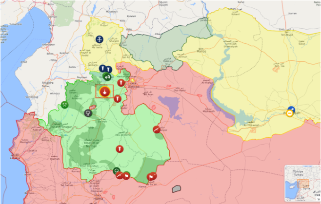

## De-escalation zone

On 4 May 2017, the sponsoring states of Astana Talks (Russia, Turkey and Iran) [signed a memorandum of understanding for the establishment of de-escalation zones in Syria](https://www.youtube.com/watch?v=5cF-gIL8yzk) which took effect on 6 May 2017. The Russian Ministry of Defense [published a map showing](https://function.mil.ru/news_page/intrel/more.htm?id=12121964%40egNews) the locations included in this memorandum as shown below (de-escalation zones in blue, ISIS in grey, Syrian army in orange). See below:

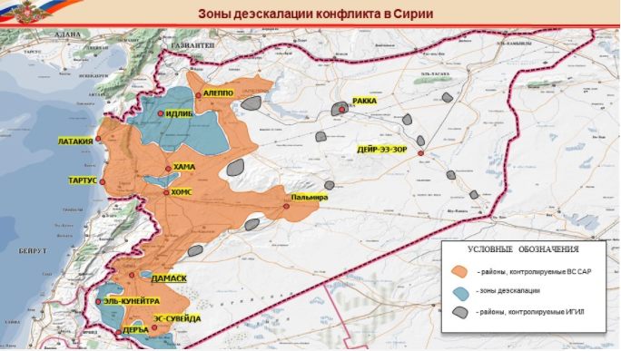

These areas included Idlib province, some parts of northern Homs province, as well as some parts of adjacent provinces (Latakia, Hama, and Aleppo), Eastern Ghouta in Damascus countryside and some parts of southern Syria.

A zoomed in look at the Russian Ministry of Defense’s map (above) clearly shows that the bombed location in Atarib city is part of the de-escalation zone established during the Astana talks.

## What Happened?

On 13 November 2017, [Atarib’s public commercial market and a nearby police station](http://wikimapia.org/#lang=de&lat=36.139079&lon=36.825367&z=19&m=b&show=/25873693/ar/مسجد&search=atarib) were targeted by three air strikes, according to reports from media activists, humanitarian groups, news agencies, and the Syrian Civil Defense in the Aleppo governorate. The claimed damage of these airstrikes was filmed and photographed and uploaded to social media platforms.

The same day, Syrian Civil Defense [published a video showing](https://www.youtube.com/watch?v=p1ZI5zX3yrw) the first moment of attacks claimed to be targeting Al Atarib city. At 0:06 an explosion from a far while the civil defense team are driving towards the impact site can be seen, then at 0:33 an explosion that happened close to a market can be seen. Women and children can be seen in the impact site. At the end of the video we see injured including children were being transferred into a medical facility to be treated.

The video has been geolocated using available satellite imagery, as shown below. Four buildings can be identified as well as the blue building. The two roads leading east are also clearly visible in the video.

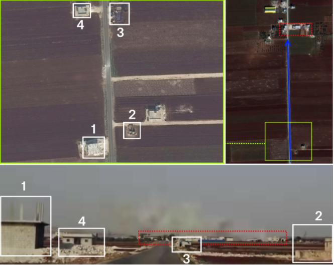

Citizen reporter Muaz AL Shami also [published a video](https://www.youtube.com/watch?v=g8_4yF0n5kU) on 13 November 2017 saying: “A massacre has committed by the Syrian government air force in the middle of the public market in Al Atarib city in the Western countryside of Aleppo. More than 20 civilians some of them were working in the market killed as a result of three airstrikes by the Syrian air force that targeted the public market with 6 thermometric bombs. The civil defense teams are coming to the market to rescue civilians and recover bodies of killed people from under the rubble.”

At *15:02 on 13 November 2017*, three photos were published by the Atarib Media Centre, stating that an attack had happened on the town’s main market. The post states:

> “Today at 14:08, the main market of the city was targeted by the Russian Air Force with three airstrikes resulting in many civilians killed and injured. The market is completely destroyed and the Civil Defense teams are still rescuing civilians stuck under the rubbles.”

[Atarib24](https://www.facebook.com/atareb24/?hc_ref=ARQov7mXHuseJZfbZ28jwxjfrAEZZI4_piDNX56ciuvthZxJn6ajPl-poquHl41sE1c&fref=nf), another local media group, also published reports of the attack on its Facebook page in two posts. At 14:11, they claimed that a [second airstrike](https://www.facebook.com/atareb24/posts/1505253179550687) had targeted Atarib. (The upload time in local timezone can be extracted using a timestamp converter.)

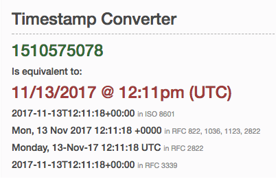

Shortly thereafter, at 12:13 local time, Atarib24 indicated that a [third airstrike](https://www.facebook.com/atareb24/posts/1505254219550583) had occurred.

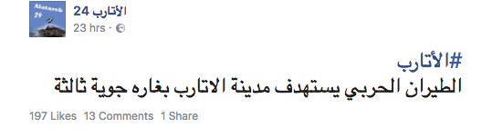

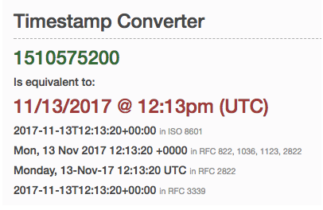

Two dashcam camera videos were published, on the Facebook page of “The Syrian Revolution Coordination in Atarib City and Its Villages.”

[The first video](https://www.facebook.com/alatareb0/videos/1621197111266483/), published on Facebook by “The Syrian Revolution Coordination in Atarib City and its Villages”, claims to show the first airstrike attacking the Free Police building in Atarib. The moment of impact is visible The video is timestamped 2017/11/13 at 15:07, which is consistent with the timing of the other attacks.

<iframe src="https://giphy.com/embed/3o6nV3XhqDAtU2w6mQ" width="520" height="359" frameBorder="0" class="giphy-embed" allowFullScreen></iframe>

Using openly available satellite imagery, it is possible to confirm the location the car is driving southward towards [a junction](http://wikimapia.org/#lang=de&lat=36.140117&lon=36.825512&z=19&m=b&show=/37462730/Building-bottom-floors-destroyed-) in central Atarib. At 8 seconds into the video, the impact of an apparent airstrike on this building at 8 seconds, which is said to be the [Free Police building](http://wikimapia.org/#lang=de&lat=36.139608&lon=36.825335&z=19&m=b&show=/37462730/Building-bottom-floors-destroyed-).

[The second dashcam video](https://www.facebook.com/mohammad.saber.311/videos/822800251223338/), uploaded to Facebook by “Mouhammed Saber”, also shows a timestamp: 2017/11/13 at 15:12, suggesting that if the time is correct it shows the moment of impact three minutes after the first airstrike on the Free Police building. This is also the time reported of the second airstrike in Atarib that day.

<iframe src="https://giphy.com/embed/3o751QWigWq0Z0w3aE" width="520" height="359" frameBorder="0" class="giphy-embed" allowFullScreen></iframe>

Using openly available satellite imagery, the Syrian Archive has determined that it is highly probable the car was standing in the road in front of the damaged building at the time of filming. At 24 seconds into the video, we can see the fire as a result of the airstrike that targeted the building behind the car. See below:

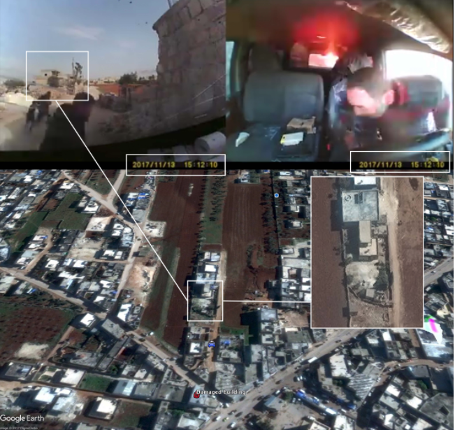

To corroborate this analysis, the Syrian Archive team interviewed the source of the video who reaffirmed the location in which the video was filmed matched the geolocation seen above.

To verify the time of the [second dashcam video](https://www.facebook.com/mohammad.saber.311/videos/822800251223338/), an analysis of sun shadows was conducted [using the SunCalc tool](https://www.suncalc.org/#/36.1403,36.8262,19/2017.11.13/14:12/1/2). The time of the airstrikes at 14:12 Damascus time, is consistent with the shadow of the building that appears where the car is parked.

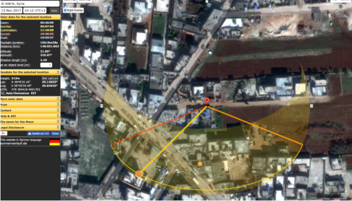

[Al Jazeera has published a video](https://twitter.com/AJArabic/status/930276622694891520) about the first moment of the attack when the air-to-surface munitions being dropped into the market.

## Geolocation of Al Jazeera video

The following munitions have been identified from Al Jazeera video reported by Suhaib Al Khalaf. Four munitions being dropped immediately before the explosion can be seen in the following image.

A light green mosque dome and a mosque minaret can be seen in the video from Al Jazeera as well.

As the same minaret can be seen in multiple frames of the video from multiple perspectives, and in other videos when civilians are being rescued in the aftermath of the the attack, it becomes possible to use this as a reference location for geolocation purposes.

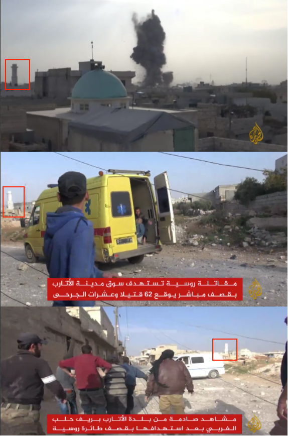

## Geolocating the mosque minaret:

The Syrian Archive team got in touch with [citizen reporter Muhammad Shakrdy](https://www.facebook.com/shaf3y90?ref=content_filter) who lives in Atarib. On 9 December 2017, Muhammad Shakrdy took pictures of the newly built mosque, which, when compared with recent satellite imagery from DigitalGlobe, was geolocated as seen below:

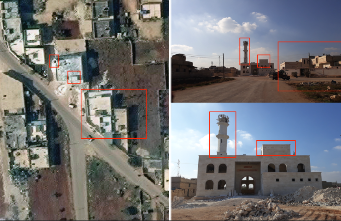

## Geolocating the mosque dom:

The location of the light green dome appearing in Al Jazeera video has been geolocated to be in Atarib, as shown below. As a result, it possible to verify that the Al Jazeera video in which four objects were being dropped in the direction of the market was in fact filmed in Atarib, as was reported.

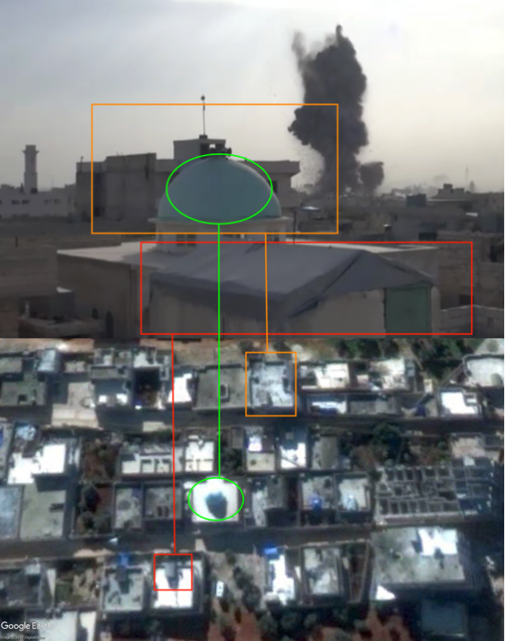

The Syrian Archive has estimated the location of the camera as well as the direction the camera faced (towards the impact site) using Google Earth. See below:

To verify the time that the Al Jazeera video was filmed, an analysis of sun shadows was conducted using the SunCalc tool. The time of the airstrikes, between 14:08 and 14:12 Damascus time, is consistent with the shadow of the mosque’s dome shadow that appears in the Al Jazeera video. This corroborates reports by civilians and reporters in Atarib that the attack took place on 13 November, around 14:08pm. See screenshot from the SunCalc analysis below:

## Visual information (After the Attack):

Thiqa news agency [published a drone video showing](https://www.youtube.com/watch?v=0X128QHTd3k) the destruction in the market as well as the police station building on Nov 14th, 2017.

The Syrian Archive team was able to geolocate six damaged buildings using the above video and Google Earth. This included four buildings in the market street and one at the police station building which is located at the start of the market street and one in front of the police station building. Four of the buildings in the market street can be seen in the image below:

Thiqa news agency has also [published a drone video](https://www.youtube.com/watch?v=AM0BgZVQGwk) on 31 August 2017 showing the market before the attack. This allowed the Syrian Archive to identify objects in the market before and after the attack. See below:

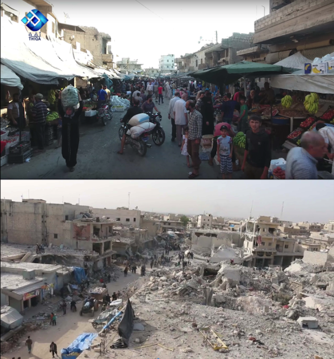

The two frames below show the same market before and after the attack - the first [video frame, taken by RFS media office](https://www.youtube.com/watch?v=FFb8c8N-Au0) with a drone and the second, taken by [Thiqa news agency](https://www.youtube.com/watch?v=0X128QHTd3k) of the same building after the airstrike.

Two other buildings can be identified from the drone frames video before and after the attack. See below:

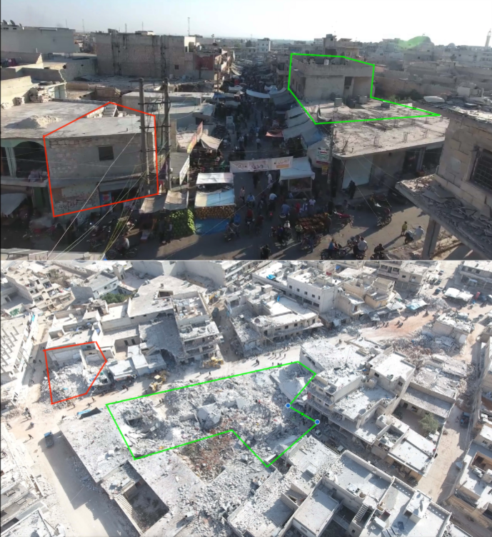

RFS media office also [published a video showing](https://www.youtube.com/watch?v=E6veK2FeGt4) the civilians killed as a result of the airstrikes, as well as of the destruction in the police station building as a result of the same attack. See below:

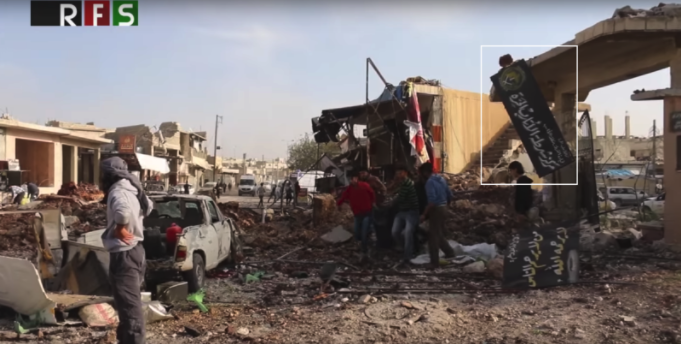

The Syrian Archive team was able to geolocate the police station building shown in the drone video of Thiqa news agency through Google Earth which makes it the fifth destroyed building as a result of the attack.

The sixth damaged building was located in front of the police station building as see below. The Syrian Archive team was able to geolocate this building using a photo [published by Muhammad Shakrdy](https://www.facebook.com/shaf3y90?ref=content_filter), and a video published by RFS media office on 13 November 2017.

## Craters:

RFS news agency [published a video documenting](https://www.youtube.com/watch?v=E6veK2FeGt4) a crater formed as a result of the airstrike that targeted Al Atarib. [AFP published a separate video showing](https://www.youtube.com/watch?v=Fdm3YmUopWc) the same crater next to the police building as geolocated below. Using the AFP video, the Syrian Archive was able to geolocate the crater formed as a result of the attack. See below:

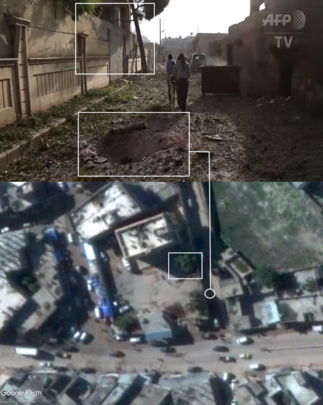

## Flight Analysis Data

To provide a further layer of verification, the Syrian Archive cross-referenced findings from the videos and witness testimony with flight observation data from a spotter organisation. This process necessitated analysing observation data for flights between 14:00 and 14:30, the period directly before and after the reported attack at 14:07 and 14:12 as was claimed by media activists and seen in the dashcam videos. See below:

Through comparing where flights were observed, the type of aircraft observed, the time flights were observed, and the direction flights were heading, and comparing this data to geolocation conducted in earlier steps, the Syrian Archive was able to identify several flights potentially responsible for the attack (several fixed-wing Russian aircraft), seen circling in the immediate vicinity of the geolocated attack site. Previous research has found that circling flights typically indicate target acquisition and/or preparation for imminent attack.

While there is no direct evidence available that one of the observed aircrafts was involved in the attack on Atarib, the presence of these aircrafts increase the likelihood that an air attack occurred at this location and the time stated by the citizen reporters as well as humanitarian groups, and estimated also using imagery from the attack.

## Killed civilians names-pictures-numbers:

[The Atarib coordination committee published 64 names](https://www.facebook.com/alatareb.l.c.c2011/) of the civilians that has been killed as a result of this attack. They also posted 4 names of missing persons after the attack.

Another list of 69 names of the civilians that has been killed as a result of this attack was also published by [the Syrians for truth and justice](https://stj-sy.com/en/view/318) as can be seen below:

### Names of the Civilians Killed Due to Shelling the Main Market in Atarib

- Rashad Mohammed Abdrrahim, a civilian.
- Ali Shereqi, a civilian.
- Omar Ali Rasheed, a civilian.
- Abdulqader Mohammed Eid al-Badawi, a civilian.
- Mohammed Khalid Mesto, a civilian.
- Hussein Mar’ei, a civilian.
- Abdullah Abdrrahim, a civilian.
- Omar Abdo Rasheed, a civilian.
- Yousef as-Saleet, a civilian.
- Ali Hallaq, a civilian.
- As’ad Haj Taher, a civilian.
- Mohammed Ammar Deebo, a civilian.
- Hazim Khaled Deebo Ibrahim, a civilian.
- Nasir Haj Mar’ei, a civilian.
- Mohammed Nasir Hej Mar’ei, a civilian.
- Mohammed Mahmoud Abian, a civilian.
- The laboratory physician, Ahmad Omar Isa, a civilian.
- Abdelazeem Ahmad Jaqoum, a civilian.
- Aref Jbraeel, a civilian.
- Yousef Bakrish, a civilian.
- Hamoudeh Faisal Ibrahim, a civilian.
- Deebo Abdulqader Deebo, a civilian.
- Hasan Ibrahim Shweif, a civilian.
- Ghassan Ayoub, a civilian.
- Hussam Zreiq, a civilian.
- Abderrazaq Ali al-Ameer, a civilian.
- Mohammed Hussein Hijazi, a civilian.
- Ali Faker Rasheed, a civilian.
- Nasir Ahmad Hajer, a civilian.
- Mohammed Sultan, a civilian.
- Mostafa Ahmad Da’doush, a civilian.
- Anas Hayed, a civilian.
- Hasan Khalifa, a civilian.
- Hussein Qasim, a civilian.
- Khalloq Hallaq, a civilian.
- Ahmad Hussein Jablawi, a civilian.
- Mohammed Nour Hayed, a civilian.
- Khalid Mearzaf, a civilian.
- Ammar Hussam Barakat, a civilian.
- Mostafa Hamdan, a civilian.
- Redwan Ayoub Haj Hamada, a civilian.
- Mohammed Munir Saleh, a civilian.
- Mohammed Abdo Haj Mar’ei, a civilian.
- Murshid al-Mahrouq, a civilian.
- Naji Sheikh Ibrahim, a civilian.
- Ahmad Othman, a civilian.
- Ahmad Othman’s wife, a woman.
- Asma Riyad Khalil, a woman.
- Zanoub Sheikh Abdel hay, a woman.
- Hiba Othman, a woman from al-Leramon.
- Rowaida Shawa, a woman.
- Zahra Hussein Jablawi, a woman from Kefr Nouran town.
- Moayad Abdo Waheeba, a child,.
- The daughter of Mohammed Qayes Haj Mar’ei, a child.
- Ayman Abdo Karbo Zarzor, a handicapped child with polio.
- Ahmad Saied Ibrahim, a missing child.

### List of Police Officers Killed in Shelling the Free Police Station Located at the Entrance to the Main Market in Atarib
- Mohammed Abderrazaq al-Faj, a police officer.
- Yamen Saeed ash-Shon, a police officer.
- Hamdo Saeed ash-Shon, a police officer.
- Omar Mohammed Deeb Shahoud, a police officer.
- Hussein Sha’alan Abderrazaq, a police officer.
- Mostafa Mohammed Othman, a police officer.
- Jbraeel AbdlWahid Jbraeel, a police officer.
- Ibrahim Mohammed Ibrahim, a police officer.
- Ahmad Abdo Taher, a police officer.
- Hamdi Ways al-Ali, a police officer.
- Mohammed Hamdo Hamdo, a police officer.
- Fadl Mohammed Eid Abdurrahman, a police officer.
- Basil Mohammed Shahid al-Hussein as-Sawadi.

## Prior attacks on this market

This is not the first time the Atarib market has been targeted. On 25 July 2016, [Smart News Agency published a video showing](https://www.youtube.com/watch?v=N_4kAc_xCFs) destruction of a building located on the market street claimed to be as a result of airstrikes. Eight civilians reported killed as a result of this attack. Thiqa News Agency and Qasion News Agency published videos on 25 July 2016 showing the destruction in Atarib market as a result of the attacks.

The Syrian Archive team has matched objects from Smart News Agency video with objects seen in the drone video taken by RFS media office before the attack. The destruction in the building through the video published by Smart News Agency can clearly be seen.

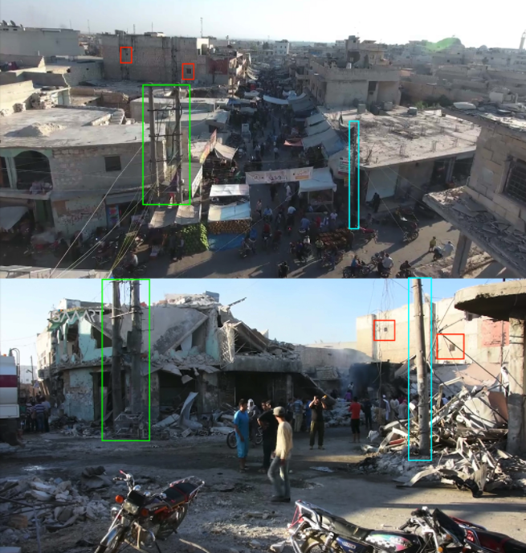

An earlier attack on the Atarib market has also been reported on 24 April 2014. The Violation Documentation Center [published a report](http://www.vdc-sy.info/index.php/en/reports/1398687645#.Wjwt5hIrLt6) about this attack. VDC has documented 31 names of civilians killed during this attack. The YouTube channel of [“Omar Ez El Deen” published a video](https://www.youtube.com/watch?v=yVARN31iSDU) about the Atarib market attack showing killed civilians in the streets as a result of airstrikes as mentioned in the VDC report. Another [video about this attack was published by Amer Alfaj](https://www.youtube.com/watch?v=yVARN31iSDU) showing civilians killed as a result of the attack.

## About the authors
[The Syrian Archive](https://syrianarchive.org/en/about) is a Syrian-led initiative striving to promote sustainable peace and respect for human rights within Syrian society through facilitating justice and accountability efforts. This includes evidence gathering and documentation of incidents; the acknowledgment that war crimes and human rights violations have been committed by all parties to the conflict; the identification of perpetrators to end the cycle of impunity; and the development of a process of justice and reconciliation. Through collecting, verifying, curating and investigating visual content, the Syrian Archive aims to preserve data as a digital memory to establish a database of human rights violations, and to act as a tool for legally implementing justice and accountability efforts as concept and practice in Syria.

Since its founding in 2014, the Syrian Archive have collaborated with organisations including Human Rights Watch (HRW), Amnesty International, Berkeley University and Essex University, Witness, Bellingcat and various agencies of the United Nations (UN), specifically the Independent International Commission of Inquiry on the Syrian Arab Republic.

## Errors, corrections and feedback
The authors of this report have strived for accuracy and transparency of process in reporting and presentation, while balancing the need to protect the safety of those providing documentation in some instances. With these interests in mind, detailed methodologies for some information deemed sensitive have not been published.

With that said, while all efforts have been made to present our best understanding of alleged incidents, it is recognised that the publicly available information for specific events can at times be limited.

If readers have new information about particular events; find an error in our work - or have concerns about the way we are reporting our data - please do engage with us. You can reach us at *info@syrianarchive.org*.
