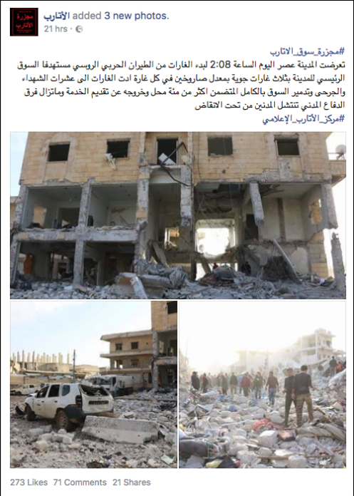
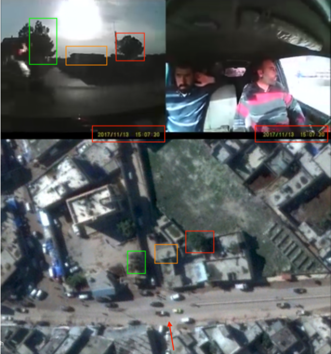

- الموقع: الأتارب (محافظة حلب، سوريا)
- الأهداف المزعومة: سوق شعبي ومبنى خاص بالشرطة
- التاريخ: 13 نوفمبر/تشرين الثاني 2017
- الضربة الجوية الأولى: ~14:07 بالتوقيت المحلي (UTC/GMT plus 2)
- الضربة الجوية الثانية: ~14:12 بالتوقيت المحلي (UTC/GMT plus 2)
- الهجمات: 3 ضربات جوية مزعومة، 6 قنابل حرارية
- القتلى الذين تم الإبلاغ عنهم: 69 قتيل
- الجرحى الذين تم الإبلاغ عنهم: 100 جريح
- المفقودون: 4 أشخاص
- الذخائر التي تم تحديدها: غير متوفر
- المسؤول المحتمل عن الهجوم: القوات الجوية الروسية أو السورية

## مقدمة

في 13 نوفمبر 2017 بين الساعة 14:07 و14:11، تم استهداف سوق الأتارب ومخفر الشرطة بثلاث ضربات جوية تسببت بمقتل 69 مدني، أضرار كبيرة في عدد من الأبنية في شارع سوق الأتارب، وأَضرار كبيرة في مبنى الشرطة الحرة. مواد مفتوحة المصدر تشير إلى أن هذا الهجوم قد تم تنفيذه من قبل القوات الجوية الروسية أو السورية.

في 13 نوفمبر، اليكسندر ايفانوف، المتحدث غير الرسمي باسم قاعدة حميميم الجوية الي تستخدمها روسيا، قام بنفي قيام القوات الجوية الروسية بارتكاب "مجزرة" في موقع مدني في الأتارب. وقد تم نشر هذا في القناة المركزية والناطقة بصفة غير رسمية لمجموعة القوات الروسية المتواجدة في قاعدة حميميم العسكرية على التيليغرام. انظر أدناه

إن مدينة الأتارب مشمولة في مذكرة التفاهم الدبلوماسية لمنطقة خفض التصعيد والتي تم توقيعها من قبل الدول الراعية لمحادثات أستانة (روسيا،تركيا وإيران) والتي لا تشمل المقرات التابعة لجبهة النصر أو داعش. لقد تم استهداف سوق الأتارب مرتين سابقاً، في 2014 و2016، وفقاً للمواد مفتوحة المصدر وتقارير مجموعات رصد حقوق الإنسان. إذا ما كان التحالف الروسي-السوري قد استهدف منطقة مأهولة بالسكان لا تحوي على وجود عسكري واضح أو هدف عسكري،فإن هذا سيشكل انتهاكاً للقانون الإنساني الدولي.

من أجل فهم أفضل لما حدث في هذه البلدة المحلية،[استخدم الأرشيف السوري تقنيات التحقيق مفتوح المصدر](https://syrianarchive.org/en/tools_methods)، التواصل مع مصادر على الأرض،وتحليل بيانات مراقبة رحلات الطيران من أجل فحص أفضل للمحتوى الذي تم إنشاؤه ورفعه من قبل مستخدم والذي يوثق هذه الحادثة. من خلال فحص مجموعة متنوعة من مصادر المعلومات، استطاع الأرشيف السوري تأكيد وتعزيز نتائج البحث. المحتوى البصري الذي قام الأرشيف السوري بجمعه والتحقق منه تم تحليله على نطاق واسع - حيث تم تحديد الموقع الجرافي بشكل معمق مع استخدام صور الأقمار الصناعية. النتائج التي سيتم تقديمها لاحقاً في هذا التقرير،تم إنشاؤها من خلال الأسئلة من،ماذا،أين،ولماذا حول هذه الحادثة.

اتسمت النتائج المتعلقة بهذا الهجوم بالقصف المتكرر، انعدام التحذيرات، وغياب الأعمال العسكرية العدائية بالقرب من موقع الهجوم. من خلال جمع، التحقق من والإبلاغ عن النتائج الاستقصائية من هذه الحوادث، يأمل العاملون على هذا التقرير حفظ معلومات حاسمة يمكن استخدامها لأغراض المناصرة أو كأدلة في الاجراءات المستقبلية التي تسعى إلى المساءلة القانونية.

هذا التقرير يكمل ويدعم الجهود الحالية التي تبذلها منظمات حقوق الإنسان للإبلاغ عن انتهاكات استهداف الأتارب في 13 نوفمبر 2017.
هذه الجهود تتضمن:
1. [سوريون من أجل الحقيقة والعدالة:"مجزرة مروعة تقتل 65 شخص في الأتارب، ريف حلب"](https://stj-sy.com/en/view/318)
2. [باكس: "لماذا تمت مهاجمة الأتارب؟"](https://blogs.paxvoorvrede.nl/2017/11/21/why-was-al-atareb-attacked/)
3. [هيومن رايتس ووتش:على سوريا التركيز على حماية المدنيين في المحادثات.](https://www.hrw.org/news/2017/11/22/syria-talks-focus-protecting-civilians).

يشمل هذا التقرير قيمة مضافة إلى الجهود التي تم ذكرها أعلاه تتضمن *تحديد الضرر*،كما تمت مقاطعة المعلومات والسياق *المحتوى البصري (20 فيديو تم التحقق منه) مع صور الأقمار الصناعية* ومع *بيانات رحلات الطيران* التي تم تزويدنا بها من قبل ممنظمة رصد للطائرات في المناطق التي تجاور المشافي بشكل مباشر وقت وقوع الهجوم.
تحديد الموقع الجغرافي للمحتوى البصري تم بالتعاون مع فريق تحقيقات البيلينغكات.

## معلومات حول الأتارب:

تقع حوالي 25 كم غرب مدينة حلب، الأتارب هي بلدة صغيرة مع تعداد سكاني يقدر بحوالي 30،000 نسمة معظمهم من السنة العرب وذلك في عام 2011 قبل بداية الحرب السورية. المدينة كانت تاريخياً محور استراتيجي للمواصلات ما بين عاصمة محافظة حلب في ريف حلب الشمالي، ومعبر باب الهوى الحدودي مع تركيا.

[مظاهرات معارضة لنظام الأسد](https://www.youtube.com/watch?v=A0LvV9UrH5o)خرجت في الأتارب في وقت مبكر بشهر أبريل من عام 2011،وسرعان ما أصبحت المدينة مركزاً هاماً لتنظيم الاحتجاجات بشكل أوسع في المنطقة، كما في مدينة حلب. كما كان للأتارب أهمية عسكرية ضد نظام الأسد بعد تشكيل الجيش السوري الحر وكانت من بين المراكز المدنية الأولى التي [استقبلت ضباطاً من الجيش انشقوا عن النظام السوري في أوائل عام 2012.](https://www.youtube.com/watch?v=cPhgK3xXL6U)

بعد ذلك بوقت قليل أصبحت المدينة تحتوي على أحد [أكبر الأعداد من الضباط المنشقين](https://www.youtube.com/watch?v=5AAOBI8O-aI) في ريف حلب، ومجموعات الجيش السوري الحر المحلية التي تشكلت لاحقاً هناك حيث تم تشكيل لواء [المعتصم بالله](https://www.youtube.com/watch?v=trtKeqypKp8)،الذي لعب دوراً رئيسياً في إخراج قوات الأسد من معظم مناطق ريف حلب، وأجزاء من مدية حلب وريف إدلب.

بعد أن أجبر النظام السوري على الخروج من الأتارب في يوليو 2012،تم تشكيل مجلس من الأعيان – يتضمن شيوخ وشخصيات مؤثرة أخرى (مثل الأطباء والمحامين والمثقفين ورجال الدين) – وذلك لتسهيل عملية اتخاذ القرارات من خلال توافق الآراء وضمان تمثيل أوسع لمختلف العائلات. في أكتوبر من ذلك العام،[وافق مجلس الأعيان على تشكيل مجلس ثوري](https://www.youtube.com/watch?v=JqEuY2IRl_I)،وهو جزء من شبكة من مجالس الإدارة المحلية في المناطق الخاضعة لسيطرة المعارضة ليكون بديلاً عن النظام السوري. وتشمل مهامه إدارة المدينة وتأمين الخدمات العامة ويتضمن ذلك إنشاء والإشراف على نظام قضائي محلي ودائرة شرطة،وهذا المجلس فعال حتى تاريخ نشر هذا التقرير.  

في أواخر عام 2013،جاء تنظيم الدولة الإسلامية(داعش) إلى المدينة،ولكن تم اعتباره “ضيفاً غير مدعو،” كما كتب حايد حايد في مقالته [“كيف قاومت مدينتي السورية الدولة الإسلامية وانتصرت”](http://archive.is/7a1Zh)، الذي تم نشره في صحيفة Middle East Eye. تمكنت المقاومة المحلية من دحر جماعة تنظيم الدولة من الأتارب، وفعل الشيء نفسه مع جبهة النصرة المرتبطة بالقاعدة في أوائل عام 2015 عندما حاولت الاستيلاء على المدينة،كما كتب حايد حايد في [تقرير شاثام هاوس](https://www.chathamhouse.org/sites/files/chathamhouse/publications/research/2017-06-01-local-community-resistance-syria-atarib-haid.pdf). تم [نشر العديد من الفيدوهات](https://www.youtube.com/watch?v=UQG_sg9S2JQ&feature=youtu.be) التي يظهر فيها سكان في مدينة الأتارب يتظاهرون ضد جبهة النصرة. ويتولى المجلس المدني حاليا إدارة المدينة وتقديم الخدمات للمدنيين.في [الخريطة أدناه في 13 نوفمبر عام 2017 من لايف يو ماب](https://syria.liveuamap.com/en/time/13.11.2017) تظهر مناطق السيطرة في الشمال السوري،حيث يمكن أن نرى أن الأتارب في وقت الهجوم كانت بعيدة عن أي خط جبهة أو اشتباكات (باللون الأحمر: الحكومة السورية - في الأزرق: قوات المعارضة السورية - في الأصفر: قوات سوريا الديمقراطية - في الأسود: داعش)

## منطقة خفض التصعيد
في 4 مايو/أيار 2017، وقعت الدول الراعية لمحادثات الأستانة (روسيا،تركيا،وإيران) [مذكرة تفاهم لإنشاء مناطق خفض تصعيد في سوريا](https://www.youtube.com/watch?v=5cF-gIL8yzk) والتي أصبحت سارية المفعول في 6 مايو 2017. قامت وزارة الدفاع الروسية [بنشر خريطة تظهر](https://function.mil.ru/news_page/intrel/more.htm?id=12121964%40egNews) المواقع المشمولة في مذكرة التفاهم هذه كما هو واضح أدناه ( مناطق خفض التصعيد باللون الأزرق،داعش باللون الرمادي، والجيش السوري باللون البرتقالي).انظر أدناه:

وشملت هذه المناطق محافظة إدلب، وبعض أجزاء من شمالي محافظة حمص، وبعض أجزاء من المحافظات المجاورة (اللاذقية وحماة وحلب) والغوطة الشرقية بريف دمشق وبعض أجزاء جنوب سوريا.

في نظرة مكبرة على خريطة وزارة الدفاع الروسية (أعلاه) يظهر بوضوح أن الموقع الذي تم قصفه في مدينة أتارب هو جزء من منطقة خفض التصعيد التي تم الاتفاق عليها خلال محادثات أستانا.

## ماذا حدث؟

في 13 نوفمبر 2017، تم استهداف [سوق الأتارب العام ومركز شرطة قريب](http://wikimapia.org/#lang=de&lat=36.139079&lon=36.825367&z=19&m=b&show=/25873693/ar/مسجد&search=atarib) بثلاث ضربات جوية، وفقاً لتقارير من نشطاء إعلاميين،مجموعات إنسانية،وكالات إخبارية، والدفاع المدني السوري في محافظة حلب. تم تصوير ورفع صور وفيديوهات عن الأضرار المزعومة التي تسببت بها هذه الضربات على منصات التواصل الاجتماعي.

في نفس اليوم،نشر الدفاع المدني السوري [فيديو يظهر](https://www.youtube.com/watch?v=p1ZI5zX3yrw)اللحظات الأولى للهجوم المزعوم استهدافه لمدينة الأتارب. عند 0:06 يمكن رؤية انفجار من بعيد اثناء توجه فريق الدفاع المدني إلى موقع الضربة، ومن ثم في 0:33 يمكن رؤية انفجار حدث بالقرب من السوق. يمكن رؤية امرأة وأطفال في موقع الضربة. وعند نهاية الفيديو يمكن رؤية مصابين بينهم أطفال حيث يتم نقلهم إلى مرفق صحي لتتم معالجتهم.

تم تحديد الموقع الجغرافي للفيديو باستخدام صور الأقمار الصناعية المتوفرة،كما يظهر أدناه. يمكن تحديد أربع مباني بالإضافة للمبنى الأزرق. كما يظهر الطريقان اللذان يقودان نحو الشرق بشكل واضح في الفيديو.

المواطن الصحفي مازن الشامي [نشر فيديو](https://www.youtube.com/watch?v=g8_4yF0n5kU) في 13 نوفمبر 2017 يقول فيه: ” مجزرة ارتكبتها القوات الجوية السورية وسط سوق شعبي في مدينة الأتارب في ريف حلب الغربي.أكثر من 20 مدني بعضهم كان يعمل في المتاجر قتلوا نتيجة لثلاث ضربات جوية نفذتها القوات الجوية السورية حيث استهدفت السوق الشعبي ب 6 صواريخ فراغية. فرق الدفاع المدني تأتي إلى السوق لتنقذ المدنيين وتنتشل جثث القتلى من تحت الركام.“

عند الساعة 15:02 في 13 نوفمبر 2017، تم [نشر ثلاث صور](https://www.facebook.com/atareb0city/posts/1787535994592105) من قبل مركز الأتارب الإعلامي،حيث تمت الإشارة إلى وقوع الهجوم على سوق المدينة المركزي.جاء في المنشور ما يلي:  

> ”تعرضت المدينة عصر اليوم الساعة 14:08 لبدء الغارات من الطيران الحربي الروسي مستهدفاً السوق الرئيسي للمدينة بثلاث غارات جوية بمعدل صاروخين في كل غارة أدت الغارات إلى عشرات الشهداء والجرحى وتدمير السوق بالكامل المتضمن أكثر من مئة محل وخروجه عن تقديم الخدمة وما تزال فرق الدفاع المدني تنتشل المدنيين من تحت الأنقاض.“

[الأتارب 24](https://www.facebook.com/atareb24/?hc_ref=ARQov7mXHuseJZfbZ28jwxjfrAEZZI4_piDNX56ciuvthZxJn6ajPl-poquHl41sE1c&fref=nf)،مجموعة إخبارية محلية أخرى،نشرت أيضاً بلاغات عن الهجوم على صفحتها على فيسبوك من خلال منشورين. عند الساعة 14:11، زعمت هذه المجموعة الإخبارية أن [غارة جوية ثانية](https://www.facebook.com/atareb24/posts/1505253179550687)استهدفت الأتارب. (وقت الرفع بالتوقيت المحلي يمكن الحصول عليه من خلال استخدام محول الختم الزمني.)  

بعد ذلك بوقت قصير، عند الساعة 12:13 بالتوقيت المحلي، الأتارب 24 أشارت إلى وقوع [ضربة جوية ثالثة](https://www.facebook.com/atareb24/posts/1505254219550583).

تم رفع فيديوهين من كاميرا داشكام على صفحة الفيسبوك الخاصة ب ”تنسيقية الثورة السورية في مدينة الأتارب وقراها.“

[الفيديو الأول](https://www.facebook.com/alatareb0/videos/1621197111266483/)،تم نشره على فيسبوك من قبل ”تنسيقية الثورة السورية في مدينة الأتارب وقراها“،وزعمت هذه الصفحة أن الفيديو يظهر الضربة الجوية الأولى التي استهدفت مبنى الشرطة الحرة في الأتارب. توقيت الضربة يمكن رؤيته بوضوح حيث أن الفيديو مختوم زمنياً2017/11/13 عند الساعة 15:07، وهذا التوقيت يتسق مع توقيت الهجمات الأخرى.

<iframe src="https://giphy.com/embed/3o6nV3XhqDAtU2w6mQ" width="480" height="319" frameBorder="0" class="giphy-embed" allowFullScreen></iframe>
<a href="https://giphy.com/gifs/3o6nV3XhqDAtU2w6mQ">via GIPHY</a>

من الممكن تأكيد موقع السيارة التي تتجه جنوباً باتجاه [تقاطع الطرق](http://wikimapia.org/#lang=de&lat=36.140117&lon=36.825512&z=19&m=b&show=/37462730/Building-bottom-floors-destroyed-) باستخدام صور الأقمار الصناعية المتوفرة بشكل مفتوح في وسط الأتارب.في الثانية الثامنة من الفيديو،يمكن رؤية تأثير غارة جوية جلياً على هذا المبنى الذي تم القول بأنه [مبنى الشرطة الحرة](http://wikimapia.org/#lang=de&lat=36.139608&lon=36.825335&z=19&m=b&show=/37462730/Building-bottom-floors-destroyed-).

[فيديو كاميرا داشكام الثاني](https://www.facebook.com/mohammad.saber.311/videos/822800251223338/)،تم رفعه على الفيسبوك من قبل ”محمد صابر”،ويظهر في هذا الفيديو أيضاً ختم زمني: 13/11/2017 عند الساعة 15:12، وفي حال كان الوقت صحيحاً فإن هذا يظهر لنا لحظة الضربة بعد ثلاث دقائق من الضربة الجوية الأولى على مبنى الشرطة الحرة. وهذا الوقت هو أيضاً وقت الضربة الجوية الثانية على الأتارب التي تم الإبلاغ عن وقوعها اليوم.

<iframe src="https://giphy.com/embed/3o751QWigWq0Z0w3aE" width="480" height="270" frameBorder="0" class="giphy-embed" allowFullScreen></iframe>
<a href="https://giphy.com/gifs/3o751QWigWq0Z0w3aE">via GIPHY</a>

باستخدام صور الأقمار الصناعية المتوفرة بشكل مفتوح، قام الأرشيف السوري بتحديد أن هنالك احتمال كبير أن السيارة كانت في الطريق أمام المبنى المتضرر في وقت التسجيل. في الثانية 24 في الفيديو، يمكننا رؤية النيران نتيجة الضربة الجوية التي استهدفت المبنى خلف السيارة. انظر أدناه:

لتعزيز هذا التحليل، أجرى فريق الأرشيف السوري مقابلة مع مصدر الفيديو الذي أكد من جديد على الموقع الذي تم تصوير الفيديو فيه مع تحديد الموقع الجغرافي المذكور أعلاه.

للتحقق من وقت [فيديو كاميرا داشكام الثانية](https://www.facebook.com/mohammad.saber.311/videos/822800251223338/)،تم إجراء تحليل لظلال الشمس [باستخدام أداة "سنكالك"](https://www.suncalc.org/#/36.1403،36.8262،19/2017.11.13/14:12/1/2).توقيت الضربة الجوية عند الساعة 14:12 بتوقيت دمشق، يتسق مع ظل المبنى الذي يظهر حيث تم ركن السيارة.

[قامت الجزيرة بنشر فيديو](https://twitter.com/AJArabic/status/930276622694891520) عن اللحظة الأولى للهجوم حين سقطت ذخائر جو-أرض على السوق.

## تحديد الموقع الجغرافي لفيديو قناة الجزيرة

تم تحديد الأجسام التالية في فيديو قناة الجزيرة بتقرير لصهيب الخلف. يمكن رؤية أربع ذخائر تم إسقاطها مباشرةً قبل الانفجار في الصورة التالية.

يمكن رؤية قبة مسجد بلون أخضر فاتح بالإضافة لمئذنة مسجد في فيديو قناة الجزيرة أيضاً.

بما أنه يمكننا رؤية المئذنة نفسها في إطارات متعددة من الفيديو من منظورات متعددة، وفي فيديوهات أخرى حيث يتم إنقاذ المدنيين في أعقاب الهجوم، يصبح من الممكن استخدام هذا كموقع مرجعي لأغراض تحديد الموقع الجغرافي.

## تحديد الموقع الجغرافي لمئذنة المسجد:

قام فريق الأرشيف السوري بالتواصل مع [المواطن الصحفي محمد شاكردي](https://www.facebook.com/shaf3y90?ref=content_filter)الذي يعيش في الأتارب. في 9 ديسمبر 2017، قام محمد شاكردي بالتقاط صور للمسجد الذي بني حديثاً، والتي بمقارنتها مع صور الأقمار الصناعية الحالية من ديجيتال غلوب،تم تحديد موقعها الجغرافي كما هو ظاهر أدناه:

## تحديد الموقع الجغرافي لقبة المسجد:

تم تحديد الموقع الجغرافي لقبة المسجد ذات اللون الأخضر الفاتح والتي ظهرت في فيديو قناة الجزيرة في مدينة الأتارب، كما يظهر أدناه. وكنتيجة لذلك يمكن التأكيد على أن فيديو قناة الجزيرة الذي تظهر فيه الأجسام الأربعة التي تم إسقاطها باتجاه السوق قد تم تصويره في الأتارب،كما ذكر.

قام الأرشيف السوري بتقدير موقع الكاميرا وكذلك الاتجاه الذي واجهته الكاميرا (نحو موقع الضربة) باستخدام غوغل إيرث. انظر أدناه:

من أجل التحقق من الوقت الذي تم فيه تصوير فيديو قناة الجزيرة تم إجراء تحليل لظلال الشمس باستخدام أداة SunCalc. توقيت الضربات الجوية، بين الساعة14:08 والساعة 14:12 بتوقيت دمشق، وهذا يتوافق مع ظل قبة المسجد التي تظهر في فيديو قناة الجزيرة. هذا يثبت ما تم الإبلاغ عنه من قبل المواطنين والمراسلين في الأتارب كون الهجوم وقع في 13 نوفمبر،حوالي الساعة 14:08.انظر لقطة شاشة من تحليل سنكالك أدناه:

## المعلومات البصرية (بعد الهجوم):

نشرت وكالة "ثقة" الإخبارية [مقطع فيديو](https://www.youtube.com/watch?v=0X128QHTd3k) تم تصويره من طائرة بدون طيار يُظهر الدمار الحاصل في السوق فضلًا عن مبنى مركز الشرطة في 14 نوفمبر 2017.

تمكن فريق الأرشيف السوري من تحديد الموقع الجغرافي لستة أبنية متضررة باستخدام مقطع الفيديو أعلاه وخرائط غوغل إيرث. يشمل ذلك أربعة أبنية في شارع السوق، وبناء في مركز الشرطة الواقع عند مدخل شارع السوق، وبناء أمام مركز الشرطة. يمكن رؤية الأبنية الأربعة في شارع السوق في الصورة أدناه:

نشرت وكالة "ثقة" الإخبارية [مقطع فيديو آخر](https://www.youtube.com/watch?v=AM0BgZVQGwk) تم تصويره من طائرة بدون طيار في 31 أغسطس 2017 يُظهر السوق قبل الهجوم. مكّن ذلك "الأرشيف السوريّ" من تحديد الأجسام الموجودة في السوق قبل الهجوم وبعده. انظر أدناه:

يظهر الإطاران التاليان السوق نفسه قبل الهجوم وبعده. صُوّر [الإطار الأول من قبل مكتب RFS الإعلامي](https://www.youtube.com/watch?v=FFb8c8N-Au0)  باستخدام طائرة بدون طيار، أما الإطار الثاني فهو من تصوير  [وكالة "ثقة" الإخبارية](https://www.youtube.com/watch?v=0X128QHTd3k) لنفس البناء بعد الغارات الجوية.

يمكن تحديد بنائين آخرين من إطارات الفيديو المصوّر من الطائرة بدون طيار قبل الهجوم وبعده. انظر أدناه:

نشر مكتب RFS الإعلامي [مقطع فيديو آخر](https://www.youtube.com/watch?v=E6veK2FeGt4) يظهر المدنيين الذين قُتلوا جراء الغارات الجوية، فضلًا عن الدمار في مبنى مركز الشرطة والناجم عن نفس الهجوم. انظر أدناه:

تمكن فريق الأرشيف السوري من تحديد الموقع الجغرافي لمبنى مركز الشرطة الظاهر في فيديو وكالة ثقة من خلال خرائط غوغل إيرث، مما يجعله خامس مبنى تمّ تدميره نتيجة للهجوم.

تم تحديد المبنى السادس المتضرّر أمام مبنى الشرطة كما هو مبين أدناه. تمكن فريق الأرشيف السوري من تحديد الموقع الجغرافي لهذا المبنى باستخدام صورة [نُشرت من قبل محمّد شكردي](https://www.facebook.com/shaf3y90?ref=content_filter)، ومقطع فيديو نُشر من قبل  مكتب RFS الإعلامي في 13 نوفمبر 2017.

## الحُفر:

نشرت وكالة RFS الإعلامية [مقطع فيديو يوثّق](https://www.youtube.com/watch?v=E6veK2FeGt4) حفرة ناجمة عن الغارة التي استهدفت الأتارب. [نشرت وكالة فرانس برس مقطع فيديو منفصل](https://www.youtube.com/watch?v=Fdm3YmUopWc) يُظهر الحفرة ذاتها جوار مبنى الشرطة، والمحدّد موقعه جغرافيًا أدناه. تمكن فريق الأرشيف السوري من تحديد الموقع الجغرافي للحفرة الناجمة عن الهجوم باستخدام مقطع فيديو وكالة فرانس برس. انظر أدناه:

## تحليل بيانات الطيران

بغرض إضافة طبقة أخرى من التحقق؛ قارن الأرشيف السوري النتائج المستخلصة من مقاطع الفيديو وإفادات الشهود مع بيانات رصد الطيران من قبل منظمة مراقبة. استلزمت هذه العملية تحليل بيانات رصد الطيران ما بين الساعة 14:00 و 14:30، وهي الفترة الزمنية التي سبقت الهجوم وتلته مباشرة، حيث أُبلغ عنه في 14:07 و 14:12 وفقًا للناشطين الإعلاميين، ولما تم مشاهدته في مقاطع فيديو كاميرات المراقبة. انظر أدناه:

من خلال مقارنة الرحلات الجوية المرصودة، نوع الطائرات المرصودة، الوقت الذي رُصدت به، ووجهات هذه الرحلات، ومقارنة هذه البيانات مع المواقع الجغرافية المقدّمة في الخطوات السابقة؛ تمكّن الأرشيف السوري من تحديد العديد من الرحلات المحتملة المسؤولة عن هذا الهجوم (عدّة طائرات روسية ثابتة الجناح) حيث شوهدت هذه الطائرات تُحلق فوق المنطقة الجغرافية للهجوم. وقد خلصت التحقيقيات السابقة إلى أن الطيران الدائري في السماء عادةً ما يُشير إلى محاولة الاستحواذ على الهدف أو التحضير لهجوم وشيك.

على الرغم من عدم توافر دليل مباشر على ضلوع إحدى هذه الطائرات المرصودة في الهجوم على الأتارب؛ فإن وجود هذه الطائرات يزيد من احتمال وقوع غارة جوية على هذا الموقع وفي الوقت المحدّد من قبل الصحفيين المواطنين والمجموعات الحقوقية، والمُقدّر باستخدام صور من موقع الهجوم.

## الضحايا المدنيين بالأسماء والصور والأعداد:

 [نشرت لجان التنسيق المحلية - مدينة الأتارب 64 اسمًا](https://www.facebook.com/alatareb.l.c.c2011/) لمدنيين قُتلوا نتيجة لهذا الهجوم. كما نشروا أسماء 4 أشخاص فُقدوا بعده.

نٌشرت قائمة أخرى تضم أسماء 69 مدنيًا قُتلوا نتيجة لهذا الهجوم من قبل [سوريون من أجل الحقيقة والعدالة](https://stj-sy.com/en/view/318) كما يتضّح أدناه:

### أسماء المدنيين الذين قُتلوا بسبب القصف على السوق الرئيسي في مدينة الأتارب:
- رشاد محمد عبدالرحيم - مدني.
- علي شريقي - مدني.
- عمر علي رشيد - مدني.
- عبد القادر محمد عيد البدوي - مدني.
- محمد خالد مستو - مدني.
- حسين مرعي - مدني.
- عبد الله عبد الرحيم - مدني.
- عمر عبدو رشيد - مدني.
- يوسف السليت - مدني.
- علي حلاق - مدني.
- أسعد حاج طاهر - مدني.
- محمد عمار ديبو - مدني.
- حازم خالد ديبو ابراهيم - مدني.
- ناصر حج مرعي - مدني.
- محمد ناصر حج مرعي - مدني.
- محمد محمود عبيان - مدني.
- الدكتور المخبري عمر أحمد عيسى - مدني.
- عبد العظيم أحمد جقوم - مدني.
- عارف جبرائيل - مدني.
- يوسف بكريش - مدني.
- حمودة فيصل ابراهيم - مدني.
- ديبو عبد القادر ديبو - مدني.
- حسن ابراهيم شويف - مدني.
- غسان أيوب - مدني.
- حسام زريق - مدني.
- عبد الرزاق علي الأمير - مدني.
- محمد حسين حجازي - مدني.
- علي فاكر رشيد - مدني.
- ناصر أحمد هاجر - مدني.
- محمد سلطان - مدني.
- مصطفى أحمد دعدوش - مدني.
- أنس حايد - مدني.
- حسن خليفة - مدني.
- حسين قاسم - مدني.
- خلوق حلاق - مدني.
- أحمد حسين جبلاوي - مدني.
- محمد نور حايد - مدني.
- خالد معرزاف - مدني.
- عمار حسام بركات - مدني.
- مصطفى حمدان - مدني.
- رضوان أيوب حج حمادة - مدني.
- محمد منير صالح - مدني.
- محمد عبدو حج مرعي - مدني.
- مرشد المحروق - مدني.
- ناجي شيخ ابراهيم - مدني.
- أحمد عثمان  - مدني.
- زوجة أحمد العثمان - امرأة.
- أسماء رياض خليل - امرأة.
- زنوب شيخ عبد الحي - امرأة.
- هبة عثمان - امرأة  من بلدة الليرمون.
- رويدا شوا - امرأة.
- زهرة حسين جبلاوي - امرأة من بلدة كفرنوران.
- الطفل مؤيد عبدو وهيبة.
- الطفلة ابنة محمد قيس حاج مرعي.
- الطفل أيمن عبدو كربو زرزور - من ذوي الاحتياجات الخاصّة منذ الولادة – شلل أطفال.
- الطفل أحمد سيد ابراهيم - مفقود.

### أسماء عناصر الشرطة الذين قُتلوا نتيجة للقصف على مركز الشرطة الحرة والواقع عند مدخل السوق الرئيسي في مدينة الأتارب:

- الشرطي محمد عبدالرزاق الفج.
- الشرطي يامن سعيد الشون.
- الشرطي حمدو سعيد الشون.
- الشرطي عمر محمد ديب شحود.
- الشرطي حسين شعلان عبد الرزاق.
- الشرطي مصطفى محمد عثمان.
- الشرطي جبرائيل عبد الواحد جبرائيل.
- الشرطي ابراهيم محمد ابراهيم.
- الشرطي أحمد عبدو طاهر.
- الشرطي حمدي ويس العلي.
- الشرطي محمد حمدو حمدو.
- الشرطي فاضل محمد عيد عبد الرحمن.
- الشرطي باسل محمد شهيد الحسين السوادي.

## الهجمات السابقة على هذا السوق

هذه ليست المرّة الأولى التي يُستهدف بها سوق الأتارب، ففي 25 يوليو / تموز 2016 نشرت وكالة سمارت نيوز شريط فيديو يُظهر مبنى مُدمّر - يقع في شارع السوق - ادُّعي أنه نتيجة للغارات الجويّة، وأبلغ عن مقتل ثمانية مدنيين نتيجةَ لهذه الغارات. كما نشرت وكالة أنباء ثقة ووكالة قاسيون في 25 يوليو / تموز 2016 مقاطع فيديو تُظهر الدمار في سوق الأتارب نتيجةَ للهجمات.

قام فريق الأرشيف السوري بمطابقة الأجسام من فيديو وكالة سمارت نيوز مع الأجسام المُشاهدة في مقطع فيديو التُقط من طائرة بدون طيّار من قبل مكتب RFS الإعلامي قبل الهجوم، ويُمكن رؤية الدمار الحاصل في المبنى من خلال الفيديو الذي نشرته وكالة سمارت نيوز.

كما أُبلغ عن هجومٍ سابق على سوق الأتارب بتاريخ 24 إبريل / نيسان 2014، ونشر مركز توثيق الإنتهاكات تقريرًا عن هذا الهجوم، حيث وثّق 31 اسمًا لمدنيين قتلوا خلال هذا الهجوم. ونشرت قناة "عمر عز الدين" على موقع يوتيوب فيديو عن هجوم على سوق الأتارب يظهر فيه قلتى مدنيون في الشوارع نتيجة لغارات جوية كما أفاد التقرير. كما نشر عامر الفج شريط فيديو آخر يظهر القتلى المدنيين نتيجة هذا الهجوم.

## عن المؤلفين

الأرشيف السوري هو مبادرة سورية تسعى إلى تعزيز السلام المستدام واحترام حقوق الإنسان في المجتمع السوري من خلال تسهيل جهود العدالة والمساءلة يشمل ذلك جمع الأدلة، توثيق الحوادث، الاعتراف بأنّ جرائم الحرب وانتهاكات حقوق الإنسان قد ارتكبت من قبل جميع الأطراف، وتحديد هوية الجناة بهدف وضع حد للإفلات من العقاب وتطوير عملية العدالة والمصالحة.
يهدف "الأرشيف السوري" من خلال جمع الأدلة البصرية لانتهاكات حقوق الإنسان على الأرض السورية وتنظيمها وتحليلها إلى حفظ البيانات كذاكرة رقمية ،وإنشاء قاعدة بيانات محقّق منها لانتهاكات حقوق الإنسان في سوريا، ويسعى "الأرشيف السوري" من خلال ذلك ليكون أحد الأدوات التي تساهم في تطبيق العدالة وتعزيز المساءلة كمفهوم وكتطبيق في سوريا.

تعاون الأرشيف السوري منذ تأسيسه في عام 2014 مع منظمات عديدة، من بينها هيومن رايتس ووتش، منظمة العفو الدولية، جامعة بيركلي، جامعة إسيكس، بيلنكات، ومختلف وكالات الأمم المتحدة؛ لا سيما اللجنة الدولية المستقلة المعنية بشأن بالجمهورية العربية السورية.

### الأخطاء، التصحيحات، والملاحظات

سعى القائمون على هذا التقرير إلى تحقيق الدقة والشفافية في عملية التقديم والعرض، مع الأخذ بعين الحاجة إلى حماية سلامة أولئك الذين يقدمون الوثائق في بعض الحالات. ومع أخذ هذه المصالح في الاعتبار، لم يتم نشر منهجيات مفصلة لبعض المعلومات التي تعتبر حساسة.

ومع ذلك، وفي حين أن جميع الجهود قد بذلت لتقديم فهمنا الأفضل للحوادث المزعومة، فمن المعروف أن المعلومات المتاحة للعموم عن أحداث محددة يمكن أن تكون محدودة في بعض الأحيان.

إذا كان لدى القراء معلومات جديدة حول أحداث معينة؛ العثور على خطأ في عملنا - أو لديك مخاوف بشأن الطريقة التي تتم فيها تقديم بياناتنا يرجى التواصل معنا عبر البريد الإلكتروني التالي : info@syrianarchive.org
