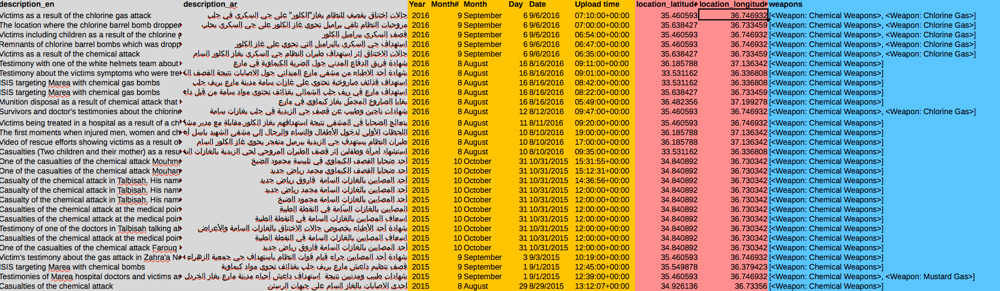
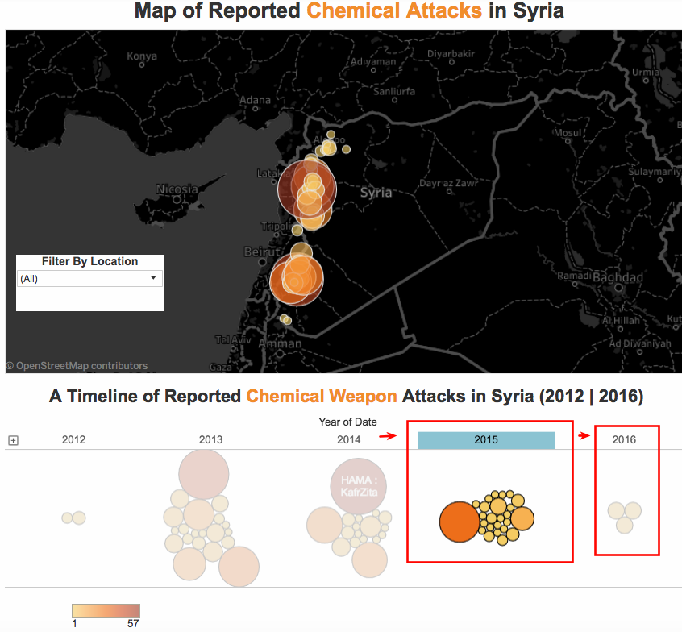
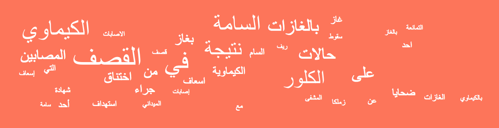
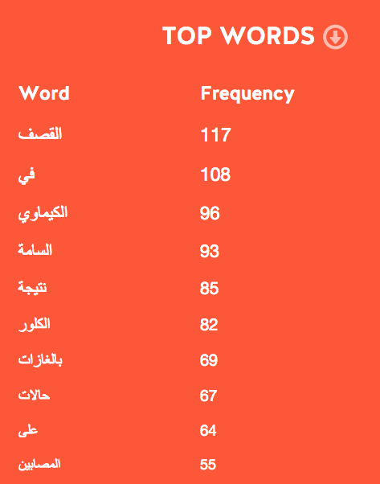
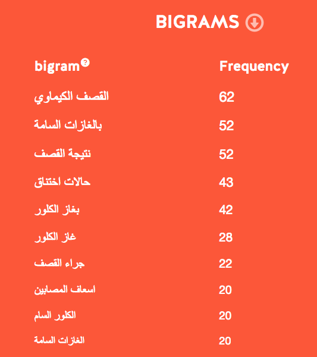

استخدم النظام السوري وتنظيم داعش الغازات السامة بعد [قرار مجلس الأمن (2218) الصادر في 27/09/2013](http://www.securitycouncilreport.org/atf/cf/%7B65BFCF9B-6D27-4E9C-8CD3-CF6E4FF96FF9%7D/s_res_2118.pdf) بشأن إطار العمل لإزالة الأسلحة الكيميائية في سوريا على الرغم من عمل [منظمة حظر الأسلحة الكيميائية](https://www.opcw.org/) خلال السنتين الماضيتين على تدميرها.

وقد أصدرت الشبكة السورية لحقوق الإنسان تقريرا [يؤكد استخدام الغازات السامة 139](http://sn4hr.org/arabic/2016/08/20/6828/) مرة بعد قرار مجلس الأمن من قبل النظام السوري وتنظيم داعش.

يقدّم "الأرشيف السوري" في هذا التقرير [قاعدة بيانات تحتوي على أدلة مصورة لبعض الهجمات الكيميائية المذكورة بتقرير الشبكة السورية لحقوق الإنسان. تحتوي ](https://syrianarchive.org/ar/database?type_of_violation=Use_of_illegal_weapons&weapons_used=Chemical%20Weapons)[قاعدة بيانات الهجمات الكيميائية على 392](https://syrianarchive.org/ar/database?type_of_violation=Use_of_illegal_weapons&weapons_used=Chemical%20Weapons) فيديو من تاريخ 01/12/2012 إلى تاريخ 06/09/2016.

## منهجية التحقق من الأدلة المصورة

* * *

### أولا: التحقق من المصدر الذي قام بنشر الفيديو

حدّدنا أكثر من 100 مصدر مع قنواتهم على اليوتيوب والفيسبوك والتلغرام، بدأوا عملهم في أواخر سنة 2011 أو في بداية 2012 وكانوا ذوي مصداقية في عملهم وتقاريرهم. وهم يتوزعون على مختلف المحافظات السورية لنشر الأخبار والمعلومات حول الانتهاكات التي تحدث في مناطقهم.

يعد المراسلون الميدانيون الجزء الأكبر من هذه المصادر ومنهم الإعلامي ياسر الحاج الذي بدأ عمله في سنة 2012 في حلب إلى الآن.

يتضمن الجزء الآخر من المصادر الوكالات الإخبارية المحلية والعالمية، كوكالة سمارت، مركز حلب الإعلامي، منظمات حقوق الإنسان كمركز توثيق الإنتهاكات في سوريا، الشبكة السورية لحقوق الإنسان، منظمات ومجموعات إنسانية أخرى كفريق الدفاع المدني، المشافي والعيادات الميدانية.

أرسل لنا بعض المراسلون المتحقق من هوياتهم فيديوهات لم تكن موجودة على مواقع التواصل الإجتماعي.

### ثانيا: جمع وتحليل قاعدة بيانات الفيديوهات

صنّف فريق الأرشيف السوري البيانات (المئات من الفيديوهات) التي تدل على هجمات كيميائية ضد المدنيين بعد جمعها من 100 مصدر.

استخدمنا ملف اكسل للقيام بهذه العملية كما نرى في الأسفل.

أضفنا معلومات بعد التحقق من البيانات كنوع السلاح المستخدم أو نوع الغاز السام المستخدم في حال توافر الأدلّة من قبل المنظمات الحقوقية والإنسانية.

### ثالثا: التحقق من الموقع الجغرافي

حدّد فريق الأرشيف السوري الموقع الجغرافي لجميع الفيديوهات التي تدل على هجمات كيميائية ضد المدنيين.

تأكدنا من المحافظة والمنطقة لكل فيديو. وقد تم التحديد الجغرافي عن طريق مقارنة صور لمباني، تضاريس الجبال، شجر، مآذن الجوامع، بصور القمر الصناعي  (ستالايت) باستخدام أداتي [غوغل إيرث](https://www.google.com/earth/) و [Openstreetmap](http://www.openstreetmap.org) وصور محددة جغرافيا عن طريق أداة [Panoramio](http://www.panoramio.com/).

تأكدّنا أيضا من اللهجة المحكية في الفيديو لتحديد مكان تصويره.

تواصل فريق الأرشيف السوري مع مصوري الفيديو بشكل مباشر لسؤالهم عن موقع تصوير الفيديو والتأكد منهم.

تواصلنا أيضا مع صحفيين يعملون في سوريا للتأكد من المواقع الجغرافية.

### رابعا: التحقق من التواريخ

تأكدنا من تاريخ تسجيل الفيديو بمقارنته مع تاريخ التقارير المنشورة حول نفس الحادثة على مواقع التواصل الإجتماعي كالفيسبوك والتلغرام، بالإضافة للتقارير التي نشرتها الوكالات الإخبارية العالمية مثل رويترز، أو الوكالات المحلية مثل وكالة قاسيون الإخبارية، وشبكة أخبار حلب، وكذلك المنظمات الحقوقية مثل هيومن راتس ووتش، منظمة العفو الدولية، الشبكة السورية لحقوق الإنسان، مركز توثيق الانتهاكات في سوريا، بالإضافة إلى حسابات وقنوات الإعلاميين في داخل سوريا كالتويتر والفيسبوك والتلغرام.

## أدلة مصوّرة تدعم تقرير لجنة التحقيق المشتركة بين الأمم المتحدة ومنظمة حظر الأسلحة الكيميائية

أصدرت لجنة التحقيق المشتركة بين الأمم المتحدة ومنظمة حظر الأسلحة الكيميائية تقريرا بتاريخ 24/08/2016 حول الهجمات الكيميائية ضد المدنيين، حدّد المسؤولين عن استخدام هذه الاسلحة المحرمة دوليا بالنظام السوري وتنظيم داعش. أكّد التقرير على استخدام غاز الكلور في بعض الهجمات الكيميائية وخصوصا التي حدثت في السنة الماضية 2015.

تحقّق فريق "الأرشيف السوري" من الأدلّة المصوّرة (فيديو) التي تؤكّد استخدام الغازات الكيميائية (الكلور) خلال الهجمات التي حدثت مؤخرا في:

1. حي الزبدية في مدينة حلب بتاريخ 10/08/2016 | [5 فيديوهات](https://syrianarchive.org/ar/database?location=%D8%AD%D9%84%D8%A8%20:%20%D8%AD%D9%8A%20%D8%A7%D9%84%D8%B2%D8%A8%D8%AF%D9%8A%D8%A9&type_of_violation=Use_of_illegal_weapons&weapons_used=Chemical%20Weapons)

2. مارع في ريف حلب بتاريخ 16/08/2016 | [5 فيديوهات](https://syrianarchive.org/ar/database?location=%D8%AD%D9%84%D8%A8%20:%20%D9%85%D8%A7%D8%B1%D8%B9&after=2016-08-15&before=2016-08-17&type_of_violation=Use_of_illegal_weapons&weapons_used=Chemical%20Weapons)

3. حي السكري في مدينة حلب بتاريخ 06/09/2016 | [5 فيديوهات](https://syrianarchive.org/ar/database?location=%D8%AD%D9%84%D8%A8%20:%20%D8%AD%D9%8A%20%D8%A7%D9%84%D8%B3%D9%83%D8%B1%D9%8A&type_of_violation=Use_of_illegal_weapons&weapons_used=Chemical%20Weapons)

تعاون فريق الأرشيف السوري مع صحفيي "[Bellingcat](https://www.bellingcat.com/)" على نشر تحقيقين حول الهجمات الكيميائية في منطقتي [حي الزبدية في حلب](https://www.bellingcat.com/news/2016/08/13/reports-of-chlorine-gas-that-targeted-civilians-in-aleppo/) و[مارع في ريف حلب.](https://www.bellingcat.com/news/mena/2016/08/31/evidence-august-16-2016-chemical-attack-marea-isis/)

فيما يلي الحالات التسع التي تم التحقيق فيها من قبل "لجنة التحقيق المشتركة" بالإضافة إلى الادلّة المصوّرة التي تم التحقّق منها من قبل فريق "الأرشيف السوري" لدعم التقرير:

(ا) كفرزيتا، محافظة حماة، 11/04/2014; تحقّقنا رقميا من [16](https://syrianarchive.org/ar/database?location=%D8%AD%D9%85%D8%A7%D8%A9%20:%20%D9%83%D9%81%D8%B1%D8%B2%D9%8A%D8%AA%D8%A7&after=2014-04-09&before=2014-04-14&weapons_used=Chemical%20Weapons) فيديو

(ب) كفرزيتا، محافظة حماة، 18/04/2014; تحقّقنا رقميا من [8 ](https://syrianarchive.org/ar/database?after=2014-04-17&before=2014-04-19) فيديوهات

(ت) تلمنس، محافظة ادلب، 21/04/2014; تحقّقنا رقميا من [21](https://syrianarchive.org/ar/database?location=%D8%A7%D8%AF%D9%84%D8%A8%20:%20%D8%AA%D9%84%20%D9%85%D9%86%D9%8A%D8%B3&after=2014-04-19&before=2014-04-22&type_of_violation=Use_of_illegal_weapons) فيديو

(ث) التمانعة، محافظة ادلب، 29/04/214 و 30/04/2014; تحقّقنا رقميا من [7](https://syrianarchive.org/ar/database/?location=%D8%A7%D8%AF%D9%84%D8%A8%20:%20%D8%A7%D9%84%D8%AA%D9%85%D8%A7%D9%86%D8%B9%D8%A9&after=2014-04-28&before=2014-05-01) فيديوهات

(ج) التمانعة، محافظة ادلب، 25/05/2014 و 26/05/2014; تحقّقنا رقميا من [14 ](https://syrianarchive.org/ar/database/?location=%D8%A7%D8%AF%D9%84%D8%A8%20:%20%D8%A7%D9%84%D8%AA%D9%85%D8%A7%D9%86%D8%B9%D8%A9&after=2014-05-20&before=2014-05-31) فيديو

(ح) قمينس، محافظة ادلب، 16/03/2015; تحقّقنا رقميا من [21 ](https://syrianarchive.org/ar/database?location=%D8%A7%D8%AF%D9%84%D8%A8%20:%20%D8%B3%D8%B1%D9%85%D9%8A%D9%86&after=2015-03-15&before=2015-03-18) فيديو

(خ) سرمين، محافظة ادلب، 16/03/2015; تحقّقنا رقميا من [21](https://syrianarchive.org/ar/database/?location=%D8%A7%D8%AF%D9%84%D8%A8%20:%20%D8%B3%D8%B1%D9%85%D9%8A%D9%86&after=2015-03-15&before=2015-03-18) فيديو

(د) بنش، محافظة ادلب، 24/03/2015; تحقّقنا رقميا من [2](https://syrianarchive.org/ar/database/?location=%D8%A7%D8%AF%D9%84%D8%A8%20:%20%D8%A8%D9%86%D8%B4&after=2015-03-22&before=2015-03-25) فيديو

(ر) مارع، محافظة حلب، 21/08/2015; تحقّقنا رقميا من  [3](https://syrianarchive.org/ar/database?location=%D8%AD%D9%84%D8%A8%20:%20%D9%85%D8%A7%D8%B1%D8%B9&after=2015-08-20&before=2015-08-22) فيديوهات

## تحليل النتائج من خلال قاعدة البيانات

حلّل فريق "الأرشيف السوري" البيانات من خلال إظهارها على خريطة لتحديد الأماكن التي تعرضت للهجمات باستخدام الأسلحة الكيميائية من 01/12/2012 إلى 06/09/2016\. ما يلي الخريطة التي تم اظهارها [باستخدام قاعدة بيانات الأسلحة الكيميائية](https://syrianarchive.org/ar/database/?type_of_violation=Use_of_illegal_weapons&weapons_used=Chemical%20Weapons)

<iframe src="https://public.tableau.com/views/timeline_of_chemical_weapons_attacks_syria_fixed/Dashboard1?:showVizHome=no&:embed=y&:display_count=yes" width="800" height="800"></iframe>

لاحظنا من خلال جمع وتصنيف الفيديوهات بالخريطة أن معظمها نشر من ريف دمشق في 2013, كفر زيتا بحماة في 2014، التمانعة وتلمنس في أدلب في 2014، سرمين في ادلب في 2015، التلبيسة بحمص في 2015، حلب في 2016.
نشرت أدلّة مصوّرة تدل على استخدام الأسلحة الكيميائية بعد [قرار مجلس الأمن (2218) الصادر في 27/09/2013](http://www.securitycouncilreport.org/atf/cf/%7B65BFCF9B-6D27-4E9C-8CD3-CF6E4FF96FF9%7D/s_res_2118.pdf)  وبعد [إعلان تدميرها بإشراف منظمة حظر الأسلحة الكيميائية في 30/09/2014.](https://www.opcw.org/fileadmin/OPCW/CSP/C-20/en/c2004_e_.pdf)

نلاحظ من خلال الضغط على سنة 2015 في الخريطة استخدام الأسلحة الكيماوية في 25 موقع مختلف، و ثلاث مواقع مختلفة في سنة 2016\.

حلّل فريق "الأرشيف السوري" البيانات أيضا عن طريق اظهارها بالرسم البياني التالي:

<iframe src="https://public.tableau.com/views/SA_chem_attack_timeline_08092016_0/Dashboard1?:showVizHome=no&:embed=y&:display_count=yes" width="800" height="600"></iframe>

نلاحظ من خلال الرسم البياني أن العدد الأكبر من الفيديوهات التي تدل على الهجمات الكيميائية ضد المدنيين تم نشرها في شهر آب 2013، ونلاحظ انها بدأت بتاريخ 24/12/2012 إلى تاريخ 06/09/2016.

نشر أكبر عدد من الفيديوهات في شهر آب 2013 والذي يصادف الهجمات الكيماوية بغاز السارين على ريف دمشق.

حلّل فريق "الأرشيف السوري" النص الموجود على عناوين 392 فيديو لإظهار أغلب المفردات المستخدمة. يوضح الشكل التالي أكثر الكلمات المستخدمة:

استخدمت كلمة "القصف" في117 فيديو من أصل 392، استخدمت كلمة "الكيماوي" في 96 فيديو من أصل 392، وكلمة "السامة" 93 مرة وكلمة "كلور" 82 مرة كما نرى في الأسفل:

استخدمت كلمة "القصف الكيماوي" 62 مرة وكلمة "الغازات السامة" 52 مرة كما نرى في الأسفل:

## خاتمة

نستنتج من الأدلة المصوّرة (392 فيديو) التي قمنا بجمعها وتحليلها أن الاسلحة الكيميائية مازالت تستخدم ضد المدنيين من تاريخ  24/12/2012 إلى تاريخ 06/09/2016 في سوريا بالرغم من  قرار مجلس الأمن (2218) الصادر في 27/09/2013  وبعد إعلان تدميرها بإشراف منظمة حظر الأسلحة الكيميائية في 30/09/2014\.

كشف تقرير "لجنة آلية التحقيق المشتركة" في 24/08/2016 عن تسع حالات استخدمت فيها أسلحة كيميائية في سوريا بين عامي 2014 و2015 من قبل النظام السوري وتنظيم داعش، مما يؤكد إدعاءات استخدام الكيماوي في عام 2016 من قبلهما أيضا وفق الأدلة البصرية التي تحققنا منها.

على مجلس الأمن تجديد تفويض لجنة التحقيق المشتركة للسماح لها بمواصلة التحقيق في هذه الادعاءات وباقي هجمات الأسلحة الكيميائية في سوريا.

## شاركونا مقاطع الفيديو لحفظها وتصنيفها

سيتابع فريق الأرشيف السوري إضافة فيديوهات تدل على هجمات كيميائية ضد المدنيين على قاعدة البيانات. أرسل لنا أي فيديو يدل على هذا الموضوع لبناء قاعدة بيانات متكاملة وصحيحة.
إيميل الفريق **info@syrianarchive.org**

## تصحيح الأخطاء

يركز فريق الأرشيف السوري بشدة على أهمية الشفافية والدقة عند بناء قاعدة بيانات وإعداد تقارير. نرجو إرسال أي تصحيح على إيميل الفريق وسنقوم بالتعديل المباشر على أي تقرير أو فيديو خاطئ **info@syrianarchive.org**
