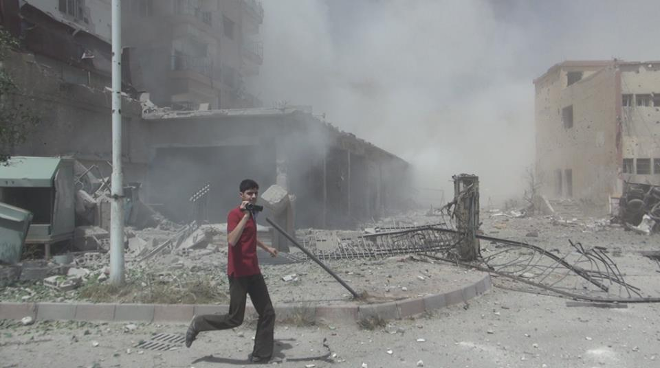

The Syrian Archive Team on the 2nd anniversary of the chemical weapons attack on Ghouta, Syria \| 21 August 2015

Friday 21 August was the 2nd anniversary of the Ghouta massacre. In the early hours of 21 August 2013, rockets containing the nerve agent Sarin were dropped on suburbs of the Syrian capital, Damascus, causing the death of more than 1300 people, many of them women and children.

Two years later and, despite the efforts of the OPCW (Organization for the Prohibition of Chemical Weapons) to destroy and dismantle the Syrian government's chemical weapons programme, new attacks using chemicals continue to be reported across Syria, including reports of the use of poison gas by Daesh (Islamic State).

Meanwhile, the use of banned weapons is only one of many crimes that are being committed against the Syrian people. Indiscriminate shelling, aerial bombardment, regular use of barrel bombs on urban areas, unlawful arrest and detention, torture: the list of atrocities against the Syrian population committed by the Assad regime and other parties in the conflict keeps getting longer. Only last week, the Syrian Airforce bombed the central market in Douma killing many civilians.

Today, the Syrian Archive Team wants to remember the victims of the chemical attacks by publishing an archive of video evidence documenting those dreadful events that caused the death of up to 1300 people. The full dataset is now available at [the violation database](https://syrianarchive.org/en/database) and the [incident map](https://syrianarchive.org/en/database/map).

The Syrian Archive is an initiative launched by a network of human rights activists, lawyers, archivists, researchers, and technical professionals, committed to end the spiral of violence in Syria and to promote a culture of accountability and respect for human rights within Syrian society.

Working in support of media and documentation centres in Syria, our goal is to preserve the most valuable material to ensure it is organised and accessible for use by current researchers, journalists, lawyers and others with an interest in the conflict as well as to facilitate the work of future historians and investigators.

Preserving the hundreds of thousands of pictures and videos recorded by Syrian citizen journalists not only honours those who made great efforts by risking their lives to document these crimes.

<iframe width="560" height="315" src="https://www.youtube.com/embed/y6CZtF6pGvQ" frameborder="0" allowfullscreen>
</iframe>

[Video metadata.](https://syrianarchive.org/en/database?term=ccef0219&type_of_violation=Use_of_illegal_weapons&unit=ccef0219)

This material also forms valuable evidence that can be used in the exposure and investigation of human rights violations by all parties, that will play a vital role in future justice and accountability efforts.
