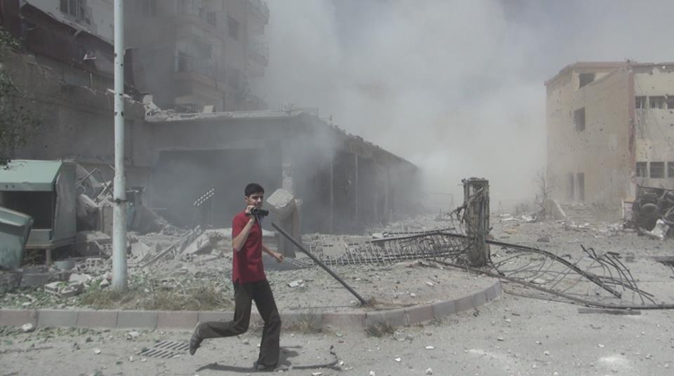

فريق الأرشيف السوري بشأن الذكرى الثانية لمجزرة الكيماوي في ريف دمشق | 21 آب، 2015

يصادفُ يوم الجمعة الواحد والعشرين من آب ذكرى مجزرة الكيماوي التي ارتكبت في غوطة دمشق قبل عامين، حيث ألقت الصواريخ رؤوسًا مُحمّلة بغاز السارين على مناطق أهلةً بالسكّان المدنيين ليبلغ عدد الضحايا في ذلك اليوم ألفًا وثلاثمئة شخص معظمهم من الأطفال والنساء.

وعلى الرغم من الجهود المبذولة من قبل منظمة حظر الأسلحة الكيميائية خلال عامين لتدمير الأسلحة الكيميائية التي تملكها الحكومة السورية وفق قرار مجلس الأمن الدولي رقم 2118، فقد تمّ التبليغ عن وقوع ضربات جديدة استخدمت فيها أسلحة كيماوية من قبل الحكومة السورية وتنظيم داعش.

وإلى جانب استخدام السلاح الكيماوي ترتكب الحكومة السورية انتهاكات مستمّرة بحقّ المدنيين، كالقصف العشوائي، استعمال البراميل المتفجّرة، الاختفاء القسري، التعذيب الجسدي والنفسي، العنف الجنسي، الانتهاكات ضدّ الأطفال، والتشريد التعسفي والقسري، حيث نفّذ الطيران الحربي السوري في الأسبوعين الماضيين عدّة هجمات ضدّ السكّان في ريف دمشق أسفرت عن سقوط العشرات من الضحايا المدنيين.

يودّ فريق الأرشيف السوري في هذه المناسبة أن يتذكّر ضحايا الهجمات الكيماوية من خلال أرشفة ونشر قاعدة بيانات بالأدلة البصريّة التي وثقت هذه الحادثة المروّعة والتي أسفرت عن وقوع عن ما لا يقل من 1300 شخص من المدنيين.

يمكنكم الإطّلاع على قاعدة البيانات والأدلة البصريّة الموثّقة في موقع الأرشيف السوري من خلال [قاعدة بيانات الإنتهاكات](https://syrianarchive.org/ar/database/) و[خريطة الأحداث](https://syrianarchive.org/ar/database/map/).

"الأرشيف السوري" مبادرة سوريّة أطلقتها شبكة من الناشطين الحقوقيين واختصاصيي الأرشفة وتقنيين ومحاميين وصحفيين لأرشفة الأدلّة الموثِّقة لانتهاكات حقوق الإنسان في سوريا والمُرتكبة من قبل جميع الأطراف -بمستوى معيّن- منذ آذار 2011\. نأمل أن يساعد "الأرشيف السوري" بذلك في بناء السلام المستدام واحترام حقوق الإنسان ضمن المجتمع السوري، وذلك من خلال التمهيد للعدالة والمساءلة.

تعمل المبادرة بدعم المنظمات الحقوقية والمراكز الإعلامية على حفظ وفهرسة الوثائق المتعلقة بانتهاكات حقوق الإنسان من أي جهة كانت، بما يلائم احتياجات الموثّقين والإعلاميين في سوريا، بالإضافة لجعل تلك الوثائق منظّمة وقابلة للاستخدام من قبل المحقّقين والمحاميين والصحفيين والباحثين لتسهيل عملهم.

نودّ من خلال أرشفة الأدلة البصرية إرسال كل التحية والاحترام للنشطاء والمراسلين المدنيين الذين يضحون بحياتهم لتوثيق الانتهاكات ضد المدنيين.

<iframe allowfullscreen="" src="https://www.youtube.com/embed/y6CZtF6pGvQ" width="690" height="450" frameborder="0"></iframe>

[تفاصيل الفيديو.](https://syrianarchive.org/ar/database?term=ccef0219&unit=ccef0219)

تعد هذه الأدلة البصرية ذات قيمة كبيرة لإمكانية استخدامها في عمليات التحقّق والمناصرة والمحاسبة ضد مجرمي الحرب.

