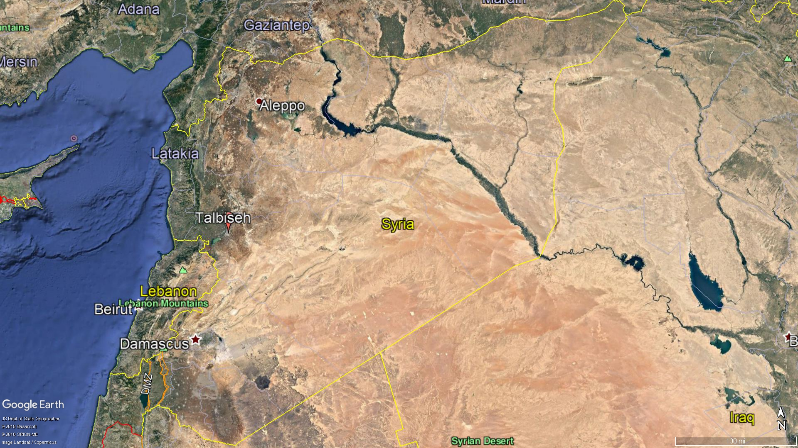
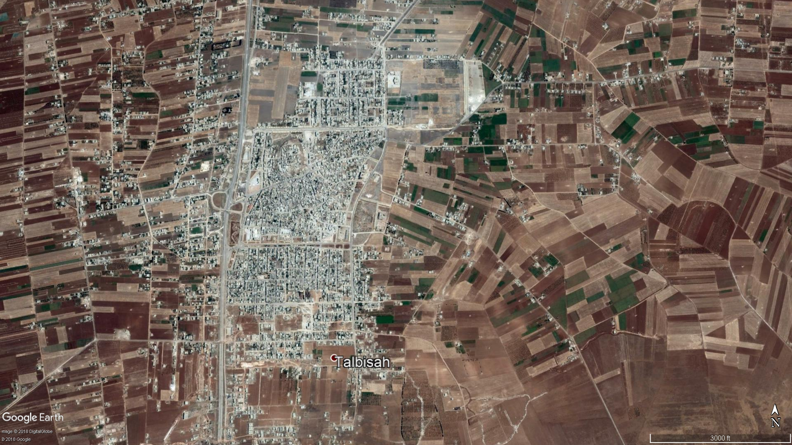
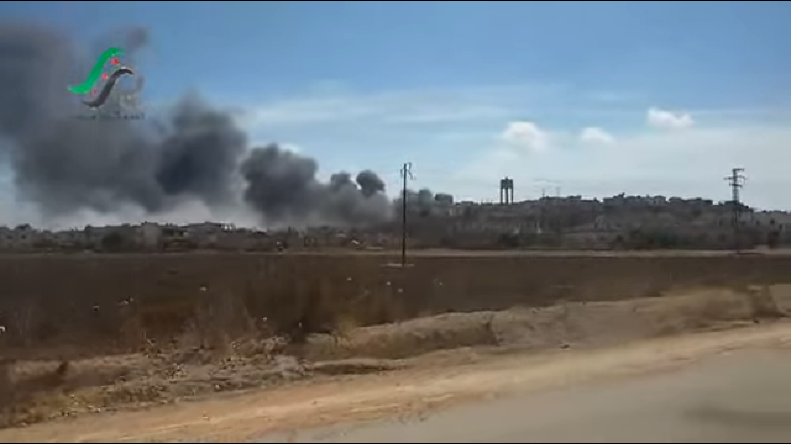
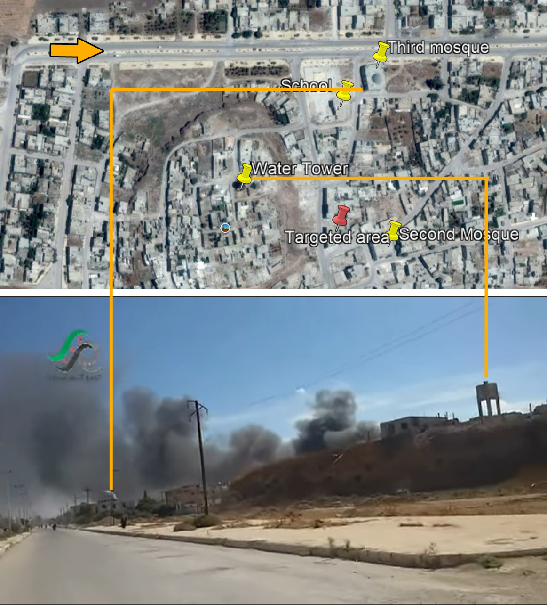
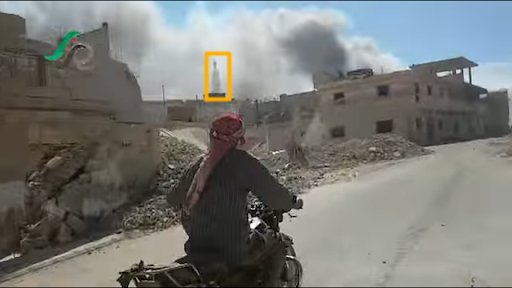
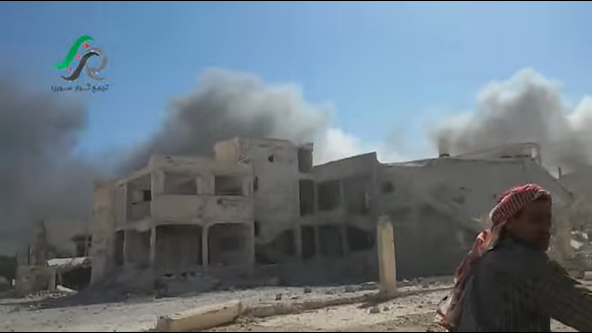
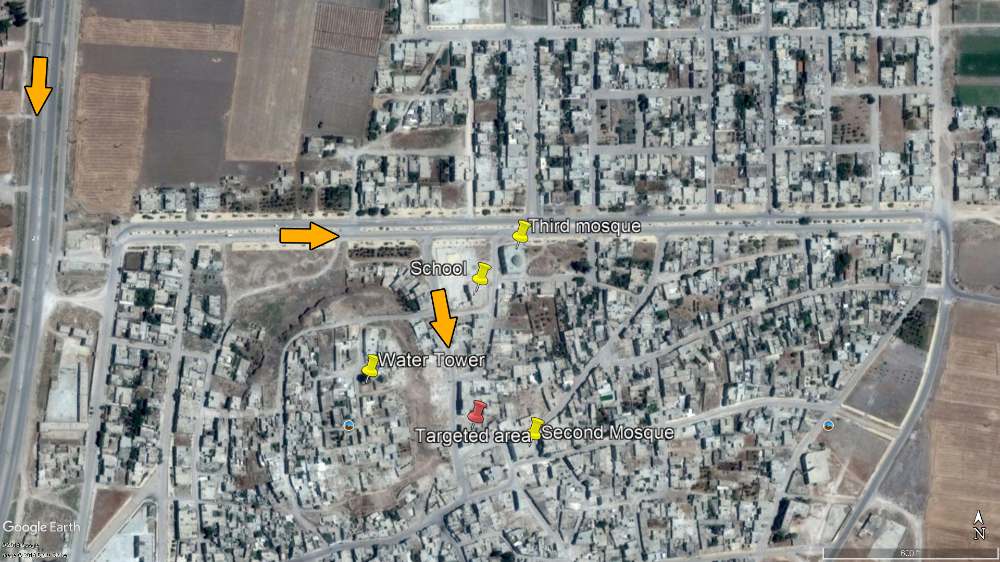
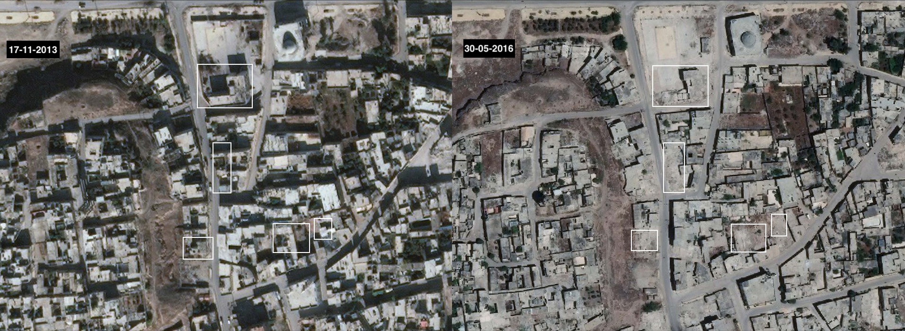

## Incident information

- Location: Homs : Talbiseh
- Date: 30/09/2015  
- Time of Attack: ~ Between 10:00am and 11:00am   
- Target: Buildings lived by civilians, mosque and a school
- Reported killed: 18
- Munitions identified: Not available  
- Potentially responsible: Russian Airforce  

## What Happened?

On 30 September 2015, several news networks and activist pages [reported](https://www.youtube.com/watch?v=pPfe3S5vvMc) that the Russian airforce carried out airstrikes on [Talbiseh](https://goo.gl/maps/HR6mru5nPSz), a town in the countryside of Homs. This attack coincided with the Russian Federation Council authorising Russian President Vladimir Putin to use the force in Syria, [announcing the start of Russian military operations in Syrian territory](https://www.youtube.com/watch?v%3DqblmOvkV9KM&sa=D&ust=1539188171178000).

The location of Talbiseh in the northern countryside of Homs:

The location of Talbiseh between the cities of Rastan and Homs:

Satellite image of Talbiseh city:

Talbiseh News Channel published a video on 30 September 2015 [documenting the moment when the reporter arrived after the claimed airstrike](https://www.youtube.com/watch?v%3DKqEtOd5Mypg&sa=D&ust=1539188171179000). This video shows, according to the source, the location where thermobaric rockets fell and subsequent rescue operations.

A few hours after publishing the first video, the same channel published another video [showing the rescue operations](https://www.youtube.com/watch?v%3DpPfe3S5vvMc&sa=D&ust=1539188171180000), a trail of destruction, and some of those killed as a result of the raid.

The same day, the "Syria Revolutionaries Gathering" YouTube account published a video [showing the first moments after the airstrikes](https://www.youtube.com/watch?v%3D66G9nXb1oCA&sa=D&ust=1539188171180000) which targeted the city's neighbourhoods, as claimed by the video's source.

A photo of the impact site. The water tower can be noticed on the right side.

Also on that day, the "Syria Revolutionaries Gathering, Homs northern countryside - media office" channel published another video on YouTube [showing the first moments of the airstrikes](https://www.youtube.com/watch?v%3DO4cP-FUFQrY&sa=D&ust=1539188171181000) carried out by Russian airforce, as claimed by the video's source. The video also shows the impact site, structural damage to civilian buildings, and subsequent rescue operations.

The impact site in Talbiseh, and the water tower can be seen again in this video as shown below.

## When did it happen

The Violations Documentation Center in Syria [published a report](http://www.vdc-sy.info/pdf/reports/1444252328-English.pdf) on the Russian air raids of 30 September 2015, in which the Paramedic Omar Al Daqa (Abu Khaled Al Homsy), one of Talbiseh’s field hospital staff, recounted his experience:

“On Wednesday 30 September 2015, around 10:00 am, Russian warplanes launched several fierce airstrikes on Talbiseh city, targeting a number of neighbourhoods with thermobaric missiles, including Karameh, Post, and Mashjer streets, as well as the city’s bread distribution centre. The shelling was along one track with almost 100 meters between each missile. As a result, 17 civilians were killed, 34 were wounded, and one is missing (probably torn into pieces).”

Syrian Civil Defence member Dhiaa Abu Musaab (26), who was present during the airstrikes on the city of Talbiseh told the Violations Documentation Center:

“On 30 September 2015, at about 10:00 am, we were informed by the observatories that two warplanes were flying over the northern countryside of Homs, including over the city of Talbiseh. I took my video camera and rushed to the roof of my house to film them, but before I got there, the observatories requested civilians to instantly evacuate the streets, adding that the pilots were speaking Russian. A few seconds later, the warplanes launched eight vacuum missiles – specifically on the northern neighbourhoods, which were crowded with civilians. The attack also hit a civilian bread distribution centre, although there were no military headquarters in the targeted area. It was probably the first time that I saw a smoke cloud that large after an explosion. When I arrived at the scene, I saw three large holes in the street of different depths from one meter to two and a half meters. Some of the missiles had fallen directly between civilian houses and streets.“

VDC also [published](http://www.vdc-sy.info/pdf/reports/1444252328-English.pdf) the names of the 18 people who were killed as a result of the airstrikes including children.

## Landmarks and Geolocation

"Talbiseh Mubasher" network also published a video [showing smoke rising as a result of airstrikes](https://www.youtube.com/watch?v%3DlQNhP6G0u7s&sa=D&ust=1539188171184000) that targeted Talbiseh. This video shows a mosque minaret in front of the explosion site. Syrian Archive identified that this minaret belongs to the [Al Mustafa and Al Maqbara mosques](https://goo.gl/maps/43Sk5FnU9Cs) east of the town.

Below is a photo published on Google Maps [which shows the minaret of "Al Mustafa and Al Maqbara" mosques](https://goo.gl/maps/iZSk24sNV1F2), and behind it, the minaret of a second mosque (جامع علي).

Another photo published Google Maps [shows the mosque as well as the water tower](https://goo.gl/maps/CSHK4ByDq9R2).

Google Earth imagery shows [the water tower (خزان القلعة), school (مدرسة الطلائع), the second (جامع علي) and the third mosque (جامع المصطفى) in the area of the attack](https://www.google.com.tr/maps/@34.8454128,36.730747,181m/data%3D!3m1!1e3&sa=D&ust=1539189669563000). Those landmarks are the same ones appear in the videos published above.

A satellite image shows the locations of the water tower, the second mosque in the southeast, and the third mosque (which has no minaret) in the northeast.

[Al-Kul Radio published](https://www.youtube.com/watch?v%3Do233wvp_3AA&sa=D&ust=1539188171188000) a video one year after the incident which shows the damage of the [second mosque](https://www.google.com.tr/maps/@34.843604,36.7278948,981m/data%3D!3m1!1e3&sa=D&ust=153918817118600).

Below on the right is the location of the water tower, and on the left, the location of the third mosque with no minaret. It is possible to estimate the proximity of the targeted site to those landmarks based on the photographers movement and the spread of rising smoke.

In the video published by "Syria Revolutionaries Gathering, Homs northern countryside - media office" channel, [the second mosque minaret appeared for a moment](https://www.youtube.com/watch?v=O4cP-FUFQrY), shows how close the impact site is to the mosque.

By comparing these images to the landmarks, it is possible to accurately determine the photographer's track.

The school fence appeared to the left of the photographer near the targeted site:

The below image shows the structural damage to the school:

After matching the video with satellite images, Syrian Archive determined the location of the partially destroyed school though its L-shaped construction, the location of the where the second mosque's minaret, and the location of the water tower to the south-west.

The below photo shows the photographer's path from [the video of "Syria Revolutionaries Gathering"](https://www.youtube.com/watch?v%3DO4cP-FUFQrY&sa=D&ust=1539188171189000)

After identifying the photographer's path and the landmarks (e.g., include "Al-Iman and AL-Rahma" Mosque, the second Mosque, the third mosque that has no minaret, and the water tower above Talbiseh castle), [the exact impact site can be determined](https://www.google.com.tr/maps/@34.8448492,36.7315971,103m/data%3D!3m1!1e3&sa=D&ust=1539188171190000). See below:

The landmarks and the targeted area have been identified using Google Earth imagery from 17/07/2015. See below:

Before and after satellite images (the first was taken on Nov 17, 2013 and the other one on May 30, 2016) show the structural damage to the buildings as a result of the airstrike.

Later, after the airstrike, several sources reported targeting the same impact site again during the rescue operations. Many activists and news networks published pictures and news of victims and wounded civilians who were killed in airstrikes that targeted the Talbiseh town. Media networks that published materials about the incident report that the second bombing was also by a Russian aircraft.

Baladi Media Network Facebook page posted a video on 30 September 2015 concerning the [targeting of the impact site again during rescue operations](https://www.facebook.com/baladinetwork/videos/622454614524504/&sa=D&ust=1539188171191000) by a Russian aircraft.

## Civilian casualties

Talbiseh News channel on YouTube posted several videos of victims of Talbiseh attacks, including [a video of the child victim](https://www.youtube.com/watch?v%3D9aZ0tew17VY&sa=D&ust=1539188171192000) "Ahmed Mohammed Juma", [a video of the young victim](https://www.youtube.com/watch?v%3D0mm-S2adiU4&sa=D&ust=1539188171192000) "Musa Mahmoud Juma", and [a video of a Civil Defense member](https://www.youtube.com/watch?v%3D1bHO1ieMYwU&sa=D&ust=1539188171192000) "Abd Al-Latif al-Dahik" who was killed in the second airstrike during the rescue operations. The channel also published [a video of the funeral](https://www.youtube.com/watch?v%3DIeK-V6ywp2o&sa=D&ust=1539188171192000) of some of the victims.

In addition, the Syrian Civil Defence in Homs province mourned the death of the member "Abd Al-Latif Al-Dahik" [in a post on their Facebook page](https://www.facebook.com/SCDHOMS/posts/462825793895268?__tn__%3D-R&sa=D&ust=1539188171192000).

The Syrian Network for Human Rights published a picture of two children who were killed in the airstrikes on Talbiseh town, Ahmad and Yamen Mohammed Al Juma.

On the same day, Talbiseh News channel published many videos of injured people, including a [video of a child](https://www.youtube.com/watch?v%3DiW_PfDoR-60&sa=D&ust=1539188171193000) injured by shrapnel as a result of the airstrikes, and [a video of an injured young man](https://www.youtube.com/watch?v%3DGMU54aiGSDA&sa=D&ust=1539188171193000) receiving medical care after being extracted from under the rubble. The channel also posted [a video of one of the field hospitals](https://www.youtube.com/watch?v%3DwUMWd_vmr1E&sa=D&ust=1539188171194000) in Talbiseh crowded with injured as a result of the attacks.

The Talbiseh Media Center published a [video showing the people killed](https://www.youtube.com/watch?v=uN2WWMoZ1-4&list=TLzlllYDxAVbMwMjEwMjAxNQ) as a result of the Russian airstrike.

Some [pro-Syrian government pages](http://archive.fo/2DS2k&sa=D&ust=1539188171195000) published news of the [continued bombing of Talbiseh town](https://www.facebook.com/General.Command.Armed.Forces963/posts/835469936572767?__tn__%3D-R&sa=D&ust=1539188171195000).

Several hours after the airstrike, at 15:45 Damascus local time, the Turkish Anadolu News Agency [reported in their Facebook page](https://www.facebook.com/AnadoluAgency.AR/posts/896894630431676?__tn__%3D-R&sa=D&ust=1539188171195000) that activists in the provinces of Hama and Homs saw two aircrafts of a new-model they had not previously seen, simultaneously in the skies of areas under the opposition control in both provinces. Reports pointed out that the aircraft carried out a number of raids in those areas.

According to the website of the Russian Ministry of Defence, [the Ministry launched the first airstrike in Syria on 30 September 2015](http://syria.mil.ru/news/more.htm?id=12059172@egNews) to fight what they called global terrorist groups in the Syrian Arab Republic.

On 30 September 2015, the spokesman of the Russian Ministry of Defence, Major General Igor Konashenkov said in a brief statement [that Russian forces launched about twenty precision airstrikes](https://www.youtube.com/watch?v%3DqblmOvkV9KM&sa=D&ust=1539188171198000) targeting eight objectives of the ISIS terrorist group at the territory of Syrian Arab Republic. The website of the Russian Ministry of Defence also [published a video](http://syria.mil.ru/news/more.htm?id=12059172@egNews) about these airstrikes on 30 Sep 2015.

The Armed Forces of the Russian Federation VK account [published a map](https://vk.com/wall-3457550_23655) showing ISIS and Al Nusra controlled areas. The location of Talbiseh that was targeted by airstrikes is not under the green area which is not under the control of ISIS neither Al Nusra.

## Conclusion

After collecting and analysing images and visual documentation published on social media platforms and news networks, Syrian Archive found that Talbiseh, located in the countryside of Homs, was targeted by Russian airstrikes on 30 September 2015.

It should be noted that hours before the airstrikes on the same day, the Russian Federation Council authorised President Vladimir Putin to use force in Syria as an official announcement to start Russian military operations in Syrian territory.

According to the analysed evidence and sources, between 10:00am and 11:00am that same day, Russian airstrikes targeted the north of Talbiseh town, followed by a second airstrike at the same site during the rescue operations resulting in a larger number of victims (especially among Civil Defence members), where the death toll of both attacks reached 18 with many more wounded. The Russian Ministry of Defence said that its forces launched about twenty precision airstrikes targeting eight objectives of the ISIS terrorist group at the territory of Syrian Arab Republic. Talbiseh city was not under either ISIS or Al Nusra control at this time.
