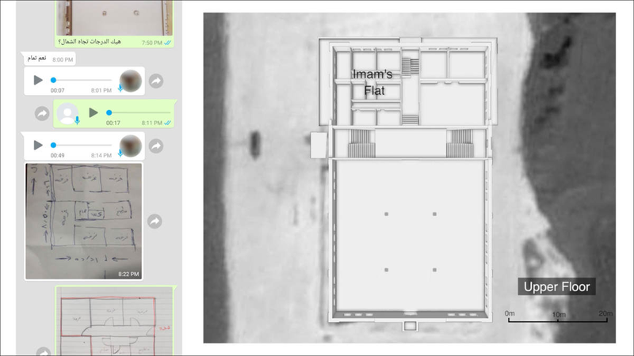

\_Live URL of this investigation is on the [Bellingcat website](https://www.bellingcat.com/) from April 18th 2017. \_\_Bellingcat exchanged information with Forensic Architecture and Human Rights Watch. Both of which carried out separate investigations into the attack. All multimedia information has been [archived by the Syrian Archive.](https://syrianarchive.org/en/database?location=%D8%AD%D9%84%D8%A8%20:%20%D8%A7%D9%84%D8%AC%D9%8A%D9%86%D8%A9&after=2017-03-15&before=2017-03-19)\_

On March 16, 2017, around 18:55 local time, a United States (US) airstrike targeted the Sayidina Omar ibn al-Khattab mosque, where reportedly almost 300 people had gathered for the \_Isha'a \_night prayers and a religious lecture. The airstrike completely destroyed the northern side of the mosque complex near al-Jinah in Syria's Aleppo governorate. Thirty-eight bodies, including five children, were recovered from the rubble, according to the Syria Civil Defence, a search and rescue group operating in opposition-held territories better known as the "White Helmets".

There is no doubt that the US conducted the attack. Initial open source information already hinted towards US involvement [as we detailed in our initial report](https://www.bellingcat.com/news/mena/2017/03/16/us-missile-remains-reportedly-recovered-from-site-of-aleppo-mosque-bombing/), and the US Central Command (CENTCOM) claimed responsibility for the strike, saying it targeted "an Al Qaeda in Syria meeting location," killing "dozens of core al Qaeda terrorists" after extensive surveillance. They incorrectly referred to the location of the attack as the Idlib governorate, but later confirmed to Bellingcat that they meant that the strike occurred near al-Jinah in the Aleppo governorate. A US military spokesperson claimed that the US had taken "extraordinary measures to mitigate the loss of civilian life". The Pentagon released a post-strike image of the site, and said they "deliberately did not target the mosque at the left edge of the photo". Instead, they claimed, a partially-constructed community hall was targeted.

However, one pressing question remained: is this building a mosque or a meeting hall? New information, collected by both Forensic Architecture and Human Rights Watch, reveals that the building targeted was a functioning, recently built mosque containing a large prayer hall, several auxiliary functions, and the Imam's residence. Bellingcat believes that the civilian casualties caused by this strike are partially the result of the building's misidentification.

The new information will be discussed in this article in relation to all the open source multimedia information found by Bellingcat with a timeline of that information included later in the article. All multimedia information has been archived by the Syrian Archive, a project to which Bellingcat contributes.

## Content

**The Mosque Complex**

-   The Location
-   The Floorplan
-   The Exterior

**The Activities in the Mosque**

-   The Tablighi Jamaat
-   An Al-Qaeda Meeting?

**The Damage and the Casualties**

A Timeline of Open Source Information

-   March 16, 2017
-   March 17, 2017
-   March 18, 2017
-   March 19, 2017

## The Mosque Complex

## The Location

The Sayidina Omar ibn al-Khattab mosque is located around 1.5 kilometers southwest of the village of al-Jinah in Syria's Aleppo governorate, at coordinates [36.107721, 36.787080](http://wikimapia.org/#lang=en&lat=36.107785&lon=36.786904&z=15&m=b). The mosque is situated next to a small mosque just meters north of it. Locals told Human Rights Watch that construction at the mosque started in 2013. Historical imagery from Google Earth, Microsoft Bing, and TerraServer corroborates this account. The construction remained unfinished due to lack of funds, the interviewees said.

## The Floorplan

The mosque complex's original contractor and care-taker, who was also wounded in the strike, has been interviewed by Forensic Architecture. The upper floor in the northern part of the complex, he claims, contained the living space for the Imam, whose wife was at home and killed in the strike.

The ground floor of the northern section included a ritual wash room, toilets, a kitchen, and the Winter prayer hall.

A video recorded during the construction of the mosque and [published on YouTube in November 2014](https://www.youtube.com/watch?v=SOdP6FbrFzQ), confirms the use of each room, such as the ritual wash room (4:37-4:54), the toilets (4:54-5:16), the Winter prayer hall (5:21-5:27), and the kitchen (5:37-5:57).

There are several important features in the video of what used to be the north area. It is worth pointing out is that the winter prayer hall had two openings. One, facing the west-east corridor, was closed off, and the other was open as is visible in the video. The main prayer hall had sliding doors and non-moveable windows, showing that the two sections of the building were connected by doorways. The video also shows that even during the earlier phases of the construction, the mosque complex, including the prayer hall, was used by locals.

The ground floor contained the main prayer hall in the southern side of the building, confirming Bellingcat's initial research. Forensic Architecture has made a 3D model of the mosque complex. Several aspects indicate the building is indeed a mosque, such as the shelves for worshippers' shoes, the rugs and the *mihrab*, where the Imam leads the prayer and indicates the direction to the Kaaba in Mecca.

The 2014 video also shows worshippers in front of the same *mihrab*. Other features visible in the videos also match, confirming this is the same location.

## The Exterior

Two videos showing the mosque complex before the strike happened have been obtained by Forensic Architecture. One of the videos was provided by a local and was not previously published online, while the other had been uploaded to YouTube in 2014 and has already been referred to above.

The first video shows that the *athan* speaker, used for the call for prayer, is visible on the roof of the mosque. A sign next to the entrance reads "Sayidina Omar Ibn al-Khattab mosque". It is worth noting that this sign is in the very same position as seen in post-strike photos and videos.

The second video starts with several photographs of the mosque complex under construction.

\#\#The Activities in the Mosque
\#\# The Tablighi Jamaat

Individuals featured in open source videos showing the aftermath of the attack claim that the mosque was used by Tablighi Jamaat, a non-political global Sunni Islamic missionary movement which focuses on urging return to primary Sunni Islam. The movement is believed to have around [12](http://www.livemint.com/Politics/nYJVwDC7lMtF8ZlDNGxAvI/Inside-the-Tablighi-Jamaat.html) to [150](https://www.stratfor.com/weekly/tablighi-jamaat-indirect-line-terrorism) million adherents worldwide, the majority of them living in South Asia.

The pre-strike video showing the mosque under construction was uploaded by a group that appears to be affiliated with the Tablighi Jamaat, as its title is "Centre for Tablighi Da'wah in the Levant".

Some individuals shown in the video, as well as Bilal Abdul Kareem, a controversial reporter for a small media outlet called *On the Ground News*, confirmed the account that the mosque was used by Tablighi Jamaat, which reportedly held religious lectures each Thursday. These accounts are corroborated with a reporter of [Anadolu Agency](http://aa.com.tr/ar/%D8%A7%D9%84%D8%AF%D9%88%D9%84-%D8%A7%D9%84%D8%B9%D8%B1%D8%A8%D9%8A%D8%A9/%D9%82%D8%AA%D9%84%D9%89-%D9%85%D8%B3%D8%AC%D8%AF-%D8%A7%D9%84%D8%AC%D9%8A%D9%86%D8%A9-%D8%A8%D8%B1%D9%8A%D9%81-%D8%AD%D9%84%D8%A8-%D9%85%D9%86-%D8%A3%D8%AA%D8%A8%D8%A7%D8%B9-%D8%AC%D9%85%D8%A7%D8%B9%D8%A9-%D8%A7%D9%84%D8%AA%D8%A8%D9%84%D9%8A%D8%BA-%D9%88%D9%84%D9%8A%D8%B3%D9%88%D8%A7-%D9%85%D9%86-%D8%A7%D9%84%D9%82%D8%A7%D8%B9%D8%AF%D8%A9/773921), and testimonies collected by Human Rights Watch:

"...preachers hold a religious lecture in the mosque between sunset and night prayer every Thursday, the day of the attack. On the day of the attack, as they usually do when it is cold outside, they used the eating area in the service section for the lecture because the large prayer hall in the southern section was poorly insulated."

The group, going by the name "the loved ones" (Arabic: الأحباب), has a sizeable presence in the Aleppo governorate, according to [Ahmad Abouzeid](https://twitter.com/abazeid89), who spoke to Bellingcat.

In [a video](https://drive.google.com/file/d/0B8e-Baa7LjKEWURTMHRvbTdiWDA/view) recorded after the incident, the imam of a mosque in the Aleppo governorate, Sheikh Abdul Razzaq (Arabic: الشيخ عبد الرزاق), says that a mosque and meeting place of the Tablighi Da'wah group was targeted. He says that the Tablighi Jamaat have no connection with politics, Islamic State, or Jabhat al-Nusra.

Local residents and a mosque employee told Human Rights Watch a similar story:

"They are a hundred percent civilian. We call them"the beloved.\" They don't preach jihad or war. They preach only god and Islam. They rotate between different villages. There are 10-15 from our village. 10-15 from another village and so on. These people they practice *itikaf* \[the practice of staying in a mosque for a certain number of days, devoting oneself to worship and staying away from worldly affairs\]. They're just spreading the word of god.\"

## An Al-Qaeda Meeting?

The entire ground floor was open to the public and there were no doors to the prayer rooms, according to witnesses and confirmed by the 2014 video. This makes them an unlikely place for a secret "meeting of senior al-Qaida terrorists" as the Pentagon asserts, especially since almost 300 worshippers were present at the site according to witnesses.

Human Rights Watch has also not found evidence to support the claim that members of al-Qaeda or any other armed group were meeting in the mosque. As the organisation notes, the US authorities have so far not released any information to support their claims.

In case there were armed group members present in the mosque, Human Rights Watch stresses the importance of understanding the nature of the targeted building and the pattern of life around the building as crucial to assess the risk to civilians.

Human Rights Watch also searched online for the names of the dead, reviewing possible Facebook profiles connected to those names. They did not find any indication that any of the casualties belonged to an armed group. One user with an identical name had a picture referring to Jabhat al-Nusra, but Human Rights Watch could not confirm whether it was indeed the profile of a casualty, as the name is common.

In Bellingcat's examination of all the photos and videos from the attack, we have identified no signs of armed individuals or military equipment at the mosque, nor have we seen any signs of al-Qaeda presence.

## The Damage and the Casualties

The airstrike happened at 18:55 local time, only 15 minutes before the \_Isha'a \_night prayers would start that day. The time of the night prayer is relevant, Human Rights Watch asserts, because "since they knew that that another mosque was nearby." Information related to prayer times is easily findable in online databases, and "should have been well known \[to\] US authorities."

The strike targeted the northern side of the building, just as a religious seminar in the Winter prayer hall was taking place, according to eyewitnesses. The northern side of the building functioned as the service section of the mosque complex. Other individuals were gathering in the main mosque in preparation for the\_ Isha'a\_ night prayers, according to a witnesses interviewed by Forensic Architecture and Human Rights Watch.

Two large craters in the north part of the building have been identified by Forensic Architecture. Munition experts have confirmed to them that these craters are consistent with two 500-pound bombs.

As the bombs hit the northern part of the building, resulting in the total collapse of it, a large number of people started to flee the building, according to eyewitnesses interviewed by Human Rights Watch and Forensic Architecture. As they escaped outside, they were targeted by several smaller missiles.

A US official later told a Washington Post reporter that Hellfire missiles were used in the attack.

Mohammad Halak, director of the Syrian Civil Defence's western rural Aleppo sector, told Forensic Architecture that he saw around twenty to thirty dead bodies scattered between the mosque complex and the road. His account is confirmed by other witnesses. Mr. Halak told Forensic Architecture where they found victims in the rubble, including the location where they pulled out the 14-year old Mohammad Orabi, who later died of his injuries. That rescue attempt was filmed by Thiqa Agency.

Markings on the road that indicate the traces of a Hellfire missile are also visible in open source multimedia information, and have been visualised in the 3D model of Forensic Architecture. The pattern is identifiable by its distinct fragmentation pattern and by shrapnel found nearby, Forensic Architecture asserts.

In total, 38 bodies were recovered from the site according to the Syrian Civil Defence, who published 28 names of those who could be identified by relatives. Ten bodies were not identified, Human Rights Watch writes.
\#\# A Timeline of Open Source Information
This is a timeline of statements of the United States (US) airstrikes that targeted the northern side of a newly-built prayer hall in Syria's northern Aleppo province. All times mentioned are in the local timezone of the Aleppo governorate (UTC+2).

<iframe allowfullscreen frameborder="0" height="650" src="https://cdn.knightlab.com/libs/timeline3/latest/embed/index.html?source=1pH2dQjrU4QMcaD4V8GHkkZCnz50Il0NM1DO1qatHXlQ&amp;font=Default&amp;lang=en&amp;initial_zoom=2&amp;height=650" width="100%">
</iframe>
