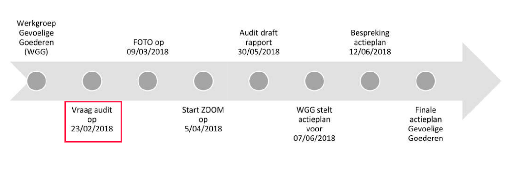
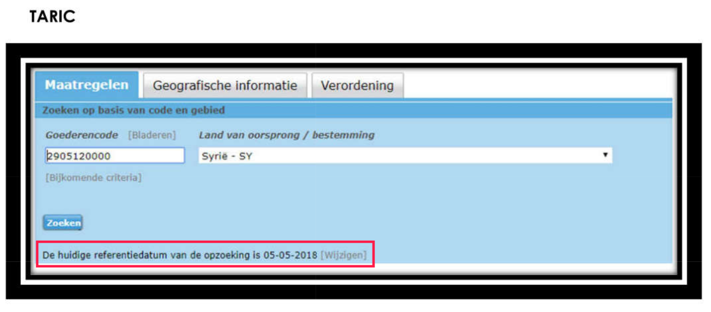
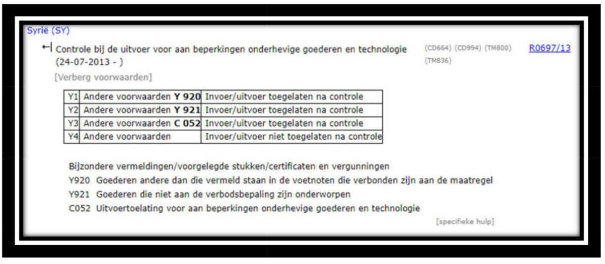
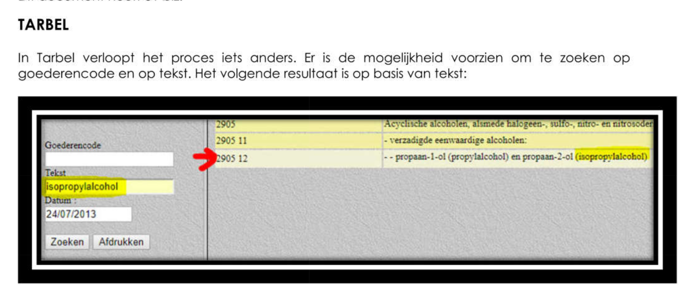

### Illegal export of isopropanol to Syria

Today, 7 February 2019, Antwerp Criminal court convicted the three Flemish companies (AAE Chemie Trading, Anex Customs and Danmar logistics) and two managing directors for shipping 168 tonnes of the chemical substance isopropanol with 95% purity to Syria between 2014 and 2016 without submitting the appropriate export licences. The court imposed conditional fines of up to 500.000 EUR as well as (conditional) prison sentences for one managing director and one manager. A export licence for isopropanol 95% has been mandatory since the European Union ratified sanctions on Syria with [regulation 36/2012](https://eur-lex.europa.eu/legal-content/EN/TXT/?qid=1493825060366&uri=CELEX:02012R0036-20170321). This conviction follows a story published jointly on April 18th, 2018 from [Knack and Syrian Archive](https://syrianarchive.org/en/investigations/belgium-isopropanol/).

AAE Chemie Trading, the wholesaler from Kalmthout that supplied the chemicals, was sentenced to a conditional fine of 346.443 EUR, of which 50.000 EUR is effective. Anex Customs from Hoevenen and Danmar Logistics from Stabroek were sentenced to a conditional fines of 500.000 EUR, of which 100.000 EUR takes is effective, and 75.000 EUR, of which 50.000 is effective.

The manager of AAE Chemie Trading and the manager of Anex Customs and Danmar Logistics were sentenced to a conditional fine of 346.443 EUR, of which 50.000 EUR effective, and 500.000 EUR, of which 100.000 EUR effective. The manager of AAE Chemie Trading also received a conditional 4 months prison sentence, and the manager of Anex and Danmar received a 12 months prison sentence effective.

Isopropanol, also known as isopropyl alcohol, is a so-called “dual-use substance,” as it has a wide range of legitimate civilian uses, but it can also be used in the synthesis process of manufacturing chemical agents such as the nerve agent sarin.

After the 2017 sarin attack in Khan Shaykhun, the Organisation for the Prevention of Chemical Weapons (OPCW), that oversees compliance with the Chemical Weapons Convention, examined samples from and around the impact crater, [finding](http://www.securitycouncilreport.org/atf/cf/%7b65BFCF9B-6D27-4E9C-8CD3-CF6E4FF96FF9%7d/s_2017_904.pdf) in laboratory tests that isopropanol was used in the production of sarin used in the attack.

The lawsuit against the three companies began in Antwerp on May 15, 2018 and the sentencing took place on February 7, 2019.  

### Companies faced possible fines and prison sentence

In the pleadings, lawyer Pieter Borms, representing the Belgian Customs, asked for a minimum fine of 346.443 EUR for AAE Chemie as this was the company's first infringement.

The lawyer asked a higher fine for Anex Customs (750.000 EUR) and Danmar Logistics (160.000 EUR), as well as a 500.000 EUR fine for the manager. Customs also demanded a forfeiture of the goods.

The Public Prosecutor's Office joined the Customs' point of view. It asked a prison sentence of 4 months for the manager of AAE Chemie and 18 months for the manager of Danmar Logistics.
Lawyer Joris Vercraeye represented AAE Chemie, which declared bankruptcy on December 20, 2018. The manager of AAE Chemie was not present in the court during the pleadings. Vercraeye mentioned that the bankruptcy of AAE Chemie was a direct consequence of this court case. He also stated that the Belgian Customs had presented a friendly settlement to his client on November 8, 2017, adding 'That is at odds with what the Customs declare today, namely that there is deceptive intent. If that would be true, why offer a friendly settlement then?"

Vercraeye stated that Anex Customs and Danmar Logistics (that took care of the administrative obligations on behalf of AAE Chemie) were not aware of the license obligation. He added that the Customs tool TARWEB at the time of the exports did not mention that an export licence was required, and that that was  the reason why AAE Chemie hadn't applied for the required approval.  

According to Vercraeye the last update of TARWEB regarding isopropanol was implemented on April 19, 2018, one day after the article was published by [Knack](https://m.knack.be/nieuws/belgie/isopropanol-schandaal-hoe-een-grondstof-voor-gifgas-door-de-handen-van-de-belgische-douane-glipte/article-longread-1097291.html).

He also stated that all 24 shipments had been checked by the Belgian Customs. “Samples were taken, examined in the lab, and afterwards the products were released by the Customs for shipment. It was only later that the manager learned through Dutch Customs that an export license was required for isopropanol. He then spontaneously sent the Dutch Customs a list of shipments that had been exported to Syria.”

Vercraeye also denounced that the judicial file was not complete: the Belgian Customs had conducted their own internal audit into the matter, but neither the lawyers of the defense nor the judge had access to that audit report.

### Internal audit report of Belgian customs

Knack submitted a FOIA request to the Belgian Customs in order to get a copy of the audit report. After a procedure battle, on January 25, 2019, Knack received the 31 page document entitled [“Audit Control Sensitive Goods in the context of the Isopropanol case.”](https://www.knack.be/nieuws/belgie/de-zaak-isopropanol-audit-hekelt-falende-douanecontrole/article-normal-1422901.html)

According to this internal audit report, the Customs' inspection service was asked on February 23, 2018 to launch an audit into the subject matter. This was shortly after Knack had contacted the Belgian Customs with worrying indications –based on Syrian Archive's findings in the UN Comtrade database– about the export of isopropanol to Syria.

<small>*Screenshot from the pdf of the internal audit by the Belgian Customs, showing the timeline of the audit process and the following action plan.*</small>

“Most control weaknesses are in the first line,” the audit concludes. On the basis of a studied sample of isopropanol exports, the inspection service of the Customs found that “many physical checks were requested but virtually none performed.” Customs usually checked only the documents, not the chemicals. Customs officers surveyed indicated that they were under time pressure, that it was difficult to consult European legislation in the internal Customs system, and that the selection profile document to detect fraud was insufficiently informative.

The report also mentioned that the internet capacity at the border inspection post in Antwerp was “very low” until the beginning of 2018, and even insufficient to carry out additional investigations. Moreover, the Customs officers had received insufficient training. Finally, the Customs also argue that the declaration forms of the chemicals had been incorrectly filled out by the exporter.

The audit also examined whether the control process for the export of goods subject to restrictions complies with the principles of internal control.

In this context, “a large number of control weaknesses were identified,” linked to limited human and financial resources. “The inspection service can not give a reasonable assurance that risks are being controlled and that the monitoring process will achieve its objectives”.

There were ambiguities about roles and responsibilities, some instructions were no longer up to date, and education and awareness also turned out to be points for improvement.

Problems were identified with both internal and external communication. There was not even an unambiguous verification method to determine the “purity level or composition of sensitive strategic goods.”

The audit report further addressed the lack of a central database with information about previous violations. And the quality of the checks carried out was not effectively monitored.

Finally, the report showed that it was unclear which procedure the Customs had to follow after establishing an infringement against the export restrictions.

Kristian Vanderwaeren, the Customs' Administrator-General, says that the Customs have, in the meantime, taken several actions to improve the control system. “A structurally better consultation with the licensing services in Flanders, Wallonia and Brussels has also been developed as a vital element for a better assessment of the export risks.”

The audit report lists 17 concrete recommendations and improvement actions, such as practical training for Customs officers and clear communication guidelines. The Customs also carried out a feasibility study regarding digital storage of all submitted documents, and they plan, among other things, a re-evaluation of the workload measurement.

The audit also includes a series of screenshots from the Customs’ TARIC and TARBEL databases. From the screenshots, it appears that the database includes information about the export restrictions for isopropanol.

Below is a screenshot of the TARIC database, with the code of isopropanol entered (2905120000). It is important to note that this search was conducted on “05-05-2018”, roughly a month after the audit was started.

