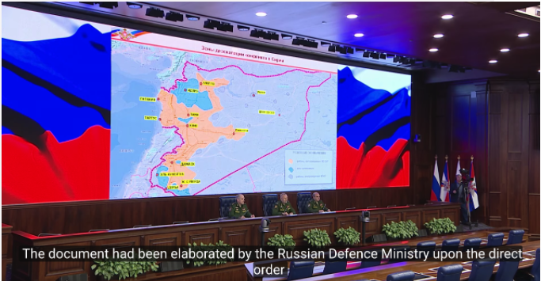
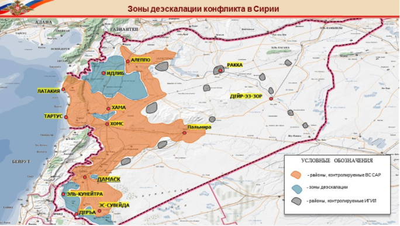
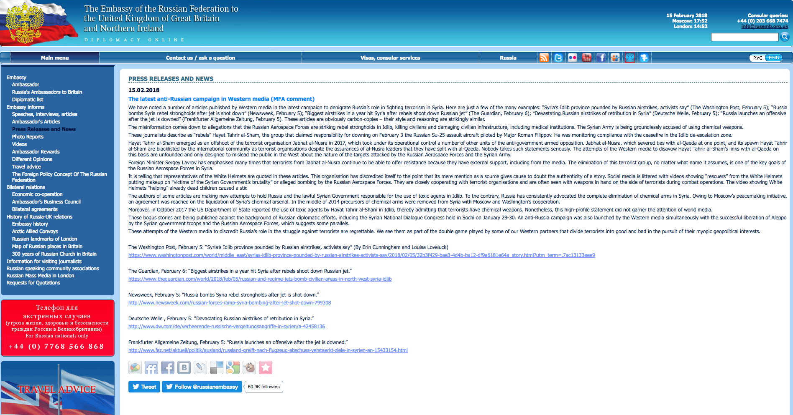

## Introduction

In the period between 03 January 2018 and 05 February 2018, four hospitals in Idlib governorate well within the De-Escalation Zones established by Russia, Turkey and Iran during the Astana talks were attacked by airstrikes that visual documentation, witness statements, and flight observation data attributes to Syrian or Russian forces. Three of these hospitals were attacked within the span of a week.

This report was written as a followup to a July 2017 report titled titled [Medical Facilities Under Fire: Systemic Attacks during April 2017 on Idlib Hospitals.](https://syrianarchive.org/en/investigations/Medical-Facilities-Under-Fire/), in which detailed reports of eight hospitals or medical facilities targeted within one month in one province (Idlib) were published jointly by the Syrian Archive, in partnership with [Syrians for Truth and Justice](https://stj-sy.com/en), [Justice for Life](http://jfl.ngo/), [Bellingcat](https://www.bellingcat.com/) and a flight observation organisation.

Findings in this previous report suggest that in April 2017, Syrian and Russian armed forces were responsible for the eight attacks on Syrian hospitals and healthcare centres - facilities in Idlib serving a combined 1.3 million people (a beneficiary group larger than the population of Brussels), as reported in witness statements as well as by the managers of those medical facilities. Subsequently, [the United Nations' Commission of Inquiry presented findings of a fact-finding](http://webtv.un.org/live-now/watch/commission-of-inquiry-on-the-syrian-arab-republic-press-conference/4473491386001) mission confirmed the systemic targeting of medical facilities by the Syrian government in April 2017, as well as the illegal use of chemical weapons.

### De-escalation zone

On 4 May 2017, the sponsoring states of Astana Talks (Russia, Turkey, and Iran) [signed a memorandum of understanding for the establishment of de-escalation zones in Syria](https://www.youtube.com/watch?v=5cF-gIL8yzk) for at least six months, which [was extended](https://sana.sy/en/?p=116911]) at Astana 7 on 31 October 2017. The Russian Ministry of Defense [published a map showing](https://function.mil.ru/news_page/intrel/more.htm?id=12121964%40egNews) the locations included in this memorandum as shown below (de-escalation zones in blue, ISIS in grey, Syrian army in orange). See below:

These areas included Idlib province, some parts of northern Homs province, as well as some parts of adjacent provinces (Latakia, Hama, and Aleppo), Eastern Ghouta in Damascus countryside and some parts of southern Syria.

Just four days after the [Astana International meeting establishing Syria's De-Escalation Zones](http://www.aljazeera.com/news/2017/09/final-de-escalation-zones-agreed-astana-170915102811730.html) in many parts of the country, [three Idlib medical facilities serving a combined more than 100.000 people yearly were allegedly attacked](https://syrianarchive.org/en/investigations/Three-Idlib-Medical-Facilities-Attacked.html) in airstrikes attributed to Syrian or Russian forces on a single day.

Now, six months later, little has changed. Hospitals remain at the frontlines of the Syrian conflict, and attacks against medical facilities are regular.

### Russian Ministry Statement of Denial

The first week of February 2018 has shown a flurry of media attention focused on potential Russian involvement in the bombing of civilians in Syria. In response, the Russian Embassy to the United Kingdom [published a press release](https://www.rusemb.org.uk/fnapr/6391) on 15 Feb. 2018 claiming a misinformation campaign by "Western media." The press release claims "the misinformation comes down to allegations that the Russian Aerospace Forces are striking rebel strongholds in Idlib, killing civilians and damaging civilian infrastructure, including medical institutions." See below:

This statement, implies (though does not outrightly deny) that Russian airforces are not responsible for the bombing of civilian infrastructure, including hospitals and medical facilities. Later, the same press release states that "on February 3 the Russian Su-25 assault aircraft piloted by Major Roman Filippov...was monitoring compliance with the ceasefire in the Idlib de-escalation zone" at the time his plane was shot down.

That four Idlib hospitals were targeted by airstrikes within a four week period indicates that regardless of whether or not Russian aircraft are targeting medical facilities and other protected persons and objects (deliberately or not), Russia, Turkey and Iran have failed in their compliance enforcement of the de-escalation zones. Through analysis of flight observation data for 4 Feb. 2018 bombing of Maarat al-Numaan National Hospital, for example, several flights were tracked as having taken off from Hmeimim airbase (controlled by Russian forces), flown north, turned around and bombed the National Hospital at 20:40.

In a [previous statement by Russian Foreign Minister Sergey Lavrov regarding the 2016 attack on a humanitarian aid convoy near Aleppo](https://sputniknews.com/middleeast/201609211045538182-syria-russia-attack-convoy/), the Foreign Minister stated: "The Syrian aircraft could not have operated [there], because the attack against the convoy was conducted in the night time and the Syrian Air Force does not perform flights in this time, it has no such capabilities."

As the Maarat al-Numaan National Hospital was attacked at night, Lavrov's statement can be interpreted as: 1) inaccurate, as the Syrian Airforce does in fact have the capacity to fly at night, potentially involving them in the 2016 attack on a humanitarian aid convoy; 2) the Syrian Air Force has vastly improved its capabilities since 2016, allowing flights to operate at night and operates out of a Russian airbase, in addition to airbases controlled wholly by the Syrian airforce; 3) Russian aircraft were involved in the attack of Idlib medical facilities; or 4) A third-party operating Russian aircraft from Russian airbases was involved in the attack of Idlib medical facilities, and Russian forces are failing to enforce compliance within their own airbases.

### Protected status of medical personnel

Under International Humanitarian Law, medical personnel enjoy a protected status. As part of their protected status, they cannot be targeted by any party to the armed conflict. The law defines medical personnel as, "Personnel assigned, by a party to the conflict, exclusively to the search for, collection, transportation, diagnosis or treatment, including first-aid treatment, of the wounded, sick and shipwrecked, and the prevention of disease, to the administration of medical units or to the operation or administration of medical transports." Moreover, persons performing medical duties who do not fall within this legal definition but are attacked when providing similar medical services enjoy the same protection under International Humanitarian Law.

The principle of proportionality also prohibits parties to an armed conflict from launching attacks that might incidentally harm medical personnel, creating excessive harm in relation to any concrete military advantages gained. Article 3 of the Geneva Conventions further requires that the wounded and the sick be collected and cared for during armed conflict.

### About this report

The Syrian Archive and its partners ([Syrians for Truth and Justice](https://stj-sy.com/en), and [Bellingcat](https://www.bellingcat.com/)) analysed and verified this pattern of attacks by cross referencing a combination of open-source visual content, flight observation data, and witness statements. Findings regarding these attacks were characterised by repeated bombardments, lack of warnings, and an absence of active military hostilities in the vicinity of the attack. Through collecting, verifying and reporting investigative findings from these incidents, the authors hope to preserve critical information that may be used for advocacy purposes or as evidence in future proceedings seeking legal accountability.

This report includes damage identification, cross referencing and contextualising visual content (50 verified videos) with witness statements (10 people) and with flight observation data (1696 observations) provided by a spotter organisation of aircraft in the immediate vicinity of hospitals at the time of attacks. Geolocation of visual content was done in collaboration with the Bellingcat Investigation Team.

By examining a variety of sources of information for each attack, the Syrian Archive was able to corroborate and strengthen the findings from their visual content dataset. Visual content gathered and verified by the Syrian Archive is extensively analysed - including in-depth geolocation and, when relevant, munition identification.

To cross-reference findings from visual content, flight observation data was provided to the Syrian Archive by an organisation employing a well-developed network of spotters. Following an analysis of the visual content and flight observation data, the Syrian Archive identified excerpts of statements from witnesses and victims collected by Syrians for Truth and Justice combined them with findings from their earlier analysis to provide corroborating witness statements for each attack.

Detailed overviews of each incident are provided in the following pages. An overview of the visual content is provided first, followed by an overview of the corroborating flight observation data and witness statements. All times provided are in Damascus local time, and in 24-hour format. Prior to publication, consent was acquired with those interviewed (e.g. medical workers, facility managers, and Civil Defense volunteers) regarding the public sharing of information regarding attacks.

- [Bombing the Orient Hospital](orient)
- [Bombing the Oudai Hospital](oudai)
- [Bombing the National Hospital](national)
- [Bombing the Al Salam Medical Facility](salam)
- [About the Authors](about-the-authors)
- [Data Ethics](data-ethics)
- [Errors, Corrections, and Feedback](errors)
- [Methodology](methods)
