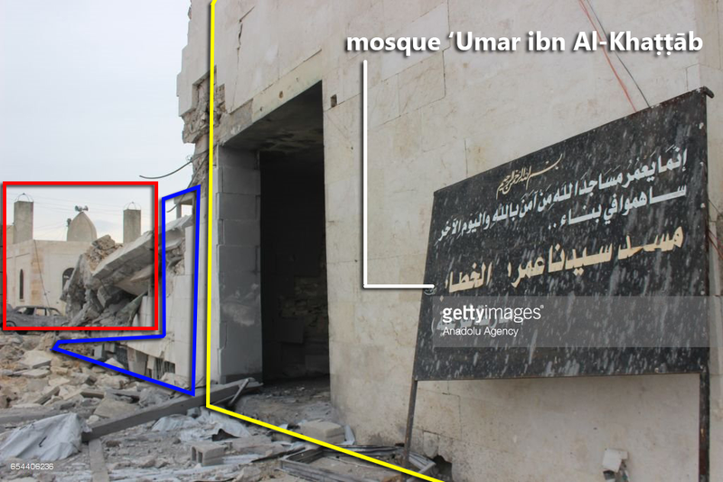

*This is a developing investigation, which will be updated as soon as there are new findings. We are currently waiting for a reaction from CENTCOM and the Pentagon with regards to our findings. Last update: March 18, 2017, 19:41 UTC.*

This is an investigation into the bombing by the United States (US) of a mosque in Al-Jīnah, a Syrian village located in the western part of the Aleppo governorate. The report is structured along the lines of the five W-questions:

-   **What happened?**
-   **When did it happen?**
-   **Where did it happen?**
-   **Who is responsible?**
-   **Why did it happen?**

## What happened?

In the evening of March 16, 2017, reports came in that a mosque in a Syrian village in the western part of the Aleppo governorate was targeted by one or more airstrikes, killing over 50 attendees of evening prayer.

Most of the initial posts on social media blamed either the [Russian](http://archive.is/Dk32M) or the [Syrian](http://archive.is/HOq9U) Air Force for the attack. Some reports, however, accused the US or the US-led Coalition, operating under the name Combined Joint Task Force -- Operation Inherent Resolve (CJTF-OIR). Other reports said that the planes could not be identified.

The civilian casualty figures are high, ranging from 29 ([Syrian Network for Human Rights](http://sn4hr.org/blog/2017/03/16/massacre-syrian-regime-shelling-mosque-al-jeina-village-aleppo-governorate-march-16/)), to 35 ([Syrian Civil Defence](https://www.facebook.com/SCDaleppo/posts/1285988564814132:0)), to even higher casualty figures putting the number of civilians killed at over 50.

Local media sources claimed that a religious meeting was ongoing in the 'Umar ibn Al-Khaṭṭāb mosque when they were targeted by what an eyewitness described as [seven airstrikes](https://twitter.com/trbrtc/status/842549995492577282). The mosque, which could host over 200 individuals, partly collapsed. According to reports, the evening prayer was mainly attended by civilians, and was also used for religious teaching. The amount of damage will be further discussed under "Where did it happen?" section.

There are dozens of photos and videos of victims and the airstrike aftermath, such as this excerpt filmed by Thiqa News Agency, which shows how a child is uncovered from under the rubble.

The attack was a condemned by a number of opposition groups, including Hay'at Tahrir al-Sham (HTS), the Levant Front, and Ahrar al-Sham.

## When did it happen?

The alleged airstrike took place on March 16, 2017. In several videos of the event, people are saying that the airstrikes took place during the [Isha prayer](https://en.wikipedia.org/wiki/Isha_prayer), meaning that the specific time of the airstrike must have been somewhere between 19:00 and 19:30 local time.

## Where did it happen?

Based on the information available, the location of the airstrike is said to be at a mosque in or around Al-Jīnah (Arabic: الجينة), an opposition-held village located in the western part of the Aleppo governorate. Local reports, for example by the "[Free Police of Al-Jinah](https://www.facebook.com/permalink.php?story_fbid=210744452743525&id=177224532762184)" call the mosque the 'Umar ibn Al-Khaṭṭāb mosque (Arabic: مسجد عمر بن الخطاب). Videos were uploaded by [Thiqa Agency](https://www.youtube.com/watch?v=hW8d6VchZs0), [Al-Jisr News](https://www.youtube.com/watch?v=bK1tAZnbUcE), [Sami Al-Halabi](https://www.youtube.com/watch?v=1mKppDaI_0s), amongst others.

There are three mosques found on satellite imagery in Al-Jīnah itself; however, local activists told *Bellingcat* that the targeted mosque was a relatively newly built house of worship just southwest of the village: 36.107721, 36.787080 ([Wikimapia](http://wikimapia.org/#lang=en&lat=36.107785&lon=36.786904&z=15&m=b)).

Based on [a video uploaded to YouTube](https://www.youtube.com/watch?v=29UptxVQwL8) by citizen journalist Hadi al-Abdallah showing the aftermath, it is possible to confirm that the two locations match.

Half a dozen videos have been published the next morning, giving a better impression of the targeted site. These videos were published by, amongst others, "[SMART News Agency](https://www.youtube.com/watch?v=TBwagt3lXXU)" and Bilal Abdul Kareem from the small media outlet "On the Ground News" (OGN), which often reports from territories controlled by Jabhat Fateh al-Sham (JFS). Mr. Abdul Kareem [was recently interviewed by the New York Times](https://www.nytimes.com/2017/03/10/world/middleeast/reporting-from-syria-an-american-with-a-point-of-view-and-a-message.html).

Based on historical satellite imagery, for example via Google Earth, it can be determined that the mosque was not built yet in June 2011. This means the mosque must have been constructed after the Syrian war began.

By cross-referencing ground footage from the aftermath with satellite imagery, it is can be established that the northern side of the blue mosque (marked in blue) has been destroyed. A sign post shown in a video also shows that the name of the mosque is the 'Umar ibn al-Khaṭṭāb mosque. A [video of OGN](https://twitter.com/trbrtc/status/842669789084602368) also clearly shows that the northern part of the mosque has been destroyed. The northern part of the building are said to be meeting rooms.

The southern side of the 'Umar ibn al-Khaṭṭāb mosque, which is the prayer room, has some minimal damage, but is still standing.

The old mosque as well as the new construction right north of the new mosque are completely intact. Locals confirmed to \_Bellingcat \_that the smaller building with minarets and speakers is indeed a mosque, which is visible in a video of RFS.

Therefore, there were two mosques right next to each other. This is important to note, because an initial statement of the US Central Command (CENTCOM) claimed that it bombed a building at the opposite side of the street, but did not target the mosque. They also claimed that the mosque was not damaged. This seems to suggest that CENTCOM refers to the smaller and older mosque, which is indeed undamaged.

The above theory was indeed confirmed on March 17, when [the Pentagon presented a photo](https://www.defense.gov/Photos/Photo-Gallery/igphoto/2001718389) of the airstrike aftermath, shown below.

The image is annotated below by Bellingcat to show that it is indeed the same location as shown above on the Google Earth satellite imagery.

It is thus clear that the Pentagon, the local citizens, activists, and journalists on the ground, as well as Bellingcat, are speaking of the very same location. But while the small building is confirmed to be a mosque, and clearly looks like one, what can we find out about the bigger building? Was it indeed a mosque?

All available information from local and international media points towards it indeed being a mosque.

First of all, a sign outside the western side of the building says this is the 'Umar ibn al-Khaṭṭāb mosque, indicates it is a religious school (Arabic: مدرسة شرعية), and refers to a text on people financing the construction of the mosque.

Some have suggested that the sign appears a bit awkwardly situated against the wall, leading some to suggest the sign was placed in hindsight. the location is right next from the part of the building which collapsed. The sign is visible on the image provided by the Pentagon, which appears to be a still from a video filming the airstrike and its aftermath. It is unclear how many minutes or hours the Pentagon image was taken.

Besides, the interior of the targeted building does strongly resemble the interior of a mosque's prayer room, as shown in videos uploaded by OGN and "[Moaz al-Shaami](https://www.facebook.com/moaz.Alshami.shada/videos/1836671799918423/)", as it features the miḥrāb, a semicircular niche in the wall of a mosque that indicates the direction of the Kaaba.

The interior can be matched with the exterior of the building, as shown below, for example by the 3-4-3 upper windows and entrance blocked by the collapse of the northern part of the building.

On eve of the attack, CENTCOM did report that they struck "Al Qaeda meeting location" in Idlib.

As we have seen above, the mosque's location is in the Aleppo governorate though only 4 km from the governorate's border with Idlib. For that reason, it may have been that the Idlib strike referred to the same incident -- something Airwars journalist [Samuel Oakford first noted](https://twitter.com/samueloakford/status/842514169941442561).

However, confusion remained, so \_Bellingcat \_e-mailed CENTCOM for a statement of clarification regarding these strikes. In an e-mailed reply, they said that:

*We believe this is the same strike. We do not mean to cause any confusion. Different internal reports may have this listed differently.*

Now, this is interesting. Bellingcat contributors and others, most notably Twitter user @obretix, have geolocated official CJTF-OIR airstrike videos from Iraq and Syria for over two years now. All these videos came with a rough description of a location, e.g. "near Raqqah". Obretix [mapped all these geolocated videos](https://sami-r.carto.com/viz/dc7a04e6-f284-11e5-8e3d-0ea31932ec1d/embed_map) and used a Voronoi diagram to get an impression of the region labels the Coalition -- which is led by CENTCOM -- uses. It shows that they labels were not always that accurate, and that governorate borders may well overlap each other.

Either way, CENTCOM said it targeted a building in the Idlib governorate, while it actually was in the Aleppo governorate.

## Who is responsible?

*This section was written before the US confirmed it had conducted the airstrike, the discussion 'Who is responsible' is clear from the previous section. Nevertheless, it is worth showing how alleged weapon remnants were the first visual sources to indicate that the US may have been the perpetrator. The photos were followed by an online search to match the remnants with possible weapons deployed by the US.*

Both the Russian Air Force as well as the United States(-led Coalition) have been accused of targeting the mosque in Al-Jīnah.

However, a photo showing an alleged weapon remnant found in the rubble of the mosque may reveal more about the perpetrator of the attack.

The photo was published on Twitter by Sakir Khader, a Dutch journalist, who said he received the photo from local activists on the ground. No results show up in a reverse image search, suggesting the photo has not been indexed by Google and may thus be authentic. The location and authenticity of the photo could not be independently referenced, and caution is thus needed.

A text in Latin is visible on the alleged weapon remnant: "WT: 52.0 kg". 'WT' is an abbreviation for "weight", possibly referring to the weight of the missile.

Interestingly, the specific font and abbreviation are used on US missiles, as can be seen in [hundreds of reference pictures](https://www.google.com/search?q=AGM-114&source=lnms&tbm=isch&sa=X&ved=0ahUKEwjJ5paljdzSAhVMmBoKHeeyD70Q_AUICSgC&biw=767&bih=756) of AGM-114 Hellfire air-to-surface missiles, as shown below. This fact, combined with the striking similarity of rivets, paint, et cetera, strongly suggests the photographed object is a remnant of a US AGM-variant.

Noteworthy is that the exact same label on a weapon remnant was found at the site of an alleged drone strike on a high value target (HVT) in Syria's Idlib province in October 2016. At the day that those photos were published by pro-opposition Step News Agency, the US admitted targeting a target with a drone.

If the photo of Mr. Khader thus indeed was taken at the mosque site, it is highly likely that the US is the perpetrator of this attack. It is, however, also worth mentioning that the damage shown in the October 16, 2016, footage of Idlib is considerably smaller than the March 16, 2017, strike, as was noted by Twitter-uster [@sasmojo][39](https://twitter.com/sasmojo/status/842513526174433281).

An explanation follows the next day, when Washington Post journalist Thomas Gibbons-Neff [tweets a statement](https://twitter.com/Tmgneff/status/842740011099459585) by a US official he spoke: "US official: AQ strike in N. Syria involved two Reapers that fired roughly entirety of their Hellfire payload and followed up w/ 500lb bomb."

The MQ-9 Reaper drone usually carries up to four Hellfire missiles, meaning eight missiles were fired at the location, followed by a 500 lb bomb. A photo, courtesy of [Getty Images/Anadolu Agency](http://www.gettyimages.pt/detail/fotografia-de-not%C3%ADcias/civil-defense-team-members-and-people-try-to-fotografia-de-not%C3%ADcias/654406182#civil-defense-team-members-and-people-try-to-rescue-people-who-were-picture-id654406182), of the aftermath shows what a massive crater has been created by that 500 lb bomb.

The next morning, new photos emerged of weapon remnants published by both the Syrian Institute for Justice as well as Getty Images, which can be grouped by three different objects. It is important to mention that *Bellingcat* cannot confirm the authenticity of this photos, only that they do not show up in reverse image searches.

First of all, there is an object with the Latin inscription which reads "30000892-01 REV C S/N 005827". "S/N" refers to the serial number, which is thus 005827. However, it is unclear to which specific group of ammunition this object belongs, but some have suggested it may be a GUB-12 or GBU-39.

The second object has a label with a text in Latin and three bar codes. The text read: "WOODWARD HRT Revision B"; "(1P) MFR PART\# 41013490-108"; "SERIAL\# 15862"; and "\[??\] DATE 1\[?\]12/22"; "(17V) MFR CAGE 81873".

Woodward is a US company which supplies fin actuators for Joint Direct Attack Munitions (JDAMs), which are guidance kits which convert unguided bombs, or "dumb bombs", into all-weather "smart" munitions. The CAGE code (Commercial and Government Entity Code), a unique identifier assigned to suppliers to various government or defence agencies, also corresponds to Woodward.

[It has been suggested](https://twitter.com/marcgarlasco/status/842744382512140289) that the remnants pictured may be related to JDAM-ER. Woodward received several US Department of Defence (DoD) contracts, though the [the Military-Industrial Complex website](http://www.militaryindustrialcomplex.com/totals.asp?thisContractor=Woodward%20HRT) only lists contracts with a value of \$6.5 million USD or higher.

The third object was visible in photos in the [Getty Images databank](http://www.gettyimages.pt/detail/fotografia-de-not%C3%ADcias/civil-defense-team-members-and-people-try-to-fotografia-de-not%C3%ADcias/654406182#civil-defense-team-members-and-people-try-to-rescue-people-who-were-picture-id654406182), provided by Anadolu Agency. It is unclear what the object belongs to.

## Why did it happen?

However, Mohamed al-Shaghel, a local activist, told the New York Times that the the people in the building had "no affiliation with any military faction or any political side." Other locals told monitoring group Airwars that the building is part of a mosque and a religious school. Mr. Abdul Kareem of OGN mentioned that the "according to locals, this is not a \[Jabhat\] Fateh al-Sham or Hay'at Tahrir al-Sham facility. This is a Tablighi Jamaat facility, where they gather every Thursday to go and give dawah to the people."

Some have suggested that a recruiting meeting, taking place in the meeting rooms of the mosque, for organisations like JFS or HTS was targeted.

It is thus possible that the US was aiming to kill one or more high value targets, or a group of militants, linked to the various Syrian groups that are designated by the US as a terrorist organisation. Over the past years, the US has unilaterally been striking individual members of Jabhat Fateh al-Sham (formerly known as Jabhat al-Nusra) and HTS. These strikes are thus separate from the CJTF-OIR campaign.

Perhaps the US was really not aware that the targeted building was a mosque built in recent years, which would explain their noticeable surprise in their initial claims from the ground that a mosque was bombed. After all, their imagery documented to them that the sole mosque they were aware of was still standing and undamaged, which explains why they said they targeted a location 50 feet away from the mosque -- they referred to the old mosque.
