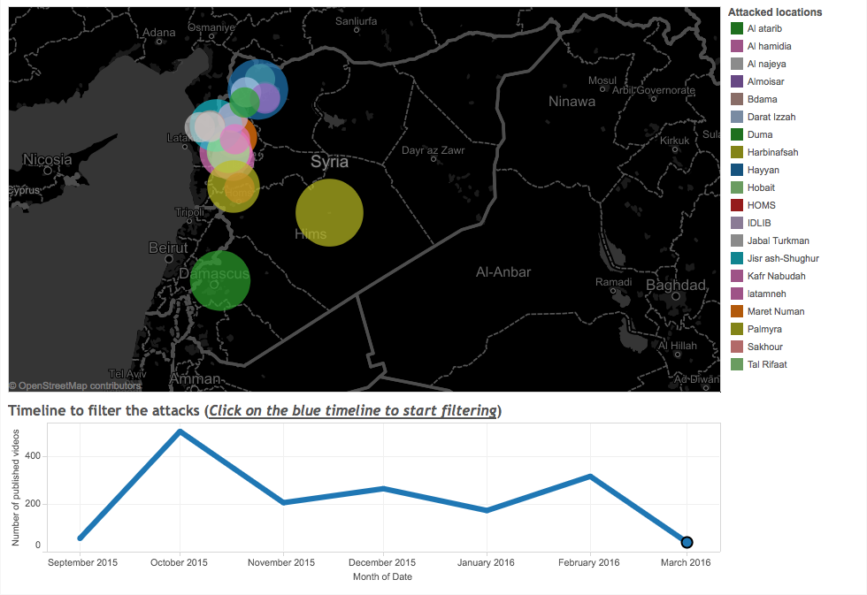
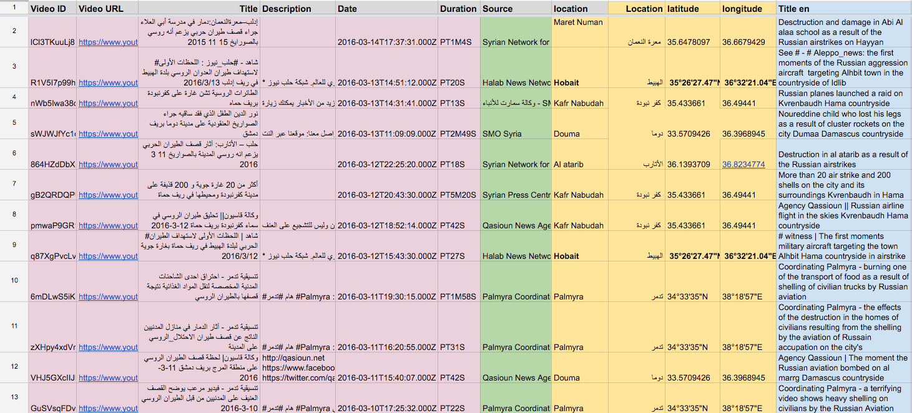
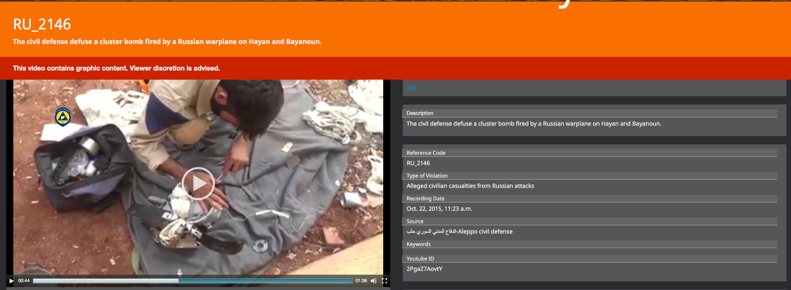
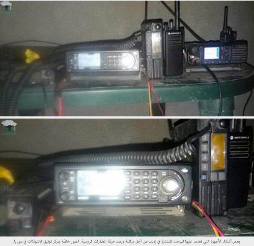
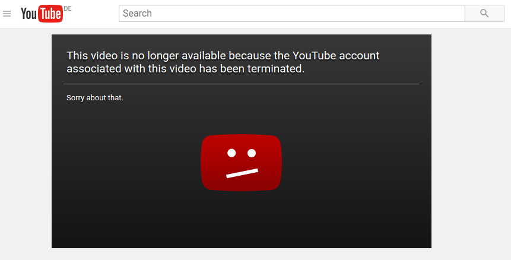

The Syrian Archive maintains an extensive video database of all known allegations in which civilians have been reported killed or injured by Russia since September 30th 2015.\
This is one of the datasets that the Syrian Archive has collected, and we will continue working on collecting and creating other video datasets of violations by all parties to the conflict against civilians.

[This Russian attacks database includes **1561 videos**](https://syrianarchive.org/en/database?collection=Civilian%20casualties%20as%20a%20result%20of%20alleged%20russian%20attacks)\*\* \*\*which has been captured by Syrian journalists, citizen reporters and activists as evidence to expose and draw attention to alleged human rights violations committed by the Russian forces in Syria.

Our goal in collecting, verifying, and publishing the videos is to bring attention to the effect of Russian attacks on Syrian civilians and show the scale and pattern from the point of view of citizen reporters who witnessed those incidents. In addition, we are cross-referencing videos of Russian attacks from different sources with the casualties that have been documented by various documentation centres such as the Violation Documentation Center which published the details of\*\* [2068 civilians as can be seen here](http://www.vdc-sy.info/index.php/en/martyrs/1/c29ydGJ5PWEua2lsbGVkX2RhdGV8c29ydGRpcj1ERVNDfGFwcHJvdmVkPXZpc2libGV8ZXh0cmFkaXNwbGF5PTB8c3RhdHVzPTF8NT1SdXNzaWFufA==)\*\*.

Here you can find the [video dataset of alleged civilian casualties from Russian attacks](https://syrianarchive.org/en/database?collection=Civilian%20casualties%20as%20a%20result%20of%20alleged%20russian%20attacks), which includes footage of:

-   Destruction of hospitals and schools as a result of alleged Russian attacks;
-   Destruction of civilian objects such as buildings, markets, mosques, bakeries, factories, displaced camps as a result of alleged Russian attacks;
-   Videos of Russian planes flying over specific areas captured by citizen reporters;
-   Destruction of water infrastructure by Russian attacks which is confirmed and cross referenced with a video published by the Russian MOD;
-   Remnants of prohibited weapons and munitions used by Russian forces in Syria e.g cluster bombs;
-   Civilian casualties including children and women as a result of alleged Russian attacks;
-   Witness testimonies of civilian casualties or targeting civilian objects by alleged Russian attacks.

Below you can see an interactive timeline to filter the attacks which happened between September 29th 2015 \| March 31st 2016.

We can see from the timeline that **506 videos **have been captured in **October 2015** by citizen reporters as evidence of alleged Russian attacks against civilians.

We can also see below that there were videos captured in **March 2016** by citizen reporters as evidence of alleged Russian attacks against civilians which means that Russia has possibly violated the ceasefire truce agreement in Syria that started in 27th February 2016. [The Syrian Network for Human Rights has a full report about this here.](http://sn4hr.org/blog/2016/03/15/19396/)

## Reports on Russian attacks on Syria's civilians

We have collected a list of reports which have been published by human rights organisations and investigative journalists about the Russian attacks on Syria's civilians in Sept 29th 2015 \| April 30th 2016. Organisations include **Physicians for Human Rights, Amnesty International, Human Rights Watch**, **Syrian Network for Human Rights, Violations Documentation Center, Bellingcat, Airwars, Carter Center and Atlantic Council** . You can find all reports in the end of this page.

## Our methodology of verification

### First: Verifying the source who published the video

We have identified **98 sources **of information and their channels on social media platform (e.g YouTube and Facebook, Telegram). These sources are established groups that have been working in Syria for a long time, some of them since 2011/2012, and have been reliable in their reporting. These groups are based in different provinces and have been spreading information about incidents and violations happening in their areas for several years.

Some of the sources are citizen reporters such as Yasser Doumany, who since 2011 has been based in Douma, or Hashem Al Abdallah, who since 2011 has been based in Idlib. Local and international news agencies, such as Smart News Agency, have also been consulted as well as human rights organisations working on documenting violations in Syria (e.g. Violation Documentation Center, Syrian Human Rights Network, White Helmets teams working across Syria). Some sources we have verified sent us videos which have not been published on social media.

### Second: Collecting and processing the video dataset

After extracting data from around 98 sources which contained thousands of videos, we filtered their materials to extract those videos which refer to Russian attacks against civilians.

### Third: Verifying the location

Every video went through basic geolocation to verify that it has been captured in Syria. We have identified the actual province in most videos and the actual coordinates in some of them. This has been done by comparing reference points such as buildings, mountains range, trees, minaret with Google Earth satellite imagery, openstreetmap and geolocated photographs from panoramio. In addition to this we have checked the Arabic accent spoken in the video to make sure of the location of the video. Where possible we have contacted the source directly to confirm the location and also consulted our network of journalists operating inside Syria to confirm the locations of specific incidents. As a result of geolocating the videos, we have noticed that most of the videos were captured in Talbisah which is located in Homs and Latamneh which is located in Hamah.

### Fourth: Verifying the date

We have verified the date of capturing the video by cross referencing the publishing date on social media e.g YouTube and Facebook with dates from reports on the same incidents which existed in:

-   News reports such as international media outlets: Reuters, Local media outlets: Smart News Agency, Qasioun News Agency,
-   Human rights reports such as the ones of the Human rights watch, Amnesty International, Syrian Human Rights Network, VDC,
-   Reports shared from our network of citizen reporters on Twitter, Facebook and Telegram about the incidents.

### Fifth: Verifying that videos are referring to alleged Russian attacks

Below are factors which indicate that attacks were Russians, not Syrian regime attacks neither coalition airstrikes.

**A. New weapons and munitions seen in Syria for the first time since the the start of the Russian airstrikes** on 30th September 2015 such as RBK-500 SPBE-D cluster bombs. It can be seen in the following two videos that were captured in Aleppo.

The first [video is by the source abnhoran hariri](https://syrianarchive.org/en/database?term=cluster%20bombs%20was%20delivered%20by%20Russian%20aircraft%20flying%20over%20the%20western%20Aleppo&unit=efd4dd2f)

and the [second video is by Aleppo civil defense](https://syrianarchive.org/en/database?term=The%20civil%20defense%20defuse%20a%20cluster%20bomb%20fired%20by%20a%20Russian&unit=7efa8e82)

**B. Observatory workers are intercepting the communication of flights spoken orders**, which were given in Russian. There are about 50 observatories from Qalamoun in Damascus Countryside to Aleppo. Some of them were able to detect messages while taking off from the military airports such as Hmeim airbase.\
The violation documentation center (VDC)obtained some of [the recordings such as this one](https://www.youtube.com/watch?v=EmWcfssz9r0) where it says: "I did the first. In a few minutes I will execute the second." And [here is another recording](https://www.youtube.com/watch?v=sa9LqFMk9mg). Below is a photo of the devices that has been sent to VDC.

Also there are interviews with observatory workers explaining how they work on monitoring Russian airstrikes. [This is one of the videos that has been recorded by Step News Agency with the observatory office 80 and the observatory Abu Faisal](https://syrianarchive.org/en/database?term=Interview%20to%20the%2080%20observatory%20and%20Abu%20Faysal%20observatory%20in%20Hama%20province&unit=65f239d0) in Hamah country side.

**C. Pattern of Russian attacks: ** VDC researchers found out that Russian jets can be distinguished by the shape of the plane, their high velocity, altitude and the high destructive power of the missiles dropped -- especially the thermobaric (vacuum) bombs and cluster munitions. Also Russian warplanes launch simulated attacks prior to the actual ones, unlike Syrian aircraft which do not conduct practice runs before their airstrikes.

## Videos that have been removed from the Internet

Two YouTube channels have been removed which contained **104 videos** as evidence of alleged Russian attacks against Syria's civilians. Those videos and channels have been preserved by the Syrian Archive.

**Channel's details:**

**Channel Names:** Qasion News Agency\
**Number of videos removed:** 85 videos which are considered as evidence of Russian attacks against civilians\
**Channel Names:** Sada Revolution Network\
**Number of videos removed: ** 19 videos which are considered as evidence of Russian attacks against civilians\
**Channel URL:** https://www.youtube.com/channel/UC9BJYGP7bA-fkyY0sPzQzQw

Some videos have been removed from International human rights organisation's reports and maps such as Physicians for Human Rights which is documenting attacks on health care including Russian attacks. This is an example of one of their removed videos that show an attack on Benin ambulance by a Russian airstrike. We don't know the exact reasons of why and how the videos were removed from YouTube or Facebook. Below is the PHR removed video on the Map of attacks on health case in Syria

## Submitting videos

In order to provide the most complete and accurate information on the Russian attacks, we are always looking for new evidence to collect and add to the alleged Russian attacks video dataset. If you would like to send us a video which is not on the dataset please reach us at **info \[at\] SyrianArchive \[dot\] org **

## Errors and corrections

We strive for accuracy and transparency of process in our reporting and presentation. That said, we do recognise that the information publicly available for particular events can at times be limited. Our video datasets are therefore organically maintained, and represent our best present understanding of alleged incidents.

If you have new information about a particular event; if you find an error in our work - or if you have concerns about the way we are reporting our data - please do engage with us. You can reach us at **info \[at\] syrianarchive \[dot\] org**

## List of reports on Russian attacks against Syria's civilians

**Amnesty International**

-   [Syrian and Russian forces targeting hospitals as a strategy of war](https://www.amnesty.org/en/press-releases/2016/03/syrian-and-russian-forces-targeting-hospitals-as-a-strategy-of-war/)
-   [Syria: Russia's shameful failure to acknowledge civilian killings](https://www.amnesty.org/en/latest/news/2015/12/syria-russias-shameful-failure-to-acknowledge-civilian-killings/)

**Physicians for Human Rights**

-   [A map of attacks on health care in Syria](https://s3.amazonaws.com/PHR_syria_map/web/index.html) which includes Russian attacks

**Violations Documentation Center**

-   [Russian strikes on Syria's civilians](http://www.vdc-sy.info/pdf/reports/1447972413-English.pdf)
-   [Our lives under Russian attacks](http://www.vdc-sy.info/index.php/en/reports/1459544470#.Vyr1H7p95Nz)

**Human Rights Watch**

-   [Russia/Syria: Extensive Recent Use of Cluster Munitions](https://www.hrw.org/news/2015/12/20/russia/syria-extensive-recent-use-cluster-munitions)
-   [Russia/Syria: Daily Cluster Munition Attacks](https://www.hrw.org/news/2016/02/08/russia/syria-daily-cluster-munition-attacks)

**Bellingcat**

-   [What Russia's Own Videos and Maps Reveal About Who They Are Bombing In Syria](https://www.bellingcat.com/news/mena/2015/10/26/what-russias-own-videos-and-maps-reveal-about-who-they-are-bombing-in-syria/)
-   [Open Source Evidence on Russian Strikes in Syria](https://russia-strikes-syria.silk.co/)

**Syrian Network for Human Rights**

-   [Reports of Russian attacks on Syria's civilians](http://sn4hr.org/blog/category/report/special-reports/russian-force/)

**Airwars**

-   [Alleged civilian casualties from Russian airstrikes in Syria](https://airwars.org/russian-civcas/)

**Atlantic Council**

-   [Distract, Deceive, Destroy](http://publications.atlanticcouncil.org/distract-deceive-destroy/)

**Carter Center**

-   [Syria conflict mapping which includes Russian attacks](http://www.cartercenter.org/peace/conflict_resolution/syria-conflict-resolution.html)
