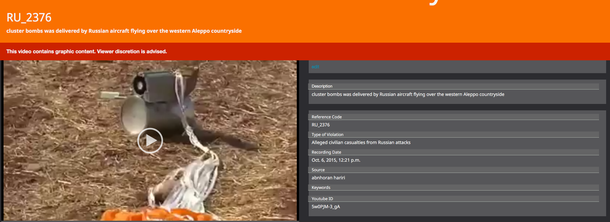

انتهى فريق "الأرشيف السوري" من إنشاء [&nbsp;قاعدة بيانات تضم مقاطع مصوّرة تدل على انتهاكات حصلت ضد المدنيين](https://syrianarchive.org/ar/database?collection=Civilian%20casualties%20as%20a%20result%20of%20alleged%20russian%20attacks) في سوريا يُرجّح أن مرتكبيها قوات روسية، وذلك في الفترة الواقعة ما بين 30 أيلول/ سبتمبر 2015 وحتى 30 آذار/مارس 2016.

وتحتوي قاعدة البيانات هذه على 1561[ مقطع فيديو](https://syrianarchive.org/ar/database?collection=Civilian%20casualties%20as%20a%20result%20of%20alleged%20russian%20attacks) تم تصويرها من قبل صحفيين ومراسلين ميدانيين وناشطين للفت الانتباه إلى الانتهاكات اليومية الواقعة بحق المدنيين في سوريا.

ويهدف فريق "الأرشيف السوري" من جمع هذه المواد المصوّرة والتحقق منها ونشرها إلى توثيق أثر الهجمات الروسية على المدنيين في سوريا وإظهار حجمها الحقيقي وتداعياتها، وإتاحة الفرصة أمام صحفيي البيانات لبناء تقارير وتحقيقات استنادًا إلى هذه المواد.

وتحقق فريق "الأرشيف السوري" من فيديوهات الهجمات الروسية عن طريق مطابقتها مع مصادر مختلفة، منها قاعدة بيانات الضحايا المدنيين التي **[نشرت 2068 إسماً لضحايا سوريين](http://www.vdc-sy.info/index.php/en/martyrs/1/c29ydGJ5PWEua2lsbGVkX2RhdGV8c29ydGRpcj1ERVNDfGFwcHJvdmVkPXZpc2libGV8ZXh0cmFkaXNwbGF5PTB8c3RhdHVzPTF8NT1SdXNzaWFufA==)**على موقع مركز توثيق الانتهاكات.

## تحتوي مقاطع الفيديو على:

1- صور لدمار المشافي والمدارس بسبب هجمات يرجح أنها روسية.

2- صور لدمار أبنية سكنية، أسواق شعبية، جوامع، أفران، معامل، ومخيمات نزوح بسبب هجمات يرجح أنها روسية.

3- صور لطيران حربي يرجح أنه روسي يُحلّق فوق مواقع مختلفة تم تصويرها من قبل المراسلين الميدانيين.

4- صور لقصف بنى تحتية للمياه تم التأكد أنها قوات روسية قامت به.

5- بقايا ذخائر وصواريخ وأسلحة محرمة دولياً استخدمت من قبل الطيران الروسي كالذخائر العنقودية.

6- ضحايا مدنيين، خصوصاً من الأطفال والنساء، فقدوا حياتهم بسبب هجمات يرجح أنها روسية.

7- مقابلات مع شهود حول الضحايا المدنيين واستهداف أماكن مدنية بسبب هجمات يرجح أنها روسية.

شاهد الخريطة التفاعية لتصنيف الهجمات ومواقعها&nbsp;في الفترة الواقعة بين 29 أيلول/ سبتمبر 2015 و30 آذار/ مارس 2016

نلاحظ من خلال الرسم البياني أن العدد الأكبر من الفيديوهات التي تدل على انتهاكات روسية لمدنيين تم نشرها في شهر تشرين الأول/ أوكتوبر

نلاحظ أيضا نشر فيديوهات تدل على انتهاكات روسية لمدنيين في شهر آذار رغم الهدنة المتفق عليها والتي بدأت بتاريخ ٢٧ شباط ٢٠١٦ مما يدل على خرقها من قبل الطيران الروسي. [نشرت الشبكة السورية لحقوق الإنسان تقريرا مفصلا حول هذا الموضوع](http://sn4hr.org/arabic/2016/03/15/5791/).

## تقارير حول الهجمات الروسية ضد المدنيين في الفترة الواقعة بين 29 أيلول/ سبتمبر 2015 و30 نيسان/ أبريل 2016

نشرت مجموعة من التقارير حول الهجمات الروسية في سوريا خلال الفترة الواقعة بين 29 أيلول/ سبتمبر 2015 و30 نيسان/ أبريل 2016\. ومن بين المنظمات التي نشرت هذه التقارير منظمة العفو الدولية، وهيومان رايتس ووتش، ومركز توثيق الانتهاكات، وبيللينغ كات، واتلانتيك كانسيل، ومركز كارتر، والشبكة السورية لحقوق الإنسان. جمعنا قائمة بجميع التقارير حول الهجمات الروسية على المدنيين السوريين في أسفل الصفحة.

## منهجية التحقق من المحتوى الرقمي

### أولا: التحقق من المصدر الذي قام بنشر الفيديو

* **حدّدنا 98 مصدراً** بالإضافة لقنواتهم على اليوتيوب والفيسبوك والتلغرام. بدأ عملهم في أواخر سنة 2011 أو في بداية سنة 2012 وكانوا ذوي مصداقية في عملهم وتقاريرهم. أما بالنسبة للموقع الجغرافي للمصادر فهم يعملون من محافظات وأماكن مختلفة لنشر الأخبار والمعلومات حول الانتهاكات التي تحدث في مناطقهم.

* يعد المراسلون الميدانيون الجزء الأكبر من هذه المصادر ومنهم الإعلامي ياسر الدوماني الذي بدأ عمله في سنة 2011 في دوما إلى الآن، أو هاشم العبد الله الذي بدأ عمله في سنة 2011 بإدلب.

* يتضمن الجزء الآخر من المصادر الوكالات الإخبارية المحلية والعالمية، كوكالة سمارت، منظمات حقوق الإنسان كمركز توثيق الإنتهاكات في سوريا، الشبكة السورية لحقوق الإنسان، منظمات ومجموعات إنسانية أخرى كفريق الدفاع المدني، المشافي والعيادات الميدانية.

* أرسل لنا بعض المراسلون المتحقق من هوياتهم فيديوهات لم تكن موجودة على مواقع التواصل الإجتماعي.

### ثانيا: جمع وتحليل قاعدة بيانات الفيديوهات
*   صنّف فريق الأرشيف السوري البيانات (الآلاف من الفيديوهات) التي تدل على هجمات روسية ضد المدنيين بعد جمعها من 98 مصدر.

*   استخدمنا ملف اكسل للقيام بهذه العملية كما نرى في الأسفل.

### ثالثا: التحقق من الموقع الجغرافي

* حدّد فريق الأرشيف السوري الموقع الجغرافي لجميع الفيديوهات التي تدل على هجمات روسية ضد المدنيين.

* تأكدنا من المحافظة والمنطقة لكل فيديو. وقد تم التحديد الجغرافي عن طريق مقارنة صور لمباني، تضاريس الجبال، شجر، مآذن الجوامع، بصور القمر الصناعي (ستالايت) باستخدام موقع غوغل إيرث وأداة **Openstreetmap** وصور محددة جغرافيا عن طريق أداة **Panoramio**.

* تأكدّنا أيضا من اللهجة المحكية في الفيديو لتحديد مكان تصويره.

* تواصل فريق الأرشيف السوري مع مصوري الفيديو بشكل مباشر لسؤالهم عن موقع تصوير الفيديو والتأكد منهم.

* تواصلنا أيضا مع صحفيين يعملون في سوريا للتأكد من المواقع الجغرافية.

* لاحظنا من خلال جمع وتصنيف الفيديوهات أن معظمها نشر من مدينتي تلبيسة في حمص واللطامنة في حماة.

### رابعا: التحقق من التواريخ

تأكدنا من تاريخ تسجيل الفيديو بمقارنته مع تاريخ التقارير المنشورة حول نفس الحادثة على مواقع التواصل الإجتماعي كالفيسبوك والتلغرام، بالإضافة للتقارير التي نشرتها الوكالات الإخبارية العالمية مثل رويترز، أو الوكالات المحلية مثل وكالة قاسيون الإخبارية، وشبكة أخبار حلب، وكذلك المنظمات الحقوقية مثل هيومن راتس ووتش، منظمة العفو الدولية، الشبكة السورية لحقوق الإنسان، مركز توثيق الانتهاكات في سوريا، بالإضافة إلى حسابات وقنوات الإعلاميين في داخل سوريا كالتويتر والفيسبوك والتلغرام.

### خامسا: التأكد من أن الهجمات روسية

جمعنا بعض الأدلة والعناصر التي توضّح أن الهجمات روسية، وليست هجمات من النظام السوري ولا من قوات التحالف الدولي. من هذه الأدلة:

* ظهور أسلحة وذخائر في سوريا لأول مرة منذ بدأ الضربات الروسية في 29-09-2015 مثل الذخيرة العنقودية RBK-500 SPBE-D.&nbsp;حدّدنا بعض&nbsp; الفيديوهات التي تدل على استخدام هذه الذخيرة:

نشر أول فيديو من قبل [abnhoran hariri](https://syrianarchive.org/ar/database?term=%20https://www.youtube.com/watch?v&after=2015-10-05&before=2015-10-07&unit=efd4dd2f)

ونشر ثاني فيديو من قبل[ فريق الدفاع المدني في حلب](https://syrianarchive.org/ar/database?term=%20RU_2146&after=2015-10-21&before=2015-10-23&unit=7efa8e82)

* تسجيل أوامر ومحادثات الطياريين الروسيين عند اقلاعهم من مطار حميميم عن طريق أجهزة تنصت منتشرة بالمراصد الموجودة في سوريا. [وقد نشر مركز توثيق الانتهاكات بعض التسجيلات التي تم تزويد المركز بها من قبل المراصد](https://www.youtube.com/watch?v=EmWcfssz9r0). سجلت هذه المقاطع بتاريخ 24 و 25 تشرين أول/ أكتوبر 2015\. شاهد صورة الأجهزة التي استخدمت من قبل المراصد لمراقبة حركة الطائرات الروسية.

صورت بعض الوكالات الإخبارية مقابلات مع الأشخاص العاملين في المراصد لتوضيح طريقة رصدهم للطائرات الروسية. [شاهد المقابلة التي قامت بها وكالة خطوة مع المرصد ٨٠ والمرصد أبو فيصل في ريف حماة](https://syrianarchive.org/ar/database?after=2015-11-18&before=2015-11-20&unit=65f239d0).

* تحديد نمط الهجمات الروسية: حدد فريق مركز توثيق الانتهاكات عناصرا تميّز الطيران الروسي عن غيره، كشكل الطائرة الحربية، وارتفاع الطائرة وسرعتها العالية، صوت الذخيرة القوي عند اصطدامها بالهدف وخصوصا الذخيرة العنقودية والصواريخ الفراغية.

## **فقدان الفيديوهات التي تدل على هجمات يرجّح أنها روسية من الإنترنت**

أزيلت قناتين من اليوتيوب تحويان **على 104 مقطع فيديو هام يدل على هجمات يرجّح أنها روسية**. خزّن فريق الأرشيف السوري هذه الفيديوهات [وصنّفها على قاعدة البيانات الموجودة هنا.](https://syrianarchive.org/ar/database?collection=Civilian%20casualties%20as%20a%20result%20of%20alleged%20russian%20attacks)

**تفاصيل القنوات المحذوفة:**

**إسم القناة**: وكالة قاسيون الإخبارية

**عدد الفيديوهات المفقودة**: 85 فيديو

**إسم القناة**: صدى الثورة

**عدد الفيديوهات المفقودة:** 19 فيديو

**رابط القناة**: [https://www.youtube.com/channel/UC9BJYGP7bA-fkyY0sPzQzQw](https://www.youtube.com/channel/UC9BJYGP7bA-fkyY0sPzQzQw)

فقدت بعض الفيديوهات أيضا من تقارير منظمات حقوقية وطبية عالمية كفيديو موجود في تقرير أطباء من أجل حقوق الإنسان الذي وثّق الهجمات الروسية على النقاط الطبية في سوريا. يوضح الشكل التالي [فقدان هذا الفيديو من اليوتيوب](https://www.youtube.com/watch?v=A4uhPXrU9hg) والذي يدل على استهداف سيارة اسعاف في ريف ادلب من قبل الطيران الروسي.

## **شاركونا مقاطع الفيديو لحفظها وتصنيفها**

سيتابع فريق الأرشيف السوري إضافة فيديوهات تدل على هجمات روسية ضد المدنيين على قاعدة البيانات. أرسل لنا أي فيديو يدل على هذا الموضوع لبناء قاعدة بيانات متكاملة وصحيحة.

إيميل الفريق info [at] SyrianArchive [dot] org

## **تصحيح الأخطاء**

يركز فريق الأرشيف السوري بشدة على أهمية الشفافية والدقة عند بناء قاعدة بيانات وإعداد تقارير. نرجو إرسال أي تصحيح على إيميل الفريق عند ملاحظته وسنقوم بالتعديل المباشر على أي تقرير أو فيديو خاطئ info [at] syrianarchive [dot] org
