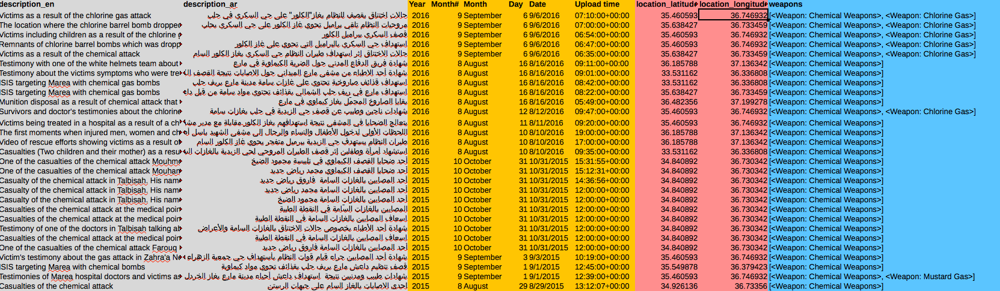
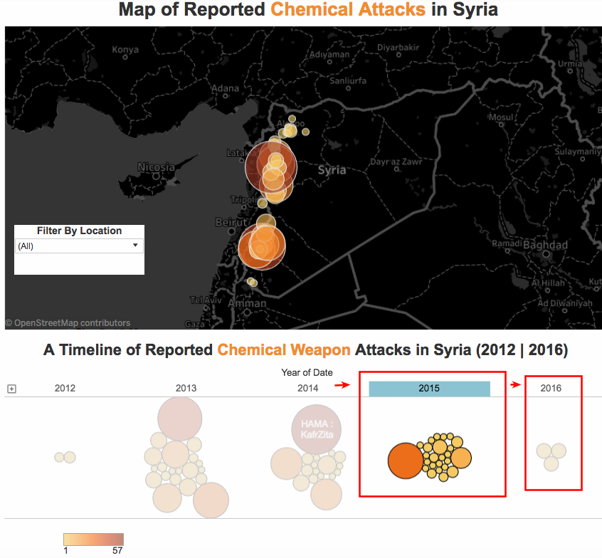
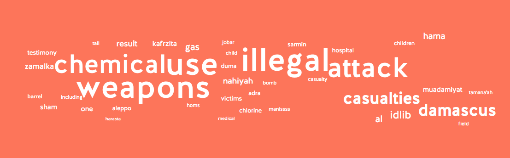
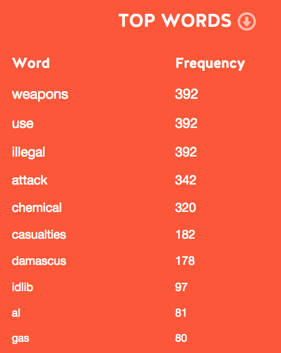

Since the UN Security Council [adopted Resolution 2118 three years ago](http://www.securitycouncilreport.org/atf/cf/%7B65BFCF9B-6D27-4E9C-8CD3-CF6E4FF96FF9%7D/s_res_2118.pdf), outlining the framework for the elimination of chemical weapons in Syria, and despite the Organization for [the Prohibition of Chemical Weapons (OPCW)](https://www.opcw.org/) working to destroy chemical weapons owned by the Syrian government, chemical weapons continue to be used against civilians by government forces and ISIS.

The Syrian Network for Human Rights has identified [139 incidents in which chemical weapons have been used.](http://sn4hr.org/blog/2016/08/21/25931/) In this report, the Syrian Archive provides visual documentation for some of these incidents. [The updated chemical weapons database, with 392 newly verified videos,](https://syrianarchive.org/en/database?type_of_violation=Use_of_illegal_weapons&weapons_used=Chemical%20Weapons) includes violations committed between December 2012 and September 2016.

## Methodology of Verification

------------------------------------------------------------------------

### First : Verifying the Source of the Video

The Syrian Archive has identified more than a hundred sources through following credible and verified social media accounts and channels of individual citizen journalists and larger media houses (e.g. YouTube, Facebook and Telegram). Many of those providing video documentation began to do so in late 2011 or early 2011 and have published their work in other credible media outlets as well.

Trusted sources report from different cities in Syria in order to spread news and information about violations occurring in their areas. The Syrian Archive works with field reporters, such as the Journalist Yasser Al-Haj, who began his career in 2012 in Aleppo and continues working until today.

The Syrian Archive also works with local and international international news agencies, human rights organisations, as well as the white helmet's team, local field clinics and hospitals. Additionally, some video evidence analysed was sent to the Syrian Archive directly by verified reporters and has not previously been posted on social media platforms.

### Second: Collecting and Analysing Videos

The Syrian Archive has collected hundreds of videos indicating attacks against civilians using chemical weapons.

After verifying the video evidence and cross referencing it with other reports about the same incident, additional metadata is added to videos indicating items such as the type of weapon or chemical gas used.

### Third: Verifying the Location

Each video went through basic geolocation to verify that it has been captured in Syria. The Syrian Archive has additionally identified the province for most videos and the actual coordinates in some of them. This has been done by comparing reference points (e.g. buildings, mountains ranges, trees, minarets) with Google Earth satellite imagery, [OpenStreetMap](http://www.openstreetmap.org) imagery and geolocated photographs from [Panoramio](http://www.panoramio.com/).

In addition to this, the Syrian Archive has referenced the Arabic spoken in videos against known regional accents and dialects within Syria to further verify location of videos. When possible, the Syrian Archive has contacted the source directly in order to confirm the location, and the project has also consulted existing networks of journalists operating inside and outside Syria to confirm the locations of specific incidents.

### Fourth : Verifying the Dates

The Syrian Archive has verified the date of capturing the video by cross referencing the publishing date on social media platforms (e.g YouTube and Facebook) with dates from reports concerning the same incident. Sources for reports used for cross-referencing include:

**First:** News reports such as international media outlets: Reuters, local media outlets, Smart News Agency, Aleppo Media Center, Qasioun News Agency, Local Coordination Committee (LCC).

**Second:** Human rights reports published by groups including Human Rights Watch, Amnesty International, Syrian Human Rights Network, Violations Documentation Center in Syria, Syrian American Medical Society, and Physicians for Human Rights.

**Third:** Reports shared from the Syrian Archive's network of citizen reporters on Twitter, Facebook and Telegram about the incidents.

## Verified Videos that Supports the UN Security Council Report on Chemical Weapons in Syria

------------------------------------------------------------------------

The UN-Organization for the Prohibition of Chemical weapons (OPCW) Joint Investigative Mechanism (JIM), the body mandated to determine responsibility for the use of chemical weapons in Syria, [issued its latest report in late August](http://www.securitycouncilreport.org/atf/cf/%7B65BFCF9B-6D27-4E9C-8CD3-CF6E4FF96FF9%7D/s_2016_738.pdf) in which it found the Syrian government and ISIS have continued to use chemical weapons against civilians, confirming new occurrences of chlorine gas attacks. The Syrian Archive has additionally verified and preserved videos showing use of chemical weapons by government forces in two separate incidents, and one incident in which chemical weapons were used by ISIS, since the publication of of the Security Council report:

\[a\] By government forces in [Zabadiyah district of Aleppo on 10 August 2016](https://syrianarchive.org/en/database?type_of_violation=Use_of_illegal_weapons&weapons_used=Chemical%20Weapons&location=%D8%AD%D9%84%D8%A8%20:%20%D8%AD%D9%8A%20%D8%A7%D9%84%D8%B2%D8%A8%D8%AF%D9%8A%D8%A9).

\[b\] By ISIS in [Marea, Aleppo governorate on 16 August 2016](https://syrianarchive.org/en/database?type_of_violation=Use_of_illegal_weapons&weapons_used=Chemical%20Weapons&location=%D8%AD%D9%84%D8%A8%20:%20%D9%85%D8%A7%D8%B1%D8%B9&after=2016-08-15&before=2016-08-17).

\[c\] By government forces in [Sukkari district of Aleppo on 06 September 2016](https://syrianarchive.org/en/database?type_of_violation=Use_of_illegal_weapons&weapons_used=Chemical%20Weapons&location=%D8%AD%D9%84%D8%A8%20:%20%D8%AD%D9%8A%20%D8%A7%D9%84%D8%B3%D9%83%D8%B1%D9%8A).

The Syrian Archive has also collaborated with the journalists of [Bellingcat](https://www.bellingcat.com/) in publishing two investigations about two of these incidents in [Zabadiyah district](https://www.bellingcat.com/news/2016/08/13/reports-of-chlorine-gas-that-targeted-civilians-in-aleppo/) and [Marea](https://www.bellingcat.com/news/mena/2016/08/31/evidence-august-16-2016-chemical-attack-marea-isis/) city.

The Joint Initiative Mechanism (JIM) report provides an update on the activities up to 19 August 2016. It also outlines the concluding assessments of the Leadership Panel to date, on the basis of the results of the investigation into the nine selected cases of the use of chemicals as weapons in the Syrian Arab Republic.

Below are the nine selected cases outlined in the JIM report as well as verified visual documentation by the Syrian Archive team which supports the JIM report:

\[a\] Kafr Zita in Hama governorate, 11 April 2014: [16 verified videos](https://syrianarchive.org/en/database?location=%D8%AD%D9%85%D8%A7%D8%A9%20:%20%D9%83%D9%81%D8%B1%D8%B2%D9%8A%D8%AA%D8%A7&after=2014-04-09&before=2014-04-14).

\[b\] Kafr Zita in Hama governorate, 18 April 2014: [8 verified videos](https://syrianarchive.org/en/database?after=2014-04-17&before=2014-04-19).

\[c\] Talmenes in Idlib governorate, 21 April 2014: [21 verified videos](https://syrianarchive.org/en/database?type_of_violation=Use_of_illegal_weapons&location=%D8%A7%D8%AF%D9%84%D8%A8%20:%20%D8%AA%D9%84%20%D9%85%D9%86%D9%8A%D8%B3&after=2014-04-19&before=2014-04-22).

\[d\] Al-Tamanah in Idlib governorate, 29 - 30 April 2014: [7 verified videos](https://syrianarchive.org/en/database?location=%D8%A7%D8%AF%D9%84%D8%A8%20:%20%D8%A7%D9%84%D8%AA%D9%85%D8%A7%D9%86%D8%B9%D8%A9&after=2014-04-28&before=2014-05-22).

\[e\] Al-Tamanah in Idlib governorate, 25 -26 May 2014: [14 verified videos](https://syrianarchive.org/en/database?location=%D8%A7%D8%AF%D9%84%D8%A8%20:%20%D8%A7%D9%84%D8%AA%D9%85%D8%A7%D9%86%D8%B9%D8%A9&after=2014-05-20&before=2014-05-31).

\[f\] Qmenas in Idlib governorate, 16 March 2015: [21 verified videos](https://syrianarchive.org/en/database?location=%D8%A7%D8%AF%D9%84%D8%A8%20:%20%D8%B3%D8%B1%D9%85%D9%8A%D9%86&after=2015-03-15&before=2015-03-18).

\[g\] Sarmin in Idlib governorate, 16 March 2015: [21 verified videos](https://syrianarchive.org/en/database?location=%D8%A7%D8%AF%D9%84%D8%A8%20:%20%D8%B3%D8%B1%D9%85%D9%8A%D9%86&after=2015-03-15&before=2015-03-18).

\[h\] Binnish in Idlib governorate, 24 March 2015: [2 verified videos](https://syrianarchive.org/en/database?location=%D8%A7%D8%AF%D9%84%D8%A8%20:%20%D8%A8%D9%86%D8%B4&after=2015-03-22&before=2015-03-25).

\[i\] Marea in Aleppo governorate, 21 August 2015: [3 verified videos.](https://syrianarchive.org/en/database?after=2015-08-20&before=2015-08-22)

## Analysis of findings

------------------------------------------------------------------------

The Syrian Archive analysed the data through a map that has been created using the [Syrian Archive database](https://syrianarchive.org/en/database?type_of_violation=Use_of_illegal_weapons&weapons_used=Chemical%20Weapons) indicating which cities in Syria have documented video evidence of chemical weapons attacks. See below:

<iframe height="800" src="https://public.tableau.com/views/timeline_of_chemical_weapons_attacks_syria_fixed/Dashboard1?:showVizHome=no&amp;:embed=y&amp;:display_count=yes" width="800">
</iframe>

In the map presented above, video evidence occurs most often in Damascus suburbs in 2013, Kafr Zita in Hamah in 2014, Talmenes and Al-Tamanah in Idlib in 2014, Sarmin in Idlib in 2015, Talbisah in Homs in 2015 and Aleppo in 2016, coinciding with the chemical weapons attacks identified by JIM investigators.

By clicking on the year 2015, we can see that there are 25 different locations attacked by chemical weapons. We can also see that in 2016, there are 3 different locations attacked by chemical weapons.

The Syrian Archive has additionally carried out a time-series analysis on its database, whereby the upload dates of video evidence are investigated. See below:

<iframe height="600" src="https://public.tableau.com/views/SA_chem_attack_timeline_08092016_0/Dashboard1?:showVizHome=no&amp;:embed=y&amp;:display_count=yes" width="800">
</iframe>

This analysis demonstrates that the most videos were uploaded on 21 August 2013, coinciding with the Sarin gas attack in Damascus suburbs. After this attack, the UN Security Council adopted Resolution 2118 (27 September 2013), the framework for the elimination of chemical weapons in Syria. The Syrian Network for Human Rights has identified 139 incidents in which chemical weapons were used by Syrian government and ISIS since the adoption of Resolution 2118, and since the [OPCW's announcement that it verified the destruction of 98% of chemical weapons declared by the Syrian government.\
](https://www.opcw.org/fileadmin/OPCW/CSP/C-20/en/c2004_e_.pdf)

The time-series analysis above demonstrates that the Syrian Archive has visual documentation of some of these incidents from 2012 until 2016.

[The Syrian Archive has conducted a text analysis of the titles and descriptions of the](https://www.opcw.org/fileadmin/OPCW/CSP/C-20/en/c2004_e_.pdf)[392 verified videos of chemical weapons](https://syrianarchive.org/en/database?type_of_violation=Use_of_illegal_weapons&weapons_used=Chemical%20Weapons). A visualisation of text analysis is shown below:

The term "weapons," "use," and "illegal" were used in all 392 videos. "Attack" appears in 342 verified videos, and "chemical" appears in 320 verified videos. The terms "casualties" and "gas" appear 182 times and 80 times in verified videos respectively. And the locations "Damascus" and "Idlib" appear 178 times and 97 times in verified videos.

## Conclusion

------------------------------------------------------------------------

Based on the 392 visual documentation we have collected and verified, it appears that civilians are being attacked by chemical weapons despite the [UN Security Council Resolution 2118](http://www.securitycouncilreport.org/atf/cf/%7B65BFCF9B-6D27-4E9C-8CD3-CF6E4FF96FF9%7D/s_res_2118.pdf)which was adopted in 27/09/2013 and after the [OPCW's announcement that it verified the destruction of 98% of chemical weapons declared by the Syrian government](https://www.opcw.org/fileadmin/OPCW/CSP/C-20/en/c2004_e_.pdf).

The Joint Investigation Mechanism (JIM) report addresses nine cases related to the use of chemical weapons in Syria between 2014 and 2015 by the Syrian government and ISIS which confirm that the majority of new attacks in which chemical weapons have been carried out by the Syrian government, as well as ISIS. The Security Council should renew the Joint Investigation Mechanism's mandate (JIM) to allow it to continue its investigation into these and other allegations of chemical weapon attacks in Syria.

For the aforementioned reasons, we reiterate the concerns of civil society organisations and urge the United Nations to use its means to stop the use of chemical weapons in the Syrian Conflict.

## Submitting videos

------------------------------------------------------------------------

## 

In order to provide the most complete and accurate information on chemical weapons attacks, we are always looking for new evidence to collect and add to the alleged chemical weapons video dataset. If you would like to send us a video which is not on the dataset please reach us at **info\@syrianarchive.org. **

## Errors and corrections

------------------------------------------------------------------------

## 

We strive for accuracy and transparency of process in our reporting and presentation. That said, we do recognise that the information publicly available for particular events can at times be limited. Our video datasets are therefore organically maintained, and represent our best present understanding of alleged incidents.

If you have new information about a particular event; if you find an error in our work - or if you have concerns about the way we are reporting our data - please do engage with us. You can reach us at **info\@syrianarchive.org. **
