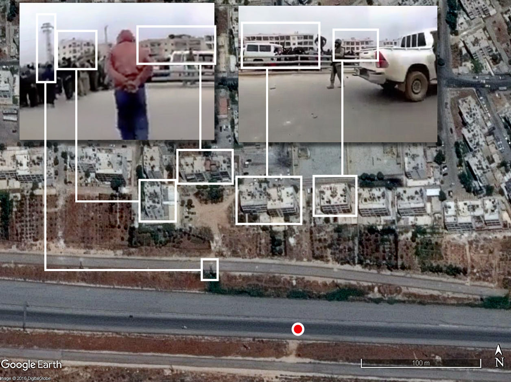
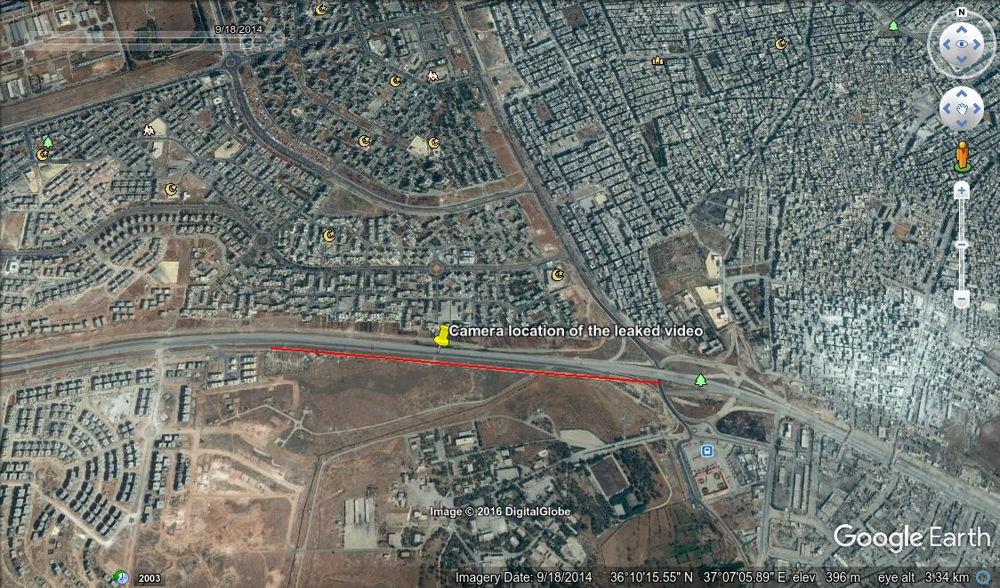

This section provides a summary of attacks identified by the Syrian Archive against specially protected persons and objects.

Using the same methodology as described in the previous investigations, the Syrian Archive was able to identify a total of 50 unique incidents in which violations against specifically protected persons and objects occurred.

Below is a map that shows the geolocation of the videos and the type of object that has been attacked.

<iframe src="https://www.google.com/maps/d/u/0/embed?mid=1JFceCXhuD5dd0EOnXAP_CLm2kg0" width="750" height="750">
</iframe>

## Mosques

Mosques are a specially protected object under IHL, which states that "It is prohibited to commit an act of hostility directed against places of worship \[including mosques\] which constitute the cultural or spiritual heritage of peoples." A map of violations against mosques is provided below:

In February 2017 UN OHCHR report on Aleppo, only one attack against a mosque was identified, occurring on 19 August at approximately 5PM in the Salah al-Din district of Aleppo. OHCHR attributed the attack on Abdulqader Shasho school and the attached mosque to either Russian or Syrian air strikes. While the school and mosque was not in session during this time, four adults were wounded during the attack. For this incident, the Syrian Archive was unable to locate any video documentation.

The Syrian Archive was, however, able collect and verify evidence of four (4) other attacks against mosques occurring in Aleppo during the July - December 2016 period. Video footage is available on the Syrian Archive website, and a table highlighting available incidents and associated metadata is available in the Appendix to this report.

The first incident identified by the Syrian Archive was an attack on the Grand Mosque in Anadan city, Aleppo, occurring on 6 September. For this incident, the Syrian Archive has collected and verified two videos. A few days later on 10 September, the Grand Mosque of Batbo, Aleppo, and separately, the "Abu Ubaidah al Jarrah" mosque in Sukkari, Aleppo were both attacked. The Syrian Archive has collected and verified one video for each of these two incidents. The final incident against mosques identified by the Syrian Archive in the July - December 2016 period occurred on 21 November against the Hussayn mosque in the Katerji neighborhood of Aleppo. For this incident, the Syrian Archive has collected and verified one video.

## Schools

Schools are a specially protected object under IHL, paragraph 22 of which states that they may only be the object of attack \"when used for military purposes, and such attacks require prior warning when the school is located in a densely populated civilian area. In the February 2017 UN OHCHR report on Aleppo, four (4) incidents against schools were identified.

The first incident identified occurred on 19 August at approximately 5PM in Salah al-Din district by Syrian or Russian airstrikes. In this incident the Abdulqader Shasho school and attached mosque were targeted. While the school was not in session during this time, four adults were injured in the attack. While the school remained open for a short time after the attack, by September the school was relocated within Salah al-Din for the safety of students. In early September, the relocated Abdulqader Shasho school was hit by an airstrike while classes were in session. Nine elementary school students were killed during the attack and dozens more were wounded. For this incident the Syrian Archive has not yet been able to collect or verify any video documentation.

The OHCHR report identified an incident occurring on 2 November in which numerous educational institutions were affected by indiscriminate attacks by armed groups. Indirect mortar projectiles killed at least two female students at the Aleppo University Faculty of Humanities in Al-Farqan district. As of the date of this publication, the Syrian Archive has not yet been able to collect or verify any video documentation for this incident. An additional attack was identified as occurring on 20 November, shortly before 11AM, in which unguided rockets were directed towards Al-Furqan district, striking an elementary school and killing at least seven children. For this incident, the Syrian Archive has not yet been able to collect or verify any video documentation, as of the date of this publication.

The final incident identified in the February OHCHR report occurred on 28 November in which armed groups struct the Maamoun school and an adjacent school in Al-Jamiliyah, Aleppo. At least one 18-year-old student suffered shrapnel injuries, and later died as a result. As of the date of this publication, the Syrian Archive has been unable to collect or verify visual documentation of this incident.

Based on video footage, the Syrian Archive has been able to identify a further nine (9) incidents on schools in the July - December 2016 period. All incidents and relevant metadata are collected and preserved on the Syrian Archive website, and additionally provided in the Appendix to this report.

An incident was identified as having occurred on 24 July in Anadan, Aleppo as a result of airstrikes. For this incident, the Syrian Archive has collected and verified one (1) video. On 29 September, another incident was identified by the Syrian Archive in which a school was hit by shelling. For this incident, the Syrian Archive has collected and verified one (1) video.

The Syrian Archive was able to to identify an attack on a school for girls as having occurred on 4 November in Al-Jinah, Aleppo as a result of airstrikes. For this incident, the Syrian Archive has collected and verified two (2) videos. Another incident against a secondary school and the civil defence center, also from an airstrike, was identified as having occurred on 13 November in Al atarib, Aleppo. For this incident, the Syrian Archive has collected and verified two (2) videos.

An attack on Aleppo University was found to to have occurred on 18 November. For this incident, the Syrian Archive has found and verified two (2) videos. The Syrian Archive identified an attack against a school occurring on 6 December in Kafar Nouran, Aleppo. For this incident, one (1) video has been collected and verified.

Two incidents against schools by rebels were separately identified as having occurred by RT. The first against Hatam Al Ta-ay school on 13 October, and the second on 28 October against Al Watanya school. For these incidents, the Syrian Archive was able to independently verify that attacks had in fact taken place, based on analysis of other primary and secondary sources.

## Markets

The February 2017 OHCHR report found several attacks on markets in their investigations, however as of the date of publication, the Syrian Archive was unable to find and verify visual evidence of these incidents. The Syrian Archive was, however, able to identify a further twelve (12) unique incidents in which markets were attacked based on an analysis of 23 videos. All videos are available on the Syrian Archive website and a summary of relevant information (including metadata), is included in the Appendix of this report.

On 25 July, an incident in which a market was attacked was found to have occurred in Al Atarib, Aleppo. For this incident, the Syrian Archive has collected and verified five (5) videos. Two days later on 27 July, another attack was found to have occurred on a market in Sakhour, Aleppo, as a result of airstrikes. For this incident, the Syrian Archive has collected and verified one (1) video.

The Syrian Archive has identified an attack on a market occurring on 2 August in Al Atarib, Aleppo. For this incident, the Syrian Archive has collected and verified one (1) video. One week later, an incident was found to have occurred on 9 August in Sakhour, Aleppo. For this incident, the Syrian Archive has collected and verified one (1) video.

On 12 August, an incident was found to have occurred in Uwayjil, Aleppo, targeting a public market. For this incident, the Syrian Archive has collected and verified four (4) videos. The incident is noteworthy because it was able to be determined that cluster munitions were used unlawfully in the attack.

On 18 August, an incident against a market in Hoor, Aleppo was found to have occurred. For this incident, the Syrian Archive has collected and verified one (1) video. A few days later on 22 August, an attack against a market was found to have occurred in Sukkari, Aleppo. For this incident the Syrian Archive has collected and verified one (1) video.

On 29 August, the Syrian Archive identified another attack against a market in the Aleppo countryside. This incident is noteworthy not only because it is unlawful, but also because of the use of illegal weapons in the attack. The Syrian Archive was able to determine that incendiary munitions were used in this attack, specifically ZAB-2.5S. For this incident, one (1) video was collected and verified).

An airstrike attack against a Al-Fardos, Aleppo market was identified as having occurred on 12 October. For this incident, the Syrian Archive has collected and verified four (4) videos. One month later, on 18 November, the same market was attacked again in an airstrike attack. For this incident, the Syrian Archive has collected and verified one (1) video.

On 23 November, another market in Kafar Naha, Aleppo was attacked, reportedly due to shellings. For this incident, the Syrian Archive has collected and verified one (1) video. A few days later, on 6 December, a separate market in Al Atarib, Aleppo was unlawfully attacked. For this incident, the Syrian Archive has collected and verified one (1) video.

## Bakeries

The February 2017 OHCHR report on the situation in Aleppo found several incidents of attacks against bakeries. Attacks on bakeries or other food sources are unlawful under rule 54 of International Humanitarian Law, which prohibits attacks against objects indispensable to the survival of the civilian population, which it defines as including but not limited to foodstuffs, agricultural areas for the production of foodstuffs, crops, livestock, drinking water installations and supplies, and irrigation works.

On 28 September, the report found that an attack by either Syrian or Russian air forces occurred at approximately 3AM before morning prayers on a bakery in al-Maadi district while inhabitants lined up for bread. The bakery, which served almost 6,000 people was destroyed. Eight civilians, including one of the bakery owners, were killed in the attack, and at least 19 others were injured. For this incident, the Syrian Archive has collected and verified two (2) videos.

The following day, on 29 September, the Syrian Archive has identified an attack on a bakery in the Aleppo countryside as a result of an airstrike. The attack took place in Anadan, Aleppo, destroying its last bakery. For this incident, the Syrian Archive collected and verified three (3) videos.

The following day on 30 September, OHCHR found evidence of an attack on the Azizi bakery, also from an airstrike, occurred in al-Haydaria, Aleppo. More than 15 civilians were killed, including the owner. As of the date of publication, the Syrian Archive was unable to collect and verify any videos of this attack.

The Syrian Archive found evidence of an attack on a last remaining bakery in Al Atarib, Aleppo, occurring on 2 November. For this incident, the Syrian Archive has collected and verified one (1) video.

## Hospitals

Much has been written about attacks against hospitals in Aleppo city in the Atlantic Council and UN OHCHR reports. For this reason, and in order to not duplicate findings, while this report will mention specific incidents when relevant, deeper analysis will not be provided in this report. Attacks against hospitals are illegal under International Humanitarian Law as they fall under the category of specially protected persons and objects.

Incidents occurring in the Aleppo countryside, however, have not been focused extensively in existing reports, and will form the bulk of this section. An analysis of 43 collected and verified videos by the Syrian Archive found a total number of eleven (11) incidents in which hospitals were attacked.

On 14 July in Kafr Hamrah, Aleppo, an attack on the only hospital left it permanently out of service. For this incident, the Syrian Archive has collected and verified four (4) videos.

Two days later on 16 July, an attack against the Omar bin AbdulAziz hospital in Ma'adi, Aleppo was found to have occurred. For this incident, the Syrian Archive has collected and verified three (3) videos. The Syrian Archive has additionally created a 3D video showing damage to the Omar Bin AbdulAziz hospital through a process of scanning and processing digital images from one of the videos. See below:

<iframe allowfullscreen="" src="https://www.youtube.com/embed/6EJUuhRN4KA" width="660" height="415" frameborder="0"></iframe>

The 3D structure helped to identify details in the room unseen in a normal video, such as viewing objects at various angles. This methodology has the potential to assist in future verification work in other contexts.

The following week on 23 July, an attack on Al-Daqa hospital as a result of Russian or Syrian Airstrikes was found to have occurred in Alshaar, Aleppo. For this incident, the Syrian Archive has collected and verified one (1) video. The week following this incident, on 31 July, a hospital was attacked in Anadan, Aleppo as a result of airstrikes. For this incident, the Syrian Archive has collected and verified one (1) video.

On 12 August, another attack against a hospital in Kafr Hamrah, Aleppo was found to have occurred. For this incident, the Syrian Archive has collected and verified one (1) video. Four days later on 16 August, an airstrike targeted a hospital in Darat Izzah, Aleppo. For this incident, the Syrian Archive has collected and verified two (2) videos.

On 1 October an attack against the Al Sakhour hospital in Sakhour, Aleppo was found to have occurred. For this incident, the Syrian Archive has collected and verified fourteen (14) videos. The incident is noteworthy as the Syrian Archive was able to identify specific cluster munitions used in the attack, in this PTAB-1M submunitions and RBK-500 casings. Additionally, the Syrian Archive found evidence of incendiary munitions being used, however specific make and model numbers were unable to be identified.

On 14 November two separate attacks against hospitals have been found to have occurred both of which as a result of either Russian or Syrian airstrikes. The first occurred against Beyouty hospital in Urum al-Kubra, for which the Syrian Archive has collected and verified three (3) videos. The second, documented in a March 2017 UN OHCHR report, occurred shortly after 11AM, which hit the hospital of Atarib, the Civil Defence centre and a celebrations hall, hit the hospital four times forcing it to close permanently. The attack also destroyed an ambulance and injured three (3) children. For this incident, the Syrian Archive has collected and documented three (3) videos.

The next day on 15 November, airstrikes were found to have hit Oweijel hospital in Umayjil, Aleppo. For this incident, the Syrian Archive has collected and verified six (6) videos. Three days following this on 18 November, Al Bayan hospital was hit by airstrikes in Alshaar, Aleppo. For this incident, the Syrian Archive has collected and verified five (5) videos.

## Arbitrary arrest and unlawful detention

There are several reports of civilians being detained or [prevented](https://www.independent.co.uk/news/world/middle-east/aleppo-crisis-latest-rebel-assad-blame-un-lack-evacuations-a7374081.html) from evacuating Aleppo. Syrian and Russian forces claimed that rebel groups were preventing people from evacuating, and rebel groups claimed that Syrian and Russian forces controlled checkpoints.

In December 2016, Syrian government forces made advances into eastern Aleppo, forcing thousands of women, men and children out of their homes. Many people were reported to be disappeared during the evacuation. Among them includes AbdulHadi Kamel, a volunteer rescue worker with the Syrian Civil Defense. After his disappearance, [Amnesty International began a campaign](https://www.amnesty.org/en/latest/campaigns/2017/01/man-missing-during-east-aleppo-evacuation/) to locate and release him.

In [one leaked video](https://www.youtube.com/watch?v=zlL8660ZViQ) of an evacuation obtained by the Syrian Archive, soldiers in military uniforms can be seen searching and detaining evacuated civilians, asking them to remove clothing and lay on the ground. Some detainees appear to have hoods covering their faces.

<iframe allowfullscreen src="https://www.youtube.com/embed/zlL8660ZViQ" width="660" height="415" frameborder="0">
</iframe>

The soldiers are heard speaking in Syrian and Lebanese dialect. The [video has been geolocated](https://goo.gl/maps/A3sqZ2G4Raw)next to Al Ramousah roundabout and 1070 apartments project and though based on witness testimony has been dated to 16 December 2016.

In this [witness testimony video taken](https://www.youtube.com/watch?v=mLN0vOwS4Og) by Aleppo Media Center, Ebrahim Abu Al leith mentions that during the evacuation on 16 December 2016 he was detailed while traveling on a bus to Aleppo countryside. The bus was stopped between Al Ramousa roundabout and 1070 apartments project as seen in the video below:

This confirms what has is shown in the first leaked video, as it is in the same location as the second video. In the second video, Ebrahim mentioned the presence of Hezbollah forces in the location, confirming the Lebanese accent from the first leaked video.

Ebrahim also mentions that men and young boys were asked to leave the buses and get on the ground, as seen in the first leaked video. He also mentions that some people were executed by the army and that soldiers in the Syrian army or Hezbollah militia were recording video on their smart phones. What is clear from this video is that in this particular incident, government forces introduced barriers to easy evacuation.
