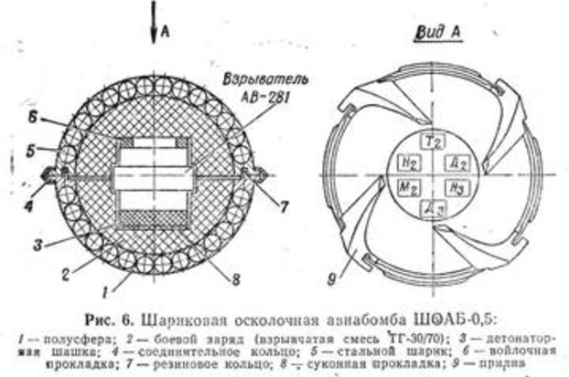

This section provides a summary of incidents identified by the Syrian Archive in analysis of its violation database. Incidents to be investigated include those where incendiary munitions were used, those in which cluster munitions were used unlawfully, and those against specifically protected persons and objects.

The Syrian Archive was able to identify a total of forty-three (43) unique violations incidents in which cluster munitions were used. Ten (10) incidents involving cluster munitions occurring in July 2016, starting with a 7 July attack in the Kafr Hamrah district of Aleppo. The Syrian Archive was able to collect and verify one (1) video related to this incident but was unable to determine which type of cluster munition was used. Two incidents on 9 July were identified, with on the Al Salhin district of Aleppo and one in the Al Shaar district of Aleppo. The Syrian Archive was able to collect and verify two (2) videos of the first incident and one (1) video of the second incident. For the first incident, the Syrian Archive has been able to identify the type of cluster munition used, in this case, SHoAB-0.5. For the second incident, it was not possible to determine cluster munition type.

An attack on 10 July in the Bshantara district of Aleppo was identified, as well as an attack on a convoy the following day on 11 July in Aleppo's Termaneen district. The Syrian Archive was able to collect and verify one (1) video related to the first incident and two (2) videos related to the second incident. In the first incident, the Syrian Archive was able to determine the type of cluster munition and submunition, PTAB-1M and RBK-500. For the second incident, the Syrian Archive was also able to determine the type of cluster munition and submunition involved, in this case AO-2.5RT/RTM and RBK-500.

Incidents on 14 July and on 16 July were identified as having occurred in Al Salhin district and Al-Jinah district of Aleppo respectively, with the Syrian Archive collecting and verifying one (1) video for each. For the 14 July incident submunitions were able to be identified (AO-2.5RT/RTM) and for the 16 July incident both munition (RBK-500) and submunition (ShOAB-0.5) were able to be identified.

An incident was identified as having occurred on 21 July in Harithan, Aleppo. For this, the Syrian Archive was able to collect and verify one (1) video. It was not possible to determine the type of cluster munitions used. Lastly, two attacks on 26 July were found to have occurred in Hayyan and Anadan, Aleppo with Syrian Archive collecting and verifying one (1) video related to each of these incident. It was not possible to determine cluster munition types for either of these incidents.

The Syrian Archive was able to identify 10 unique incidents involving cluster munitions in August 2016. The first incident occurred on 1 August in Aleppo city, the Syrian Archive was unable to determine in which neighbourhood this incident occurred however it was able to collect and verify one (1) video. Specific munition types were unable to be identified. The second incident occurred on 3 August in the Al atarib district of Aleppo and the third incident on 5 August in Kafar Naha district. The Syrian Archive was able to collect and verify one (1) video related to each of these incidents. For the 3 August incident, the Syrian Archive was able to determine the cluster munition type AO-2.5RT/RTM, however was unable to do so for the 5 August incident.

Another incident was found to have occurred on 12 August for which the Syrian Archive was able to collect and verify three (3) videos. For this incident, the Syrian Archive was able to identify specific cluster submunitions (AO-2.5RT/RTM).

Three incidents were found to have occurred on 20 August: 1) in Al-Mashhad and Salah Al-Din neighborhoods; 2) in Al-Zibdeh district; and 3) In Anadan. The Syrian Archive was able to collect and verify one (1) video related to each of these three incidents. For the first incident, the Syrian Archive was able to determine specific cluster submunitions (ShOAB-0.5), however was unable to do so for the others.

On 21 August, two incidents were identified, one in an undetermined neighbourhood of Aleppo, and the other in Urum al-Kubra. The Syrian Archive was able to collect and verify one (1) video related to each of these two incidents, but was unable to determine specific cluster munition type. The final incident identified having occurred in August was on 30 August in the Al atarib district of Aleppo. The Syrian Archive was able to collect and verify three (3) video related to this incident. Cluster munitions were able to be identified (AO-2.5RT/RTM and RBK-500).

The Syrian Archive was able to identify a total of 7 incidents involving cluster munitions occurring during September 2016. On 22 September, an incident was identified as having occured in Khan al-Asl, Aleppo, for which the Syrian Archive was able to collect and verify one (1) related video. Cluster submunition type was able to be identified (ShOAB-0.5).

The following day on 23 September, an incident was found to have occurred in Al Mashhad and Sukkari neighbourhood in Aleppo. The Syrian Archive was able to collect and verify one (1) video related to this incident but was unable to determine cluster munition type. The following day on 24 September, an incident in Bustan al-Qasr neighborhood was identified. The Syrian Archive was able to collect and verify two (2) videos related to this incident. Cluster munition (RBK-500) and submunition types (ShAOB-0.5) were able to be determined.

On 25 September three incidents have been identified: 1) in the Salah el Deen neighborhood of Aleppo; 2) in the Al Mashhad neighborhood of Aleppo; and 3) in Urum al-Kabra. The Syrian Archive was able to collect and verify two (2) videos related to this first incident, and one (1) video related to the second and third incident. Cluster munition types were unable to be determined for these incidents.

The final cluster munition incident identified by the Syrian Archive to have occurred in September occurred the following day on 26 September in the Al Mashhad neighbourhood in Aleppo. For this incident, the Syrian Archive was able to collect and verify one (1) video related to this incident. Specific cluster munition types were unable to be identified.

The Syrian Archive was able to identify a total of 5 cluster munition incidents occurring in Aleppo during October 2016, starting with an attack on 1 October near Al-Sakhour hospital for which the Syrian Archive was able to collect and verify four (4) videos. The Syrian Archive was also able to determine that PTAB-1M munitions were used in the incident.

Two days later on 3 October, another incident occurred in the Al-Ansari district of Aleppo for which the Syrian Archive was able to collect and verify one (1) video. Specific munitions were unable to be identified. On 4 October and 6 October, two incidents involving cluster bombs were found to have occurred, both of which in the Kafar Naha district of Aleppo. The Syrian Archive was able to collect and verify one (1) video related to each of these incidents. In both cases, AO-2.5RT/RTM munitions were identified.

The Syrian Archive was able to identify a total of 10 incidents involving cluster bombs in Aleppo during the November 2016 period. The first incident occurred on 4 November within Aleppo city, The Syrian Archive was able to collect and verify one (1) video related to this incident, however was unable to determine in which neighbourhood this incident occurred or specific munitions used. On 6 November, an incident was found to have occurred in the khan Touman district of Aleppo. The Syrian Archive was able to collect and verify one (1) video related to this incident but was unable to determine specific munitions used. On 9 November and 16 November, the Syrian Archive determined two more incidents occurred, both in Urum al-Kubra. The Syrian Archive was able to collect and verify one (1) video related to each of these two incidents. For both incidents the Syrian Archive was unable to identify specific munition types.

Two days later on 18 November, another incident was found to have occurred in Kafar Naseh. For this incident, the Syrian Archive was able to collect and verify one (1) video. Specific munitions were also able to be identified (PTAB-1M). On 20 November, an incident was identified, occurring within the Al-Shaar district of Aleppo city. The Syrian Archive was able to collect and verify two (2) videos related to this incident.

On 24 November, 25 November, and 26 November, incidents were determined to have occurred in Bab Al Nerab district, Al-Shaar district, and Al-Shaar district, respectively. The Syrian Archive was able to collect and verify two (2) videos related to the incident on the 24th, one (1) video related to the video on the 25th, and one (1) video related to the incident on the 26th. In all three incidents, specific munitions were unable to be identified. The final incident identified to have occurred in November 2016 occurred on 28 November in Kafar Karmin, Aleppo. For this, the Syrian Archive was able to collect and verify one (1) video. The Syrian Archive was additionally able to identify AO-2.5RT/RTM submunitions were used in the incident.

The Syrian Archive was able to identify one (1) incident involving cluster munitions occurring in December 2016. On 23 December, an incident was identified in Khan al-Asl, Aleppo for which the Syrian Archive was able to collect and verify one (1) video. Specific cluster munition model types were unable to be identified.

A table describing the date, location, reported civilian casualties, reported civilian injuries, type of munition used, and links to the video footage is provided in the Appendix of this report.

In-depth analysis of one incident occurring in the [Al Saleheen district of Aleppo city](https://www.google.de/maps/place/36%C2%B011'08.1%22N+37%C2%B009'34.2%22E/@36.1855833,37.158618,298m/data=!3m2!1e3!4b1!4m5!3m4!1s0x0:0x0!8m2!3d36.185583!4d37.159493?hl=en) on 9 July 2016 is provided below. For this investigation, videos and other open source materials shared online were used in order to understand the incident and verify the veracity of claims made about the attack. Similar in-depth analysis of other incidents involving cluster munitions described in the Appendix should be conducted, however time and capacity limitations meant that the Syrian Archive was unable to do so as of the date of publication.

## First moments of the 9 July 2016 Al Saleheen attack

On July 9, 2016, a video was published on YouTube by the user "احمد qwaszx احمد" which showed a large fire at the gas station of the Al Saleheen district as a result of an alleged Russian airstrike (as described in the video title). Sounds of ambulance cars at the nearby impact site can clearly be heard.

<iframe allowfullscreen="" src="https://www.youtube.com/embed/qvCI17LRIJA" width="560" height="315" frameborder="0"></iframe>

A second video the Syrian Archive collected and preserved was published on YouTube by the user "dibo madraty" on July 10, 2016. This second video mentions an attack targeting a gas station in Al Saleheen district, stating that workers might be in the gas station at the time of the attack. It is possible to, in this video, identify a minaret as well as smoke behind it as a result of an attack. It is also possible to hear the sound of the car ambulance, as in the case of the first video.

<iframe allowfullscreen="" src="https://www.youtube.com/embed/cu1lHzGYJgQ" width="560" height="315" frameborder="0"></iframe>

The Syrian Archive collected a photo of Al Salheen gas station [posted on Facebook in October 17, 2013](https://www.facebook.com/409669172457466/photos/a.415330965224620.94847.409669172457466/523157401108642/?type=3&theater). Comparing the photo found with the above first video, it becomes apparent that the gas station attacked in the first video is the same gas station as that of the photo found on Facebook.

We identified the roofs comparing the photo above with the videos we have found online.

A third video originally published by Halab News Network on July 9, 2016 and later preserved by the Syrian Archive, features an aircraft involved in the same Al Saleheen attack, as well as the attack's first moments.

<iframe allowfullscreen src="https://www.youtube.com/embed/tcbJ1G7N9qQ" width="560" height="315" frameborder="0">
</iframe>

A still of the aircraft allegedly used in the attack is provided below.

In this same video, it is possible to identify the bomb falling from the plane onto Al Saleheen, as visible on the still from the video below.

The Syrian Archive geolocated the position of the citizen journalist who filmed this video - he was first standing in a cemetery in front of \"[Maqam Ibrahim al Salihin,\" as the place is tagged on Wikimapia](http://wikimapia.org/35781586/Maqam-Ibrahim-al-Salihin).

Later, in the same video, the Syrian Archive geolocated another filming position based on the palm trees identified close to the impact site, as seen in the video still below:

Below is a video and a satellite image that show both positions from the above photos.

<iframe allowfullscreen src="https://www.youtube.com/embed/yIOsBDkx2ZI" width="690" height="445" frameborder="0">
</iframe>

This same video also shows members of the Syrian Civil Defence (more commonly known as \"the White Helmets') extinguishing the fire at the same gas station identified in the first video. This is visible on the still below.

Civilians, including children, are also seen running from the fire at the impact site in the same video, as seen in the following still.

On July 9, 2016, Aleppo Media Center additionally published a video on YouTube about the same attack. The Syrian Archive is able to determine this is the same attack due to the burned and damaged gas station appearing in the first video. See frames from video below:

## **Cluster munition model**

Through analysing multiple videos, the Syrian Archive was able to identify the specific cluster munition model used in the 9 July 2016 attack. In the same Aleppo Media Center video described above, a man is shown holding a [cluster submunition ShOAB-0.5](http://sovetarmy.2x2forum.com/t222-topic). See video frames below:

The man in the video is heard saying: "There are injured people that we took to the hospital, and we don't know what is going to happen to them. Look at the bombs they are attacking us with, but we will keep staying in Aleppo."

The Syrian Archive was able to determine c[luster submunition ShOAB-0.5](http://sovetarmy.2x2forum.com/t222-topic) were used based on diagrams of the munition [freely available online](http://fishki.net/1831321-chto-takoe-rbk-500-shoab-05.html/gallery-2955556/).

"ShOAB" stands for Sharikovaya Oskolochnaya Aviatsionnaya Bomba, orspherical fragmentation aircraft bomb\", and describes the fragmentation (anti-personnel) effect of these submunitions. The ShOAB-0.5 is loaded into the RBK-500 ShOAB-0.5 cargo bomb, which contains a nominal 565 submunitions (+/- 5 pieces). Assembled, these bombs are 1950mm long, and weigh 334kg.

It should be noted that the diagram above shows a model without the aerodynamic fairing (nose cone). The bomb contains a central bursting charge for dispersing its payload. The ShOAB-0.5 bomblets themselves are derived from the US BLU-26 (and similar) series submunitions, and weigh approximately 417g each. They are 60mm diameter spheres, containing approximately 304 steel balls which act as shrapnel when dispersed by the 70g of TG-30 explosive compound (30% TNT, 70% RDX) contained within the cast steel shell. Several photos of RBK-500 SHAOB-0.5 bombs can be [seen in a Ruptly RT video on Su-24 bomber](https://www.youtube.com/watch?v=FDCOtwT-KjQ).

## Geolocation of the attacked site

Analysing the photos and videos above, and, using Google Earth, the Syrian Archive was able to determine the [exact location](https://goo.gl/maps/93ATbUXb4rt) of the cluster munition impact site. See below:

We have also obtained a [video by IRT (Instant Reporting Team) which filmed Al Saleheen district](https://www.youtube.com/watch?v=e0VXK9KRjlQ&feature=youtu.be&t=1m10s).

<iframe allowfullscreen="" src="https://www.youtube.com/embed/e0VXK9KRjlQ" width="560" height="315" frameborder="0"></iframe>

The video shows the impact site, the mosque (in purple), the gas station (in blue), the roofs (in green), the building next to the mosque (in yellow) as well as the palm trees (in red).

Analysis of the munition remains above show that ShOAB-0.5 cluster bomb was used in an airstrike that targeted a civilian area, specifically a gas station, in the Al Saleheen district of Aleppo city on 9 July 2016. Alleged reports from the ground claimed this attack was carried by a Russian airstrike; journalists have previously found the SU-24 bombers at the Hmeim airbase engaged in the Syrian operation are armed with RBK-500 ShOAB-0.5 cluster bombs. Attribution to the Russian air force is not certain however, as the Syrian government began using this specific type of munition in the early years of the conflict [as of 2013 and continues to as of the date of this publication.](http://brown-moses.blogspot.de/2013/03/evidence-of-new-larger-cluster-bombs.html)
