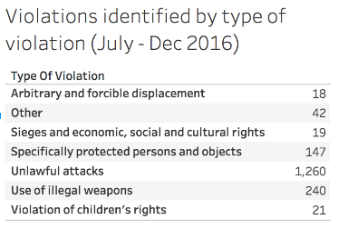

The Syrian Archive has collected, securely stored, verified, and make publicly available a total of [1748 videos of human rights violations](https://syrianarchive.org/en/database?location=%D8%AD%D9%84%D8%A8%20:%20%D8%AD%D9%84%D8%A8&after=2016-07-01&before=2016-12-31) in Aleppo city and its suburbs committed by all major parties to the conflict in the period between July and December 2016. This section of the report provides a summary of videos disaggregated by**\_ type of violations identified\_**, ***specific munitions identified***, and ***location of where videos were filmed.***

### Types of violations identified

An analysis of videos of violations disaggregated by the following types of violations:

1.  Arbitrary and forced displacement;\
2.  Sieges and economic, social and cultural rights;\
3.  Specially protected persons and objects;\
4.  Unlawful attacks;\
5.  Use of illegal weapons;\
6.  Violation of children's rights, and;\
7.  Other types of violations.

In many cases, videos document several different types of violations. For example, an attack on a hospital with a chemical or incendiary munition could potentially be categorised both as violations against "Specially protected persons and objects" due to the special status of hospitals, as well as a violation of "Use of illegal munitions." For the purpose of clarity, and in order not to misleadingly double-count the number of videos, each video has been categorised under only one type of violation, the dominant violation identified in each video. Returning to categorise specific videos under multiple violation categories is a subject of further research. A summary table of violations by type and date is provided below:

First of all, arbitrary for forcible displacement were identified in eighteen (18) videos. The February 2017 OHCHR report on the situation in Aleppo found that "as warring parties agreed to the evacuation of eastern Aleppo for strategic reasons - and not for the security of civilians or imperative military necessity, which permit the displacement of thousands - the evacuation agreement amounts to the war crime of forced displacement."

Secondly, sieges and economic, social and cultural rights were identified in nineteen (19) videos. For the purposes of this report, the Syrian Archive defines sieges and violations of economic, social and cultural rights as incidents where civilians are suffering from lack of basic necessary resources tied to the siege (e.g. difficulty in obtaining adequate food or water, or suffering as a result of lack of medical infrastructure). It also refers to incidents in which civilians suffered as a result of evacuation. Finally, it refers to incidents in which heritage and cultural sites were damaged or destroyed. It is recognised that many of these incidents also fall under the category specially protected persons and objects or other violation categories, however for the purposes of clarity, in this report these incidents document only those in which attacks are not directly filmed. Incidents in which attacks are directly documented are filed in this report under alternate violation categories.

Due to siege of Aleppo city between July to December 2016 period, it is recognised that the figure representing violations may severely under represent the total number of siege related violations, as most videos of violations fall under the siege violation category. Here, these nineteen videos describe when the Syrian Archive was unable to attribute other-non-siege related violations.

Thirdly, violations of specifically protected persons and objects were able to be identified in one hundred forty seven (147) videos. The Syrian Archive uses the customary international humanitarian law (IHL) definition of specially protected persons and objects, Rule 25-30 of which defines as hospitals, ambulances and medical personnel. While these may be the object of attack when used for military purposes, prior warning is needed.

The display of an emblem to signify a location's protected status is not required in conflicts where hospitals are deliberately targeted, and the treatment of wounded fighters does not render a hospital a valid military objective. Rule 38 'Attacks Against Cultural Property' of customary IHL states that special care must be taken in military operations to avoid damage to buildings dedicated to religion, art, science, education or charitable purposes and historical monuments unless they are military objectives, and also that property of great importance to the cultural heritage of must not be the object of attack unless imperatively required by military necessity. Rule 27, 31, and 32 of IHL states that religious personnel exclusively assigned to religious duties must be respected and protected in all circumstances, though they lost their protection if they commit, outside of their humanitarian function, acts harmful to the enemy.

Fourthly, unlawful attacks make up the bulk of violations identified in video footage, comprising 1,260 videos. IHL Rule 12 considers an attack unlawful if it "is not directed at a specific military objective, employs a method or means of combat which cannot be directed at specific military objectives, or employs a method or means of combat where the effects of which cannot be limited as required by IHL and as a result strike military objectives and civilians or civilian objects without distinction."

Fifthly, violations of the use of illegal weapons has been identified in two hundred and forty (240) videos. A detailed analysis which disaggregates specific illegal weapons use is provided in the following section of this report. The February 2017 OHCHR report states that Syria has ratified the Chemical Weapons Convention in 2013, following findings by the Organisation for the prohibition of Chemical Weapons that government forces had used chlorine bombs in an earlier phase in the conflict. IHL Rule 74 states that the use of chemical munitions are prohibited in both international and non-international conflicts. Rules 11, 12, and 71 of International Humanitarian Law state that the use of cluster weapons in densely-populated areas which are by their nature indiscriminate and whose effects cannot be limited is also prohibited. Further, IHL Rule 85 states that the anti-personnel use of incendiary weapons is prohibited unless it is not feasible to use a less harmful weapon.

Sixthly, violations of children's rights have been identified in twenty-one (21) videos. The Syrian Archive has categorised violations of children's rights as videos depicting children injured, killed, or being treated in a hospital as a direct result of an attack. The total number of videos featuring violations of children's rights is likely much higher, as, for the purpose of this report, only one category was applied and many may fall under the category of unlawful attacks.

Seventhly and lastly, "Other" refers to videos that were filmed from far away and when the Syrian Archive was unable to determine whether a residential area was targeted. It also refers to videos in which no voice was in the video mentioning the potential type of munition or perpetrator. Other also refers to videos showing attacks on a frontline in a residential area or attacks on legitimate military targets.

A Gantt chart of the frequency of violations in Aleppo shows that violations of all types occurred regularly and throughout the July - December 2016 period. See below:

<iframe height="350" src="https://public.tableau.com/views/violationsbytypeanddatejuly-dec2016/Sheet2?:showVizHome=no&amp;embed=y&amp;:display_count=yes" width="770"></iframe>

This analysis demonstrates that arbitrary and forcible displacement are more common towards the end of the Battle for Aleppo city. Violations of specifically protected persons and objects occur regularly and throughout that battle. Likewise, unlawful attacks and the use of illegal weapons occur regularly throughout the July - December 2016 period, and in some cases almost daily. A time series analysis demonstrates the intensity at which videos of violations were uploaded in the July - December 2016 period. See below:

<iframe src="https://public.tableau.com/views/timeseriesviolationsbytypeanddatedailyjuly-dec2016/Sheet4?:showVizHome=no&amp;embed=y&amp;:display_count=yes" style="font-size: 1.2em;" width="800" height="650"></iframe>

Like the Gantt analysis, the time series analysis demonstrates consistent and repeated evidence of violations in Aleppo during the July - December 2016 period. Unlawful attacks, the majority of which being attacks against civilians and residential areas, make up the majority of violations documented, with peaks in mid-late July, peaks in mid-September, peaks in mid-October, and peaks in mid-November.

Illegal weapons have been used and attacks against specially protected persons have been witnessed frequently and consistently throughout the July - December 2016 period, coinciding with peaks in the number of videos documenting unlawful attacks. In some cases, illegal weapons have been identified in the same incidents deemed unlawful, however videos are categorised only accordingly to which violations are observed within each video.

Arbitrary and forcible detention videos occur throughout, but peak in December as many fleeing Aleppo were unlawfully detained.

### **Specific munitions identified**

An analysis of the violation database disaggregated by type of munitions used was also conducted. In many cases, specific munitions or submunitions were able to be identified in video footage. In some cases, the Syrian Archive was unable to identify the specific submunitions used, but was able to identify other features, such as the cases used in a cluster munition attacks. A table highlighting the types of munitions used is provided below.

<iframe src="https://public.tableau.com/views/ViolationsbydateandtypeofmunitiousedJuly-December2016/Sheet1?:embed=y&amp;:display_count=yes?:showVizHome=no&amp;embed=y&amp;:display_count=yes" style="font-size: 1.2em;" width="800" height="450">
</iframe>

By far, the most common munition found in video footage of violations in Aleppo are barrel bombs. The recent [Atlantic Council report finds](http://www.publications.atlanticcouncil.org/breakingaleppo/wp-content/uploads/2017/02/BreakingAleppo.pdf) that barrel bombs, improvised air-delivered munitions in which explosives and shrapnel are metal barrels and dropped from aircraft, have caused widespread destruction and injury in Aleppo. The Syrian Network for Human Rights found that [Aleppo was hit with 4,045 barrel bombs in 2016](http://sn4hr.org/blog/2017/01/09/30900/), with no less than 648 barrel bombs dropped in Aleppo in December alone. The Syrian Archive was able to definitively identify barrel bombs in 59 videos, however the figure is likely to rise as analysis continues in the coming months.

Following the use of barrel bombs, cluster munitions appear in a total of sixty six (66) videos. Despite being denied, there is longstanding evidence that cluster munitions have been in use by Russian and Syrian Air Forces in the Syrian conflict. Cluster bombs, which are designed to spread submunitions over a large area, are likely to indiscriminately kill or cause injury to civilians. For this reason, many countries have banned the use of cluster munitions, signing the 2008 Convention on Cluster Munitions, although Syria and Russia have not. Nonetheless, as the Atlantic Council's report highlights, "the use of cluster bombs in densely-populated civilian areas is illegal." For this reason, the Syrian Archive has generally categorised videos containing cluster munitions as unlawful attacks.

When analysing videos of cluster munition attacks, the Syrian Archive was, in some cases, unable to determine which specific type or model of cluster munition had been used or was present in footage, but was able to determine the presence of some type of cluster munition was used. In this case, the Syrian Archive has found forty-one (41) videos. In two (2) cases, the Syrian Archive was unable to determine which type of cluster submunition was used, but was able to identify the model of cluster munition casings. In these cases, cluster munition casings identified were both model RBK-500.

For many videos, the Syrian Archive was able to identify specific models of cluster submunitions. PTAB-1M submunitions were able to be identified in four (4) videos, ShOAB-0.5 submunitions were able to be identified in six (6) videos, and AO-2.5RT/RTM submunitions were able to be identified in thirteen (13) videos. An in-depth investigation of cluster munitions is provided in the Analysis section of this report.

Chemical munitions, which are illegal, were identified in a total of fifty (50) videos. Specific chemical munitions were able to be identified in a majority of these cases, with thirty-eight (38) videos featuring chlorine gas munitions. In twelve (12) cases, the specific chemical munition was unable to be identified but it was able to be determined that a chemical munition had been used.

Incendiary munitions, which are also illegal for anti-personnel use unless it is not feasible to use a less harmful weapons, have been able to be identified in a total of 18 videos. Of these, in fifteen (15) cases, the Syrian Archive was unable to determine the specific incendiary munition used. Many times this is due to video footage taking place at night or from a distance. In the remaining videos, the Syrian Archive identified specific incendiary munition models, with ZAB-2.5S identified in all three (3) cases. An in-depth investigation of incendiary munitions is provided in the Analysis section of this report.

Missiles have been identified as being used unlawfully in a total of (5) videos. While the use of missiles is not prohibited in conflicts, IHL states they must be used only against legitimate military targets. Specific munitions were able to be identified in all five cases. Three (3) of these videos feature 9M79M Tochka munitions, one (1) of these videos feature FAB-500 SHN munitions, and one (1) of these videos features OFAB 250-270 munitions.

The Syrian Archive was similarly able to determine that drones were used unlawfully in two (2) videos of the same incident in which four civilians were killed. In-depth investigation of this incident was not able to be conducted as of the date of publication. more thorough analysis of these videos is provided in the Analysis section of this report.

### **Geolocation of violations by location**

The Syrian Archive has [geolocated all 1748 videos in the dataset](https://syrianarchive.org/en/database?location=%D8%AD%D9%84%D8%A8%20:%20%D8%AD%D9%84%D8%A8&after=2016-07-01&before=2016-12-31) related to human rights violations in Aleppo city and the surrounding suburbs as shown below. Two types of geolocation have been conducted:

1.  Basic geolocation; and\
2.  Advanced geolocation.

Basic geolocation refers to the location where the incident happened based on the video title, video footage, accent of the reporter as well as in cross referencing the incident with other reports about the same incident from different groups such as human rights organisations, humanitarian and medical organisations, citizen journalists, et cetera.

In some cases, advanced geolocation was conducted which allowed for geolocation of the exact impact site attacked. This is done through first conducting basic geolocation and additionally cross-referencing the video footage with openly available satellite imagery, for example via Google Earth or Microsoft Bing Maps, and reference images taken from ground perspective.

The colors in the map refer to different categories used by the OHCHR.

#### **Aleppo City**

The map below shows the location of many reported attacks during the July - December 2016 period. The majority of violations identified were found to be committed by Syrian government and Russian military forces in eastern Aleppo. This includes, the [unlawful attack on Karem Al-Qaterji](https://syrianarchive.org/en/database?after=2016-08-16&before=2016-08-18&term=3%20dead%20and%2012%20wounded%20in%20Al-Qaterji%20neighborhood&unit=307f73fe) and the targeting of specially protected Al-Sakhour hospital, both of which were investigated in detail by [open source investigative website Bellingcat](https://www.bellingcat.com/news/mena/2016/11/09/fact-checking-russias-claim-didnt-bomb-another-hospital-syria/).

<iframe src="https://public.tableau.com/views/Bookgraph1/Dashboard1?:embed=y&amp;:display_count=yes?:embed=y&amp;:display_count=yes?:showVizHome=no&amp;embed=y&amp;:display_count=yes" style="font-size: 1.2em;" width="800" height="800">
</iframe>

The use of illegal weapons in attacks carried by Syrian government forces, such as [chlorine gas](https://syrianarchive.org/en/database?after=2016-11-19&before=2016-11-22&term=Chlorine%20gas%20attack%20that%20targeted%20Aleppo%20city&unit=6b040038/) attack targeting Al Bab road in Aleppo city, was reported by different groups. Human Rights Watch has published a [report of chemical attacks in Aleppo](https://www.hrw.org/news/2017/02/13/syria-coordinated-chemical-attacks-aleppo) which included most, but not all, of the incidents mapped above.

#### **Aleppo Suburbs**

The map below shows that most of the violations in the Syrian Archive dataset occurred in the western countryside of Aleppo.

<iframe src="https://public.tableau.com/views/Bookgraph1/Dashboard2?:embed=y&amp;:display_count=yes?:showVizHome=no&amp;embed=y&amp;:display_count=yes" style="font-size: 1.2em;" width="800" height="830">
</iframe>

These violations include unlawful attacks against civilians, including an attack that[hit a vegetables market in Awejel](https://syrianarchive.org/en/database?after=2016-08-11&before=2016-08-13&term=the%20local%20market%27s%20massacre%20in%20Owayjel%20town&unit=70590ec2). They also include violations against protected persons and objects, such [as the attack that targeted a humanitarian convoy](https://syrianarchive.org/en/database?location=%D8%AD%D9%84%D8%A8%20:%20%D8%A7%D9%88%D8%B1%D9%85%20%D8%A7%D9%84%D9%83%D8%A8%D8%B1%D9%89&after=2016-08-18&before=2016-09-22) in Urum Al Kubra. The dataset also includes geolocated use of illegal weapons, as well as the [incendiary weapon attack in Al Bashqatin](https://syrianarchive.org/en/database?location=%D8%AD%D9%84%D8%A8%20:%20%D8%A8%D8%B4%D9%82%D8%A7%D8%AA%D9%8A%D9%86&after=2016-11-13&before=2016-11-15&term=Alleged%20Russian%20airstrikes%20using%20Incendiary%20weapons&unit=db509a0a).

In-depth analysis of verified video evidence has led to finding the use of illegal munitions, such as chlorine gas, as a main tactic used by Syrian government forces to regain control of Aleppo city. Visual evidence concerning chlorine gas attacks has been geolocated in the map above and is available on the Syrian Archive website. [Human Rights Watch](https://www.hrw.org/news/2017/02/13/syria-coordinated-chemical-attacks-aleppo) and [Bellingcat](https://www.bellingcat.com/news/mena/2016/12/19/the-cl2-before-the-storm/) have written and conducted extensive analysis on these incidents, for which the Syrian Archive assisted. As a result, and to not duplicate findings, the Syrian Archive will not be providing in-depth analysis of chlorine gas attacks in this report.
