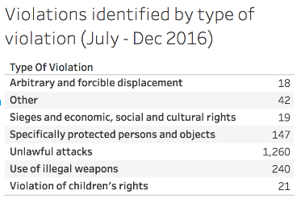

قام "الأرشيف السوري" [بجمع 1،748 مقطع فيديو](https://syrianarchive.org/ar/database?location=%D8%AD%D9%84%D8%A8%20:%20%D8%AD%D9%84%D8%A8&after=2016-07-01&before=2016-12-31)، حفظها بشكل آمن، التحقق منها وإتاحتها للعموم. توثق هذه المقاطع انتهاكات حقوق الإنسان في مدينة حلب وأريافها، والمرتكبة من قبل كافة الأطراف خلال الفترة الزمنية الممتدة بين شهر يوليو وشهر ديسمبر من عام 2016\. يقدّم هذا القسم من التقرير ملخّصًا لمقاطع الفيديو بتصنيفها **_حسب نوع الانتهاك المحدد، الذخائر  المحددة، والموقع الجغرافي لالتقاط الفيديو_**.

### حسب نوع الانتهاك المحدّد

أٌجري تحليل لمقاطع فيديو الانتهاكات المصنفة حسب أنواع الانتهاكات التالية:

1. التشريد التعسفي والقسري
2. الحصار والحقوق الاقتصادية والاجتماعية والثقافية
3. الأشخاص والأعيان المحميون على وجه التحديد
4. الهجمات غير المشروعة
5. استخدام الأسلحة غير المشروعة
6. انتهاكات حقوق الأطفال؛ و
7. أنواع أخرى من الانتهاكات

في كثير من الحالات؛ يوثّق مقطع الفيديو الواحد عدّة أنواع من الانتهاكات. على سبيل المثال:  هجوم بالذخائر الكيماوية أو الحارقة على مشفى، يمكن تصنيف هذا الانتهاك  في كلٍ من:  انتهاك بحق "الأشخاص والأعيان المحميون على وجه التحديد" بسبب المكانة الخاصة للمشافي، إضافة إلى كونه انتهاكًا بـ "استخدام الأسلحة غير المشروعة". لكن ولأجل الشفافية، ومنعًا لمضاعفة حساب عدد مقاطع الفيديو بشكل خاطئ، صُنّف كل مقطع فيديو تحت نوع واحد من الانتهاكات فقط، وهو الانتهاك الأبرز فيه. وستُترك مسألة تصنيف مقاطع فيديو محددة بأكثر من تصنيف انتهاك موضوعًا لمزيد من البحوث. في ما يلي جدول ملخص للانتهاكات مصنّفةً حسب نوع الانتهاك وتاريخه.

أولًا؛ انتهاك "التشريد التعسفي والقسري" حُدّدت في ثمانية عشر (18) مقطع فيديو. وكان تقرير المفوضية السامية للأمم المتحدة لحقوق الإنسان حول الظروف في حلب والمنشور في فبراير 2017،  قد خلُص إلى أنه "ومع موافقة الأطراف المتحاربة على الإجلاء من الجزء الشرقي من مدينة حلب لأسباب استراتيجية - وليس من أجل ضمان أمن المدنيين أو لأغراض الضرورة العسكرية الحتمية، وهو ما يسمح بترحيل الآلاف - فإن اتفاق الإجلاء عن حلب يرقى إلى جريم الحرب المتمثلة في التشريد القسري".

ثانيًا؛ انتهاك "الحصار والحقوق الاقتصادية والاجتماعية والثقافية" حُدد في تسعة عشر (19) مقطع فيديو. لأغراض هذا التقرير، يعرف "الأرشيف السوري" انتهاك الحصار والحقوق الاقتصادية والاجتماعية والثقافية بالحالات التي يعاني فيها المدنيين من شُحّ في المواد اللازمة الأساسية المقيّدة بسبب الحصار (على سبيل المثال الصعوبة في تحصيل الطعام أو المياه الكافيين، أو المعاناة نتيجة الافتقار إلى البنى التحتية الطبية). وتشير أيضًا إلى الحالات التي يعاني فيها المدنيون نتيجة الإخلاء. من المعروف أن العديد من هذه الحوادث يمكن أن تندرج تحت تصنيف "الأشخاص والأعيان المحميون على وجه التحديد"، وغيرها من أصناف الانتهاكات، على الرغم من ذلك ولأغراض تتعلق بالشفافية، يوثق تصنيف الحصار في هذا التقرير الحالات التي لم يُسجّل فيها هجوم مباشر. حيث تم إدراج الحالات التي تحتوي هجومًا مباشرًا تحت تصنيفات انتهاكات أخرى.

نظرًا لكون مدينة حلب واقعة تحت الحصار في الفترة الزمنية الممتدة بين يوليو وديسمبر 2016، فمن المسلّم به أن الرقم المحدد للفيديوهات المرتبطة به قد لا يمثل إلا نسبة ضئيلة من العدد الكلي للانتهاكات المتعلقة بالحصار، حيث تندرج معظم مقاطع الفيديو الأخرى تحت تصنيف انتهاك الحصار. تمثّل هذه المقاطع التسعة عشر الحالات التي لم يتمكن "الأرشيف السوري" من تحديد انتهاك آخر سوى انتهاك الحصار فيها.

ثالثًا؛ انتهاك "الأشخاص والأعيان المحميون على وجه التحديد" أمكن تمييزه في مئة وسبع وأربعين (147) مقطع فيديو. استخدم "الأرشيف السوري" تعريف القانون الدولي الإنساني للأشخاص والأعيان المحميون على وجه التحديد،  في المادة 25-30 حيث تُحدّد فئات معينة مثل المشافي، سيارات الإسعاف، الطواقم الطبية. وإذا كانت هذه الفئة هدفًا لهجوم عند استخدامها لأغراض عسكرية، فيجب إعطاء إنذار مسبق.

إن إبراز رمز معيّن للدلالة على المواقع المحمية أمر غير مشروط في حالات النزاع، حيث تُستهدف المشافي عمدًا، كما أن معالجة المقاتلين الجرحى لا تجعل المشفى هدفًا عسكريًا مشروعًا. تنص المادة 38 للقانون الدوليّ الإنسانيّ على وجوب توخّي حذر إضافيّ في العمليات العسكرية لتجنّب إحداث ضرر في المباني المخصصة لأغراض دينية، فنيّة، علميّة، تعليمية، خيريّة، إضافة للآثار التاريخية؛ ما لم تكن أهدافًا عسكرية، كما ونظرًا للأهمية الكبيرة للتراث الثقافي فإنه لا يجدر أن يكون هدفًا لهجوم ما لم تستلزم ذلك الضرورة العسكرية بشكل حتميّ.

تنصّ المواد 27،31، و 32 من القانون الدولي الإنساني على وجوب احترام وحماية العاملين في المجال الديني والمكلفين بالواجبات الدينيّة في جميع الظروف، ومع ذلك، فإن هذه الفئة تفقد حمايتها إذا ارتكب أفرادها أعمالًا تضرّ بالخصم بعيدًا عن مهامهم الإنسانية.

رابعًا؛ انتهاك "الهجمات غير المشروعة" والذي يشكّل الجزء الأكبر من الانتهاكات التي تم تحديدها في مقاطع الفيديو، وتضم 1260 مقطع فيديو. تعرّف المادة 12 من القانون الدولي الإنساني "الهجمات غير المشروعة" على أنها الهجمات التي لا توجه لأهداف عسكريّة محددة، الهجمات التي توظف منهجًا أو أنماطًا من القتال لا يمكن توجيهه نحو أهداف عسكريّة محددة، أو الهجمات التي توظّف نوعًا أو أنواعًا من القتال التي لا يمكن حصر تأثيرها على النحو المحدد من قبل القانون الدولي الإنساني، والتي تصيب بالنتيجة أهدافًا عسكرية ومدنيين، أو أعيانًا مدنيّة بدون تمييز.

خامسًا؛ انتهاك "استخدام الأسلحة غير المشروعة" والذي تم تحديده في مئتين وأربعين (240) مقطع فيديو. سيتم تناول استخدام أصناف الأسلحة غير المشروعة المحددة بتحليلات مفصّلة في القسم التالي من التقرير. وكان تقرير  المفوضية السامية للأمم المتحدة لحقوق الإنسان المنشور في فبراير 2017،  قد نصّ على أن سوريا صادقت على اتفاقية الأسلحة الكيميائية عام 2013، عقب النتائج التي توصلت لها منظمة حظر الأسلحة الكيميائية بأن قوات الحكومة استخدمت قنابل غاز الكلور في مرحلة مبكرة من الصراع. تنص المادة 74 من القانون الدولي الإنساني أن استخدام الذخائر الكيميائية محظور في كل من النزاعات الدولية وغير الدولية. تنص المواد 11، 12، و 71 من القانون الدولي الإنساني بحظر استخدام الذخائر العنقودية في المناطق المكتظة سكّانيًا، حيث أن طبيعة الذخائر العنقودية عشوائية ولا يمكن حصر تأثيرها. علاوة على ذلك، تنص المادة 85 من القانون الدولي الإنساني بحظر استخدام الأسلحة الحارقة ضد الأفراد ما لم يكن من الممكن استخدام أسلحة أقل إيذاءً.

سادسًا؛ انتهاكات حقوق الأطفال والتي تم تمييزها في واحد وعشرين (21) مقطع فيديو. صنّف "الأرشيف السوري" الانتهاكات بحقوق الأطفال في مقاطع الفيديو التي تصوّر أطفال أصيبوا أو قُتلوا بسبب هجوم بشكل مباشر. من المرجح أن عدد مقاطع الفيديو التي تُظهر انتهاكات لحقوق الأطفال أعلى بكثير، حيث أنه ولأغراض تتعلق بهذا التقرير، تم تطبيق فئة انتهاك واحدة لكل مقطع فيديو، ويمكن ان تُدرج العديد من المقاطع تحت تصنيف الهجمات غير المشروعة.
سابعًا وأخيرًا، يُشير تصنيف "أخرى" إلى مقاطع الفيديو التي التقطت من مكان بعيد، حيث لا يكون "الأرشيف السوري" قادرًا على تحديد فيما إذا تم استهداف منطقة سكنية. كما يشير التصنيف إلى مقاطع الفيديو التي لا تحتوي صوتًا يوضّح ماهية الذخيرة المستخدمة أو الجهة المسؤولة. يضم تصنيف "أخرى" أيضًا المقاطع التي تضم هجمات على خط جبهة في منطقة سكنية، أو هجمات على أهداف عسكرية مشروعة.

يُظهر تحليل جانت Gantt لوتيرة الانتهاكات في حلب أن كل أنواع الانتهاكات قد ارتُكبت بانتظام وطِوال الفترة الممتدة ما بين يوليو- ديسمبر 2016، كما هو موضّح.
<iframe src="https://public.tableau.com/views/violationsbytypeanddatejuly-dec2016/Sheet2?:showVizHome=no&embed=y&:display_count=yes" width="770" height="350"></iframe>

يوضح التحليل أن انتهاك "التشريد التعسفي والقسري" كان أكثر شيوعًا في نهاية المعركة للسيطرة على مدينة حلب. فيما كانت الانتهاكات تجاه "الأشخاص والأعيان المحميين على وجه التحديد" تحدث بانتظام خلال معركة السيطرة على حلب. وبالمثل، فإن انتهاكات الهجمات غير المشروعة واستخدام الأسلحة غير المشروعة حدثت بانتظام طيلة الفترة الممتدة من يوليو - ديسمبر 2016\. كما هو موضّح.

يوضح تحليل السلاسل الزمنية الكثافة التي تم رفع مقاطع فيديو الانتهاكات خلالها في الفترة الممتدة بين يوليو - ديسمبر 2016\. انظر أدناه:
<iframe src="https://public.tableau.com/views/timeseriesviolationsbytypeanddatedailyjuly-dec2016/Sheet4?:showVizHome=no&embed=y&:display_count=yes" style="font-size: 1.2em;" width="800" height="650"></iframe>

كما يَظهر في تحليل جانت أعلاه، يوضح تحليل السلاسل الزمنية وجود أدلة ثابتة ومتكررة للانتهاكات في مدينة حلب خلال الفترة الزمنية الواقعة بين يوليو - ديسمبر 2016\. كما يوضح كون أغلبية الانتهاكات الموثقة كانت عن طريق الهجمات غير المشروعة التي تمت ضد المدنيين والمناطق السكنية، مع وجود ذُرى في منتصف أواخر يوليو،  ذُرى في منتصف أيلول -سبتمبر، ذُرى في منتصف تشرين الأول - نوفمبر، وذَرى في منتصف تشرين الثاني - نوفمبر.

استخدمت الأسلحة غير المشروعة في هجمات ضد الأشخاص والأعيان المحميين على وجه التحديد، وشُهدت بشكل متكرر ومنتظم خلال الفترة الممتدة ما بين يوليو - ديسمبر، بالتزامن مع ارتفاع عدد مقاطع الفيديو الموثّقة للهجمات غير المشروعة. في بعض الحالات، تم التعرف على أسلحة غير مشروعة في نفس الحالات المحددة كهجمات غير مشروعة، لكن مقاطع الفيديو صُنّفت على أساس انتهاك واحد مُعتمّد  لكل مقطع فيديو.

كما تظهر مقاطع الفيديو وجود حالات التشريد التعسفي والقسري طيلة الفترة الزمنية، لكنها ترتفع في شهر ديسمبر مع اعتقال العديد من الفارين من حلب بصورة غير شرعية.

### التصنيف حسب الذخائر المحدّدة

أُجري تحليل لقاعدة بيانات الانتهاكات المفصّلة حسب نوع الذخيرة المستخدمة. في العديد من الحالات،  كان من الممكن تمييز أنواع محددة من الذخائر او الذخائر الصغيرة ضمن مشاهد الفيديو. في بعض الحالات، لم يكن "الأرشيف السوري" قادرًا على التعرف على الذخائر المحددة المستخدمة، ولكن قادرًا على تحديد الصفات الأخرى، مثل الحالات التي استُخدمت فيها القنابل العنقودية في الهجمات. يسلط الجدول التالي الضوء على أنواع الذخائر المستخدمة.

<iframe src="https://public.tableau.com/views/ViolationsbydateandtypeofmunitiousedJuly-December2016/Sheet1?:embed=y&:display_count=yes?:showVizHome=no&embed=y&:display_count=yes" style="font-size: 1.2em;" width="800" height="450"></iframe>

إلى حد كبير، وُجد أن الذخيرة الأكثر شيوعًا في مشاهد مقاطع الفيديو للانتهاكات في حلب هي البراميل المتفجرة. يشير التقرير الأخير للمجلس الأطلسي إلى أن البراميل المتفجرة، وهي ذخائر ارتجالية جوّية ترمى من الطائرات لتتفجر وتكون شظاياها براميل معدنية،  تسببت بدمار وإصابات على نطاق واسع في حلب. وجدت "الشبكة السورية لحقوق الإنسان" أنه [تمّ رمي حلب ب 4،045  برميل متفجر](http://sn4hr.org/%20wp-content/pdf/english/At_least_12958_barrels_explosive_%20in_2016_en.pdf)، وأن ما لا يقل عن 648 برميل متفجر ألقي على حلب في شهر ديسمبر وحده. استطاع "الأرشيف السوري" تحديد البراميل المتفجّرة في 59 مقطع فيديو بشكل حاسم، لكن هذا الرقم مرشح للزيادة مع استمرار التحليل في الأشهر القادمة.

تأتي الذخائر العنقودية في المرتبة الثانية من حيث الاستخدام بعد البراميل المتفجرة، في ستة وستين (66) مقطع فيديو. بغض النظر عن إنكار استخدامها، هناك أدلة طويلة المدى على استخدام الذخائر العنقودية من قبل سوريا وروسيا في الصراع السوري. من المرجح أن القنابل العنقودية، وهي مصممة بحيث تنشر ذخائر صغيرة على مساحة واسعة، تسببت في قتل وإصابة المدنيين عشوائيًا. ولهذا السبب، فإن العديد من البلدان حظرت استخدامها منذ اتفاقية عام 2008  المتعلقة بالذخائر العنقودية، رغم أن سوريا وروسيا لم تحظرا استخدامها. إضافة إلى ذلك، يذكر تقرير المجلس الأطلسي أن "استخدام القنابل العنقودية في المناطق المدنية المكتظة بالسكان غير قانونيّ". ولهذا السبب، صنّف "الأرشيف السوري" مقاطع الفيديو التي تتضمن ذخائر عنقودية على أنها هجمات غير شرعية.

أثناء تحليل مقاطع الفيديو الحاوية على هجمات باستخدام الذخائر العنقودية، لم يكن "الأرشيف السوري"، في بعض الحالات، قادرًا على الجزم بماهية النوع الدقيق أو طراز الذخائر العنقودية المستخدمة أو الظاهرة في المقطع، ولكنه كان قادرًا على البتّ بوجود بعض أنواع الذخائر العنقودية واستخدامها. في هذه الحالة، وجد "الأرشيف السوري" واحد وأربعين (41) مقطع فيديو. في مقطعي فيديو (2) لم يكن "الأرشيف السوري" قادرًا على تحديد نوع الذخائر العنقودية الصغيرة المستخدمة، لكنه كان قادرًا على التعرف على طراز أغلفة الذخائر العنقودية. في هاتين الحالتين، كان طراز أغلفة الذخائر العنقودية المتعرف عليها RBK-500 في كلتيهما.

تمكن "الأرشيف السوري" من التعرف على النماذج المحددة للذخائر العنقودية الصغيرة في العديد من مقاطع الفيديو. تم التعرف على الذخائر الصغيرة من نمط PTAB-1M في أربعة (4) مقاطع فيديو،  تم التعرّف على الذخائر الصغيرة من نمط  ShOAB-0.5 في ستة (6) مقاطع فيديو،  و تم التعرّف على الذخائر الصغيرة من نمط AO-2.5RT/RTM  في ثلاثة عشر (13) مقطع فيديو. سيتم تناول الذخائر العنقودية بتحقيق مفصّل في قسم التحليل من هذا التقرير.

أمكن التعرّف على ذخائر كيماوية، والتي تعتبر غير شرعية، في مجمل خمسين (50) مقطع فيديو. في معظم الحالات، كان من الممكن التعرف على ذخائر كيماوية محدّدة،  وذلك في ثمانية وثلاثين (38) مقطع فيديو ظهرت فيها ذخائر غاز الكلور. في اثني عشر (12) مقطع فيديو، أمكن التأكد من أن ذخيرة كيماوية ما قد استُخدمت، دون القدرة على تحديد نوعها بشكل تام. سيتم تناول الذخائر الكيماوية بتحقيق مفصّل في قسم التحليل من هذا التقرير.

أمكن التعرّف على ذخائر حارقة، والتي تعتبر غير شرعية ضد الأفراد ما لم يكن من الممكن استخدام أسلحة أقل إيذاءً، في مجمل ثمانية عشر (18) مقطع فيديو. وفي خمسة عشر منها (15) لم يكن "الأرشيف السوري" قادرًا على التعرف على النماذج المحددة للذخائر الحارقة المستخدمة. في كثير من الأحيان يعود ذلك إلى تصوير الفيديو خلال الليل أو من مسافة بعيدة. في مقاطع الفيديو المتبقية، تعرّف "الأرشيف السوري" على الطراز المحدد للذخائر الحارقة المستخدمة، وهو ZAB-2.5S  في الثلاث (3) حالات. سيتم تناول الذخائر الحارقة بتحقيق مفصّل في قسم التحليل من هذا التقرير.

أمكن التعرّف على استخدام القذائف الموجهة بشكل غير مشروع في مجمل خمسة (5) مقاطع فيديو. وفي حين أنه لا يحظر استخدام القذائف الموجهة في الصراعات،  فإن القانون الدولي الإنسانيّ ينصّ على وجوب استخدام القذائف الموجهة ضد الأهداف العسكرية المشروعة فحسب.  أمكن التعرف على الطراز المحدد للقذائف المستخدمة في الحالات الخمسة كلها. حيث ظهرت قذائف 9M79M Tochka في ثلاث (3) حالات. ظهرت قذائف FAB-500 SHN  في فيديو واحد (1)، واحتوى فيديو واحد (1) على قذائف OFAB 250-270.

بشكل مشابه، كان "الأرشيف السوري" قادرًا على التعرف على استخدام طائرات بدون طيار بشكل غير مشروع في اثنين (2) من مقاطع الفيديو، وفيه قُتل أربعة مدنيين. لن يكون من الممكن إجراء تحقيقات معمّقة حول هذه الحادثة حتى تاريخ النشر. سيتم تحليل هذه الفيديوهات بدقة أكبر في قسم التحليل من هذا التقرير.

### تحديد الموقع الجغرافي للانتهاكات حسب مكانها

تم تحديد المواقع الجغرافية من قبل "الأرشيف السوري" في [كافة مقاطع الفيديو ال 1748 المتعلقة بانتهاكات حقوق الإنسان في مدينة حلب](https://syrianarchive.org/ar/database?location=%D8%AD%D9%84%D8%A8%20:%20%D8%AD%D9%84%D8%A8&after=2016-07-01&before=2016-12-31) وأريافها المحيطة كما هو موضح أدناه. وقد أجري نوعان من التحديد الجغرافي: 1) تحديد الموقع الجغرافي الأساسي؛ و 2) تحديد الموقع الجغرافي المتقدم.

يشير الموقع الجغرافي الأساسيّ إلى المكان الذي وقع فيه الحادث بالاعتماد على عنوان الفيديو، مشاهد من الفيديو، لهجة المراسل؛ وكذلك الرجوع إلى تقارير أخرى توثّق نفس الحادث من جهات مختلفة مثل منظمات حقوق الإنسان، المنظمات الطبية والإغاثية، الصحفيين المدنيين إلخ.

تم تحديد الموقع الجغرافي المتقدم في بعض الحالات، وهو الموقع الجغرافي الذي يشير بدقة إلى موقع التأثير الفعلي للهجوم. يتم ذلك عبر تحديد الموقع الجغرافي الأساسي بداية، إضافة إلى مقاطعة الفيديو مع صور الأقمار الصناعية باستخدام الصور الفضائية المتاحة بشكل مفتوح، على سبيل المثال باستخدام  خرائط Google Earth أو خرائط Microsoft Bing ، وصور مرجعية مُلتقطة من منظور أرضيّ.

تشير الألوان على الخريطة إلى التصنيفات المختلفة المستخدمة من قبل مكتب المفوضية السامية لحقوق الإنسان والتابعة للأمم المتحدة (OHCHR).

#### مدينة حلب:

توضح الخريطة أدناه الموقع الجغرافي للعديد من الهجمات المُبلغ عنها في الفترة الزمنية ما بين يوليو - ديسمبر 2016\. وقد وُجد أن أغلبية الانتهاكات المحددة ارتُكبت من قبل الحكومة السورية والقوات الروسية في حلب الشرقية. يتضمن ذلك [الهجمات غير المشروعة على كرم القاطرجي](https://syrianarchive.org/ar/database?location=%D8%AD%D9%84%D8%A8%20:%20%D9%83%D8%B1%D9%85%20%D8%A7%D9%84%D9%82%D8%A7%D8%B7%D8%B1%D8%AC%D9%8A&after=2016-07-01&before=2016-12-31&term=3%20dead%20and%2012%20wounded%20in%20Al-Qaterji%20neighborhood%20by%20the%20airstrikes&unit=307f73fe/)، واستهداف مشفى الصاخور "الأشخاص والأعيان المحميون على وجه التحديد"، وكلاهما تم التحقيق في تفاصيله من قبل موقع التحقيقات مفتوح المصدر  Bellingcat.

<iframe src="https://public.tableau.com/views/Bookgraph1/Dashboard1?:embed=y&:display_count=yes?:embed=y&:display_count=yes?:showVizHome=no&embed=y&:display_count=yes" style="font-size: 1.2em;" width="800" height="800"></iframe>

استُخدمت الأسلحة غير المشروعة في الهجمات التي شنّتها القوات الحكومية، مثل استهداف منطقة طريق الباب في حلب بهجوم [استخدم غاز الكلور](https://syrianarchive.org/ar/database?after=2016-07-01&before=2016-12-31&term=Chlorine%20gas%20attack%20that%20targeted%20Aleppo%20city&unit=6b040038)، والذي تم التبليغ عنه من قبل جهات مختلفة. نشرت هيومن رايتس ووتش [تقريرًا عن الهجمات الكيماوية على حلب](https://www.hrw.org/news/2017/02/13/syria-coordinated-chemical-attacks-aleppo) والذي ضم معظم، وليس جميع، الحوادث المعينة على الخريطة أدناه.

#### ريف حلب:

تُوضح الخريطة أدناه أن معظم الانتهاكات الواردة في قاعدة بيانات "الأرشيف السوري" قد حدثت في ريف حلب الغربي، انظر أدناه:

<iframe src="https://public.tableau.com/views/Bookgraph1/Dashboard2?:embed=y&:display_count=yes?:showVizHome=no&embed=y&:display_count=yes" style="font-size: 1.2em;" width="800" height="830"></iframe>

تشمل هذه الانتهاكات هجمات غير مشروعة تجاه المدنيين، من بينها [هجوم قصف سوقًا محليًا للخضار في عُويجل](https://syrianarchive.org/ar/database?after=2016-07-01&before=2016-12-31&term=the%20local%20market%27s%20massacre%20in%20Owayjel%20town&unit=70590ec2). كما تشمل انتهاكات ضد "الأشخاص والأعيان المحميون على وجه التحديد"، مثل الهجوم الذي استهدف [قافلة إغاثة في أروم الكبرى](https://syrianarchive.org/ar/database?location=%D8%AD%D9%84%D8%A8%20:%20%D8%A7%D9%88%D8%B1%D9%85%20%D8%A7%D9%84%D9%83%D8%A8%D8%B1%D9%89&after=2016-09-18&before=2016-09-22). تشمل قاعدة البيانات الهجمات باستخدام أسلحة غير مشروعة تم تحديد موقعها الجغرافي. مثل [الهجوم بالأسلحة الحارقة على منطقة البشقاتين](https://syrianarchive.org/ar/database?location=%D8%AD%D9%84%D8%A8%20:%20%D8%A8%D8%B4%D9%82%D8%A7%D8%AA%D9%8A%D9%86&term=Alleged%20Russian%20airstrikes%20using%20Incendiary%20weapons&unit=db509a0a).
أدى التحليل المعمّق لأدلة الفيديو المُثبتة إلى التأكد من استخدام الذخائر غير المشروعة، مثل غاز الكلور، كنهج حربيّ مستخدم من قبل القوات الحكومية السورية لاستعادة السيطرة على مدينة حلب. وقد تم تحديد المواقع الجغرافية للأدلة البصرية المتعلقة بهجمات غاز الكلور في الخريطة أعلاه، وهي متاحة على الموقع الإلكتروني "للأرشيف السوري". أجرت كلًا من [هيومن رايتس ووتش](https://www.hrw.org/news/2017/02/13/syria-coordinated-chemical-attacks-aleppo)[وBellingcat](https://www.bellingcat.com/news/mena/2016/12/19/the-cl2-before-the-storm/)  تحليلات موسّعة حول هذه الحوادث، والتي كانت مساعدة "الأرشيف السوري". ولهذا، وتفاديًا لعدم تكرار الاستنتاجات، لن يقدم "الأرشيف السوري" تحليلًا موسعًا حول هجمات الكلور  في هذا التقرير.
