*This post originally appeared on the [bellingcat.com](https://www.bellingcat.com/)*

On October 1st 2015 reports of Russian airstrikes hitting a mosque in the town of Jisr al-Shughur in Idlib began appearing online. This included reports from local activists posted on social media, and video footage showing what was claimed to be damage to the Omar bin Al-Khattab mosque, in the north of the town. The claims were published by various media organisations, including Reuters, the Daily Telegraph (UK), and Al Jazeera. Russia's Major-General Igor Konashenkov confirmed the presence of Russian aircraft in the area, claiming the complete "destruction of a command post on the northern outskirts of Jisr al-Shughur". On October 30th the Russian Ministry of Defence responded to the allegations in a press conference about their air-strikes in Syria

In the[English transcript of the press conference](https://www.facebook.com/permalink.php?story_fbid=1674425756133507&id=1492252324350852) the Russian Ministry of Defence states the following:

*Thus, the western media published another "hoax" concerning the Al Farooq Omar Bin Al Khattab Mosque supposedly demolished by the Russian strikes in Jisr al-Shughur (Idlib province). *

*Today the real picture is shown by the means of objective monitoring. *

*The photos, which were made yesterday on October 29, 2015, show this mosque. *

*The photos show in detail that the mosque suffered no damage. That is why all the so-called revelations published by a number of respected publications is nothing but just a simple fabrication, which has no real factual basis. *

The following image, which was claimed to be aerial imagery from October 29th, was presented by the Russian Ministry of Defence claiming to show the undamaged "Al Farooq Omar Bin Al Khattab Mosque"

Although the Russian Ministry of Defence gives no date for the reported mosque bombing, local activists in Jisr al-Shughur have only reported one mosque bombing in October 2015, therefore we can assume the Russian Ministry of Defence is referring to the October 1st bombing. With two contradictory claims the question is whether or not the claims can be confirmed.

What is key is establishing whether or not the mosque local activists claimed was bombed is the same one featured in the Russian Ministry of Defence imagery. The first indication that the mosque bombed was not the same was the name used by local activists. In social media posts relating to the incident locals always refer to the mosque bombed as the "Omar Bin Al Khattab Mosque", never as "Al Farooq Omar Bin Al Khattab Mosque", which the Russian Ministry of Defence used to describe it. Bellingcat also contacted local activists directly who confirmed the name of the mosque bombed on October 1st was the "Omar Bin Al Khattab Mosque". They also stated that the mosque in the Russian Ministry of Defence aerial imagery was known as the Al-Farouq Mosque, and sent the following image showing the name of the mosque on the building itself

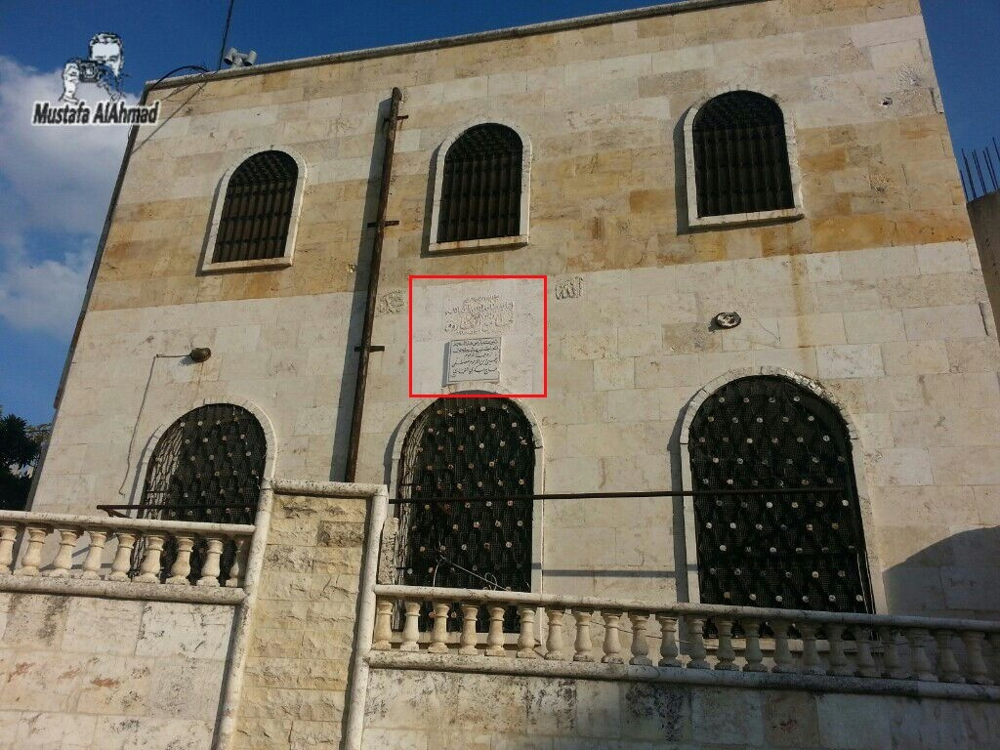

Historical satellite imagery from Google Earth from July 20th 2011 shows three rows of windows on the side of the mosque next to a wall, similar to what is visible in the photograph of the mosque

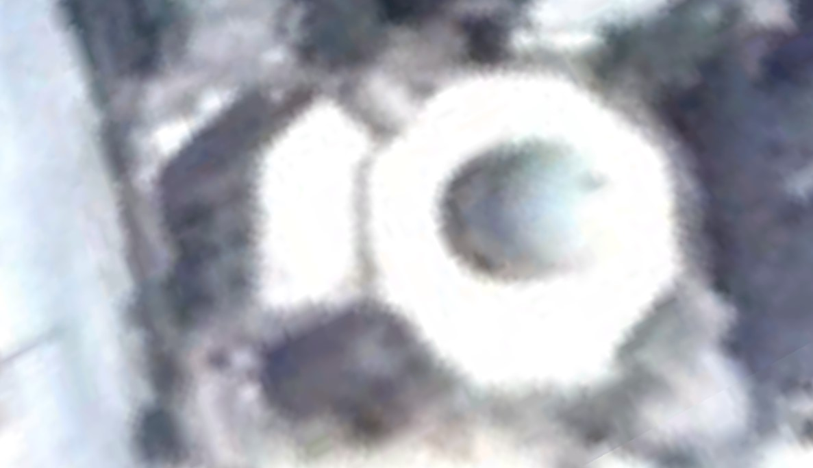

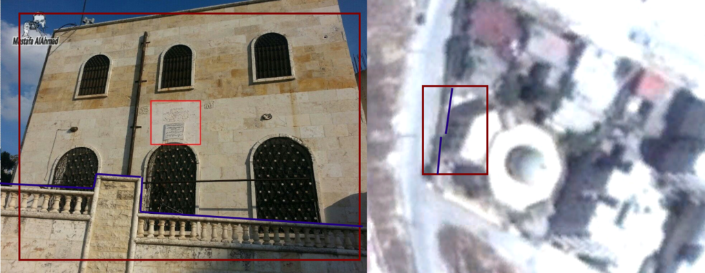

An image of the mosque taken from a distance was also provided by local activists, showing the distinct blue dome, and giving a better sense of the size of the mosque

In [October 1st of the mosque bombing](https://www.youtube.com/watch?v=WJZzxDTCtaQ&index=3&list=PLPC0Udeof3T5HMvmHc8EbKK4gwXzJqp94) it's possible to see both the outside and inside view of the roof. From the outside it's clear no blue dome is present on the roof of the mosque, which also appears to be a shorter building than the Al Farooq Mosque

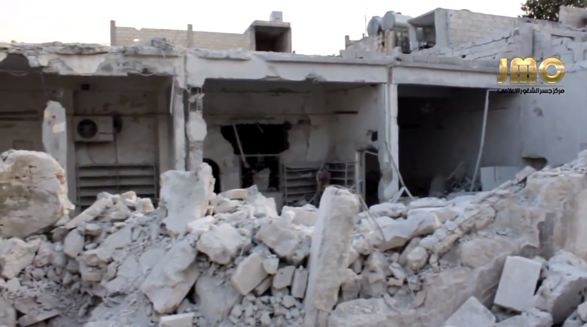

The inside of the mosque is also shown, with the roof clearly being intact, and no blue rubble present in any images of the mosque bombing, so it cannot be claimed the dome would have collapsed inside the building

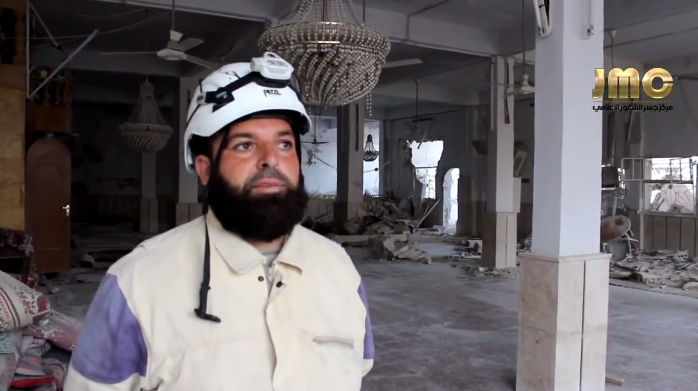

Tariq Abdul Haq, a member of Jisr al-Shugur Local Coordination Committee, confirmed the name of the mosque bombed was the "Omar Bin Al Khattab Mosque", and the location of the mosque at 35.821077, 36.322102 on the northern side of Jisr al-Shugur. While the satellite imagery for the location is unclear, Tariq Abdul Haq provide a still from drone footage locals recorded at the start of April 2015 showing the area around the Omar Bin Al Khattab Mosque (note, the image has been turned 180 degrees, a full sized version can be found here)

From this image it is possible to match features from the videos and photographs of the mosque bombing to the drone image. For example, here we can see a view south where storage tanks on the roof of a nearby building and a gap in the wall of a building to the south is clearly visible.

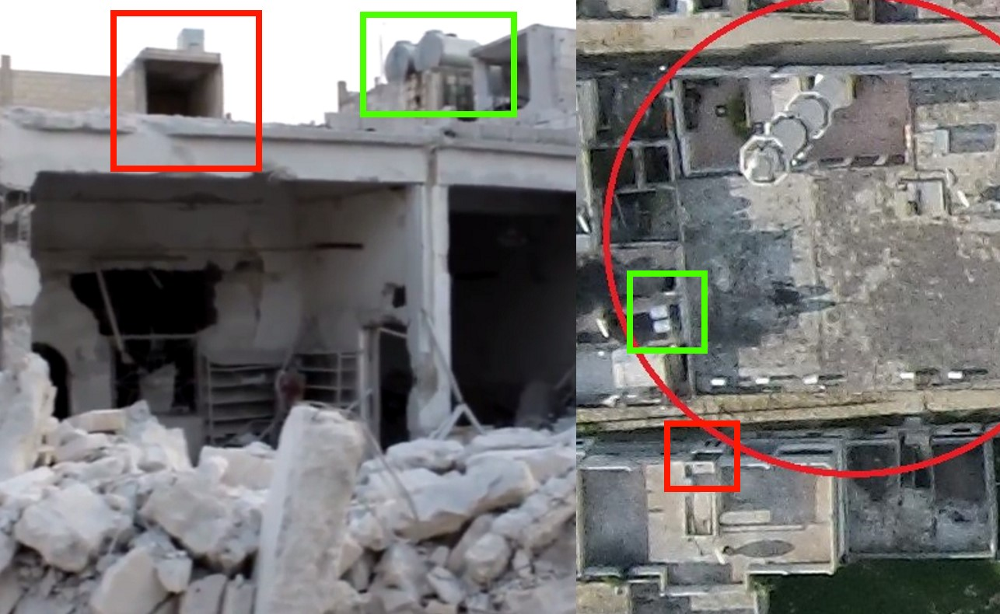

In the below image from an [Orient News video](https://www.youtube.com/watch?v=BnHnv7O3SHw&feature=youtu.be&list=PLPC0Udeof3T5HMvmHc8EbKK4gwXzJqp94&t=109) filmed on the east side of the mosque, facing south, the blue/white garage door is visible, along with the two pairs of windows next to it

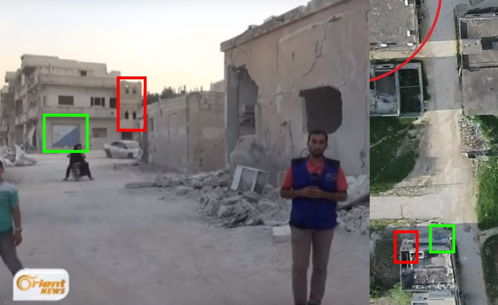

The remains of the top of the minaret are also visible in the rubble in the courtyard area, on the north side of the mosque

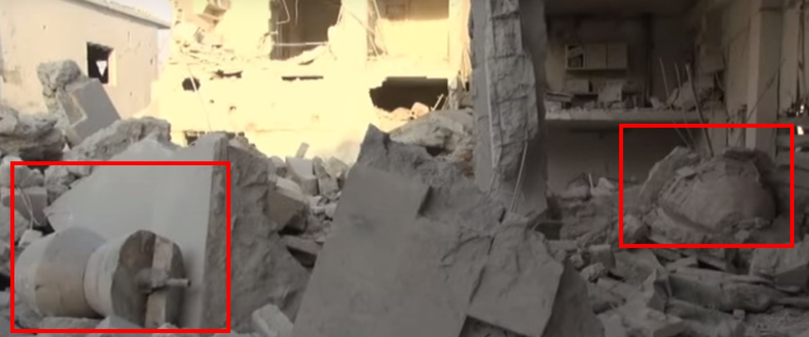

Another angle of the same area shows part of the six-sided minaret in the rubble

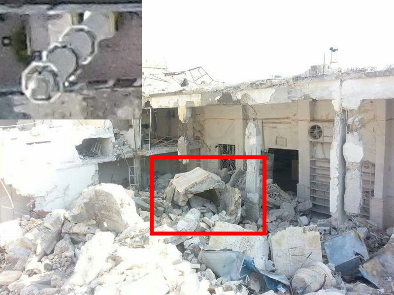

Prior to October 1st there are a few images showing the minaret still standing, the closest to October 1st being an[August 11th video](https://www.youtube.com/watch?v=tGx0RJSwu3c) showing a view over the town where the minaret is visible in the far distance (marked in red below, with thanks to the [Conflict Intelligence Team](https://twitter.com/CITeam_en))

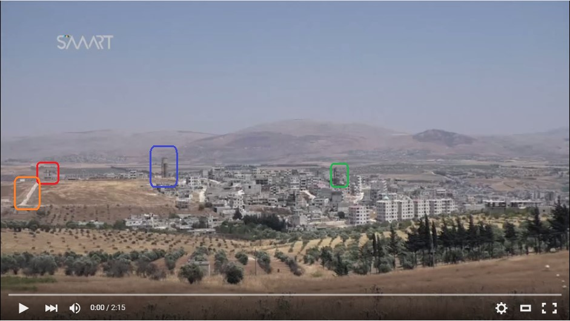

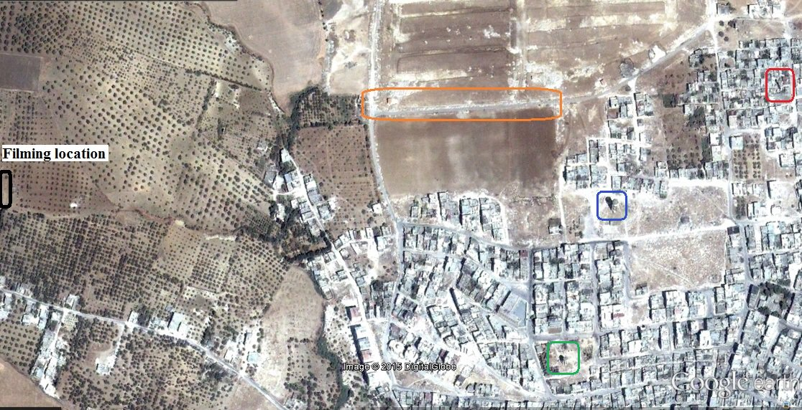

Many more matches are visible in the various [photographs](https://www.facebook.com/jisralshughour9/photos_stream) and[videos](https://www.youtube.com/watch?v=MnCaTJITERI&index=1&list=PLPC0Udeof3T5HMvmHc8EbKK4gwXzJqp94) posted online by local groups, clearly indicating that the mosque bombed on October 1st 2015 in Jisr al-Shughur was the Omar Bin Al Khattab Mosque located in the north of the town, not the "Al Farooq Omar Bin Al Khattab Mosque" in the west of the town, mentioned by the Russian Ministry of Defence. The locations of the two mosques are shown in the below image

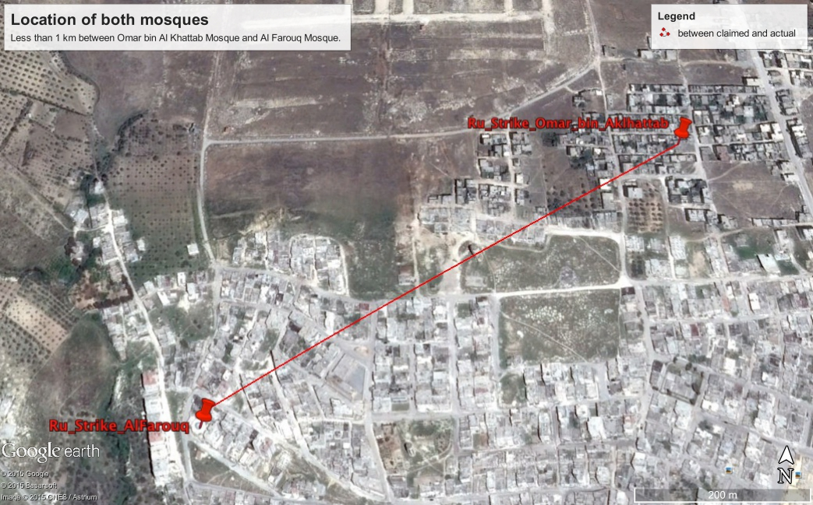

It is also noteworthy that on the Russian Ministry of Defence [aerial image](http://eng.mil.ru/images/2015-10-29_mosque-EN.jpg) the location of Omar Bin Al Khattab Mosque is covered by the text box at the top of the image.

.jpg)

Since Bellingcat contacted local activists a statement has been posted by them on[their Facebook page](https://www.facebook.com/jisralshughour9/?fref=photo)[,](https://www.facebook.com/jisralshughour9/?fref=photo) including the images provided to Bellingcat, and reconfirming the names of the mosques, that only the Omar Bin Al Khattab Mosque was bombed, and repeating their allegation it was Russian aircraft that bombed the mosque.

Based on the above analysis it is clear claims made by the Russian Ministry of Defence on October 30th are untrue. What it is not possible to establish is if this was a result of poor intelligence, or a deliberate act of deception.

***Written by Eliot Higgins with contributions from the Bellingcat Investigation Team and the [Conflict Intelligence Team](https://twitter.com/CITeam_en).***
