*Location: IDLIB : Marret Numan*\
*Hospital: The national hospital of Marret Numan*\
*Beneficiaries: \~500,000 people*\
*Date: 2 April 2017*\
*Time: 07:30 pm \~ 08:30 pm*\
*Attacks: Three airstrikes*\
*Reported casualties: None reported*\
*Reported injured: Medical patients*\
*Munitions identified: Not available*\
*Potentially responsible: Russian or Syrian air force*

The first hospital attack identified took place on 2 April 2017. One of the [first videos](https://www.facebook.com/100009011485480/videos/vb.100009011485480/1736175996692766/?type=2&theater)about this incident (source: Abu Ali al Marawy) was published on Facebook 21:13 Damascus time.

The video shows the first moment of the attack on the hospital from a far view. In the video they mention an aircraft firing a rocket in Marret Numan.

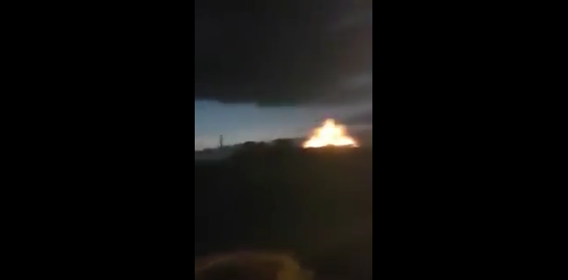

[Shaam News published a video](https://www.youtube.com/watch?v=zJ1u05D0AAI) on their YouTube channel showing the destruction inside the hospital. See still below:

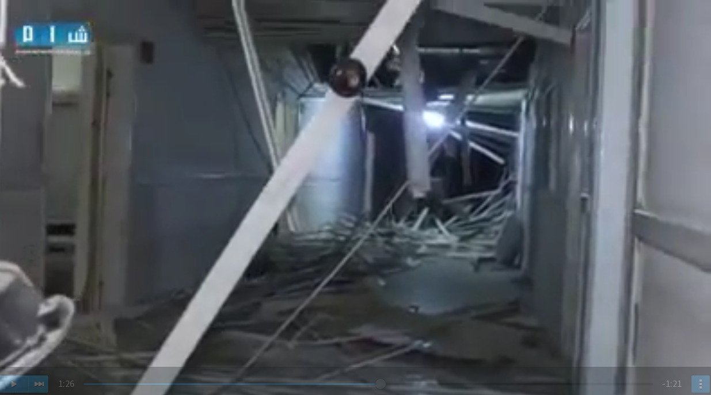

Muaz Al Shami, a citizen journalist, also published a [video on his YouTube channel](https://www.youtube.com/watch?v=lq8vN5ZPX8c) showing destruction inside the hospital, as well as destruction of the ambulance car parked outside of the facility. See still below:

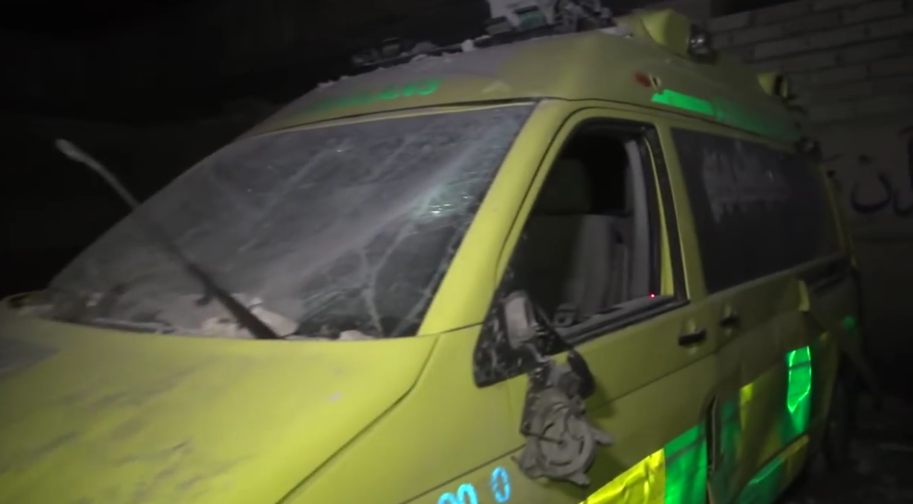

Qasioun News agency also published a [video on their YouTube channel](https://www.youtube.com/watch?v=Qyv8TBn3AMk)showing the damaged roof. From the video still below, it is apparent that two roofs were damaged from two different floors.

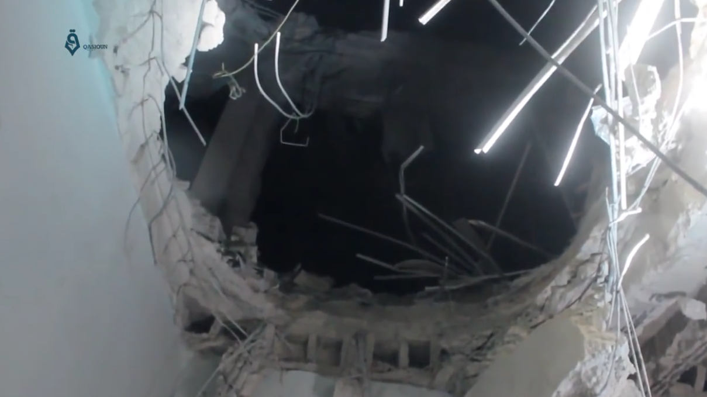

A separate [video published by Qasioun News agency shows the damaged roof from above in the daylight.](https://www.youtube.com/watch?v=wJKHZAcTvKE)

Marret Numan Network, a group of citizen journalists, [published a video](https://www.youtube.com/watch?v=e5N5tBOOE9c) on their YouTube channel showing the destruction of the exterior and interior of the building and clear damage of the roof as a result of it being targeted with an airtsrike.

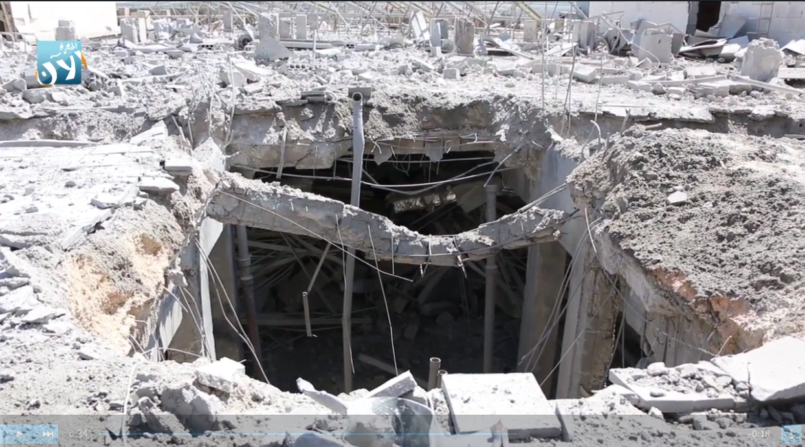

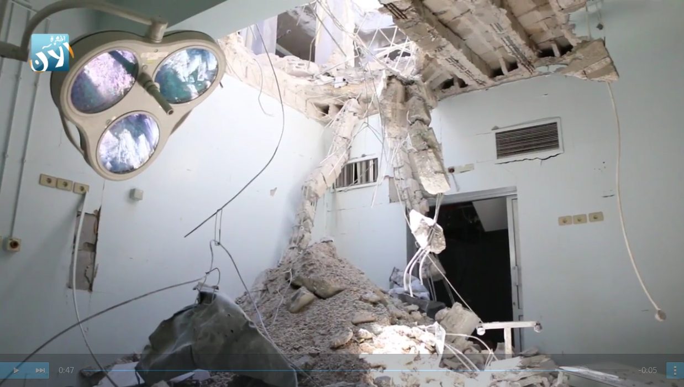

The [Idlib health directorate conducted video interviews](https://www.youtube.com/watch?v=iSAP3nj_X8Q) with doctors from Marret Numan hospital, which they published online as well. One of the doctors said: "This airstrike is not like any airstrike and Marret hospital is not like any hospital. It's a huge hospital. It was serving a big area from north countryside of Hama into the southern countryside of Idlib which has a population of 1,500 000 people."

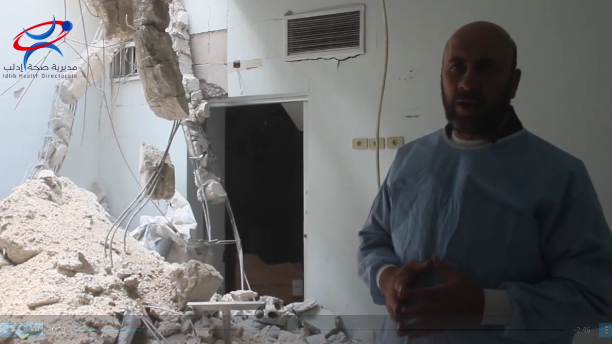

Later in the video at 1:48, a doctor states: "The hospital receives 30.000 patients per month. It does more than 1000 surgeries monthly. This hospital will not get back to be working any time soon. This is a clear message that the regime wants to kill any kind of life in our liberated areas."

In one interview [published in a video](https://www.youtube.com/watch?v=LBGfAG-Ob-Q)by the journalist "Hadi Al Abdallah" who spoke with Dr. Abdul Hadi Haidar who works at the national hospital in Marret Numan. Dr Haidar said: "All those injured and the patients were very scared after the hospital attacks. I didn't know what to do. Should I look after the patients? Or the children? Or myself? We still have infants in incubators inside. The hospital was attacked with three airstrikes which happened at the same time, 10 minutes after each strike."

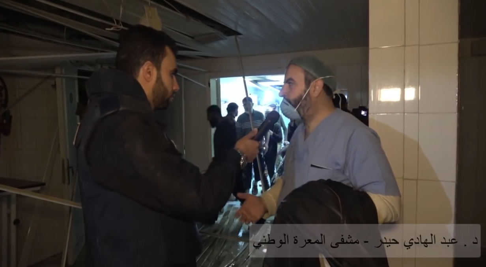

[Orient news published a video](https://www.youtube.com/watch?v=sx-eBZKNh6I) about the attack showing the outside view of the hospital building during the day. This vantage point was used to geolocate the hospital's building (see below). Satellite image was acquired through Google Earth Pro.

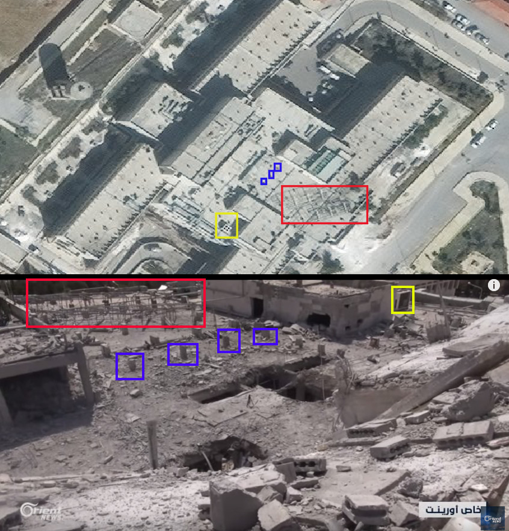

The journalist also conducted an interview with one of the hospital workers. See still below:

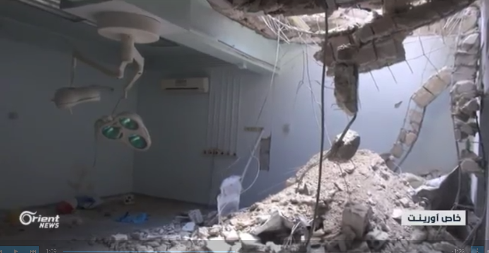

In the interview, the hospital worker said: "Yesterday at 19:20 we were transferring a patient into the surgery room when we heard the first bombing, so we all went to the basement floor. The women, children and infants departments were full and there were injuries among them as a result of this attack."

To provide a further layer of verification, the Syrian Archive cross-referenced findings from the videos with flight observation data from a spotter organisation. This process necessitated analysing observation data for flights between 18:00 and 20:00, the period directly before and after the reported attack. See below:

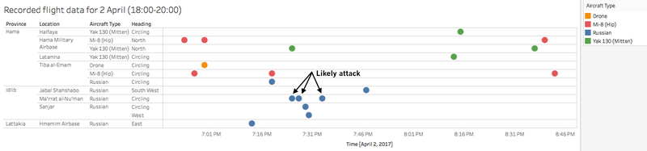

Through comparing where flights were observed, the time they were observed, and the direction flights were heading, and comparing this data to geolocation conducted in earlier steps, the Syrian Archive was able to identify a potential flight seen circling in the immediate vicinity of geolocated attack site. Previous research has found that circling flights typically indicate target acquisition and/or preparation for imminent attack.

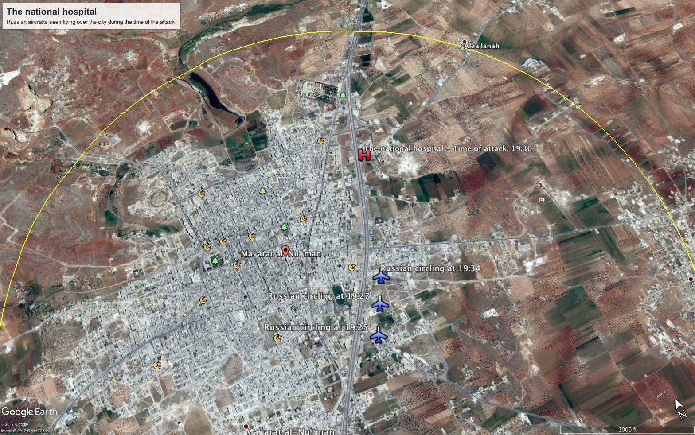

The map above demonstrates that the medical facility attacked was well within range of the aircraft detected.

Witness statements of the attack was provided jointly by Syrians for Truth and Justice and by Justice for Life. Dr. Mohamed Osman, who was in the central Maarat al-Numan Hospital at the moment of the attack, affirmed to the investigative team that on 2 April 2017 at about 20:30, a military aircraft believed to be Russian, launched three airstrikes on the hospital using six thermobaric bombs. The bombs targeted both the upstairs directly as well as the main yard of the hospital. The structural damage to the hospital from the attack was so significant that it caused the hospital to be out of service. Dr. Osman confirmed in his statement:

***"The shelling caused heavy physical damage to the building, the medical equipment and the hospital ambulance. The surgery department was the most damaged as one of the rockets fell in the middle of the operating room."***

Ibrahim al-Qasim, the anesthetist present at the hospital at the time of the attack, stated that warplanes targeted the hospital with three airstrikes, while it was crowded with doctors and patients. This caused dozens of injuries and considerable material damage to the hospital. He stated in his statement:

***"A rocket hit the operating room and another one destroyed the intensive care room completely, so we immediately transferred as much wounded as possible to the basement, but the material damage was very extensive."***

Al-Qasim emphasized that Ma'arat al-Nu'man hospital is one of the largest medical facilities located in areas controlled by the Syrian armed opposition. As such, most hospitals and medical centers in the vicinity dispatch patients to Maarat al-Nu'man hospital, given that has the capacity to support many medical specialties and surgeries, including a cardiology and surgery department. Al-Qasim mentioned that at the beginning of the conflict the hospital served a densely populated area, including Ma\`arat Al-Nu'man and its outskirts, with a total of about 500,000 people benefiting from its services.

Furthermore, Ubada Al-Thekraa, the director of the Civil Defense in Maarat Al-Numan, explained to this report's investigative team that when Russian warplanes launched the first raid on this particular hospital, Civil Defense members rushed to it, and while they were there, they were shocked by two other raids that caused the electricity to be cut from the hospital. Al-Thekraa added:

***"There were infants injured who were in the incubator department; some of them were transferred to hospitals outside Maarat Numan. I remember well that the destruction percentage was over 60."***
