*Location: IDLIB : Khan Shaykhoun\
Hospital: The medical point of Khan Shaykoun (Al Rahmeh)\
Beneficiaries: \~5,000 people\
Date: 4 April 2017\
Time: \~11:00, 4.5 hours after the chemical attack\
Attacks: Nine airstrikes based on witness statements\
Reported casualties: not available\
Reported injured: Medical staff and patients\
Munitions identified: S-5M Rocket\
Potentially responsible: Syrian or Russian air force*

The second hospital attack took place on 4 April 2017 in Khan Shaykhoun. The bombing occurred approximately 4.5 hours after the widely reported [chemical attack targeting Khan Shaykoun](https://www.bellingcat.com/news/mena/2017/04/05/khan-sheikhoun-chemical-attack-evidence-far/).

The Organisation for the Prohibition of Chemical Weapons [published a report](https://www.opcw.org/news/article/opcw-fact-finding-mission-confirms-use-of-chemical-weapons-in-khan-shaykhun-on-4-april-2017/) about this on 30 June 2017, confirming the use of chemical weapons in Khan Shaykhoun.

Many of the civilians injured as a result of the chemical attack had been transferred to this medical point for treatment, as documented in [a video published by Smart News Agency](https://www.youtube.com/watch?v=4b7byi5ZhbQ). See still from the video provided below:

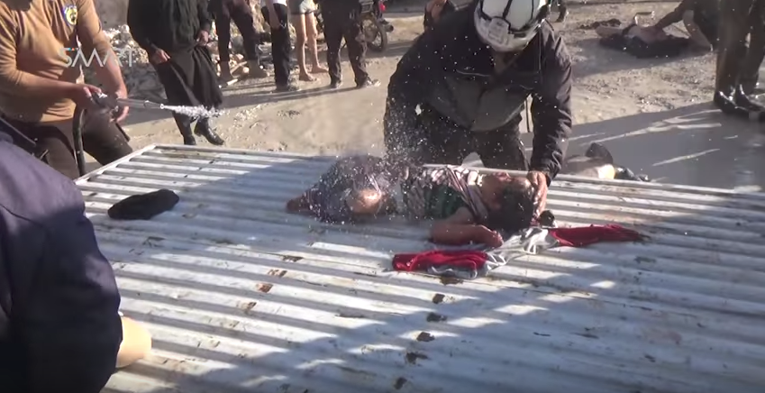

The initial moment of airstrikes against the Khan Shaykhoun medical point and the Civil Defense center were captured by[reporter Muaz Al Shami published a video](https://www.youtube.com/watch?v=UPlsAKe8-MA). See below:

https://giphy.com/gifs/Pn2hAFSoLSaYg?utm\_source=iframe&utm\_medium=embed&utm\_campaign=Embeds&utm\_term=https%3A%2F%2Fsyrianarchive.org%2Fp%2Fpage%2Fmedical-facilities-under-fire-syria-incident-2%2F

Muaz Al Shami then walks outside of medical point to document the smoke resulting from the airstrike. See below:

https://giphy.com/gifs/WuCcIdthSxnI4?utm\_source=iframe&utm\_medium=embed&utm\_campaign=Embeds&utm\_term=https%3A%2F%2Fsyrianarchive.org%2Fp%2Fpage%2Fmedical-facilities-under-fire-syria-incident-2%2F

Another reporter who was at the targeted site, Hadi Alabdallah, also [published a video](https://www.youtube.com/watch?v=4yLmSJ_X6tk) showing destruction inside and outside the medical point. See below:

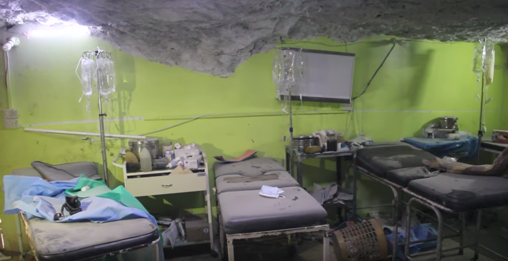

In the video, Hadi Alabdallah states: "This site was targeted by five airstrikes which resulted in huge damage to the building as well as to the Civil Defense ambulance car and truck. The Civil Defense center and medical point are out of service completely. The air force is still flying around us."

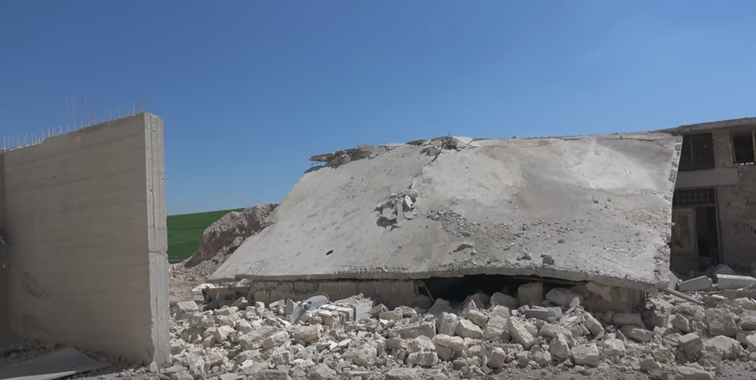

Aleppo Media Center (AMC) also [published a video](https://www.youtube.com/watch?v=5mZa0S94eXU) (The video is removed from YouTube but [archived](https://syrianarchive.org/en/database?location=%D8%A7%D8%AF%D9%84%D8%A8%20:%20%D8%AE%D8%A7%D9%86%20%D8%B4%D9%8A%D8%AE%D9%88%D9%86&term=%20warplaens%20targeting%20a%20hospital%20in%20Khan%20Shaykhun&unit=238a3c4e)with the Syrian Archive) featuring the first moments of the attack. Their video documents inside the medical point where children's voices are clearly heard in the background.

A separate [video published](https://www.youtube.com/watch?v=xtDy8xoRuSc)by AMC (The video is removed from YouTube but [archived](https://syrianarchive.org/en/database?location=%D8%A7%D8%AF%D9%84%D8%A8%20:%20%D8%AE%D8%A7%D9%86%20%D8%B4%D9%8A%D8%AE%D9%88%D9%86&after=2017-04-02&before=2017-04-05&term=the%20warplaens%20targeting%20a%20hospital%20in%20Khan%20Shaykhun&unit=657c9b61) with the Syrian Archive) includes an interview with one of the workers at the hospital. In the video, the hospital worker explains: "The hospital received hundreds of injured people as a result of the chemical attack. This included women and children. The Russian and Syrian air force attack targeted the medical point with 15 airstrikes which damaged the medical point very badly, and it's out of service now." Damage to the interior of the hospital is shown in a still from the video below:\_\
\_

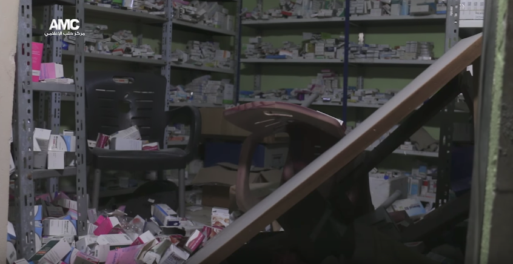

Reporter Yamaan Khatib also [published a video on his Twitter account](https://twitter.com/yamaankh_kh/status/849239505743872000) which shows the first moments of the airstrikes targeting the medical point providing services to many people injured in the Khan Shaykhoun chemical attacks. See below:

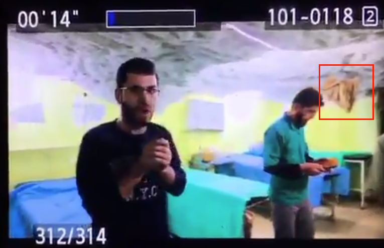

[AFP published a separate video](https://www.youtube.com/watch?v=98gL17wz3o8) from inside the same medical point, which allowed the Syrian Archive to cross-reference and verify that the reporter Yamaan Khatib was inside the same facility when it was attacked. See below:

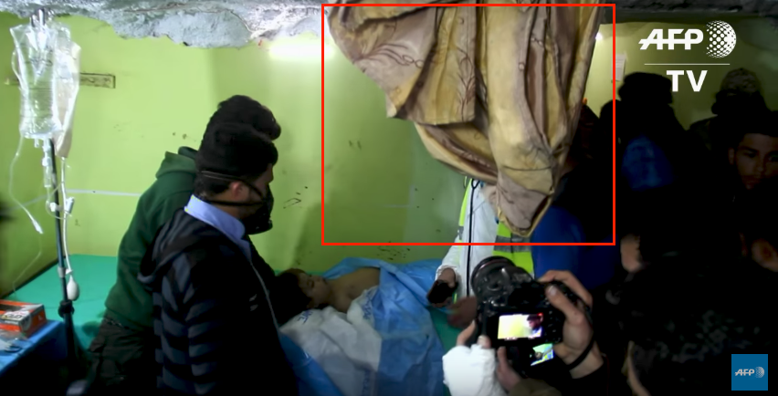

The Civil Defense Center in Idlib [published a video](https://www.youtube.com/watch?v=lIG0fOnOlyI)on their YouTube channel showing the damaged building after the attack. In the video, one of their volunteers confirms that the medical point was rendered out of service as a result of the attack.

A still from a [video published](https://www.youtube.com/watch?v=e5tjfi4cdf4)by Baladi News (The video is removed from YouTube but [archived](https://syrianarchive.org/en/database?location=%D8%A7%D8%AF%D9%84%D8%A8%20:%20%D8%AE%D8%A7%D9%86%20%D8%B4%D9%8A%D8%AE%D9%88%D9%86&after=2017-04-02&before=2017-04-05&term=the%20warplaens%20targeting%20a%20hospital%20in%20Khan%20Shaykhun&unit=24358768)with the Syrian Archive), provided below, shows the destruction of the medical point building:

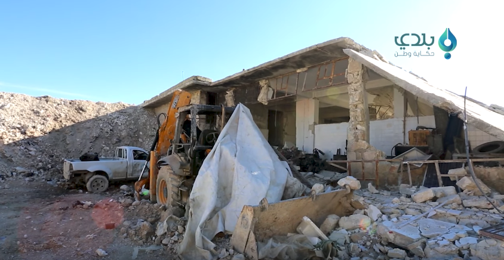

Two videos were published by the Syrian Network for Human Rights, the first taken from inside the medical point building and the second taken from outside the medical point building. [The first video shows](https://www.youtube.com/watch?v=-3PHLF3VLx4) people trying to leave the building, struggling with being stuck inside.

A [second video](https://www.youtube.com/watch?v=wuizYFSCzs0) by the Syrian Network for Human Rights shows the outside of the medical point and damage to the western side of the building. At 0:04, the person recording states: "4 April 2017 Khan Shaykoun is attacked with four airstrikes (one after the other), after the chemical massacre." While the recorder was capturing the video, a fifth airstrike occurred. Upon commencement of this new airstrike, the recorder confirms, "This is the fifth airstrike on Khan Shaykhun."

Smart News Agency published [a video clearly documenting the outside area](https://www.youtube.com/watch?v=o7-cZts25Ck) of the medical point and the Civil Defense Center. See still below:

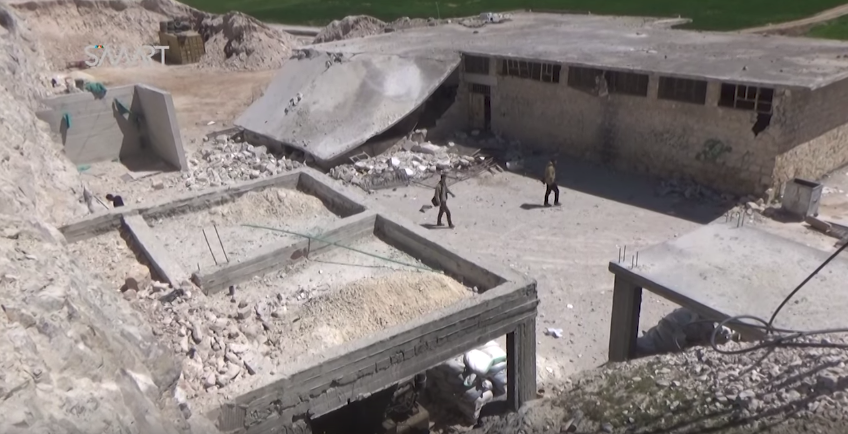

Using stills from the videos above and Google Earth, the Syrian Archive was able to geolocate the attacked site. See below:

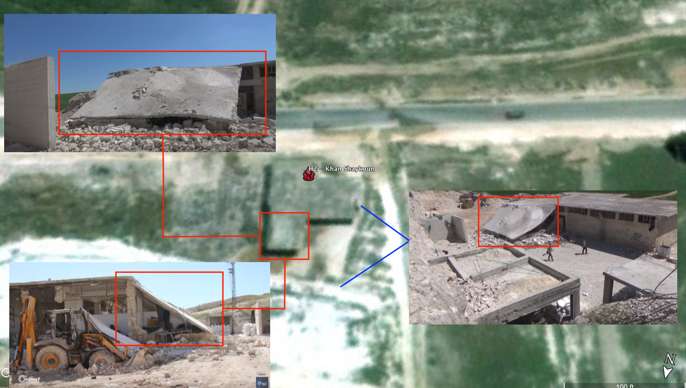

Additional satellite imagery was obtained through \[DigitalGlobe ©2017\], from which further geolocation was possible. See below:

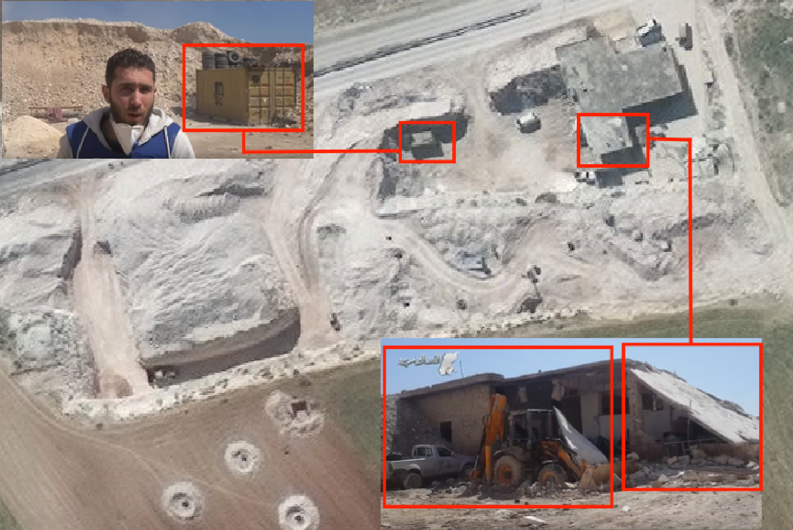

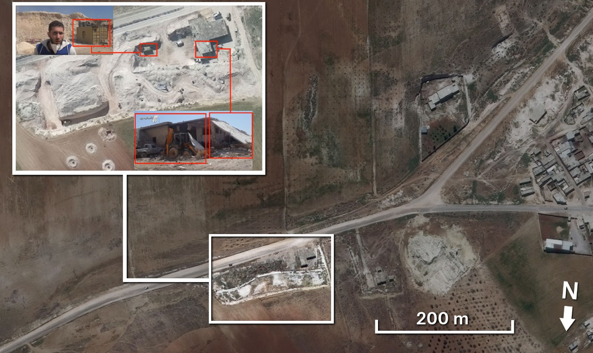

The location of the medical point, verified through geolocation by Bellingcat and the Syrian Archive, is very close to the reported location of the chemical attack that occurred in [Khan Shaykhoun on 4th April early morning](https://www.opcw.org/news/article/opcw-fact-finding-mission-confirms-use-of-chemical-weapons-in-khan-shaykhun-on-4-april-2017/). Geolocation of the medical point building, as well as of the smoke that resulted from the airstrikes, if provided below:

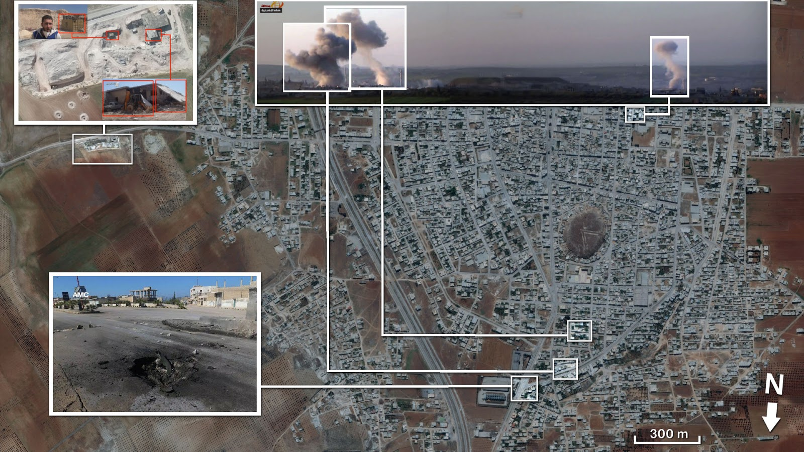

Remnants of the weapon used in the attack on the hospital were [documented in a video published](https://www.youtube.com/watch?v=KutpAEKdZio) by Orient News and in [another video published](https://www.youtube.com/watch?v=YUA_eGxcgnw) by Dorar Al Shamyah. See below:

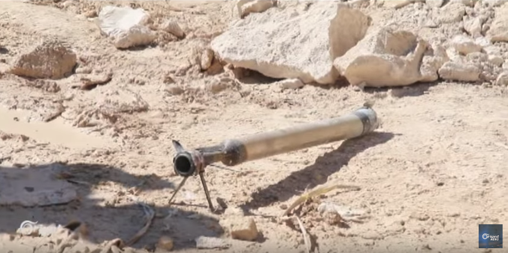

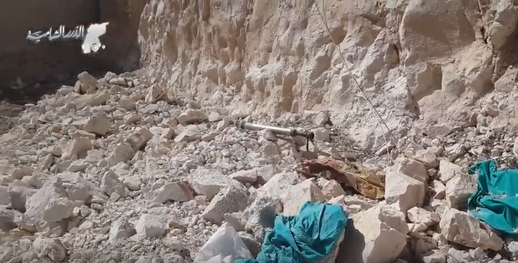

The photos above indicate that [S-5M rocket](https://en.wikipedia.org/wiki/S-5_rocket)s (developed by the Soviet Air Force and used by military aircraft against ground area targets) were used in this attack. See reference images of S-5M rockets for comparison:

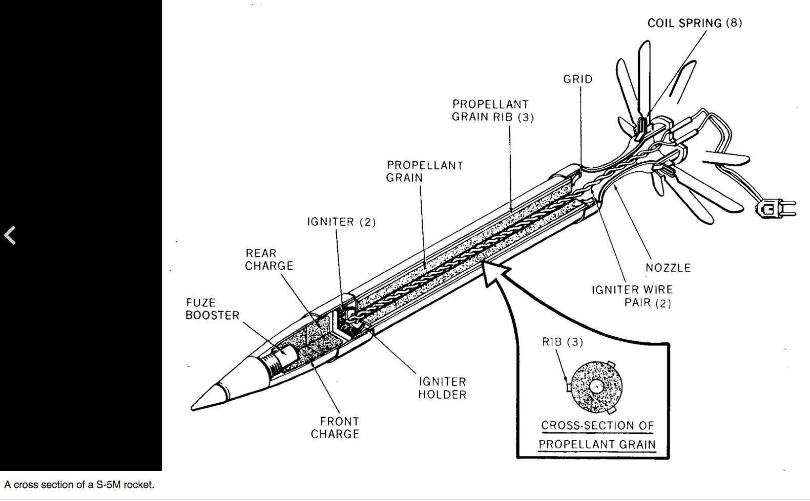

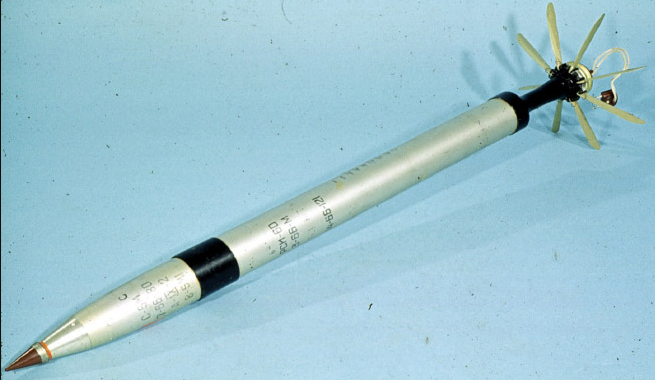

Smart News Agency [published a video showing the crater](https://www.youtube.com/watch?v=o7-cZts25Ck) of one of the rockets, as shown below:

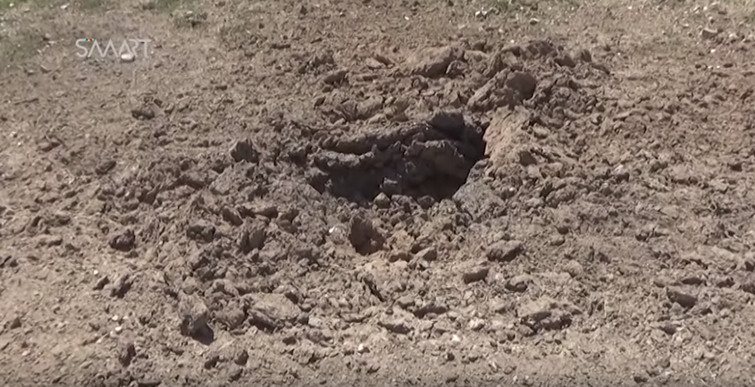

[A statement about the attack](https://www.facebook.com/Idleb.Health.Directorate/posts/964387723664583:0) has been published by the Syrian Civil Defense, as well as by the Idlib Health Directorate on their public Facebook pages.

The Syrian Archive compared two satellite images from\*\* \[DigitalGlobe ©2017\]\[\*\* \][39](https://www.terraserver.com/)- one taken on 21 February 2017 before the 4 April 2017 attack, and one taken on 2 June 2017 after the attack. The building damage highlighted in white below to the front side and the east side of the building can be clearly identified.

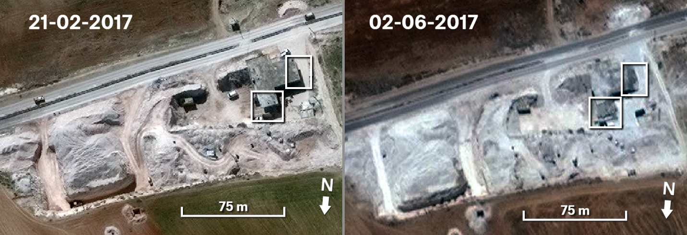

To provide a further layer of verification, the Syrian Archive analysed flight observation data provided by a spotter organisation. This consisted of analysing observation data of flights between 09:00 and 14:00, the period directly before and after the reported attack. See below:

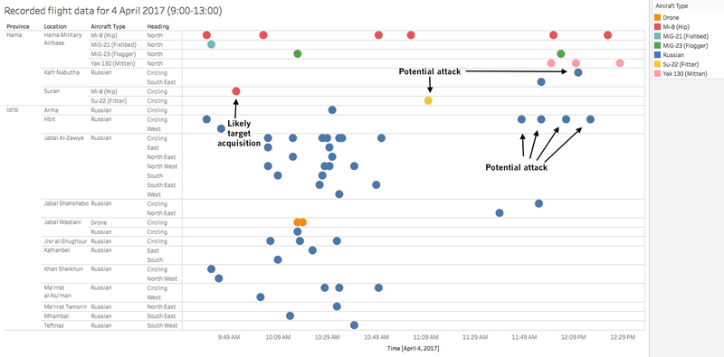

Through comparing where flights were observed, the time they were observed, and the direction flights were heading, and comparing this data to geolocation conducted in earlier steps, the Syrian Archive was able to identify a potential flight seen circling very close to the geolocated attack site.

The report's source for flight observation data has found that circling flights typically indicate target acquisition and/or preparation for imminent attack. In this case, the Mi-8 helicopter flight observed near the attack site around 10:00 has been determined to likely be acquiring the target for the later attack. Due to the larger number of flights found circling around the attack site around 12:00, identifying the specific plane responsible for the attack was unable to be conducted for this incident.

However, the presence of a large number of Syrian or Russian aircraft in the immediate vicinity to the attack site confirms that an incident may have occurred at this time and location. As with the previous incident, though some aircraft are labelled "Russian," it is possible the flight was operated by the Syrian air force, rather than the Russian air force, as the Syrian air force also used Russian planes.

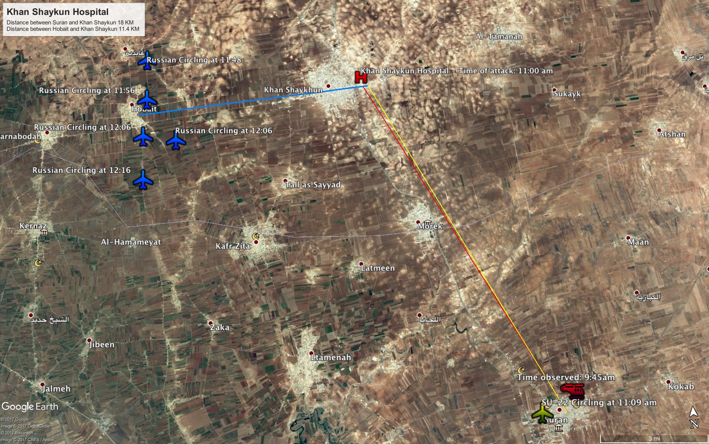

The map above demonstrates that the medical facility attacked was well within range of the aircraft detected. The Mi-8 observed and determined to likely be acquiring the target, as well as the drone observed and potentially involved in the attack, were detected circling 18km from the attack site. The four Russian aircraft observed and determined to potentially be involved in the attack were detected circling 11.4 km from the attack site.

Witness statements of the attack was provided jointly by Syrians for Truth and Justice and by Justice for Life. The Managing Director of Al-Rahma hospital in[Khan Sheikhoun](https://www.google.com.tr/maps/place/Khan+Shaykhun,+Syria/@35.4408521,36.6297784,4961m/data=!3m2!1e3!4b1!4m5!3m4!1s0x15248ae0edc9cad3:0xc9176383cb24f9c0!8m2!3d35.4403783!4d36.65721?hl=en) located in the[Idlib](https://www.google.com.tr/maps/place/Idlib+Governorate,+Syria/@35.8028553,36.1104838,158030m/data=!3m2!1e3!4b1!4m5!3m4!1s0x152500e6cc6ed27b:0xe59a7e2f651fc24c!8m2!3d35.8268798!4d36.6957216?hl=en) countryside, who did not disclose his name for security purposes, said in his statement to the investigative team that only two hours after targeting the city with chemical weapons on 4 April 2017, Russian warplanes launched nine air raids that lasted for an hour. They targeted the southern area of Khan Sheikhoun, where the Civil Defense Centre and Al-Rahma hospital exist, and caused significant material damage to the hospital such that it was rendered inoperable. He added:

***"At about 11:00 am, I was inside the hospital working on reports of the chemical attack on the city just two hours ago. We were shocked by sustained raids which focused on the hospital yard and its main gate, in addition to the drug store which was devastated. Moreover, the shelling caused the disruption of the electricity generators and consequently, power was cut off from the hospital."***

In another statement, the field coordinator of the hospital, who also declined to disclose his name for security purposes, confirmed that Russian warplanes targeted the Al-Rahma hospital alongside other medical facilities near Khan Sheikhoun, especially those that had received large numbers of patients injured by the previous chemical attacks. He added:

***"As soon as we heard the roar of the warplanes, I rushed inside with some visitors, and then the warplanes began to target the area and hit the hospital. Although the hospital was established in an underground cave, the rockets were able to penetrate it and caused considerable damage to the medical equipment."***

In a related context, Anas Diyab, a member of the Civil Defense in Khan Sheikhoun, who contributed in transferring the injured from the hospital after bombarding it by more than five airstrikes, spoke to the report's investigative team, stating:

***"Al-Rahma Hospital, also known as the Cave Hospital, is considered the only surgical hospital in the town and provides services to Khan Sheikhoun people and the surrounding villages as well. However, Russian warplanes targeted the hospital and the Civil Defense Center, aiming to cause a humanitarian catastrophe, and denying access to treat those whom were affected by the chemical attack - thus killing as many people as possible."***
