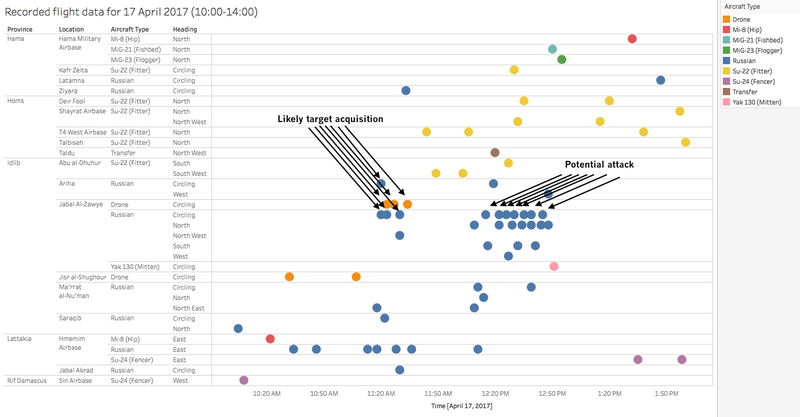

*Location: IDLIB : Shanan\
Hospital: Shanan Hospital\
Date: 17 April 2017\
Time: 12:25\
Attacks: Three airstrikes\
Reported casualties: not available\
Reported injured: 5\
Beneficiary number: \~60.000\
Reported injured: One injured from the Civil Defense team, and five between medical staff who were working in the hospital and patients who were being treated in the hospital.\
Weapon used: Not available\
Alleged perpetrator: Syrian or Russian air force*

The fourth attack identified targeted Shanan hospital for women and children. It took place on 17 April 2017. [The Syrian Archive verified a video showing](https://www.youtube.com/watch?v=AlLyo9V7xFo) the first moment of the airstrike that targeted the hospital. See a still from the video below:

The Civil Defense Center [published a video showing the attacked hospital](https://syrianarchive.org/en/database?location=%D8%A7%D8%AF%D9%84%D8%A8%20:%20%D8%B4%D9%86%D8%A7%D9%86&term=Targeting%20the%20Children%20Hospital%20with%204%20airstrikes%20in%20Shinan&unit=030a2825), in which they claim was targeted with a double tap airstrike. This means that the hospital was attacked once with an airstrike, and followed shortly after by another airstrike after rescuers were at the scene.

In the video, a member of the Civil Defense states: "We were in the centre when the first airstrike happened in Sarjeh. We divided into two teams, one team went to rescue civilians in Sarjeh and the other team stayed in the center. After a bit, the second airstrike targeted Shanan hospital. We went to the Shanan hospital to rescue civilians and doctors. The third airstrike targeted us during our rescue mission in Shanan hospital, but we continued doing our work until the fourth airstrike targeted the hospital but all civilians and doctors were out of the building by then." Stills from the video are provided below:

In the same video at 01:06, a member of the Civil Defense states: "Today 17 April 2017, Shanan was targeted 3 airstrikes, there was 5 minutes between each attack. The first airstrike hit 5 meters close to the hospital which resulted of destruction in the hospital walls and windows. The Syrian Regime air force usually leave 3 to 4 minutes to do another airstrike to attack the people that are around the impact site. The Syrian Civil Defense was at the impact site during the airstrike but they were able to rescue civilians and hospital staff team."

An additional image, a still from the same video, showing one of the attack craters is provided below:

Step News Agency[published an additional video](https://www.youtube.com/watch?v=h31iOR3Obzg)on 17 April 2017 which shows an injured colleague of theirs as a result of attacks in Shanan.

Another [video published on Facebook by user محمد ابراهيم shows](https://www.facebook.com/100014964467177/videos/193890404453107/) the hospital after the attack. See below:

Idlib Health Directorate additionally [published a statement about the attack](https://www.facebook.com/Idleb.Health.Directorate/posts/976718972431458), in which the incident is described. A screenshot of the Facebook statement is provided below:

The Union of Medical Care and Relief Organizations (UOSSM) also published [a press release about the attack the following day, on 18 April 2017](http://myemail.constantcontact.com/PRESS-RELEASE.html?soid=1125761508982&aid=GWoTB_55w8Q).

Using stills from the Civil Defense video the Syrian Archive was able to create a panoramio image to get a better view of the impact site. See below:

By comparing the video with a satellite image acquired by **DigitalGlobe**, the Syrian Archive was able to geolocate the hospital, as shown below:

To provide a further layer of verification, the Syrian Archive analysed flight observation data provided by a spotter organisation. This consisted of analysing observation data of flights between 10:00 and 14:00, the period directly before and after the reported attack. See below:

Through comparing where flights were observed, the time they were observed, and the direction flights were heading, and comparing this data to geolocation conducted in earlier steps, the Syrian Archive was able to identify potential flights seen circling very close to the geolocated attack site.

Previous research has found that circling flights typically indicate target acquisition and/or preparation for imminent attack. In this case, the several flights by drones or by Russian aircraft were observed near the attack site around 11:20, which the Syrian Archive has determined were likely acquiring the target for the later attack.

Due to the large number of flights observed circling the attack site around 12:25, the time indicated by eyewitnesses as the time of the attack, knowing which of the aircraft was responsible for which of the three strikes is unable to be determined at this time. As with previous incidents, though some aircraft are labelled "Russian," it is possible the flight was operated by the Syrian air force, rather than the Russian air force, as the Syrian air force also used Russian planes.

The map above demonstrates that the medical facility attacked was well within range of the aircraft detected. The three drones observed and, as well as the ten Russian planes observed and determined to likely be acquiring the target or potentially involved in the attack were detected circling 9.16km from the attack site.

Witness statements of the attack were provided jointly by Syrians for Truth and Justice and by Justice for Life. Abdel Salam Al-Amin, the Managing director of al-Ikhlas hospital in Shanan village, said in his statement:

***"On April 17, 2017, at 12:25 pm Damascus time, the hospital was targeted by seven sustained Sukhoi SU-24 affiliated to the Syrian regime; it caused the hospital to be completely out of service, and injured three from medical staff and two visitors as well... The most important thing to mention is that during the attack, one of the doctors at the hospital was performing a caesarean operation and she had to take the patient, while her abdomen was still open, to a nearby house to complete the operation."***

Abdel Salam confirmed that the damage to the hospital was extensive. The operation and the incubator rooms were destroyed.
