*Location: IDLIB : Abadeen\
Hospital: The medical point of Abadeen\
Beneficiary number: \~6.000 people\
Date: 22 April 2017\
Time: First attack: 14:30; Second attack: 17:15\
Attacks: 2 air-to-ground attacks, 1 ground-to-ground attack\
Reported casualties: 4\
Reported injured: 2\
Munitions identified: Tochka series missile\
Alleged perpetrator: Russian or Syrian air force*

The fifth hospital attack identified occurred on 22 April 2017. This attack targeted Abadeen, also known as the cave hospital as it is located inside of a cave. The Civil Defense team [published a video](https://www.youtube.com/watch?v=Os8GoeOklv8) of going to the impact site after it was attacked. See below:

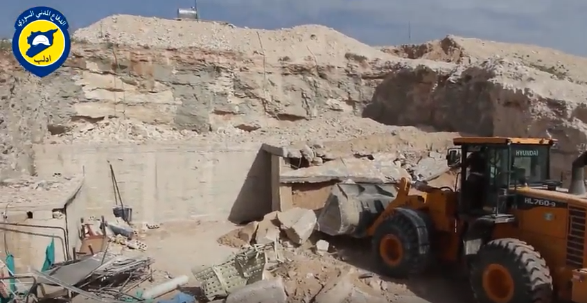

The video appears to show two bodies under rubble were recovered by the Civil Defense team. In the video, Civil Defense members mention one casualty under rubble who was a patient in the surgery room at the time of the attack.

Civil Defense members also mention three casualties, all from the same family, under rubble in another room of the hospital.

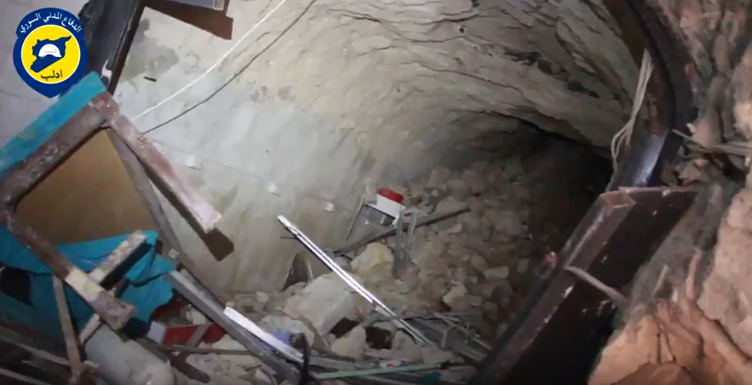

Baladi News Agency [published a video](https://www.youtube.com/watch?v=PWHQogaz3lQ) on their YouTube channel which shows the Civil Defense team removing rubble as a result of the attack.

Another [video published](https://www.youtube.com/watch?v=i6ZN2gtzhJY) (Video evidence is removed from youtube but archived with the Syrian Archive ) by user "[حسين الأدلبي](https://www.youtube.com/channel/UC2Wk09BgfP3gwBdmxnDvwPw)" who works in the media office of Ashayer shows the destruction as a result of the attack against Abadeen hospital. In the video, the person filming states: "The media office documents the location of Abadeen hospital that was targeted by the air force which resulted in more than 7 casualties and many injured. The Civil Defense team is removing the rubble to recover the bodies of casualties under it."

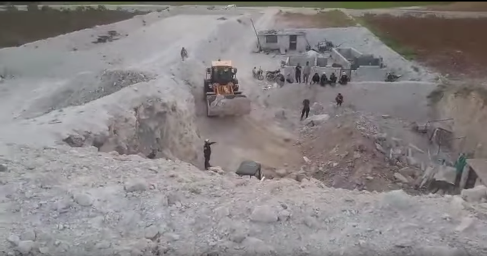

Stills from the video show that the hospital is located in a cave for protection purposes. See below:

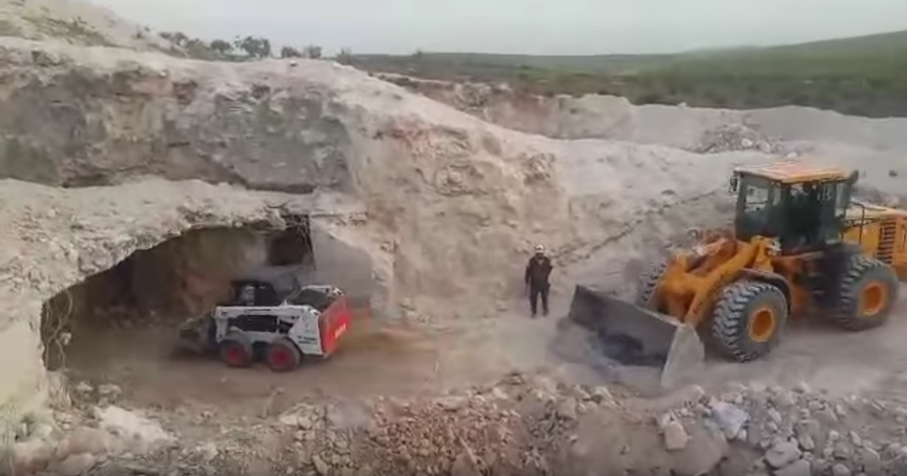

Dr Abdul Rahman Hala'a who is the manager of the coordination medical office of Al Shaam Association conducted [an interview with Smart News Agency](https://www.youtube.com/watch?v=kxMCDFdZmRQ) as well as with [Jiser news channel](https://www.youtube.com/watch?v=_EfbruA2Njo) after the attack.

In the interview, he stated: "On 22 April 2017 one of Hamah hospitals was attacked. We mostly believe that it's by the Russian air force, as we heard from observation offices through walkie talkies. The hospital is completely out of service as a result of the attack. The attack resulted in many casualties, as well as injuries among the patients and the hospital team. A seven-year-old child was also among the casualties. She just had had an operation in the hospital this morning. Other patients were transferred to other hospitals after the attack. The building damage is about 80%, as well as the equipment in the hospital. The rocket that attacked the cave went through 7 - 10 meters of rock. Most of our equipment was damaged as a result of this attack. The Civil Defence came after the attack to rescue those injured and to recover the bodies of casualties, but the hospital was attacked again with cluster bombs which killed a child who was standing in the area next to the attacked site."

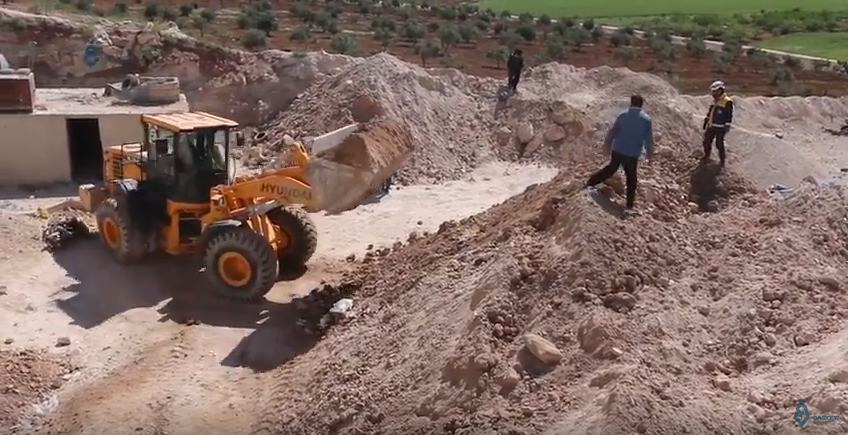

Qasioun News Agency [published a video](https://www.youtube.com/watch?v=JPcakuncvTk) about this attack mentioning three people still alive under rubble and one casualty as a result of the Russian airstrike that targeted the hospital.

Fayad Abu Rass, who is a photographer from Idlib, [published photos](https://www.facebook.com/fead.aboras/posts/1889319601289317) from the attacked site showing the destruction of the hospital.

The Syrian Archive was able to geolocate the attacked hospital using the above videos and photos and comparing them to satellite imagery from \[\*\*DigitalGlobe ©2017\]\*\*. See below:

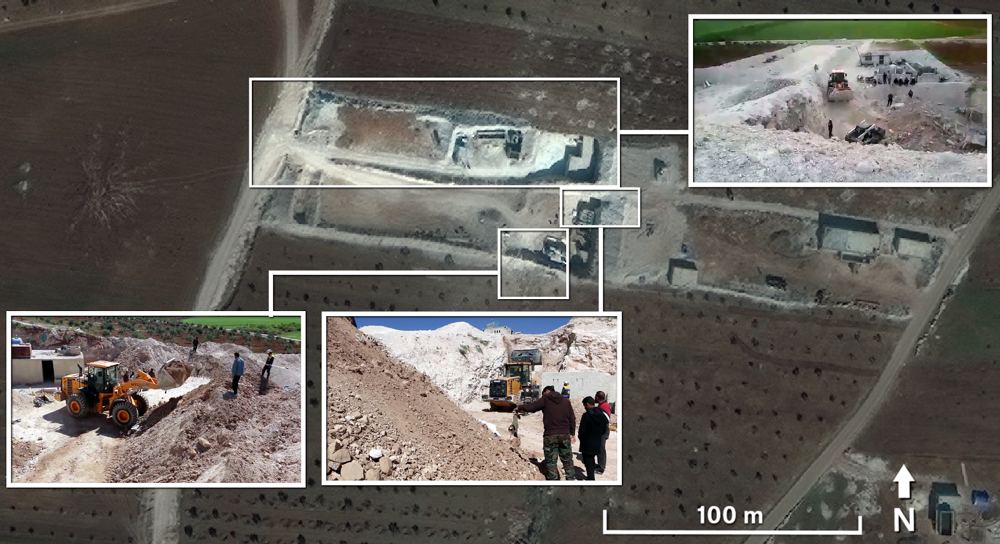

The use of cluster bombs in this attack was reported in a [video published](https://www.youtube.com/watch?v=QyAiYhzDflk)by the "All4 Syria" YouTube account, which shows the impact site from a different location.

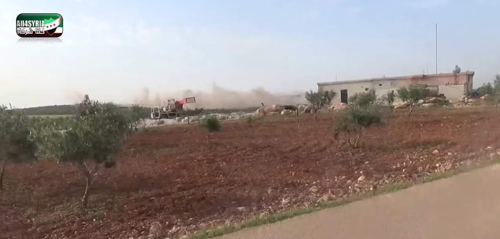

The above photo has been geolocated, and it is very likely that the impact site of the reported cluster munition is very near the attacked hospital as shown below:

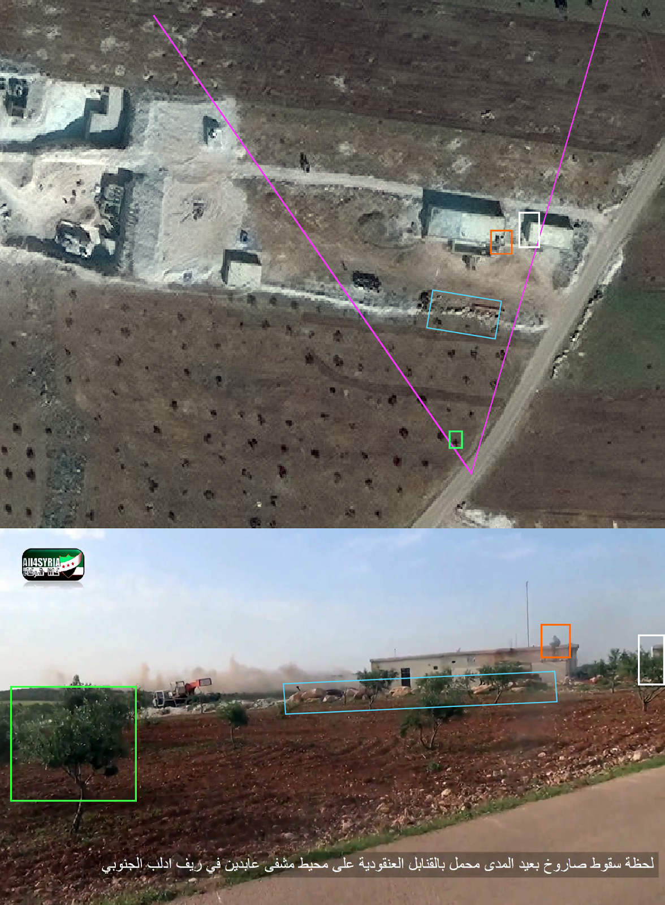

After the hospital attack in Abadeen, the Civil Defense team in Idlib[published the following photos](https://www.facebook.com/SyrianCivilDefenceIdlibWhiteHelmets/posts/1280770175355369) mentioning a cluster munitions attack that targeted an area near the attacked hospital while the Civil Defense team was rescuing injured and recovering casualties.

This attack resulted in one casualty and an injury for a man and his son. The injured child was getting treatment when the attack happened, as mentioned in the commentary for the photos below:

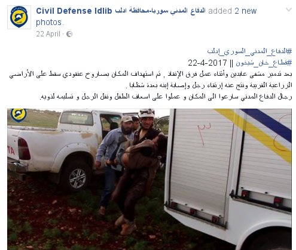

Remnants of the missile used to attack the area surrounding the Abadeen Hospital (the second attack after the initial targeting of the hospital as mentioned earlier) were documented[in a video](https://www.youtube.com/watch?v=aRet4s_ZiGQ) that was published by the YouTube channel of user "[Kaes Idlby](https://www.youtube.com/channel/UCy_Fbrq7EuUfwG3YRfyekEg)". See still from the video below:

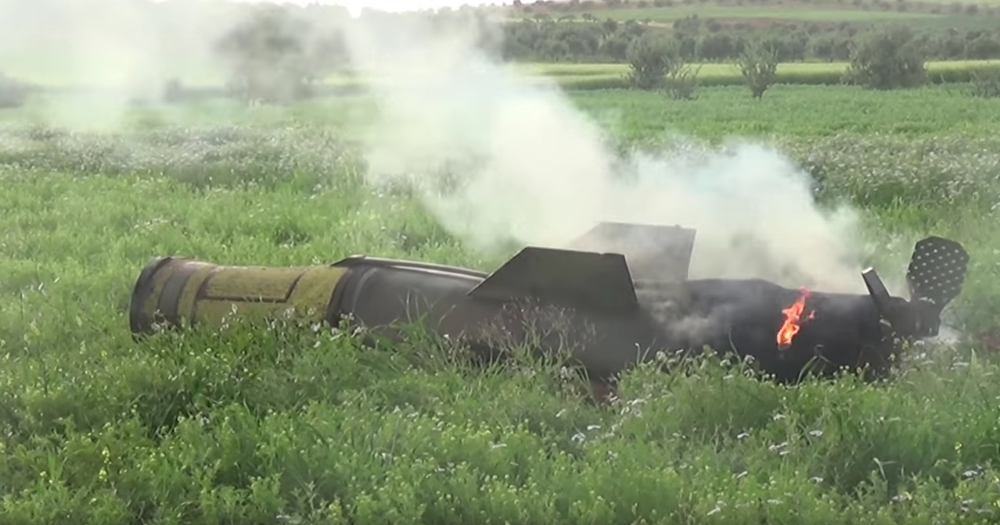

From the photo above, it has been determined that the missile pictured in the photo is a Russian made [Tochka series missile](https://de.wikipedia.org/wiki/SS-21_Scarab), as described[in a public](http://lostarmour.info/articles/tochki-nad-u/)website called lostarmour.info.

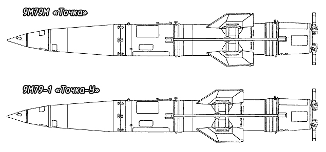

Below is the [effective range of Tochka](https://de.wikipedia.org/wiki/SS-21_Scarab).

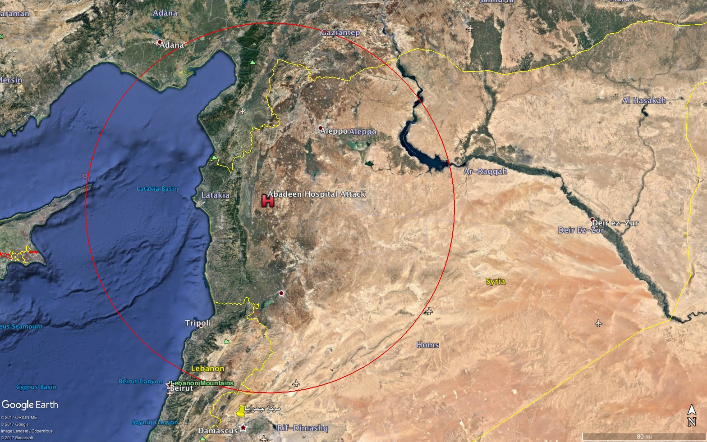

The Hama Health Directorate [published a report about the incident](https://www.facebook.com/Idleb.Health.Directorate/photos/a.648305141939511.1073741828.648124961957529/981613398608682/?type=3&theater) on their public Facebook page. The report stated: "On Saturday 22-04-2017, the Markazi hospital in Abadeen was targeted with a Russian airstrike resulting in 5 casualties from patients and civilians as well as 2 injured civilians and 2 injured from the medical team of the hospital. The attack resulted in getting the hospital out of service as well as destroying its equipments, laboratory, rooms and a van car."

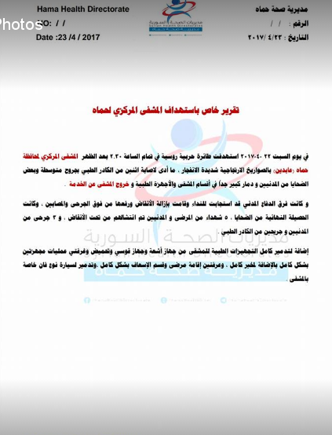

An additional [statement about this attack was published](http://reliefweb.int/sites/reliefweb.int/files/resources/Attacks%20on%20hospitals%20Press%20Statement%20EN_Clean.pdf) by the United Nations Office for the Coordination of Humanitarian Affairs.

Comparing two satellite images from \[\*\*DigitalGlobe ©2017\]\*\* before (21 February 2017) and after (19 May 2017) the attack (22 April 2017), the Syrian Archive was able to identify damage to the medical facility. See below:

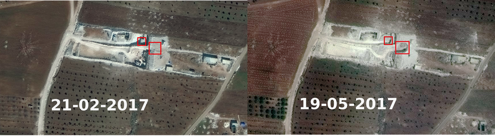

To provide a further layer of verification, the Syrian Archive analysed flight observation data provided by a spotter organisation. This consisted of analysing observation data of flights between 13:00 and 19:00, the period directly before and after the reported attack. See below:

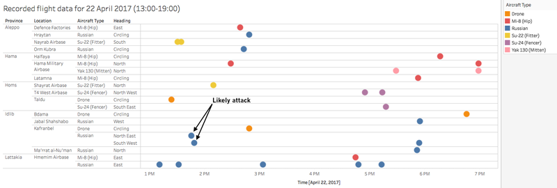

Through comparing where flights were observed, the time they were observed, and the direction flights were heading, and comparing this data to geolocation conducted in earlier steps, the Syrian Archive was able to identify potential flights seen circling very close to the geolocated attack site.

The report's source for flight observation data has found that circling flights typically indicate target acquisition and/or preparation for imminent attack. In this case, two flights by Russian aircraft were observed near the attack site around 13:20, which the Syrian Archive has determined to be likely responsible for the attack.

The map above demonstrates that the medical facility attacked was well within range of the aircraft detected. The Russian plane observed and determined to potentially be involved in the attack was detected circling 15.5km from the attack site.

The second attack, at around 17:15, was unlikely to be committed by a flight, as the munition identified in the attack was a Tochka series missile, a ballistic missile series which tend to be launched from the ground due to their size and weight (approximately 2,000kg). Tochka series missiles have a range of between 70-185 km, well within the range to be launched from the ground in regime held territory.

As with previous incidents, though some aircraft are labelled "Russian," it is possible the flight was operated by the Syrian air force, rather than the Russian air force, as the Syrian air force also used Russian planes.

Witness statements of the attack were provided jointly by Syrians for Truth and Justice and by Justice for Life. In his statement, Mustafa al-Mesri, the Managing Director of the Central Hospital in[Abdeen town](https://www.google.com.tr/maps/place/%D8%B9%D8%A7%D8%A8%D8%AF%D9%8A%D9%86%D8%8C+Syria%E2%80%AD/@35.4677825,36.5291547,2480m/data=!3m2!1e3!4b1!4m5!3m4!1s0x152460d91c48feb1:0x29d096efd4f03865!8m2!3d35.4680617!4d36.5364751?hl=en), informed the report's investigative team that the Central hospital - also known as the cave hospital because it is located inside a cave on the northern outskirts of Abdeen town - was bombed with two high explosive concussion rockets on 22 April 2017.

This caused an explosion inside the hospital that killed 3 civilians and injured a number of the medical personnel and the patients with serious injuries. In addition, it led the hospital to be completely out of service. Al-Mesri stated:

***"On April 22, 2017, at about 2:00 pm, the Russian warplanes targeted the hospital with two high explosive rockets: the first hit the operating room and the other targeted the patients ward, the laboratory, the emergency room and the radiation oncologists as well. As a result, four patients were killed; they were identified as Mohammed Abu Zayed, Iyad Saleh, his wife and his 8-year-old daughter."***

One of the Civil Defense members of Habit Center who declined to disclose his real name, said that the attack on the Central Hospital in Abdeen was possibly conducted using high explosive ground-to-ground missiles, which forced the Civil Defense team to do great efforts to rescue people who were trapped in the rubble. The Civil Defense member added:

***"At the exact moment of shelling the Central Hospital, we were in Al-Habit town warning people about the Russian's warplanes raids and at about 2:00 pm we heard a call through the observatories that we had to flee to Abdeen Central Hospital. Immediately we went to the hospital -- since we were the nearest Civil Defense center to Abdeen town- as soon as we arrived, we started to help a nurse who was lying on the ground, while a medical team was helping two others. After that, we searched the rubble and managed to take out a displaced young man who was still alive and we learned that he was a patient. We continued searching and a few hours later we found a displaced young man from Halfaya in Hama and we took him out from under the rubble, but he was dead. The next day, we continued removing the rubble and we managed to get to the completely devastated operation room. We found three bodies from the same family, a father, his wife and their 8-year-old daughter."***
