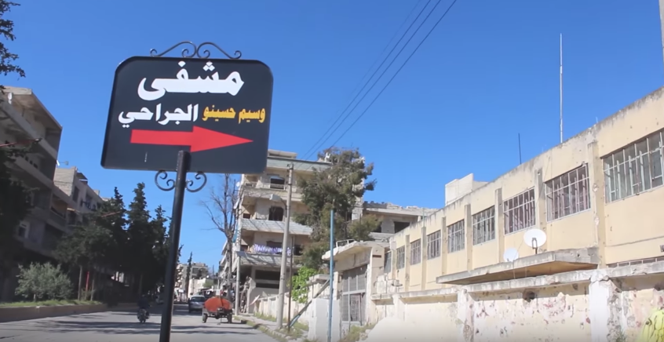
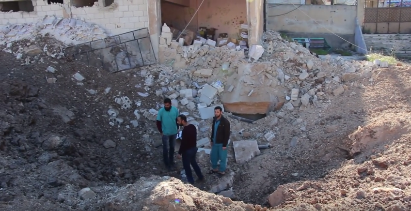
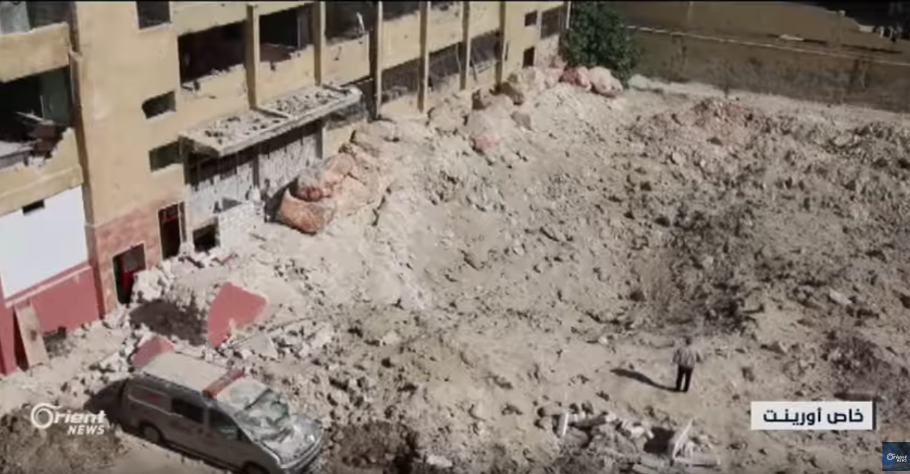
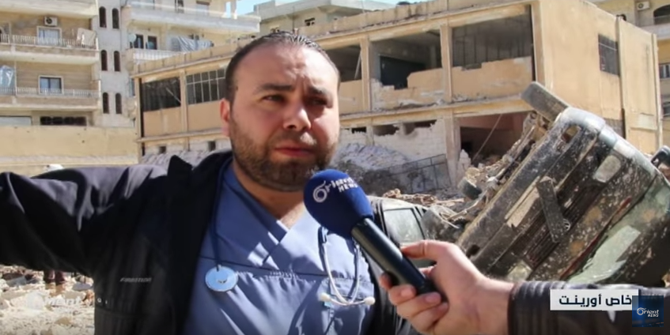
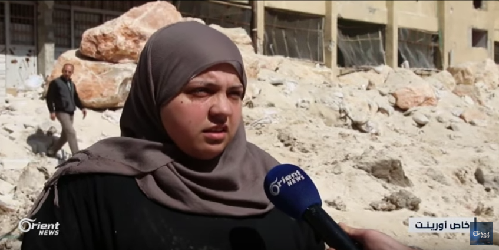
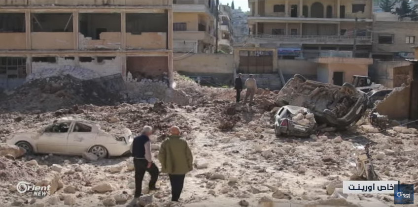
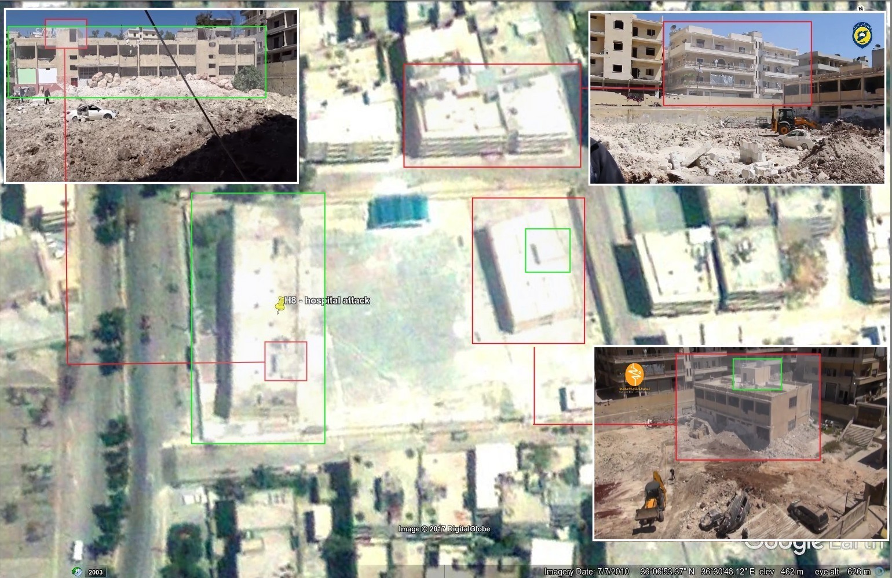
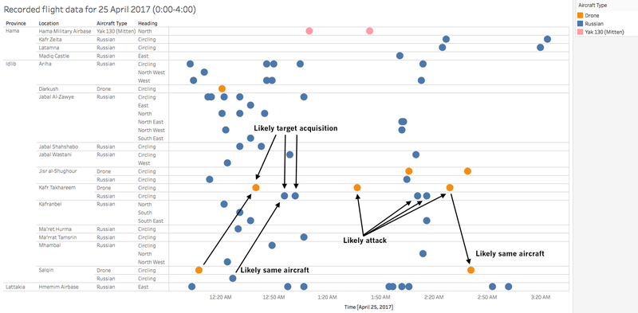
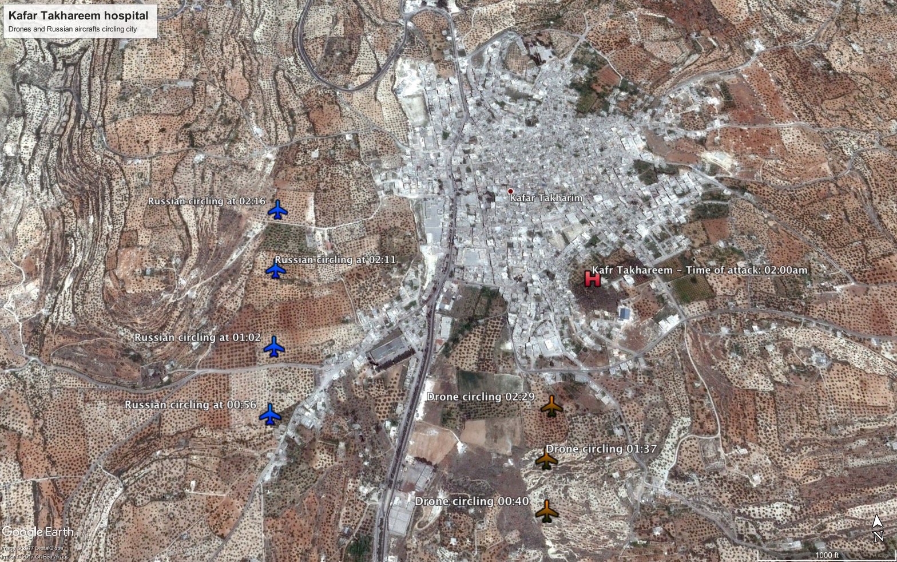

*Location: IDLIB : Kafar Takharim\
Hospital: Kafar Takharim Hospital\
Beneficiary number: \~200.000 people\
Date: 25 April 2017\
Time: 02:00 Damascus time\
Attacks: Two airstrikes\
Reported casualties: not available\
Reported injured: not available\
Weapon used: not available\
Alleged perpetrator: Syrian or Russian air force*

The sixth hospital attack identified occurred on 25 April 2017. The Civil Defense [published a video](https://www.youtube.com/watch?v=7G1B3M6qIqc)which documented them going to the targeted site after the attack. In the video, it is possible to hear someone saying through the walkie talkie: "They implemented the strike," and then at 01:18, the sound of the attack is heard.

[Another video published](https://www.youtube.com/watch?v=sXEA4C1SHUI) by SMO News Agency shows the attacked site immediately after the airstrike. In this video, a person is heard saying: "Kafar Takharim surgery hospital has been attacked with two rockets resulting in a civilian injured and damage in and around the building. The hospital is out of service as a result of the attack."

[Eba Agency \"وكالة إباء](https://www.youtube.com/channel/UCJ6BZDIwW0AjmXe_sL0u3Zg)\" also published a video, which features an interview with the Director of the "Nabeel Saed" hospital. The video mentions that two Russian airstrikes targeted the hospital as staff was treating injured people attacked earlier around midnight.

A [video published](https://www.youtube.com/watch?v=wI0XK2pPV5o&feature=youtu.be) on 25 April 2017 by the YouTube channel of user "[مراسل صحفي اا](https://www.youtube.com/channel/UC59kYDliZkiyxOxmPuQTx4A)" shows the destruction the day after the attack where a huge crater is visible. See still from the video below:

Orient news [published a separate video](https://www.youtube.com/watch?v=69rNCv6Shxw) showing the crater in front of the hospital, as well as the damaged building and cars. See stills from the video below:

In the video, one of the medical workers who witnessed the attack stated: "At 12:30 Kafar Takharim was targeted with airstrikes...During our work to aid and rescue the injured people, the hospital was targeted with two thermobaric rockets that damaged the hospital, and as a result it's out of service. Also the team of the hospital was injured. The hospital stock was completely damaged too."

Another witness who was present during the attack stated: "Two airstrikes targeted the hospital as we were rescuing the injured people who were attacked during the night. We found ourselves under rubble and four were injured from the medical team."

The Syrian Archive was able to geolocate the hospital based on the verified visual content related to incident and comparing this to Google Earth. See below:

The location of the hospital is near a residential area and there appears to be no nearby military operations.

To provide a further layer of verification, the Syrian Archive analysed flight observation data provided by a spotter organisation. This consisted of analysing observation data of flights between 0:00 and 4:00, the period directly before and after the reported attack. See below:

Through comparing where flights were observed, the time they were observed, and the direction flights were heading, and comparing this data to geolocation conducted in earlier steps, the Syrian Archive was able to identify potential flights seen circling very close to the geolocated attack site.

Previous research has found that circling flights typically indicate target acquisition and/or preparation for imminent attack. In this case, the several flights by drones or by Russian aircraft were observed near the attack site around 00:40, which the Syrian Archive has determined were likely acquiring the target for the later attack.

The flights seen circling the attack site in the period around 02:00, indicated in the visualisation above, were likely the aircraft responsible for the attack. As with previous incidents, though some aircraft are labelled "Russian," it is possible the flight was operated by the Syrian air force, rather than the Russian air force, as the Syrian air force also used Russian planes.

Witness statements of the attack were provided jointly by Syrians for Truth and Justice and by Justice for Life. In his statement, Dr. Waleed Mohammed, a specialist in orthopedic surgery, and the Director of the Shahid Wassim Husseino Hospital in Kafr Takharim, told the investigative team:

***"At about 2:00 am the Russian/Syrian warplanes targeted the hospital with two airstrikes that led the hospital to be completely out of service... The attack was conducted after targeting the ​​Duwailah area, and the wounded were transferred to the hospital given that it is located in a border area far away from the combat areas. All this highlights that the main aim of bombing is to destroy the infrastructure of all hospitals in the opposition areas."***
