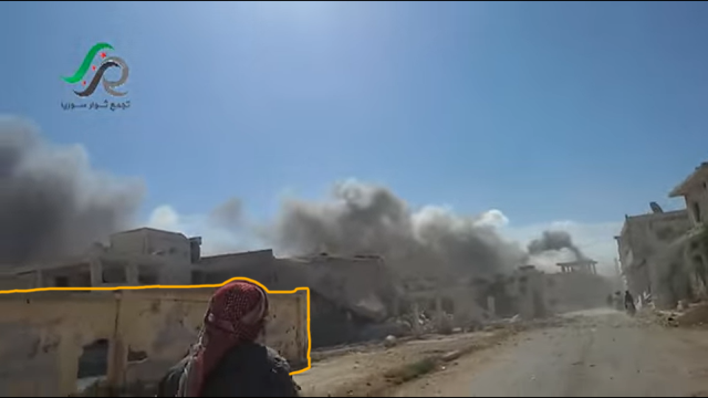

## حول الحادثة

- الموقع الجغرافي: حمص: تلبيسة
- التاريخ: 30/09/2015
- التوقيت: ~ بين 10:00 صباحا و 11:00 صباحا
- الهدف: مبانٍ يقطنها مدنيّون، مسجد ومدرسة
- القتلى المبلّغ عنهم: 18
- الجرحى المبلّغ عنهم:
- الذخائر المحدّدة: غير متوفرة
- المسؤول المحتمل: الطيران الروسي

## ماذا حدث؟

في يوم 30 أيلول\\سبتمبر 2015 تداولت العديد من الشبكات الإخبارية وصفحات الناشطين [أنباءً](https://www.youtube.com/watch?v=pPfe3S5vvMc) حول غارات شنها الطيران الروسي على مدينة [تلبيسة](https://goo.gl/maps/HR6mru5nPSz) في ريف حمص، تزامناً مع تفويض المجلس الاتحادي الروسي للرئيس الروسي فلاديمير بوتين باستخدام القوّة في سوريا معلنين [بدء العمليّات العسكريّة الروسيّة في الأراضي السوريّة](https://www.youtube.com/watch?v%3DqblmOvkV9KM&sa=D&ust=1539189669552000).

موقع تلبيسة في ريف حمص الشمالي

موقع تلبيسة بين مدينتي الرستن وحمص

صورة من الأقمار الصناعيّة لمدينة تلبيسة

في 30 أيلول/ سبتمبر 2015 نشرت قناة أخبار تلبيسة مقطع [فيديو](https://www.youtube.com/watch?v%3DKqEtOd5Mypg&sa=D&ust=1539189669554000) للحظة وصول المراسل بعد الغارة الجوية المزعومة إلى مكان سقوط الصواريخ الفراغيّة والبدء بعمليّات الإنقاذ وفقًا للمصدر الذي التقط مقطع الفيديو.

بعد ساعات قليلة من الفيديو الأول؛ نشرت القناة نفسها [فيديو](https://www.youtube.com/watch?v%3DpPfe3S5vvMc&sa=D&ust=1539189669554000) يُظهر عمليات الإنقاذ، آثار  الدمار وقتلى نتيجة للغارة.

في 30 أيلول\\سبتمبر 2015، نشرت قناة تجمّع ثوّار سوريا على يوتيوب [فيديو](https://www.youtube.com/watch?v%3D66G9nXb1oCA&sa=D&ust=1539189669555000) للحظات الأولى من الغارات التي شنّها الطيران الحربي الروسي على أحياء المدينة، حسبما ادّعى المصدر الذي التقط مقطع الفيديو.

صورة لموقع الغارة ونلاحظ برج المياه على يمين الصورة

نشرت قناة "المكتب الإعلامي -تجمّع ثوار سوريا حمص الريف الشمالي "في اليوم ذاته [فيديو](https://www.youtube.com/watch?v%3DO4cP-FUFQrY&sa=D&ust=1539189669556000) على اليوتيوب يُظهر اللحظات الأولى من الغارات الجوية التي نفذها طيران روسي وفقًا لادّعاء المصدر الذي التقط الفيديو. يظهر المقطع أيضًا موقع التأثير، الأضرار في مباني المدنيين وعمليّات الإنقاذ.

موقع الغارة في مدينة تلبيسة، ونشاهد مجدّداً برج المياه في الفيديو، كما يظهر أدناه

## متى وقع الهجوم؟

في [تقرير نشره مركز توثيق الانتهاكات في سوريا](http://www.vdc-sy.info/pdf/reports/1444252328-Arabic.pdf) عن الغارات الروسيّة في يوم 30 أيلول\سبتمبر 2015 وردت الشهادة التالية من أحد المسعفين في المدينة ويدعى عمر الدقّة (أبو خالد الحمصي) وهو أحد كوادر مشفى تلبيسة الميداني الذي قال في شهادته:

"عند حوالي الساعة 10:00 صباحاً من يوم الأربعاء المصادف 30 أيلول\سبتمبر 2015 شنّ الطيران الحربي الروسي عدّة غارات جويّة مكثّفة على مدينة تلبيسة، استهدف بالصواريخ الفراغيّة الأحياء التالية:

شارع الكرامة وشارع البريد والمشجّر ومركز لجنة الخبز في المدينة، وجاء القصف على مسارٍ واحدٍ فكان هناك حوالي 100 متر ما بين سقوط كلّ قذيفةٍ فنتج عن ذلك سقوط 17 مدني و34 جريحاً ومفقودٍ واحد."

ضياء أبو مصعب، عضو الدفاع المدني السوري والذي كان متواجدًا لحظة القصف على مدينة تلبيسة، أدلى بشهادته لمركز توثيق الانتهاكات، حيث قال:

"في صباح 30 أيلول\سبتمبر 2015 ورد إلينا من خلال المراصد أنّ هنالك طائرتين حربيّتين تحلّقان فوق سماء الريف الشمالي لمدينة حمص وتلبيسة، وكانت الساعة حوالي الساعة 11:00 صباحاً، لاحقاً نادت المراصد بإخلاء الشوارع من المدنيّين حيث قالوا أنّ الطيّارين يتكلّمون اللغة الروسيّة، وبعد ثوانٍ معدودة أطلقت الطائرات (8) صواريخ فراغيّة على المدينة وتحديداً على الأحياء الشماليّة للمدينة المكتظّة بالسكّان حيث يقع فيها مركز توزيع وتأمين الخبز للمواطنين الذي تمّ استهدافه، لم يكن هناك أيّ مقرٍ عسكريٍّ قريب من مكان الاستهداف. عندما ذهبت إلى مكان الاستهداف شاهدت ثلاث حفرٍ كبيرةٍ في أحد الشوارع بأعماق مختلفة من متر إلى مترين ونصف، وكان عدد من الصواريخ قد سقطت بين منازل المدنيّين".

كما [نشر المركز](http://www.vdc-sy.info/pdf/reports/1444252328-Arabic.pdf)أسماء ثمانية عشر شخصًا قُتلوا نتيجة للغارات الجوية، بمن فيهم أطفال.

## تحديد المعالم البارزة والموقع الجغرافيّ

نشرت شبكة تلبيسة مباشر في 30 أيلول 2015 مقطع [فيديو](https://www.youtube.com/watch?v%3DlQNhP6G0u7s&sa=D&ust=1539189669559000) يظهر تصاعد الدخان نتيجة لغارات جوية استهدفت مدينة تلبيسة، كما يمكن رؤية مئذنة جامع أمام الموقع المستهدف. تبيّن لفريق التحقيقات مفتوحة المصدر في الأرشيف السوريّ أنّها تعود [لجامع الإيمان والرحمة](https://goo.gl/maps/43Sk5FnU9Cs) شرقي المدينة.

أدناه صورة [نُشرت على خرائط جوجل](https://goo.gl/maps/iZSk24sNV1F2)، تُظهر مئذنة جامع الإيمان والرحمة وتبدو من خلفها مئذنة جامعٍ ثانٍ.

صورة أخرى [نُشرت على خرائط جوجل](https://goo.gl/maps/CSHK4ByDq9R2) تُظهر جامع الإيمان والرحمة إضافة إلى برج المياه.

أدناه صورة أقمار صناعية من جوجل إيرث [يظهر فيها برج المياه، مدرسة، الجامع الثاني والثالث في منطقة الهجوم](https://www.google.com.tr/maps/@34.8454128,36.730747,181m/data%3D!3m1!1e3&sa=D&ust=1539189669563000) وهي نفسها المعالم البارزة الظاهرة في مقطع الفيديو المشار إليه أعلاه.

صورة من الأقمار الصناعيّة تبيّن مواقع برج المياه، الجامع الثاني في الجنوب الشرقي، والمسجد الثالث، الذي ليس له مئذنة، في الشمال الشرقي.

نشر [راديو الكُلّ](https://www.youtube.com/watch?v%3Do233wvp_3AA&sa=D&ust=1539189669564000) مقطع فيديو بعد سنة من الهجوم، يظهر الأضرار التي لحقت [بالمسجد الثاني](https://www.google.com.tr/maps/@34.843604,36.7278948,981m/data%3D!3m1!1e3&sa=D&ust=153918817118600).

فيما يلي تحديد الموقع الجغرافي لبرج المياه إلى اليمين، والمسجد الثالث، من دون مئذنة، إلى اليسار. يمكن تقدير قرب مكان الاستهداف من المعلمين تبعًا لحركة المصوّر والدخان المتصاعد.

في مقطع [الفيديو](https://www.youtube.com/watch?v%3DO4cP-FUFQrY&sa=D&ust=1539189669565000) المنشور من قبل "المكتب الإعلامي -تجمّع سوريا حمص الريف الشمالي"؛ تظهر مئذنة المسجد الثاني للحظة، مما يُبيّن مدى قرب الموقع المستهدف من المسجد.

بمقارنة هذه الصور مع المعالم البارزة؛ نستطيع تحديد مسار المصوّر بدقة.

يظهر سور مدرسة إلى يسار المصور قريبًا من مكان الاستهداف

ويظهر بعده بناء المدرسة على شكل حرف L مدمّر جزئيًا

بعد مطابقة الفيديو مع صور الأقمار الصناعيّة ومحاولة ربطها؛ تمكّن فريق التحقيقات مفتوحة المصدر في الأرشيف السوري من تحديد موقع المدرسة المدمّرة جزئيًا ذات البناء على شكل حرف L حيث يقع الجامع الثاني، والذي تظهر مئذنته بوضوح، إلى الجنوب الشرقي منها؛ وبرج المياه إلى الجنوب الغربي منها.

توضّح الصورة أدناه مسار المصوّر من [فيديو](https://www.youtube.com/watch?v%3DO4cP-FUFQrY&sa=D&ust=1539189669567000) تجمّع ثوّار سوريا

بعد تحديد مسار المصوّر، والمعالم البارزة من جامع الرحمة والإيمان، الجامع الثاني ذو المئذنة، والجامع الثالث الذي ليست له مئذنة، إضافة إلى برج المياه الذي يعلو قلعة تلبيسة نستطيع [تحديد المكان المستهدف بدقّة](https://www.google.com.tr/maps/@34.8448492,36.7315971,103m/data%3D!3m1!1e3&sa=D&ust=1539189669568000) وهو:

تظهر جميع المعالم البارزة التي تم تحديدها في صورة الأقمار الصناعيّة التالية من جوجل إيرث، والملتقطة بتاريخ 17/07/2015:

فيما يلي صورتا أقمار صناعية (التُقطت الأولى في 17 نوفمبر 2013، والثانية في 30 مايو 2016) توضّحان الأضرار اللاحقة بالمباني نتيجة للغارة الجوية.

لاحقاً وبعد الغارة، تحدّثت عدّة مصادر عن استهداف الطيران الحربي لنفس موقع الغارة الأولى مرّة ثانية أثناء عمليّات الإنقاذ، حيث نشر العديد من الناشطين والشبكات الإخباريّة صوراً وأخباراً عن ضحايا وجرحى مدنيّين وقعوا جرّاء الغارات الجوية على مدينة تلبيسة، ونُفّذ القصف الثاني من قبل الطيران الروسي أيضًا بحسب بعض الشبكات الإعلاميّة.

في 30 سبتمبر 2015، نشرت شبكة بلدي الإعلاميّة على الفيسبوك [فيديو](https://www.facebook.com/baladinetwork/videos/622454614524504/&sa=D&ust=1539189669570000) عن معاودة قصف مواقع الغارة الأولى مرّة ثانية أثناء عمليّات الإنقاذ من قبل الطيران الروسي.

## الضحايا المدنيّون

نشرت قناة أخبار تلبيسة على اليوتيوب عدّة فيديوهات لضحايا الغارات على تلبيسة، من بينها [فيديو](https://www.youtube.com/watch?v%3D9aZ0tew17VY&sa=D&ust=1539189669570000) للضحية الطفل "أحمد محمّد جمعة"، [وفيديو](https://www.youtube.com/watch?v%3D0mm-S2adiU4&sa=D&ust=1539189669570000) للضحيّة الشاب "موسى محمود جمعة"، [وفيديو](https://www.youtube.com/watch?v%3D1bHO1ieMYwU&sa=D&ust=1539189669570000) لعنصر الدفاع المدني "عبد اللطيف الضحيك" الذي قُتل نتيجة للاستهداف الثاني أثناء عمليّات الإنقاذ، كما نشرت [فيديو](https://www.youtube.com/watch?v%3DIeK-V6ywp2o&sa=D&ust=1539189669571000) لتشييع بعض ضحايا الغارات.

إضافةً إلى ذلك نعت صفحة الدفاع المدني السوري في محافظة حمص العنصر "عبد اللطيف الضحيك" في [منشور](https://www.facebook.com/SCDHOMS/posts/462825793895268?__tn__%3D-R&sa=D&ust=1539189669571000) على صفحتها على الفيسبوك.

نشرت صفحة الشبكة السوريّة لحقوق الإنسان صورة لطفلين قُتلا نتيجة للغارات على مدينة تلبيسة وهما الطفلان أحمد ويامن محمد الجمعة.

في اليوم ذاته؛نشرت قناة أخبار تلبيسة فيديوهات لبعض المصابين، من بينها [فيديو لطفل](https://www.youtube.com/watch?v%3DiW_PfDoR-60&sa=D&ust=1539189669572000) مصاب بشظايا جرّاء الغارات، ومقطع [فيديو لشاب](https://www.youtube.com/watch?v%3DGMU54aiGSDA&sa=D&ust=1539189669572000) مُصاب أثناء تلقيه العلاج بعد أن أُخرج من تحت الأنقاض،  كما نشرت القناة [فيديو](https://www.youtube.com/watch?v%3DwUMWd_vmr1E&sa=D&ust=1539189669572000) يظهر إحدى مشافي مدينة تلبيسة الميدانية مزدحمةً بالمصابين والجرحى جرّاء الغارات.

نشر المركز الإعلامي لمدينة تلبيسة مقطع فيديو [يُظهر أشخاصًا قُتلوا](https://www.youtube.com/watch?v=uN2WWMoZ1-4&list=TLzlllYDxAVbMwMjEwMjAxNQ)نتيجة لغارات جوية روسية.

نشرت بعض [الصفحات الموالية للنظام السوري](http://archive.fo/2DS2k&sa=D&ust=1539189669574000) أنباءً عن [استمرار قصف مدينة تلبيسة](https://www.facebook.com/General.Command.Armed.Forces963/posts/835469936572767?__tn__%3D-R&sa=D&ust=1539189669574000)

بعد عدّة ساعات من الغارات، في الساعة 15:45 بتوقيت دمشق، ذكرت [وكالة الأناضول التركيّة](https://www.facebook.com/AnadoluAgency.AR/posts/896894630431676?__tn__%3D-R&sa=D&ust=1539189669575000) في منشور لها على الفيسبوك أنّ ناشطين في محافظتي حماه وحمص شاهدوا طائرتين من طراز حديث لم يعهدوا رؤيته من قبل، بشكلٍ متزامنٍ في سماء مناطق تخضع لسيطرة المعارضة في المحافظتين، مشيرين إلى أنّ الطائرتين نفّذتا عدداً من الغارات في تلك المناطق.

وفقًا [لموقع وزارة الدفاع الروسيّة](https://structure.mil.ru/mission/fight_against_terrorism.htm&sa=D&ust=1539189669575000) فإنّ الوزارة قد بدأت عمليّة جويّة اعتباراً من تاريخ 30 أيلول 2015 وذلك لقتال ما دعوه بمجموعات إرهابيّة عالميّة في الجمهوريّة العربيّة السوريّة.

بتاريخ 30 أيلول 2015، أعلن المتحدث الرسمي باسم  وزارة الدفاع الروسية  اللواء “إيغور كوناشينكوف” في بيان مقتضب أن  [القوات الروسية شنّت نحو عشرين غارة جوية دقيقة](https://www.google.com/url?q=https://www.youtube.com/watch?v%3DqblmOvkV9KM&sa=D&ust=1539188171198000) استهدفت ثماني مواقع لتنظيم “داعش” في الأراضي العربية السورية. كما نشر موقع وزارة الدفاع الروسي [مقطع فيديو](http://eng.mil.ru/en/news_page/country/more.htm?id%3D12059172@egNews&sa=D&ust=1539189669578000) يظهر استهداف عدّة مواقع داخل الأراضي السورية في يوم 30 أيلول 2015.

نشر حساب القوات المسلحة للاتحاد الروسي VK [خريطة](https://vk.com/wall-3457550_23655) تبين مناطق سيطرة تنظيم داعش وجبهة النصرة. إن الموقع الذي استهدفته الغارات الجوية في مدينة تلبيسة لا يقع ضمن المنطقة الخضراء، ما يعني أنه غير خاضع لأي من سيطرة تنظيم داعش أو جبهة النصرة.

## خاتمة

بعد جمع وتحليل الصور والأدلّة البصريّة التي نشرت على مواقع التواصل الاجتماعي وشبكات الأخبار؛ تبيّن لفريق التحقيقات مفتوحة المصدر في الأرشيف السوري أن مدينة تلبيسة في ريف حمص قد استُهدفت بغارات جوية روسية بتاريخ 30 أيلول سبتمبر 2015.

تجدر الإشارة إلى أنّه في ذات اليوم قبيل الغارة بساعات، كان المجلس الاتحادي الروسي قد وافق على تفويض الرئيس الروسي فلاديمير بوتين لاستخدام القوّة في سوريّا كإعلان رسميّ لبدء العمليّات العسكريّة الروسيّة في الأراضي السوريّة.

بحسب الأدلّة والمصادر التي تمّ تحليلها؛ بين الساعة 10:00 و 11:00 ظهر يوم 30 سبتمبر\أيلول 2015؛ استهدفت غارة جوية روسية شمالي مدينة تلبيسة، تبعتها غارة ثانية في نفس الموقع أثناء عمليّات الإنقاذ ممّا أوقع عدداً أكبر من الضحايا، خصوصاً بين عناصر الدفاع المدني، حيث وصل عدد الضحايا في الغارتين إلى 18 ضحيّة والعديد من الجرحى. وكانت وزارة الدفاع الروسيّة قد ذكرت أنّ قوّاتها شنّت نحو عشرين غارة جويّة نفّذت خلالها ضربات دقيقة استهدفت في مجملها ثمانية مواقع لتنظيم "داعش" في سوريا. لا تقع مدينة تلبيسة ضمن مناطق سيطرة أي من تنظيم داعش أو جبهة النصرة.
