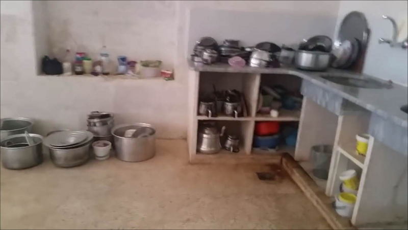
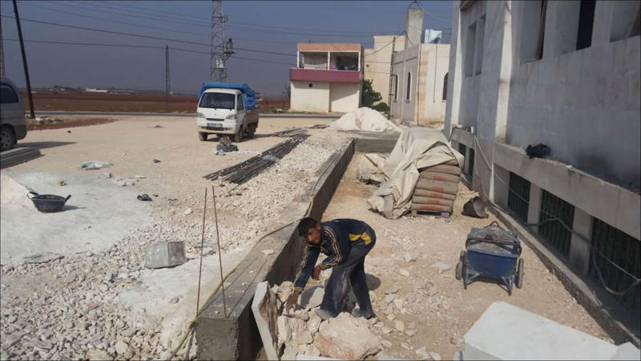
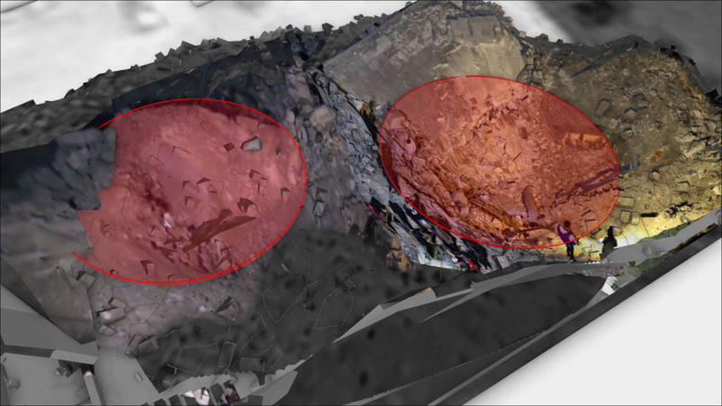
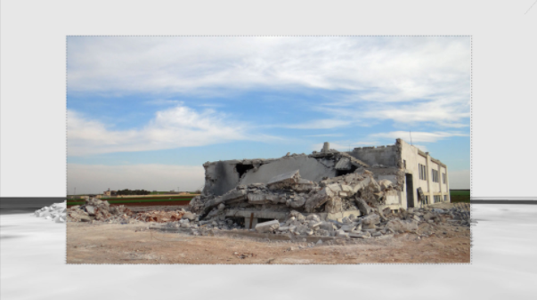
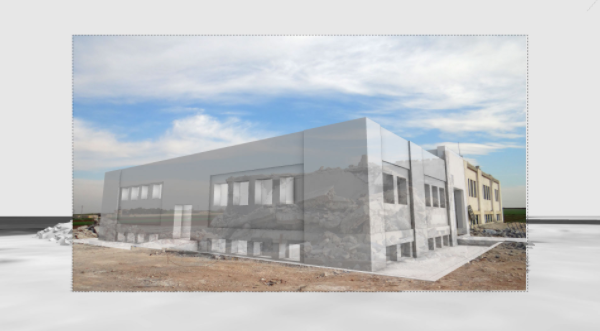
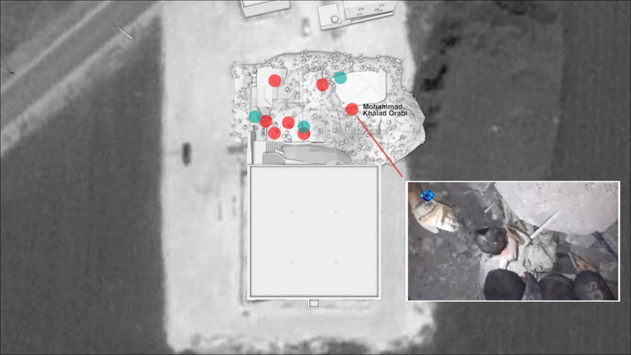

تبادلت بلينغكات المعلومات مع فريق Forensic Architecture وهيومان رايتس ووتش. حيث أجرى كلًا منهما تحقيقات منفصلة عن الهجوم الذي استهدف جامع الجينة. [أُرشفت الأدلة البصرية بواسطة "الأرشيف السوري".](https://syrianarchive.org/ar/database?location=%D8%AD%D9%84%D8%A8%20:%20%D8%A7%D9%84%D8%AC%D9%8A%D9%86%D8%A9&after=2017-03-15&before=2017-03-19)

في 16 مارس / آذار 2017، حوالي الساعة 18:55 بالتوقيت المحلي؛ استهدفت غارة جويّة للولايات المتحدّة مسجد "سيدنا عُمر بن الخطاب"، والذي كان يضم حسب التقارير حوالي 300 شخص حضروا لأداء صلاة العشاء ودرس ديني. دمّرت الغارة بشكلٍ كامل الجزء الشمالي من المسجد، والواقع بالقرب من قرية الجينة في محافظة حلب السوريّة. تمّ العثور على 38 جثة، بينهم خمسة أطفال أخرجوا من تحت الأنقاض وذلك وفقًا للدفاع المدني - وهي مجموعة بحث وإنقاذ تعمل في الأراضي التي تُسيطر عليها المعارضة وتُدعى كذلك بأصحاب "الخوذ البيضاء".

ليس هناك شك في أن الولايات المتحدة هي من شنّت الهجوم. وكانت المعلومات الأولية مفتوحة المصدر قد ألمحت بالفعل إلى تورط الولايات المتحدة كما أوردنا بالتفصيل في [تقريرنا الأولي](https://www.bellingcat.com/news/mena/2017/03/16/us-missile-remains-reportedly-recovered-from-site-of-aleppo-mosque-bombing/). لاحقًا أعلنت القيادة المركزية الأمريكية مسؤوليتها عن الضربة قائلةً إنها استهدفت "مكان اجتماع للقاعدة في سوريا" والذي أسفر عن مقتل "العشرات من إرهابيي القاعدة الأساسيين" بعد إجراء مراقبة واسعة النطاق. مع العلم أنهم أشاروا بشكلٍ غير صحيح إلى كون الهجوم قد وقع في محافظة إدلب، إلا أنهم عادوا وأكدّوا لبلينغكات أنهم قصدوا وقوع الضربة بالقرب من الجينة في محافظة حلب. وادعى متحدّث عسكري أمريكي أنّ الولايات المتحدة اتخذت "تدابير غير عادية للتخفيف من الخسائر في أرواح المدنيين". وأصدر البنتاغون بعد الهجوم صورةً للموقع قائلين أنهم "لم يستهدفوا عمدًا المسجد الظاهر في الطرف الأيسر من الصورة"، وإنما تمّ استهداف قاعة للاجتماعات تم بناؤها جزئيًا - حسبما ادّعى البنتاغون.

بيد أن سؤلًا مُلحًا لا يزال قائمًا؛ هل المبنى يعود لمسجد بالفعل أم لقاعة اجتماعات؟ معلومات جديدة جمعها Forensic Architecture وهيومن رايتس ووتش تُشير بقوّة إلى أن المبنى المُستهدف هو مسجد تمّ تشييده حديثًا، ويحتوي على قاعة صلاة كبيرة وبعض الوظائف المساعدة بالإضافة إلى مسكن للإمام. وتعتقد بلينغكات أن الخسائر المدنية الناجمة عن الضربة تعود جزئيًا نتيجة لتعريف المبنى بشكل خاطئ.

يُناقش المقال المعلومات الجديدة والمتعلقة بجميع المعلومات متعددة-الوسائط مفتوحة المصدر التي عثر عليها موقع بلينغكات مع تسلسل زمني لها في نهاية المقال. أُرشفت جميع معلومات الوسائط-المتعددة بواسطة "الأرشيف السوري" وهو مشروع تُساهم به بلينغكات.

# المحتويات

**أولا: مجمع المسجد**
*   الموقع
*   مخطط البناء
*   المظهر الخارجي

** ثانيا:  الأنشطة في داخل مجمع الجينة **
*   جماعة الدعوة والتبليغ
*   اجتماع للقاعدة؟

**ثالثا: لأضرار والخسائر**
**رابعا: لتسلسل الزمني للمعلومات مفتوحة المصدر**
*   آذار 16, 2017
*   آذار 17, 2017
*   آذار 18, 2017
*   آذار 19, 2017

# مجمع المسجد

## الموقع

يقع مسجد "سيدنا عُمر بن الخطاب" على بُعد 1.5 كيلومتر تقريبًا جنوب غرب قرية الجينة في محافظة حلب، عند الإحداثيات [36.107721, 36.787080](http://wikimapia.org/#lang=en&lat=36.107785&lon=36.786904&z=15&m=b). يقع المسجد بجوار مسجد صغير على بعد بضعة أمتار شماله. ووفقًا لما قاله سكانٌ محليون لهيومن رايتس ووتش فإن بناء المسجد بدأ عام 2013\. وأضاف الأشخاص الذين أجريت معهم المقابلات أن بناء المسجد لم يكتمل بسبب نقص في التمويل، وهذا ما يتطابق مع الصور القديمة الملتقطة من خرائط غوغل إيرث، مايكروسوفت بينغ، وتيراسرفر.

## مخطط البناء

أجرى فريق Forensic Architecture مقابلة مع مقاول المُجمع وحاجب المسجد - والذي أُصيب أيضًا في الهجوم - إذ ذكر بأن الطابق العلوي في الجزء الشمالي من المجمع يحتوي على مساحة معيشة لإمام المسجد، حيث كانت زوجته موجودة وقُتلت في الضربة.

ويضم الطابق الأرضي من القسم الشمالي موضئًا، مراحيض، مطبخ، وصالة لأداء الصلاة في فصل الشتاء.

ويؤكّد [مقطع فيديو](https://www.youtube.com/watch?v=SOdP6FbrFzQ) سُجّل أثناء بناء المسجد ونُشر على موقع يوتيوب في نوفمبر 2014 الاستخدام المذكور لكل غرفة، مثل الموضئ (4:37-4:54) المراحيض (4:54-5:16) الصالة الشتوية للصلاة (5:21-5:27) والمطبخ (5:37-5:57).

هناك العديد من السمات الهامة في الفيديو الذي يُرجّح أن يكون للمنطقة الشمالية من المسجد. ومن المهم الإشارة لوجود فتحتين لصالة الصلاة الشتوية، أغلقت واحدة والتي تواجه الممر الغربي الشرقي، وبقيت الأخرى مفتوحة كما يظهر في الفيديو. كما تملك قاعة الصلاة أبوابًا منزلقة ونوافذ ثابتة، ويتضح أن القسمين من المبنى يتصلون معًا بواسطة المداخل. يُظهر الفيديو أيضًا أنه حتى أثناء المراحل الأولى للبناء؛ كان مُجمّع المسجد - بما في ذلك قاعة الصلاة - يُستخدم من قبل السكّان المحليين.

ويحتوي الطابق الأرضي على قاعة الصلاة الرئيسية في الجانب الجنوبي من المبنى، مما يُؤكّد الأبحاث الأوليّة لبلينغكات. كما صمّم فريق Forensic Architecture نموذجًا ثلاثي الأبعاد لمجمع المسجد بواسطة الكمبيوتر. حيث يتضح من جوانب عدّة أن المبنى ما هو إلا مسجد؛ مثل الرفوف لأحذية المصلين، السجاد، ومحراب الإمام.

يُظهر شريط فيديو 2014 وجود المصلين أمام المحراب نفسه، ويبدو أن السجاد قد تبدّل من الأخضر إلى الأحمر لاحقًا.

## المظهر الخارجي

حصل فريق Forensic Architecture على اثنين من شرائط الفيديو التي تُظهر مجمع المسجد قبل وقوع الضربة، الأوّل زُوّد من طرف أحد السكان المحليين ولم يُنشر على الإنترنت من قبل، بينما حُمّل الآخر على اليوتيوب في عام 2014.

يُظهر الفيديو الأول مُكبّر الصوت المُستخدم لرفع أذان الصلوات موجودًا على سطح المسجد، بالإضافة إلى لافتة بجوار المدخل كُتب عليها "مسجد سيدنا عمر بن الخطاب". ومن الجدير بالذكر أنها نفس اللافتة التي ظهرت في أشرطة الفيديو المُحمّلة بعد الضربة.

ويعرض الفيديو الثاني في بدايته عدّة صور من مجمع المسجد قيد الإنشاء، يليها جولة بالكاميرا - سيرًا على الأقدام - في المبنى.

# الأنشطة في داخل مجمع الجينة

## جماعة الدعوة والتبليغ

يظهر في أشرطة الفيديو مفتوحة المصدر التي تُوضّح آثار الهجوم؛ بعض الأشخاص الذين يدّعون أن المسجد كان يُستخدم من قبل جماعة الدعوة والتبليغ، وهي حركة دعوية إسلامية سنيّة عالميّة وغير سياسيّة تحث الناس على العودة إلى الإسلام السني الأصلي، ويُعتقد أن عدد أتباع الحركة يتراوح ما بين [12](http://www.livemint.com/Politics/nYJVwDC7lMtF8ZlDNGxAvI/Inside-the-Tablighi-Jamaat.html) إلى [150](https://www.stratfor.com/weekly/tablighi-jamaat-indirect-line-terrorism) مليون حول العالم، يتركّز معظمهم في جنوب أسيا.

وقد تمّ تحميل مقطع فيديو 2014 (قبل الضربة) والذي يُظهر المسجد قيد الإنشاء من طرف مجموعة يبدو أنها تتبع لجماعة الدعوة والتبليغ حيث يحمل مقطع الفيديو اسم "مركز الدعوة والتبليغ في بلاد الشام".

وأكّد بعض الأفراد في شريط الفيديو، إضافةً إلى بلال عبدالكريم - والذي يُعدّ تقارير صحفية لصالح On the Ground News - أن المسجد يُستخدم بالفعل من قبل جماعة الدعوة والتبليغ والتي أفادت تقارير بأنها تعقد الدروس الدينية كل خميس. هذه التأكيدات مُدعمة بواسطة مراسل [لوكالة الأناضول](http://aa.com.tr/ar/%D8%A7%D9%84%D8%AF%D9%88%D9%84-%D8%A7%D9%84%D8%B9%D8%B1%D8%A8%D9%8A%D8%A9/%D9%82%D8%AA%D9%84%D9%89-%D9%85%D8%B3%D8%AC%D8%AF-%D8%A7%D9%84%D8%AC%D9%8A%D9%86%D8%A9-%D8%A8%D8%B1%D9%8A%D9%81-%D8%AD%D9%84%D8%A8-%D9%85%D9%86-%D8%A3%D8%AA%D8%A8%D8%A7%D8%B9-%D8%AC%D9%85%D8%A7%D8%B9%D8%A9-%D8%A7%D9%84%D8%AA%D8%A8%D9%84%D9%8A%D8%BA-%D9%88%D9%84%D9%8A%D8%B3%D9%88%D8%A7-%D9%85%D9%86-%D8%A7%D9%84%D9%82%D8%A7%D8%B9%D8%AF%D8%A9/773921) والشهادات التي جمعتها هيومن رايتس ووتش:

"كان الدعاة قد اعتادوا على عقد درس ديني في المسجد بين صلاتي المغرب والعشاء كل خميس. في يوم الهجوم وكما يفعلون عادةً عندما يكون الطقس باردًا في الخارج؛ كانوا يستخدمون منطقة تناول الطعام في قسم الخدمات للدرس الديني، ذلك لأن قاعة الصلاة الكبيرة في القسم الجنوبي كانت معزولة بشكلٍ سيء"

ولجماعة الدعوة والتبليغ - والتي تُعرف باسم الأحباب - وجودٌ كبير في محافظة حلب كما أخبر أحمد أبو زيد بلينغكات.

وفي مقطع فيديو تمّ تسجيله بعد الحادث، قال الشيخ عبد الرزاق إمام مسجد في محافظة حلب أن مسجد ومكان اجتماع جماعة الدعوة والتبليغ قد اُستهدفا. وأضاف أن الجماعة لا علاقة لها بالسياسة أو الدولة الإسلامية أو جبهة النصرة.

وقال سكانٌ محليون وحاجب المسجد لهيومن رايتس ووتش قصة مشابهة:

"إنهم مدنيون مئة بالمئة، نحن نسميهم "بالأحباب"، إنهم لا يدعون إلى الجهاد أو الحرب، يدعون فقط إلى الله والإسلام. وهم من قرى مختلفة، هناك 10-15 من قريتنا، 10-15 من قرية أخرى وهكذا.. هؤلاء الناس يمارسون الاعتكاف، إنهم فقط يعملون لإعلاء كلمة الله".

## اجتماع للقاعدة؟

كان الطابق الأرضي مفتوحًا بأكمله للجمهور، ولم تكن هناك أبواب إلى غرفة الصلاة، وفقًا لما ذكره شهود عيان وأكّده شريط فيديو يعود لعام 2014؛ ما يجعلها مكانًا غير محتمل لاجتماع سري "لإرهابيي القاعدة" كما يُؤكّد البنتاغون، خاصةً أن ما يقرب من 300 مصلي كانوا موجودين في الموقع، وفقًا لشهود.

كما لم تجد هيومن رايتس ووتش أيّة أدلة تدعم الادعاء بأنّ أعضاء في تنظيم القاعدة أو أي جماعة مُسلّحة أخرى كانوا قد اجتمعوا في المسجد. وكما ذكرت المنظمة فإن السلطات الأمريكية لم تنشر حتى الآن أيّة معلومات تدعم ادعاءاتها.

وحتى في حال وجود أفراد مسلحين في المسجد؛ تُشدّد هيومن رايتس ووتش على أهمية فهم طبيعة المبنى المُستهدف ونمط الحياة المحيط به باعتباره أمرًا مهمًا للغاية في تقييم الخطر على المدنيين.

إضافة إلى ذلك؛ بحثت هيومن رايتس ووتش عن أسماء القتلى، واستعرضت حسابات الفيسبوك التي يُحتمل ارتباطها بهذه الأسماء. ولم يعثروا على أية إشارة إلى أن أيًا من الضحايا ينتمي إلى جماعة مسلحة. عُثر على صورة تشير إلى جبهة النصرة في حساب أحد مستخدمي الفيسبوك ممن يحملون اسمًا مشابهًا، لكن هيومن رايتس ووتش لم تتمكن من تأكيد فيما إذا كان حساب الفيسبوك يعود للضحية، نظرًا لكون الاسم شائع.

في فحص أجرته بيلينغكات للصور ومقاطع الفيديو المرتبطة بالهجوم، لم يتم تحديد أية علامة تدل على وجود أفراد مسلحين أو معدات عسكرية في المسجد، كما لم تظهر أية علامات تشير إلى وجود تنظيم القاعدة.

# الأضرار والخسائر

وقعت الغارة الجوية في الساعة 18:55 في التوقيت المحلي، أي قبل 15 دقيقة من صلاة العشاء في ذلك اليوم. ولوقت صلاة العشاء صلة وثيقة بالحادث كما تُؤكّد هيومن رايتش ووتش لأنهم "كانوا يعرفون أن مسجدًا آخر كان قريبًا". إذ يمكن العثور على المعلومات المتعلقة بأوقات الصلاة بسهولة في مواقع مختلفة على الإنترنت، فضلًا عن أنه "كان يبغي أن يكون ذلك معروفًا بشكلٍ جيد بالنسبة للسلطات".

وقال شهودٌ عيان أن الضربة استهدفت الجانب الشمالي من المبنى، حيث تعقد محاضرات دينية في قاعة الصلاة الشتوية. ووفقًا لشهود قابلهم فريق Forensic Architecture وهيومان رايتس ووتش فإن القسم الشمالي من المبنى كان بمثابة قسم الخدمات في مُجمّع المسجد، وكان أشخاصٌ آخرون قد اجتمعوا في المسجد الرئيسي استعدادًا لصلاة العشاء.

وقد حدد فريق Forensic Architecture حفرتين إثنتين كبيرتين في الجزء الشمالي من المبنى، وأكّد خبراء الذخائر أن حجم الحفر يتوافق مع قنبلتين من وزن 500 رطل (227 كغ تقريبًا).

وبينما أصابت القنابل الجزء الشمالي من المبنى - ما أدى إلى إنهياره تمامًا، بدأ عدد كبير من الناس بالفرار منه وفقًا لشهود عيان قابلتهم هيومن رايتس ووتش وفريق Forensic Architecture. وعندما هربوا من الخارج استهدفتهم عدّة صواريخ أصغر حجما.

صرّح مسؤول أمريكي فيما بعد لصحفي من واشنطن بوست أن صواريخ جهنم استخدمت في الهجوم.

وقال محمد حلق مدير قطاع ريف حلب الغربي للدفاع المدني، أنه رأى ما بين عشرين إلى ثلاثين جثة موزّعة بين مُجمّع المسجد والطريق. وقد أكّد شهودٌ آخرون ذلك. وقال السيد حلاق لـ Forensic Architecture أنهم وجدوا ضحايا تحت الأنقاض بما في ذلك المكان الذي سحبوا منه محمد عرابي (14 عامًا) والذي توفي فيما بعد متأثرًا بجروحه، وقد تمّ تصوير محاولة الإنقاذ هذه من قبل وكالة ثقة.

الآثار على الطريق تُشير إلى آثار صاروخ "جهنم" والمرئية كذلك في معلومات وسائط مفتوحة المصدر. كما تمّ بناء نموذج ثلاثي الأبعاد من قبل فريق Forensic Architecture، ويمكن التعرّف على هذا النمط من خلال التفتيت المتميز والشظايا الموجودة في الأنحاء كما يُؤكد فريق Forensic Architecture.

وقد اُستخرجت 38 جثة من الموقع وفقًا للدفاع المدني السوري، ونُشر 28 اسمًا من تلك التي أُمكن التعرّف عليها من قبل أقاربها، بينما لم يتم التعرّف على 10 جثث بحسب منظمة هيومان رايتس ووتش.

# التسلسل الزمني للمعلومات مفتوحة المصدر

فيما يلي تسلسلٌ زمنيّ للإفادات المنشورة حول الغارات الجوية الأمريكية التي استهدفت القسم الشمالي من قاعة صلاة مبنيّة حديثًا؛ شمالي محافظة حلب في سوريا.حُدّدت كل الأوقات المذكورة وفقًا للتوقيت المحلي لمحافظة حلب؛ وهو التوقيت العالمي المنسق+2.

<iframe allowfullscreen="" src="https://cdn.knightlab.com/libs/timeline3/latest/embed/index.html?source=1pH2dQjrU4QMcaD4V8GHkkZCnz50Il0NM1DO1qatHXlQ&font=Default&lang=en&initial_zoom=2&height=650" width="100%" height="650" frameborder="0"></iframe>
