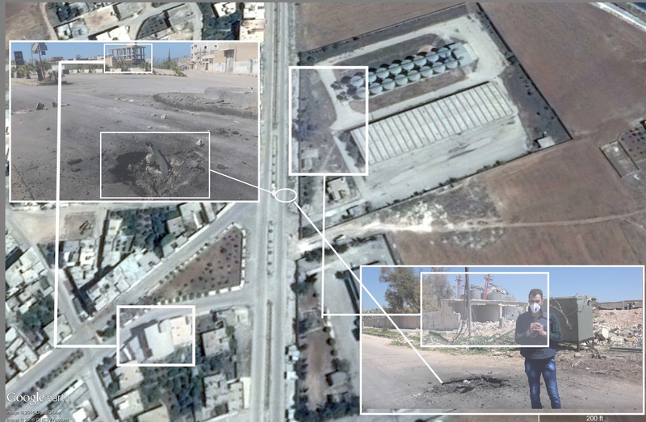
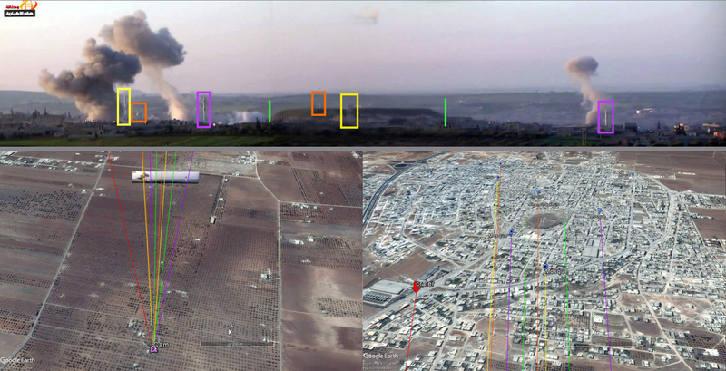
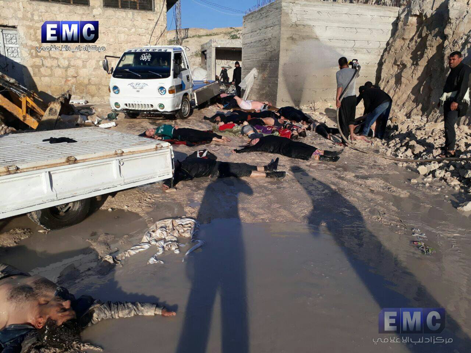
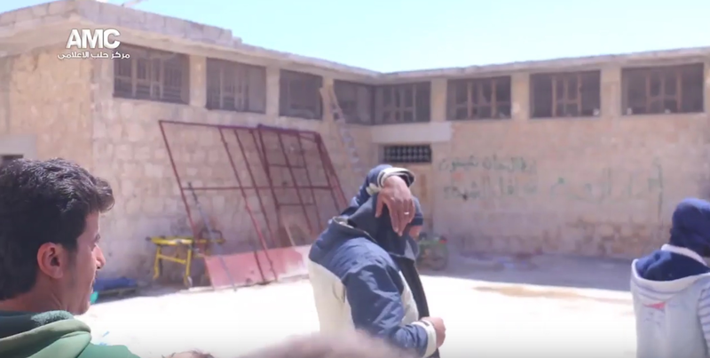
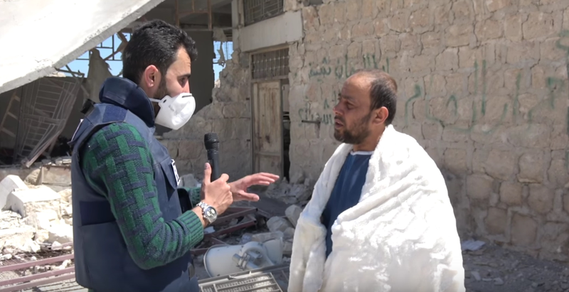

On Tuesday April 4th 2017, videos and images emerged from sources within Syria showing what is claimed to be a chemical weapon attack that targeted [Al Sheikhun](https://goo.gl/maps/T58PgYZrZ8r) south of Idlib.

## Introduction

Initial reports of the attack appeared on social media on the morning of Tuesday April 4th 2017. It was claimed that airstrikes in Khan Sheikhoun, Idlib, had included the use of a chemical agent, which many sources began describing as Sarin. A typical summary of events from these sources is shown below.

<iframe allowfullscreen src="https://www.youtube.com/embed/xFAo7mV73U0" width="760" height="515" frameborder="0">
</iframe>

Translation -- "On 4th April 2017, Khan Al Shekhoun was targeted with 4 rockets by two airstrikes from Sukhoi 22. The civil defense was at the impact site that was targeted with chemical gas. The civil defense were injured. More than 200 injured people were moved to medical clinics. we don't know exactly the number of casualties but we believe it's more than 50 or 60 casualties. The medical team took off cloths from injured people, wash their bodies with water and them getting them inside the medical points. The symptoms were, respiratory distress described as a tightness, yellow foam material coming out from their mouth, and also later on blood came out of the mouth as well."

1:18 -- "Many cases of suffocation are coming to us as a result of gas attacks. Children and women were among the injured. We received more than 70 casualties and 20 casualties so far. We don't know what kind of gas was used."

Photographs and videos from various hospitals treating victims were published online, [collected in this playlist](https://www.youtube.com/playlist?list=PLPC0Udeof3T5wl6rRYrvyGKoAd2W4XG46) along with other relevant videos. These videos showed victims displaying symptoms including pinpoint pupils unreactive to light, foaming at the mouth, and convulsions. While these are consistent with Sarin exposure those symptoms are not exclusive to Sarin exposure. However, based on previous Sarin attacks in Syria and similar symptoms displayed victims in those attacks, some drew the conclusion Sarin was used in the attack. In the below video, in English, Dr Shajul Islam from Binnish hospital, explains the situation in the hospital as it was treating victims of the attack.

<iframe allowfullscreen src="https://www.youtube.com/embed/ZTszOjAZNtI" width="760" height="515" frameborder="0">
</iframe>

During the aftermath of the attack it was also reported that one of the civil defense centers, used as a hospital, was damaged in an airstrike while it was treating victims of the earlier chemical attack. This airstrike, on a civil defense center and a hospital in Khan Sheikhoun that is partly underground, was caught on camera as it occurred:

<iframe allowfullscreen src="https://www.youtube.com/embed/QbePT_ZwO68" width="760" height="515" frameborder="0">
</iframe>

In response to the attack both Syria and Russia rejected the attack was a chemical attack, and the Russian Ministry of Defence stated that a rebel controlled chemical weapons warehouse was struck in Khan Sheikhoun.

## Initial Reports

The first reports of a chemical attack occurring in Khan Sheikhoun appeared online on the morning of April 4th. The following video, claiming to show the airstrike during which the chemical attack occurred, was posted online at 4:59am UTC, as per Amnesty International's [YouTube Data Viewer](http://www.amnestyusa.org/sites/default/custom-scripts/citizenevidence/):

<iframe allowfullscreen src="https://www.youtube.com/embed/MYOMEDK_uVs" width="760" height="515" frameborder="0">
</iframe>

[A tweet](https://twitter.com/Agencynewshaq/status/849129791294930944) by Haq News Agency linking to the same video was published at 5:21am UTC, describing it as "The moment of targeting Khan Sheikhun with chemical rocket 04/04/2017 by Russian airforce". It is possible the original title of the video was changed after the first reports of a chemical attack in Khan Sheikhoun appeared, so it's important to establish when this video was first referred to as showing a chemical attack.

Edlib Media Center [broadcast a live video](https://www.facebook.com/edlibEmc12/videos/1889428304604063/) at 6:22am UTC showing victims of the attack being treated. At 6:24am UTC Dr Shajul Islam, based in Binnish, 50km north of Khan Sheikhoun [tweeted](https://twitter.com/DrShajulIslam/status/849145690613833728) "OUR HOSPITAL GETTING FULL FROM THE SARIN ATTACK TODAY. ANYONE THAT WANTS EVIDENCE, I WILL VIDEO CALL YOU.", and shortly afterwards, at 6:33am UTC a video showing 9 dead children described as victims of a chemical attack was published online ([graphic](https://www.youtube.com/watch?v=v6rqgSGclUw)).

Later statements about the timing of the attack are consistent with the above social media postings:

<iframe allowfullscreen src="https://www.youtube.com/embed/YuvBAWFY0FE" width="760" height="515" frameborder="0">
</iframe>

Translation -- \"We woke up at 7.00am (\_local time, 5am UTC) \_in the morning on the alarm voice of the observatories offices that was saying all ambulances should go to Khan Sheikhoun. I went to Khan Sheikhoun and I rescued children and men there. There are no military bases in the area that was attacked. The last injured case I transferred was a women that I rescued but she died on the way while I was transferring her to the medical clinics. This women had three children and their father didn't know where they are. The regime is responsible for this massacre, he's targeting Idlib liberated areas without military presence so he is deliberate targeting civilians. We have start protesting against this regime, we are not terrorists. Where is everyone, no one is helping us while we are being killed. The Syrian regime is the one created terrorism when attacking civilians and children in Khan Sheikhoun. Why everyone is silence on these crimes.\"

<iframe allowfullscreen src="https://www.youtube.com/embed/p-GhbtRn450" width="760" height="515" frameborder="0">
</iframe>

Translation -- \"Latamneh was targeted on Monday evening at 11:00pm by helicopters. 22 were injured without casualties. Chlorine gas might be used in this attack.

In the same day Al Habeit was targeted which resulted of 17 injured without casualties. Chlorine gas might be used in this attack.

Today, 04 April 2017, at 6.30am (*local time, 4:30am UTC) * Khan Sheikhon was targeted by an airforce. Sarin might be used in this attack. 50 casualties and more than 300 injured. Most the medical points in Idlib are full of injured. Some injuries are in a very dangerous situation because of the lack of medicines and equipment.

It seems that the Syrian regime has prepared for this chemical attack because yesterday Maret Al Numaan national hospital was targeted with three airstrikes at 7.00am in the evening. It is out of service now as a result of the attack. Maret Al Numan national hospital is the main hospital that service the southern countryside of Idlib. It's beneficiaries are around 30.000 people. Most medical services in this area are lacking right now because of the attack on this hospital.

We are treating people by washing them, giving them Etrobin and Oxygen and then referring them to other hospitals if available. Now all medical points in Idlib are totally full. Tomorrow the Turkish authorities told us that they will be able to receive patients to be treated in Turkish hospitals.\"

## The Impact Sites

Photos and videos published on social media and news agency website showed the impact site where the rocket hit. Below is one of the videos published by [Hadi Al Abdallah YouTube channel](https://www.youtube.com/channel/UCo_dRDd4m7fgCNdfwLAPKMA) that clearly shows a crater in the street, reportedly as a result of the attack.

Translation -- "Casualties and injured here in Al Shamali district in Khan Sheikhoun as a result of the Syrian regime airstrikes with rockets that contain chemical gas. More than 70 casualties and 200 injuries as an initial assessment as a result of the airstrikes. We are now in the impact site that was targeted with chemical gas. We were not allowed to be here earlier as the gas smell was spread all over this area. The injured civilians were transferred to the medical points and hospitals for treatment. Some patients were transferred to Turkey and they are waiting on the boarders until it opens for them to go to the hospitals in Turkey. We witness the same massacre here as we have witnessed in few years ago in August 2013 in the countryside of Damascus. We understand from this attack that the Syrian regime didn't give all it's chemicals stock to the OPCW."

01:47 -- "Syrian airstrikes targeted Khan Sheikoun with four rockets, one of them contained chemical gas, it hit a residential area in the northern side of the city. Since the chemical rocket incident until now, the Syrian airforce won't stop hovering over the city and shelling it."

<iframe allowfullscreen src="https://www.youtube.com/embed/0bJw84eXALs" width="760" height="515" frameborder="0">
</iframe>

Photos of the impact site were published by [Warsheh group on their facebook page](https://www.facebook.com/permalink.php?story_fbid=1580000705361859&id=1140855475943053).

\[khan\]\[../assets/b1.jpg\]

Other photos showing the impact site from a different angle were [published by news agencies such as Reuters](https://ichef.bbci.co.uk/news/624/cpsprodpb/9975/production/_95458293_d4234a7b-5817-489f-9e09-e986d4cea8e1.jpg). It was possible to geolocate the crater below based on the video and the photo above.

The geolocation of the above crater, and the footage claiming to show the moment the chemical weapon attack occurred, shows that the crater site is not visible in that video, so that footage would not show the chemical attack if this is the only site where a chemical attack occurred:

Another impact site that was shown in a video published by the [Syrian journalism Center Youtube channel](https://www.youtube.com/channel/UCUuBtxlD8--AB9Q_1LV_Nnw) was also geolocated

Translation -- 2:20 -- "Residential areas were attacked today. There are no presence to any military base in the areas that were targeted by airstrikes. The first rocket hit at 6.30am a location far a bit from here, the second rocket hit this location here."

<iframe allowfullscreen src="https://www.youtube.com/embed/EnZxoLkb474" width="760" height="515" frameborder="0">
</iframe>

While images of the remains of a munition have been [shared online](https://www.facebook.com/maaramediacenter/photos/a.222313004901998.1073741829.221452968321335/239932289806736/?type=3&theater) it has not yet been possible to identify the munition used.

## Hospitals

In the aftermath of the attack victims were taken to hospitals and clinics, some over 50km away from the attack site. In the [videos published](https://www.youtube.com/playlist?list=PLPC0Udeof3T5wl6rRYrvyGKoAd2W4XG46) in the aftermath of the attack it was possible to identify at least 4 separate locations receiving and treating patients. These videos have been collected in separate playlists, and nominally described as [Hospital A](https://www.youtube.com/playlist?list=PLPC0Udeof3T6yQDO4TvcOQPPcS3WikME9), [Hospital B](https://www.youtube.com/playlist?list=PLPC0Udeof3T66dQ7MM9YKhhtjtfjUZQGr), [Hospital C](https://www.youtube.com/playlist?list=PLPC0Udeof3T7mrNLSDaNzsh8_JEnFCd9a), and [Hospital D](https://www.youtube.com/playlist?list=PLPC0Udeof3T4448X5lMbXOWXSECZxE9Dg). Most notable among these was Hospital B, based in Khan Sheikhoun, and bombed on the same day of the chemical attack, as it was treating victims. This location was being used both as a hospital and by local civil defense. The moment was caught on camera by activists in the area:

<iframe allowfullscreen src="https://www.youtube.com/embed/4yLmSJ_X6tk" width="760" height="515" frameborder="0">
</iframe>

A journalist from AFP [was also present when the attack occurred](http://www.independent.co.uk/news/world/middle-east/syrian-civil-war-chemical-weapons-attack-idlib-hospital-bombed-khan-sheikhoun-gas-sarin-chlorine-a7665816.html) and damage to the area can be confirmed by comparing [earlier photographs](https://www.facebook.com/edlibEmc12/photos/pcb.1889429761270584/1889429741270586/?type=3&theater) of the area taken that morning with footage filmed after the airstrike. In the below images, taken before and after the strike, the large building on the left hand side of the image has partly collapsed:

In the below images we can see the opposite side of the building, with green graffiti and a distinct doorway, [before](https://www.youtube.com/watch?v=I9fWxtN6DQ8) and [after](https://www.youtube.com/watch?v=4yLmSJ_X6tk) the bombing:

It's worth noting that the hospital beds appear to be located in areas dug underground, while the structure damaged was being used for storage.

## Denials

While the international community has condemned the attack, the Syrian and Russian governments both denied direct responsibility for the attack, claiming instead a warehouse storing chemical weapons produced by rebel groups was hit. [Sputnik reported the following](https://sputniknews.com/middleeast/201704051052301312-syria-strikes-chemical-weapons-warehouse/):

According to Konashenkov, on Tuesday "from 11.30 to 12.30, local time, \[8.30 to 9.30 GMT\] Syrian aircraft conducted an airstrike in the eastern outskirts of Khan Shaykhun on a large warehouse of ammunition of terrorists and the mass of military equipment".

Konashenkov said that from this warehouse, chemical weapons' ammunition was delivered to Iraq by militants.

Konashenkov added that there were workshops for manufacturing bombs, stuffed with poisonous substances, on the territory of this warehouse. He noted that these munitions with toxic substances were also used by militants in Syria's Aleppo.

Aside from the geographical limitations of transporting chemical weapons across Syria through ISIS and government held territory it is also notable that the time of this supposed attack on a chemical weapons warehouse was hours after the first reports of the attack and images from the attack were published online. It's also worthwhile to note the Russian Ministry of Defence has been [caught lying repeatedly and faking evidence](https://medium.com/@DFRLab/lie-in-the-sky-224186b6e98c), so should be considered extremely unreliable, even when they present evidence to support their claims.

\*\*[\_Investigation original source.](https://www.bellingcat.com/news/mena/2017/04/05/khan-sheikhoun-chemical-attack-evidence-far/) This investigation is a collaboration between Bellingcat and the Syrian Archive. \_\*\*
