On 19 September 2017, just four days after the [Astana International meeting establishing Syria's De-Escalation Zones](http://www.aljazeera.com/news/2017/09/final-de-escalation-zones-agreed-astana-170915102811730.html) in many parts of the country, and only days after[the United Nations' Commission of Inquiry presented findings of a fact-finding](http://webtv.un.org/live-now/watch/commission-of-inquiry-on-the-syrian-arab-republic-press-conference/4473491386001) mission confirming the illegal use of chemical weapons and the systemic targeting of medical facilities by the Syrian government in April 2017, three Idlib medical facilities serving a combined more than 100.000 people yearly were allegedly attacked in airstrikes attributed to Syrian or Russian forces.

One of these facilities, the Rahme hospital in Khan Shaykhoun, was the same facility targeted with airstrikes in the immediate aftermath of the chemical attack on 4 April 2017. The Syrian Archive has [done in-depth open source analysis on this incident](https://syrianarchive.org/en/investigations/Medical-Facilities-Under-Fire/Incident-2.html). The Kafranbel hospital was also previously attacked [on March 25th 2017](https://www.youtube.com/watch?v=srgCm-W_gqM). All three facilities were far from conflict areas, and well within the designated [De-Escalation Zones established](http://www.aljazeera.com/news/2017/09/final-de-escalation-zones-agreed-astana-170915102811730.html) as per an agreement between Russia, Turkey, and Iran.

This report presents in-depth overviews of visual content regarding the three incidents. To cross-reference findings from visual content, flight observation data was provided to the Syrian Archive by an organisation employing a well-developed network of spotters. By examining a variety of sources of information for each attack, the Syrian Archive was able to corroborate and strengthen findings. Visual content gathered and verified by the Syrian Archive was extensively analysed - including in-depth geolocation with satellite imagery. All times provided are in Damascus local time, and in 24-hour format.

Findings regarding these attacks were characterized by repeated bombardments, lack of warnings, and an absence of active military hostilities in the vicinity of the attack. Through collecting, verifying and reporting investigative findings from these incidents, the authors hopes to preserve critical information that may be used for advocacy purposes or as evidence in future proceedings seeking legal accountability.

## Incident 1: The Rahmeh hospital in Khan Shaykhoun

Location: IDLIB : Khan Shaykhoun
Hospital: The Rahmeh hospital in Khan Shaykhoun
Beneficiaries: ~50,000 people
Date: 19/09/2017
Time of Attack: ~ 11:00am
Attacks: Alleged: Two airstrike according to [Hama Health Directorate](https://www.facebook.com/HamaHealthDirectorate/photos/a.491994577596716.1073741829.473950772734430/1334949736634525/?type=3&theater)
Reported killed: None reported
Reported injured: None reported
Munitions identified: Not available
Potentially responsible: Russian air force

Written on the wall "The health care center of Khan Shaykoun"

On 19 September 2017 between 11:00 and 11:45, the Rameh hospital in Khan Shaykhoun was attacked with airstrikes allegedly by Syrian airforce. The hospital served approximately 50.000 - 100.000 people. Khan Shaykoun Hospital was previously attacked on 4 April 2017, immediately after the chemical attack by sarin or a sarin-like substance, confirmed in a [report published by the OPCW.](https://www.opcw.org/fileadmin/OPCW/Fact_Finding_Mission/s-1510-2017_e_.pdf)

For the attack on 19 September, the [first video documenting the attack was published](https://www.youtube.com/watch?v=CAeBtlsiwfE) by Muaz Al Shami's, which showed destruction of the Khan Shaykoun hospital building, as well as fire inside the building. In the video, Al Shami stated: "Most of the hospital equipments have been destroyed. Tow ambulance cars have been destroyed too. The hospital is completely out of service now".
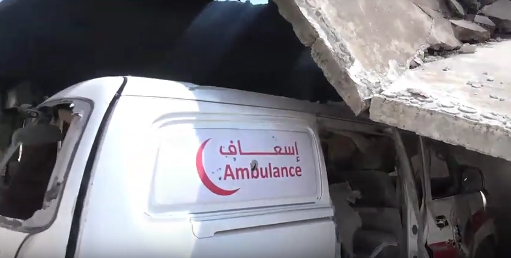

Al Shami conducted an interview with one of the hospital workers, who stated in the video: "On 19 September 2017 the Rahmeh hospital in Khan Shaykhoun was targeted by an airstrike. The hospital serves children and women. Its beneficiaries are around 75.000 to 100.000 people. Two ambulance cars that belong to Sham ambulance system were destroyed."

[Orient news also published a video](https://www.youtube.com/watch?v=eNMQXSkgB1g) of the same incident, reported by Mouhammed Faisal. See below:

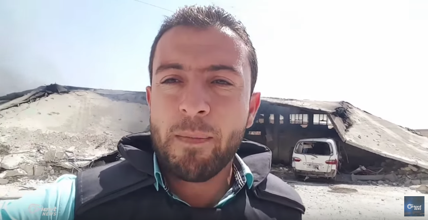

This video shows the total destruction of the hospital. See still below:

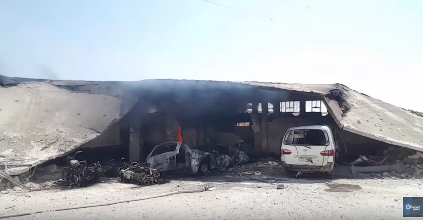

The [Syrian Archive has published an investigation](https://syrianarchive.org/en/investigations/Medical-Facilities-Under-Fire/Incident-2.html)of the previous attack on the hospital on 4 April 2017.A Geolocation from the previous attack is provided below:

Video by Muaz Al Shami and Dorar Al Sham after the attack on Khan Shaykoun on April 4th 2017

Video documentation of the attack on 19 September confirms that the attack has taken place as the same location. See below:

Orient news video captured during the attack on 19-09-2017 compared to satellite images taken in 21-02-2017 and 02-06-2017

Hamah health directorate published a statement about the attack on [their facebook channel](https://www.facebook.com/HamaHealthDirectorate/photos/a.491994577596716.1073741829.473950772734430/1334949736634525/?type=3&theater) saying that the hospital was attacked at 11:00am on 19-09-2017 with two airstrikes which resulted in hospital building damage as well as its equipment and three ambulances.

Additional videos related to this attack are provided below

1.  Video from [Edlib Media Center](https://www.youtube.com/watch?v=Dbpy48dwNNE).

2.  Video from [Assi Press](https://www.youtube.com/watch?v=B_GaDzoTnHs).

To provide a further layer of verification, the Syrian Archive cross-referenced findings from the videos with flight observation data from a spotter organisation. This process necessitated analysing observation data for flights between 7:00 and 15:00, the period directly before and after the reported attack.

Through comparing where flights were observed, the time they were observed, and the direction flights were heading, and comparing this data to geolocation conducted in earlier steps, the Syrian Archive was able to identify a flight potentially responsible for the attack (a fixed-wing Russian aircraft), seen circling the immediate vicinity of the geolocated attack site. Previous research has found that circling flights typically indicate target acquisition and/or preparation for imminent attack. Important to note is that while the aircraft type was Russian, it is possible the flight was operated by the Syrian airforce, rather than the Russian airforce, as the Syrian airforce also operates Russian planes.

## Incident 2: The Rahman hospital in Altah

Location: IDLIB : Altah
Hospital: The Rahman hospital in Altah
Beneficiaries: ~ 2000 children and 2500 women monthly
Date: 19/09/2017
Time of Attack: ~ 1st airstrike: 11:45am - 2nd airstrike 12:15pm - 3rd airstrike 12:25pm
Attacks: Alleged Three Russian airstrike
Reported killed: One killed (Fathyah Khaled Al Arnous) ([Woman staff of the hospital](https://www.facebook.com/ALTIH.TMC/posts/1823828491280562))
Reported injured: Injured included the medical staff of the hospital and 10 civilians (patients)
Munitions identified: Not available
Potentially responsible: Russian or Syrian air force

On 19 September 2017 at around 12:00, the Rahman hospital in Altah was attacked with airstrikes allegedly by the Syrian or Russian airforce. The hospital served approximately 10.000 people.

[Step News Agency has published a video](https://www.youtube.com/watch?v=1Jjim7_908c) showing the first moment of an airstrike that targeted Al Rahman hospital.

<iframe allowfullscreen class="giphy-embed" frameborder="0" height="470" src="https://giphy.com/embed/13yUel7H9OCU0g" width="680"></iframe>

[Qasioun News Agency also published a video](https://www.youtube.com/watch?v=2rVKRbo52so) which features an interview with a member of the Syrian Civil Defence rescue team, who said: "Al Rahman hospital was attacked by a Russian airstrike.After the first airstrike we emptied the hospital of women, children and infants. Generators were on fire as a result of this attack."

Continuing, the Civil Defence volunteer said that the hospital was attacked with three airstrikes which followed each other. "The first airstrike happened which was followed by the second airstrike after 15 minutes, and lastly by the third airstrike after 5 minutes."

Anas Al Merawi also [published a video showing](https://www.facebook.com/100010399271536/videos/vb.100010399271536/497069380649700/?type=2&theater) the Syrian Civil Defence rescue team distinguishing the fire. "19 September 2017: The targeting of infant, children, and women's hospital in Idlib countryside. It doesn't have any relation to the clashes happening in northern countryside of Hammah. One women patient was killed as a result of this attack. There were many patients as well. There is huge destruction of the infant department as well as the birth department.

[Smart News Agency also published a video](https://www.youtube.com/watch?v=JqYnn5J5AX4) which showed an ambulance and a car destroyed as a result of the attack.

Another [video showing the same ambulance](https://www.youtube.com/watch?v=kVd2AFqikhk) was published by Muaz Al Shami on his YouTube channel. See below:

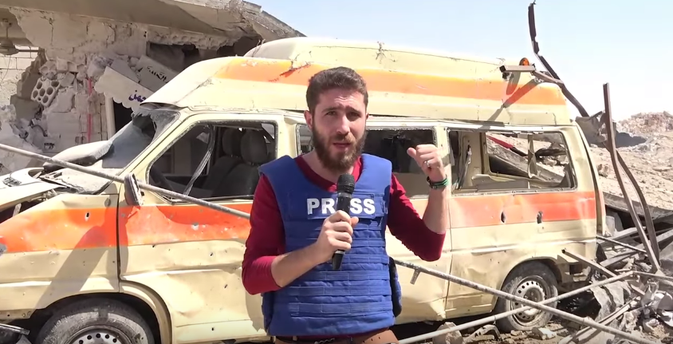

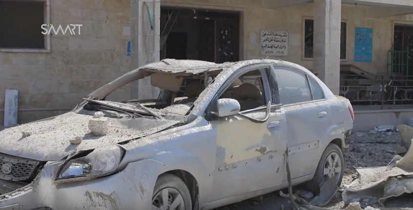

In the video, it is possible to read a sign next to the door saying "This hospital was set up by the non-profit association Ihsan in 2016." See below:

Another sign was featured in the same video with the following text:"Al Rahman Charitable Specialist Hospital - Women, Birth, Children - 24 hours emergency"

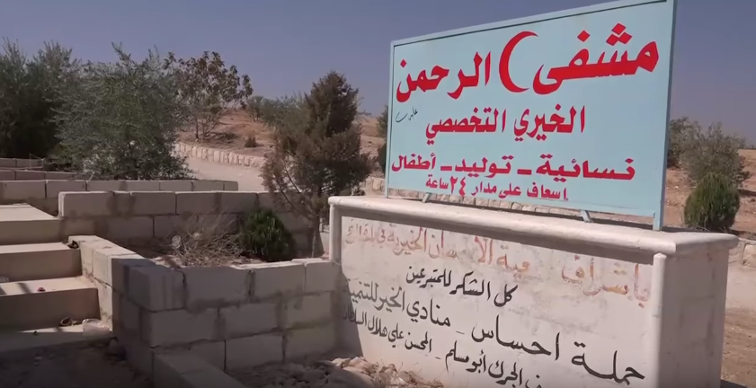

SMART News Agency's reporter took some footage inside the hospital which shows a sign reading: "Infant section." See below:

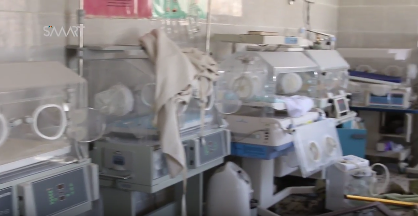

Muaz Al Shami's video shows cards posted on the infant incubator. The text written on one of them:"Name: Nour Alshoun - Gender: Female - Father's name: Omar - Date: 18-09-2017." See below:

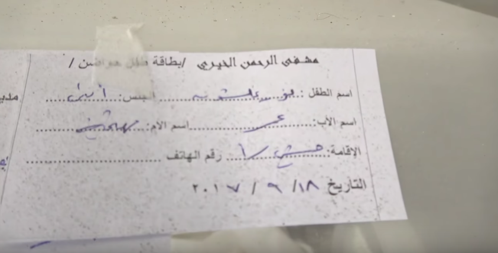

Other departments of the hospital able to be identified through the SMART News video include: ""Women's Section." See below

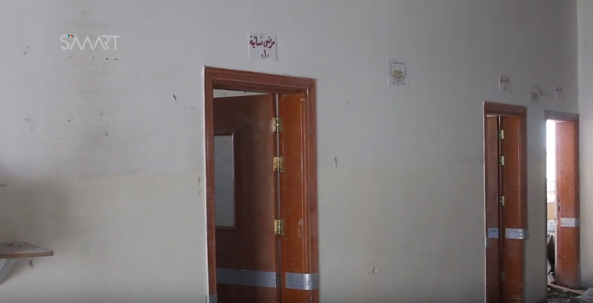

There is also an "Emergency and radiology department." See below:
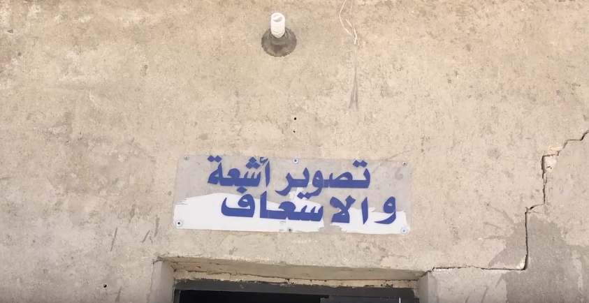

In an interview from the same video, a member of the medical facility staff stated: "A few members of the hospital staff were injured, including the administration director. One of the women staff died as a result of the attack. The medical facility is out of service now as a result of this attack."

Another staff member stated in the same video: "The destruction of the hospital included the Emergency department - X-Ray department - the infant department, the women's department, and the birth department. We moved one of the children from Altah hospital into the university hospital before the attack. We heard about the attack on Altah hospital while we were in the university hospital, so we came back to move the infants to Telmenes hospital and other medical facilities that are close to this area."

A panoramic image of the damaged hospital was created using stills from [Muaz Al Shami video](https://www.youtube.com/watch?v=kVd2AFqikhk). See below:

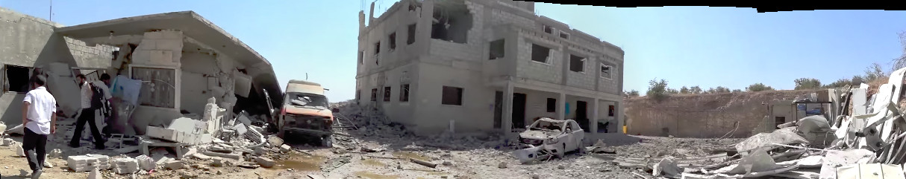

Additional satellite imagery was obtained from DigitalGlobe, from which further geolocation of the hospital was possible. See below:

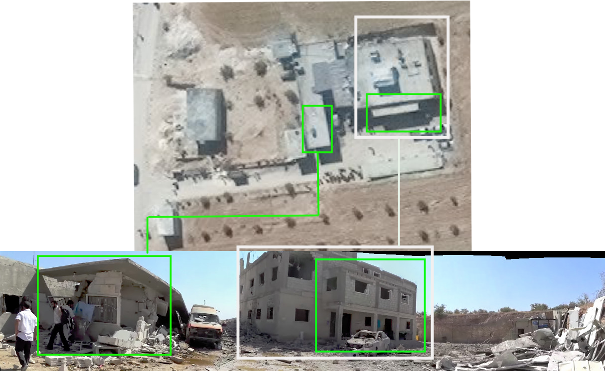
Additional video documentation of this incident are provided below:

1.  [Video of Aladeyeh](https://www.youtube.com/watch?v=xL_S1vkzBKA) media channel showing the damage in the hospital.

2.  [Video of Eye On Homeland](https://www.youtube.com/watch?v=eQHvrWI3s20) media agency

3.  [Video of Civil defense](https://www.youtube.com/watch?v=N_nrvqA8mw8) team rescue mission

4.  [Video of Shaam Network media](https://www.youtube.com/watch?v=KP8XYUSD6o4) agency

5.  [Video of Barada News](https://www.youtube.com/watch?time_continue=1&v=sDHG9Rnev8w)

6.  [Video from OGN](https://www.youtube.com/watch?v=JOZZhFWFR-w) channel

To provide a further layer of verification, the Syrian Archive cross-referenced findings from the videos with flight observation data from a spotter organisation. This process necessitated analysing observation data for flights between 7:00 and 15:00, the period directly before and after the reported attack.

Through comparing where flights were observed, the time they were observed, and the direction flights were heading, and comparing this data to geolocation conducted in earlier steps, the Syrian Archive was able to identify several flights potentially responsible for the attack (several fixed-wing Russian aircraft as well as a MiG-23 Flogger), seen circling the immediate vicinity of the geolocated attack site. Previous research has found that circling flights typically indicate target acquisition and/or preparation for imminent attack. Important to note is that while the aircraft type were all Russian, it is possible the flights were operated by the Syrian airforce, rather than the Russian airforce, as the Syrian airforce also operates Russian planes.

## Incident 3: The Kafranbel Hospital

Location: IDLIB : Kafranbel
Hospital: The Kafranbel Hospital
Beneficiaries: ~ 3000 people Monthly
Date: 19/09/2017
Time of Attack: First airstrike: 10:30, Second airstrike: 10:35, Third airstrike: 10:40
Attacks: Alleged three Russian airstrikes
Reported killed: No reports
Reported injured: One injured was standing outside of the hospital
Munitions identified: Not available
Potentially responsible: Russian or Syrian air force

On 19 September 2017 at approximately 10:30am, the Kafranbel hospital was attacked with three airstrikes allegedly by the Syrian or Russian airforce. The hospital served approximately 3000 people.

Radio Fresh [published a video](https://www.facebook.com/Radio.Fresh.90.00FM/videos/1663365057041915/) documenting the first moments of the attack, as their photographer was there.

Eye on Homeland News Agency also [published a video](https://www.youtube.com/watch?v=eYUZlbUKH2k) that showed the sign of the hospital including the name and logo of the supporting organisation ([Hand in Hand for Syria](https://hihfad.org/)). The organisation describes itself on the website stating: "Hand in Hand for Syria is a UK registered charity that was set up soon after the start of the conflict in Syria in 2011. Established by a group of British-Syrians, the charity has grown to become a leading humanitarian force inside the country." See below:

The video also shows a small building damaged as a result of this attack and previous attack that targeted the same hospital on [on March 25th 2017](https://www.youtube.com/watch?v=srgCm-W_gqM). See below:

Ma'ara Media Center's Mohammed Al Daher also [published a video](https://www.youtube.com/watch?v=2RJ-k5jXopQ) which shows a crater located in front of the hospital as a result of the attack. See below:

In an interview from the video, one of the survivors stated: "We were working, then we saw the airforce which targeted us and we didn't expect it."

Another [photo published on the Facebook page](https://www.facebook.com/maaramediacenter/photos/pcb.311922602607704/311922422607722/?type=3&theater) of Marra Media Center shows the same crater in front of the hospital. See below:

SMART News Agency [published a video](https://www.youtube.com/watch?v=M3zsuyum6QQ) showing the entrance to the hospital. In the same video, one of the hospital staff members stated in an interview: "We were working on an emergency case when the airstrike happened. We don't have injured from the medical staff but, one girl was injured in her back, as she was standing outside the hospital."

The Syrian Archive used frames from this video to create a panoramic view of the entrance to the hospital. See below:

This, combined with additional satellite imagery obtained from DigitalGlobe, allowed for geolocation of the hospital was possible. See below:

Additional video documentation of this incident are provided below:

1. Video of [RFS Video](https://www.youtube.com/watch?v=bMSlVYcQ58Y) showing the moment of the airstrike from distance.

2. Video of [Al dorar Al shamya](https://www.youtube.com/watch?time_continue=1&v=UUNMoSiSQEU) showing the moment of the airstrike from distance.

3. Video of [Idlib Media Center EMC](https://www.youtube.com/watch?v=6nMggXpfu0Q) showing the first moment of the airstrike from distance.

4. Video of [citizen journalist Mustafa Hussein](https://www.youtube.com/watch?v=o2JKLgQyFk0) showing the attack from distance.

To provide a further layer of verification, the Syrian Archive cross-referenced findings from the videos with flight observation data from a spotter organisation. This process necessitated analysing observation data for flights between 7:00 and 15:00, the period directly before and after the reported attack.

Through comparing where flights were observed, the time they were observed, and the direction flights were heading, and comparing this data to geolocation conducted in earlier steps, the Syrian Archive was able to identify several flights potentially responsible for the attack (all fixed-wing Russian aircraft), seen circling the immediate vicinity of the geolocated attack site. Previous research has found that circling flights typically indicate target acquisition and/or preparation for imminent attack. Important to note is that while the aircraft type were all Russian, it is possible the flights were operated by the Syrian airforce, rather than the Russian airforce, as the Syrian airforce also operates Russian planes.
