في 19 سبتمبر - أيلول 2017، وبعد أربعة أيام فقط من مؤتمر[أستانة الدولي لتفعيل مناطق تخفيف التوتر في أماكن عديدة](http://www.aljazeera.com/news/2017/09/final-de-escalation-zones-agreed-astana-170915102811730.html) من سوريا، وبعد عدة أيام فحسب من تقديم[لجنة التحقيق التابعة للأمم المتحدة نتائج بعثة تقصي الحقائق](http://webtv.un.org/live-now/watch/commission-of-inquiry-on-the-syrian-arab-republic-press-conference/4473491386001) والتي أكّدت الاستخدام غير المشروع للأسلحة الكيماوية والاستهداف العام للمنشآت الطبية من قبل الحكومة السورية في نيسان - أبريل 2017، زُعم أن ثلاث منشآت طبية هوجمت بغارات جوية نُسبت للقوات السورية أو الروسية، تقدّم هذه المنشآت خدماتها الطبية لما مجموعه أكثر من 100,000 شخص سنويا.

إحدى هذه المنشآت، مستشفى الرحمة في خان شيخون، هي المنشأة نفسها التي استهدفتها الغارات الجوية مباشرة عقب الهجوم الكيميائي في 4 نيسان - أبريل 2017. وقد أجرى الأرشيف السوري[تحليلا معمقًا ومفتوح المصدر حول هذه الحادثة](https://syrianarchive.org/ar/investigations/Medical-Facilities-Under-Fire/Incident-2.html). وكان مستشفى كفرنبل قد هوجم سابقًا في[25 مارس - آذار 2017](https://www.youtube.com/watch?v=srgCm-W_gqM). المنشآت الثلاث جميعها بعيدة عن مناطق الصراع، وتقع تمامًا ضمن[مناطق تخفيف التوتّر](http://www.aljazeera.com/news/2017/09/final-de-escalation-zones-agreed-astana-170915102811730.html) المحدّدة بموجب اتفاق بين روسيا وتركيا وإيران.

يُقّدم هذا التقرير نظرة عامّة معمّقة على المحتوى البصري المتعلّق بالحوادث الثلاث. ولمقاطعة المعلومات مع نتائج تحليل المحتوى البصري، تم تزويد "الأرشيف السوري" ببيانات مراقبة الرحلات الجوية من قبل منظمة تستخدم شبكة متطورة من المراصد (مراقبي الرحلات الجوية) للطائرات. من خلال دراسة مجموعة متنوعة من مصادر المعلومات لكل هجوم، تمكّن "الأرشيف السوري" من إثبات النتائج وتعزيزها. تم تحليل المحتوى البصري المجموع والمحقق منه من قبل الأرشيف السوري بشكل موسّع، بما في ذلك التحديد الدقيق للموقع الجغرافي باستخدام صور الأقمار الصناعية. حُدّدت كل الأوقات المذكورة وفقًا للتوقيت المحلي لمحافظة دمشق، وبصيغة 24 ساعة.

تتسم النتائج المتعلقة بهذه الهجمات بتكرار القصف، غياب الإنذار المسبق، وعدم وجود نشاطات عسكرية قتالية على مقربة من مكان الهجوم. من خلال الجمع، التحقق، والإعلان عن نتائج التحقيق في هذه الحوادث الثلاث، يأمل المؤلّفون في الحفاظ على معلوماتٍ حسّاسة يمكن استخدامها لأغراض المناصرة أو كأدلة في المحاكمات المستقبلية في سبيل المساءلة القانونية.

## الحادثة الأولى: مستشفى الرحمة في خان شيخون

الموقع: ادلب: خان شيخون
المستشفى: مستشفى الرحمة في خان شيخون
عدد المستفيدين من خدمات المستشفى: بحدود 50,000 شخص
التاريخ: 19/09/2017
توقيت الهجوم: 11:00 صباحًا تقريبًا
الهجمات المزعومة: غارتان جويتان[وفقًا لمديرية صحّة حماة](https://www.facebook.com/HamaHealthDirectorate/photos/a.491994577596716.1073741829.473950772734430/1334949736634525/?type=3&theater)
القتلى المبلّغ عنهم: لم يبلغ
الجرحى المبلّغ عنهم: لم يبلّغ
الذخائر المحدّدة: غير متوافرة
المسؤول المحتمل: القوات الجوية الروسية

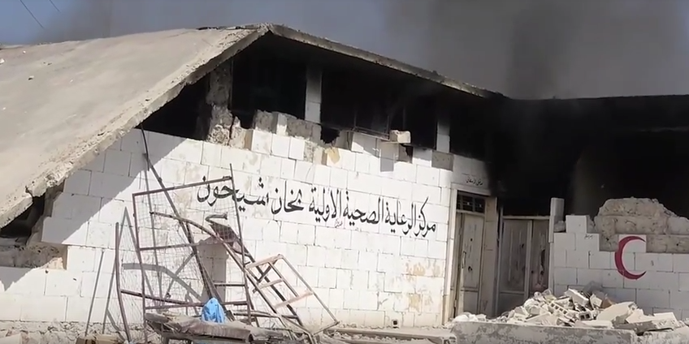
[Written on the wall "The health care center of Khan Shaykoun"]

في 19 أيلول - سبتمبر 2017، وما بين الساعة 11:00 إلى 11:45 صباحًا، هوجمت مستشفى الرحمة في خان شيخون بغارات جوية زُعم أنها من قبل القوات الجوية السورية. تقدم المستشفى خدماتها الطبية لما يقارب 50,000 - 100,000 شخص. هوجمت مستشفى خان شيخون سابقًا في 4 نيسان - أبريل 2017، مباشرة عقب هجوم بالأسلحة الكيميائية بغاز السارين أو مادة شبيهة بالسارين،[تم تأكيده بتقرير نشرته منظمة حظر الأسلحة الكيميائي](https://www.opcw.org/fileadmin/OPCW/Fact_Finding_Mission/s-1510-2017_e_.pdf)ة.

[نُشر أول مقطع فيديو يوثّق هجوم 19 أيلول - سبتمب](https://www.youtube.com/watch?v=CAeBtlsiwfE)ر من قبل معاذ الشامي، ويظهر فيه الدمار في بناء مستشفى خان شيخون، إضافة للحريق داخل المبنى. قال الشامي في مقطع الفيديو: "احترقت المعدات بشكل كامل، سيارتا إسعاف احترقوا بشكل كامل، إضافة لتدمير المشفى وخروجه عن الخدمة تمامًا".

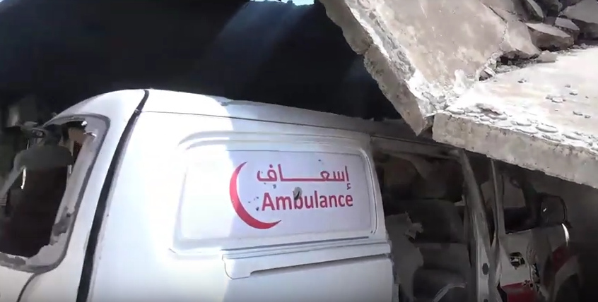

أجرى الشامي مقابلة مع أحد العاملين بالمستشفى، والذي قال في مقطع الفيديو: "في 19 أيلول 2017 استُهدفت مشفى الرحمة بخان شيخون، تعالج هذه المشفى الأطفال والنساء، وتخدّم ما يقدر بين 75,000 و 100,000 نسمة، استهدف الطيران هذه المشفى فخرجت عن الخدمة، وخرجت عن الخدمة سيارتا إسعاف لمنظومة شام الإسعافية".

[نشرت قناة أورينت نيوز مقطع فيدي](https://www.youtube.com/watch?v=eNMQXSkgB1g)و للحادثة نفسها، أٌعد من قبل محمد فيصل، انظر أدناه:

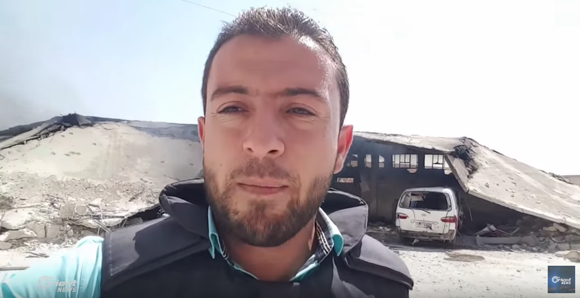

يظهر الفيديو الدمار الكامل في المستشفى، انظر أدناه:

[نشر "الأرشيف السوري" تحقيقًا عن الهجوم السابق](https://syrianarchive.org/ar/investigations/Medical-Facilities-Under-Fire/Incident-2.html) على المستشفى في 4 نيسان - أبريل 2017، فيما يلي الموقع الجغرافي للهجوم السابق:

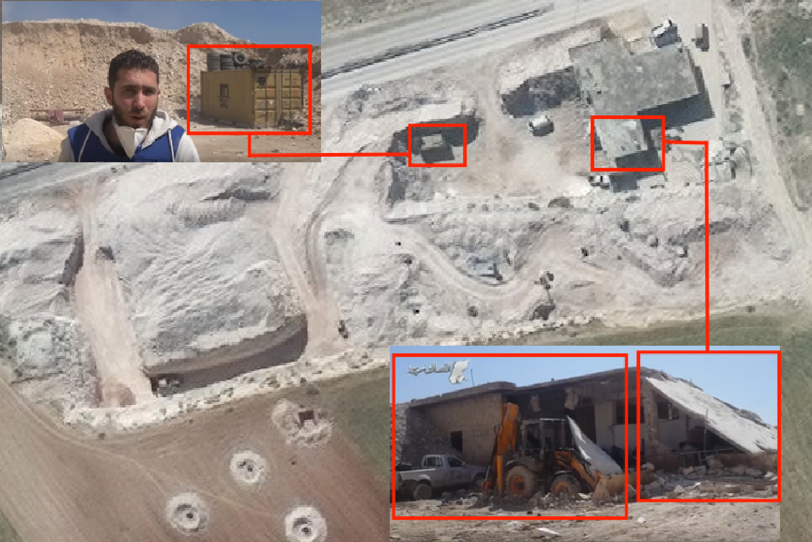

فيديو من قبل معاذ الشامي ودرر الشام بعد الهجوم على خان شيخون في الرابع من أبريل - نيسان 2017

يؤكد التوثيق المصوّر لحادثة 19 أيلول أن الهجوم وقع في الموقع الجغرافي ذاته، انظر أدناه:

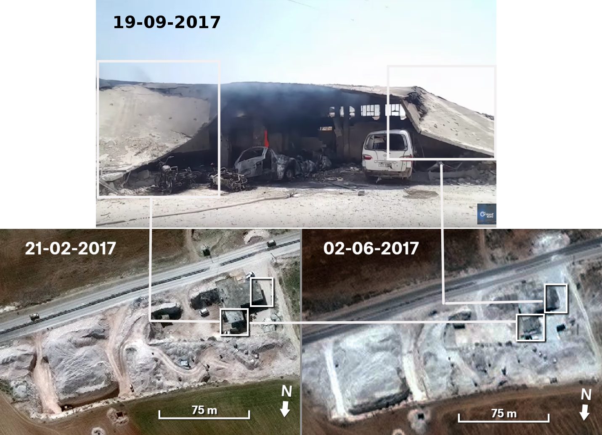

لقطة من مقطع فيديو أورينت نيوز لهجوم 19-09-2017، مقارنة مع صور أقمار صناعية التُقطت في 21-02-2017 و 02-06-2017

نشرت مديرية صحة حماة بيانًا عن الهجوم على[صفحتهم على موقع فيسبو](https://www.facebook.com/HamaHealthDirectorate/photos/a.491994577596716.1073741829.473950772734430/1334949736634525/?type=3&theater)ك، قالوا فيه أن المستشفى هوجمت في الساعة 11:00 صباحًا من يوم 19-09-2017 بغارتين جويتين، ما تسبب بأضرار في بناء المشفى، إضافة إلى تعطيل في المعدات واحتراق ثلاث سيارات إسعاف.

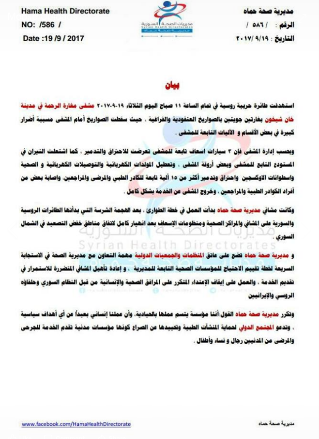

فيما يلي مقاطع فيديو إضافية متعلقة بهذا الهجوم:

1.  فيديو:[غارات روسية على خان شيخون بريف ادلب](https://www.youtube.com/watch?v=Dbpy48dwNNE)

2.  فيديو:[نشوب حرائق في مشفى "الرحمة" بمدينة خان شيخون بعد أن استهدفها الطيران بعدة غارات جوية](https://www.youtube.com/watch?v=B_GaDzoTnHs)

ومن أجل التحقق بشكل أكبر، قام الأرشيف السوري بتحليل بيانات مراقبة رحلات الطيران التي تم تقديمه من قبل منظمة تعمل في مجال الرصد، وشمل ذلك تحليل بيانات مراقبة الرحلات الجوية بين الساعة 07:00، والساعة 15:00، وهي الفترة التي سبقت وتلت الهجوم مباشرة:

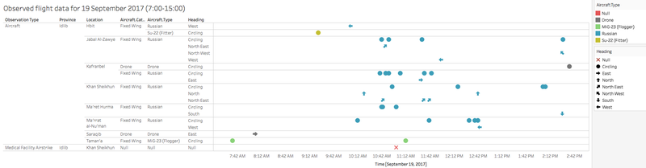

ومن خلال المقارنة بين الرحلات الجوية التي تمت مراقبتها، والوقت الذي تمت مراقبتها به، ومسارها وجهتها، ومقارنة هذه البيانات مع الموقع الجغرافي الذي تم تحديده في خطوات سابقة، تمكن "الأرشيف السوري" من تحديد رحلة جوية يحتمل أنها مسؤولة عن الهجوم (طائرة روسية ثابتة الجناحين) شوهدت تطوف بشكل قريب جدا حول الموقع الجغرافي للهجوم.

وقد خلُصت أبحاث سابقة إلى أن الرحلات الجوية التي تطوف بشكل دائري تشير عادة إلى تحديد الهدف و/أو التحضير لهجوم وشيك. تجدر الإشارة إلى أنه على الرغم من أن نوع الطائرة كان روسيًّا، إلا أنه من الممكن أن يتم تنفيذ الرحلات من قبل القوات الجوية السورية بدلًا من القوات الجوية الروسية، حيث تستخدم القوات الجوية السورية طائرات روسيّة أيضًا.

## الحادثة الثانية: مشفى الرحمن في بلدة التح

الموقع: إدلب : التح
المستشفى: مشفى الرحمن في التح
عدد المستفيدون: قرابة 2000 من الأطفال و 2500 من النساء شهريًا
التاريخ: 19/09/2017
وقت الهجوم: الغارة الجويّة الأولى 11:45 صباحًا، الغارة الجوية الثانية 12:15 مساءً، الغارة الجوية الثالثة 12:25 مساءً
الهجمات: يُزعم بأنها ثلاث غارات جويّة روسية
القتلى المبلغ عنهم: شخص واحد (فتحية خالد العرنوس) ([موظفة في المستشف](https://www.facebook.com/ALTIH.TMC/posts/1823828491280562)ى)
الجرح المبلغ عنهم: أصيب الطاقم الطبي العامل في المستشفى بجروح بالإضافة إلى عشر مدنيين (من المرضى).
الذخائر المُستخدمة: غير متوفر
المسؤول المحتمل: القوات الجوية الروسيّة أو السورية

في 19 إيلول / سبتمبر 2017 في حوالي الساعة 12:00 ظهرًا، تعرّض مستشفى الرحمن في التح لهجوم بقصف جويّ من قبل القوات الجويّة السورية أو الروسية. علمًا أن المستشفى يخدم حوالي 10.000 من الأشخاص

[وقد نشرت وكالة خطوة الإخبارية فيديو](https://www.youtube.com/watch?v=1Jjim7_908c) يُظهر أول لحظة من الغارة الجوية التي استهدفت مستشفى الرحمن.

[ونشرت وكالة قاسيون أيضًا شريط فيدي](https://www.youtube.com/watch?v=2rVKRbo52so)و يتضمن مقابلة مع أحد أعضاء فريق الإنقاذ من الدفاع المدني السوري، قال فيه: "تعرضت مُستشفى الرحمن لغارات جوية من قبل الطيران الجوي الروسي، حيث أسفرت الغارة الأولى عن اشتعال النيران في المولدات الكهربائية، وأسرعنا لإفراغ المستشفى من النساء والأطفال والرضع إثر هذا الهجوم".

وتابع متطوع الدفاع المدني قائلًا بأن المستشفى استهدفت بثلاث غارات جويّة تلت بعضها البعض. وأضاف "بعد الغارة الجوية الأولى اُستهدف المستشفى بغارة ثانية بعد 15 دقيقة، ثم بعدها بخمسة دقائق تلتها غارة جوية ثالثة".

كما نشر أنس المعراوي[شريط فيديو يُظهر فريق الإنقاذ](https://www.facebook.com/100010399271536/videos/vb.100010399271536/497069380649700/?type=2&theater) من الدفاع المدني السوري وهو يخمد الحرائق "19 إيلول 2017: استهداف مشفى الأطفال والتوليد، مشفى الرحمن النسائي في ريف إدلب، والذي لا علاقة له بالاشتباكات التي تحدث في ريف حماة الشمالي. قتلت امرأة واحدة نتيجة لهذا الهجوم، بالإضافة إلى عدد من الجرحى من المرضى المراجعين. هناك دمار كبير لقسم الحاضنات وكذلك قسم التوليد".

كما[نشرت وكالة سمارت للأنباء شريط فيدي](https://www.youtube.com/watch?v=JqYnn5J5AX4)و يُظهر سيارة إسعاف وسيارة مدنية دُمرتا نتيجةً للهجوم.

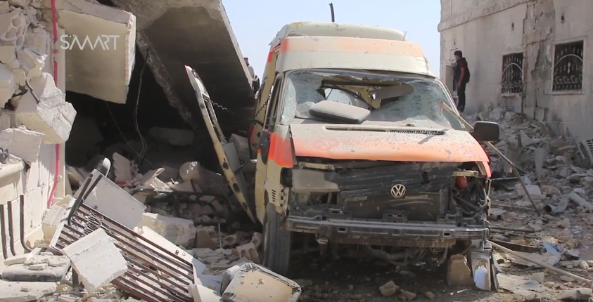

كما نُشر فيديو آخر من قبل معاذ الشامي في قناته على اليوتيوب[يُظهر نفس سيارة الإسعاف](https://www.youtube.com/watch?v=kVd2AFqikhk)، انظر أدناه:

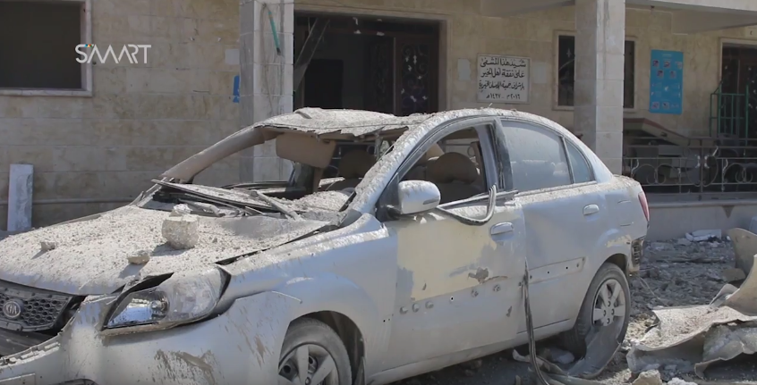

في الفيديو، من الممكن قراءة اللافتة بجوار الباب والتي تقول "شُيّد هذا المشفى على نفقة أهل الخير بإشراف جميعة الإحسان الخيرية في عام 2016". انظر أدناه:

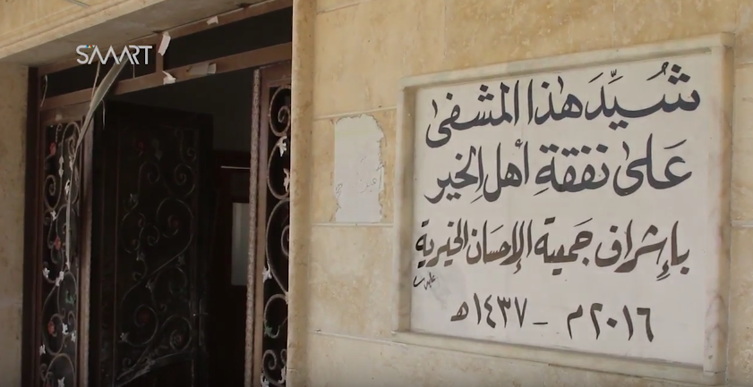

وظهرت لافتة أخرى في نفس الفيديو بالنصّ التالي: "مستشفى الرحمن الخيري التخصصي. نسائية - توليد - أطفال. اسعاف على مدار 24 ساعة".

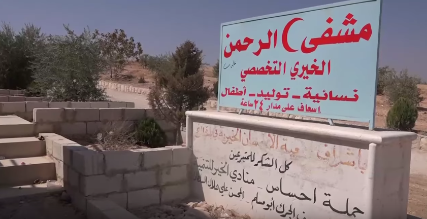

والتقط مراسل وكالة سمارت للأنباء بعض اللقطات داخل المستشفى والتي تُظهر اللافتة التالية: "[قسم] الحواضن". انظر أدناه:

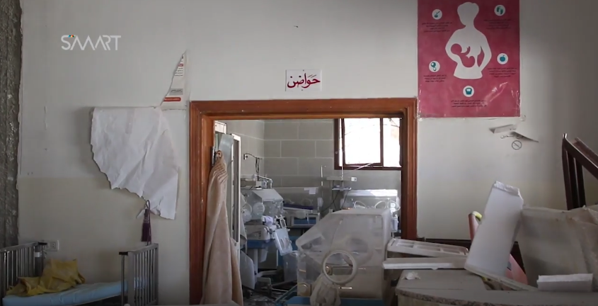

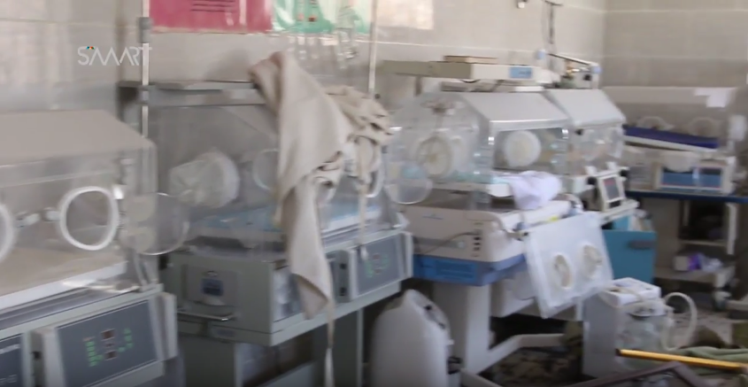

ويُظهر فيديو معاذ الشامي بطاقات عُلقت على الحواضن، اللقطة التالية تُظهر أحدها وقد كُتب عليها "اسم الطفل: نور الشون، الجنس: أنثى، اسم الأب: عُمر، التاريخ: 18-09-2017". انظر أدناه:

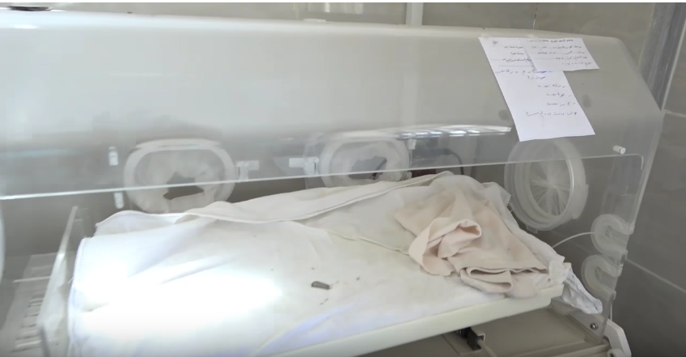

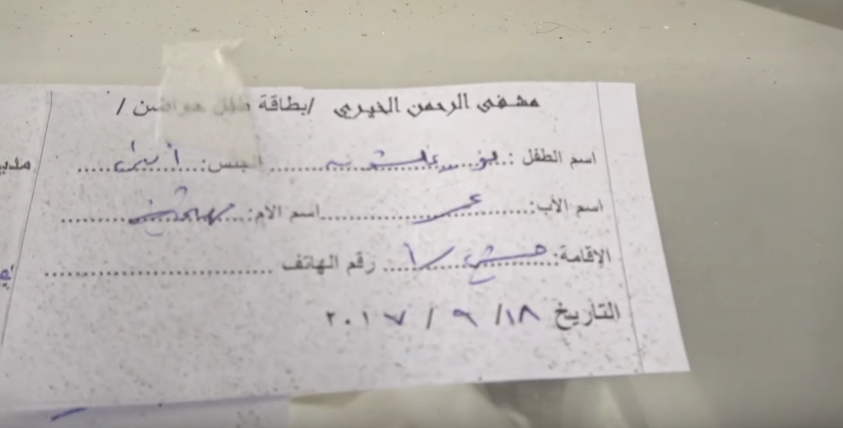

وتشمل أقسام المستشفى الأخرى والتي يُمكن التعرّف عليها من خلال فيديو سمارت نيوز "قسم مرضى النسائية" انظر أدناه:

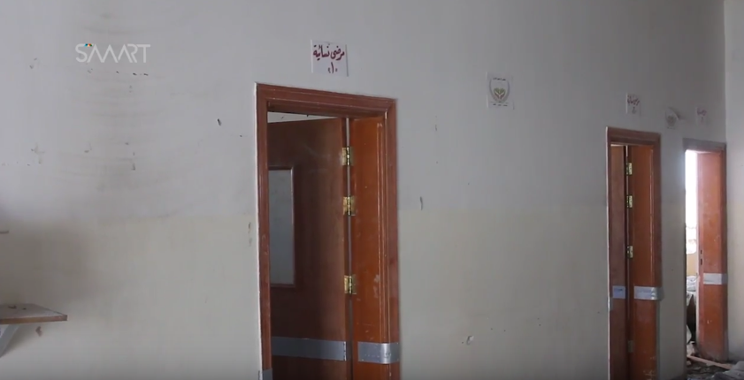

بالإضافة إلى قسم "الأشعة والإسعاف". انظر أدناه:

وفي مقابلة بنفس الفيديو قال أحد الموظفين العاملين في المؤسسة الطبية "أصيب عدد من العاملين في المستشفى، بما فيهم مدير القسم الإداري. وتوفيت إحدى الموظفات نتيجة الهجوم. المنشأة الطبية خارج الخدمة الآن نتيجةَ لهذا الهجوم".

وقال موظف آخر في نفس الفيديو "الدمار في المستشفى شمل قسم الإسعاف، قسم الأشعة السينية - قسم الرضع - وقسم التوليد. نقلنا أحد الأطفال من مشفى التح إلى المستشفى الجامعي قبل الهجوم، وحينها سمعنا بالهجوم على مستشفى التح لذا عدنا لنقل الرضع إلى مستشفى تلمينس والمرافق الطبية الأخرى القريبة من هذه النقطة".

كما تم إنشاء صورة بانورامية للمستشفى المستهدف باستخدام اللقطات الثابتة[من فيديو معاذ الشامي](https://www.youtube.com/watch?v=kVd2AFqikhk). انظر أدناه:

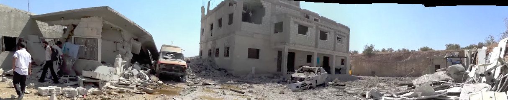

وتم الحصول على صور إضافية من الأقمار الصناعية من DigitalGlobe والذي يمكن من خلاله تحديد الموقع الجغرافي للمشفى. انظر أدناه:

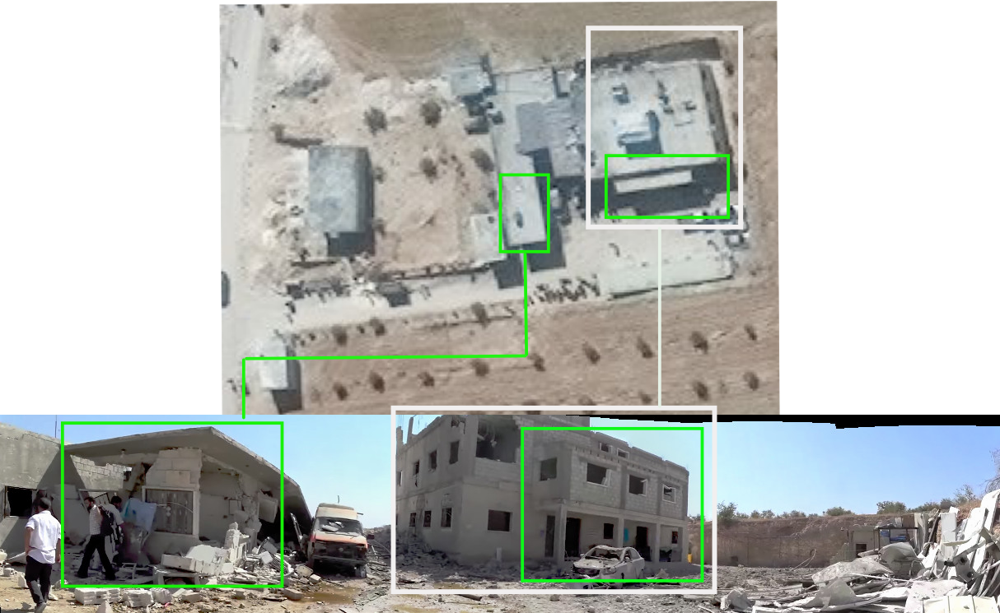

وفيما يلي وثائق فيديو إضافية عن هذا الحادث:

1. فيديو:[الطائرات الروسية تدمر مشفى التوليد في بلدة "التح" بشكل كامل](https://www.youtube.com/watch?v=xL_S1vkzBKA)

2. فيديو:[شاهد الدمار الذي خلفته الطائرات الحربية إثر الغارات التي نفذتها على مشفى الرحمن في بلدة التح](https://www.youtube.com/watch?v=eQHvrWI3s20)

3. فيديو:[الدفاع المدني -اخماد حريق مشفى الرحمن ببلدة التح بريف معرة النعمان](https://www.youtube.com/watch?v=N_nrvqA8mw8)

4. فيديو:[قصف مشفى الرحمن قي بلدة التح 19/9/2017 ريف ادلب الجنوبي الشرقي - بلدة التح](https://www.youtube.com/watch?time_continue=1&v=sDHG9Rnev8w)

5. تغريدة:[الطيران الروسي يدمر مشفى التوليد في بلدة #التح](https://twitter.com/MOAZALSHAMY/status/910130188922576897)

وبغرض إضافة طبقة أخرى من التحقق؛ قارن الأرشيف السوري النتائج المستخلصة من مقاطع الفيديو مع بيانات رصد الطيران من قبل منظمة مراقبة. استلزمت هذه العملية تحليل بيانات رصد الطيران ما بين الساعة 07:00 و 15:00، وهي الفترة الزمنية التي سبقت الهجوم وتلته مباشرة. انظر أدناه:

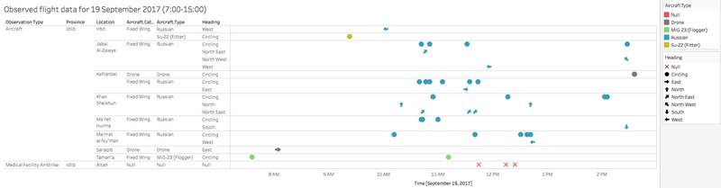

من خلال مقارنة الرحلات الجوية المرصودة، والوقت الذي رُصدت به، ووجهات هذه الرحلات، ومقارنة هذه البيانات مع المواقع الجغرافية المقدّمة في الخطوة السابقة؛ تمكّن الأرشيف السوري من تحديد العديد من الرحلات المحتملة المسؤولة عن هذا الهجوم (عدّة طائرات روسية ثابتة الجناح، بالإضافة إلى طائرة من طراز ميغ-23 فلوجر) حيث شوهدت هذه الطائرات تُحلق فوق المنطقة الجغرافية للهجوم. وقد خلصت التحقيقيات السابقة إلى أن الطيران الدائري في السماء عادةً ما يُشير إلى محاولة الاستحواذ على الهدف أو التحضير لهجوم وشيك. تجدر الإشارة إلى أنه وعلى الرغم من أن نوع الطائرات المرصودة روسية، فمن الممكن أنه يكون قد تم تشغيل هذه الرحلات الطلعات الجوية من قبل القوات الجوية السورية بدلًا من القوات الجوية الروسية. حيث تقوم القوات الجوية السورية بتشغيل الطيران الحربي الروسي أحيانًا.

## الحادثة 3: مستشفى كفرنبل

الموقع: إدلب: كفرنبل
المستشفى: مستشفى كفرنبل
المستفيدون: ~ 3000 شخص شهريا
التاريخ: 19/9/2017
وقت الهجوم: الغارة الجوية الأولى: 10:30، الغارة الجوية الثانية: 10:35، الغارة الجوية الثالثة: 10:40
الهجمات: ثلاث غارات جوية روسية مزعومة
القتلى المبلغ عنهم: لا يتم الإبلاغ عن وقوع قتلى
الجرحى المبلغ عنهم: جريح واحد كان يقف كان يقف خارج المشفى
الذخائر التي تم تحديدها: لم يتم تحديد الذخائر المستخدمة
المسؤول المحتمل عن الهجوم: القوات الجوية الروسية أو السورية

وفي 19 أيلول / سبتمبر 2017 في حوالي الساعة 10:30 صباحا، تعرض مستشفى كفرنبل لهجوم بثلاث غارات جوية يزعم أن القوات الجوية السورية أو الروسية هي من نفذت الهجوم. وهذا المستشفى يخدم حوالي 3000 شخص.

راديو "فريش"[نشر فيدي](https://www.facebook.com/Radio.Fresh.90.00FM/videos/1663365057041915/)و يوثق اللحظات الأولى من الهجوم، حيث أن مصورهم كان متواجداً في موقع الحادثة.

كما[نشرت وكالة "عين على وطن أيضا فيدي](https://www.youtube.com/watch?v=eYUZlbUKH2k)و يظهر لافتة المستشفى والتي تتضمن اسم وشعار المنظمة الداعمة[(يدا بيد لسور](https://hihfad.org/)ية). وتصف المنظمة نفسها على الموقع: "يدا بيد من أجل سوريا هي مؤسسة خيرية مسجلة في المملكة المتحدة أنشئت بعد فترة وجيزة من بدء الصراع في سوريا في عام 2011. تم انشاؤها من قبل مجموعة من السوريين البريطانيين، نمت المؤسسة الخيرية لتصبح قوة إنسانية رائدة داخل البلاد". انظر أدناه

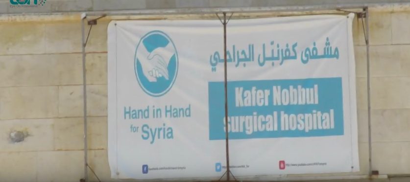

يظهر الفيديو أيضا مبنى صغير تضرر نتيجة لهذا الهجوم والهجوم السابق الذي استهدف نفس المستشفى . انظر أدناه:

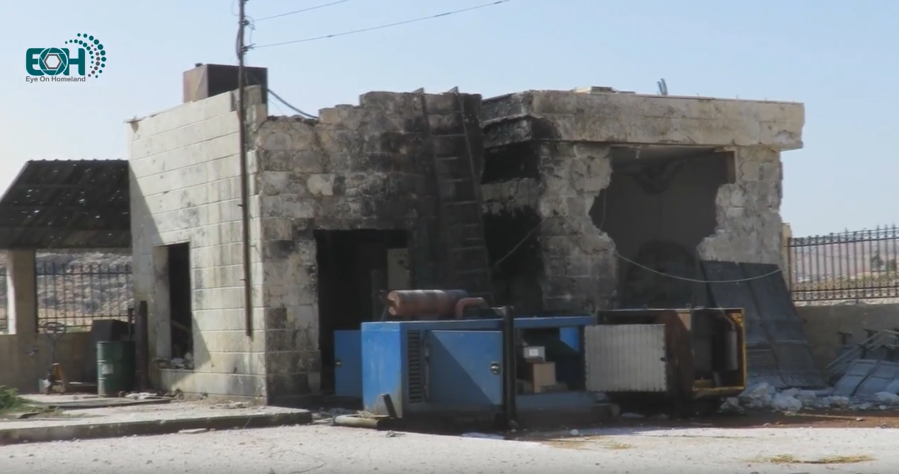

كما[نشر محمد الضاهر](https://www.youtube.com/watch?v=2RJ-k5jXopQ) مركز المعرة الإعلامي فيديو يظهر حفرة تقع أمام المستشفى نتجت عن لهجوم. انظر أدناه :

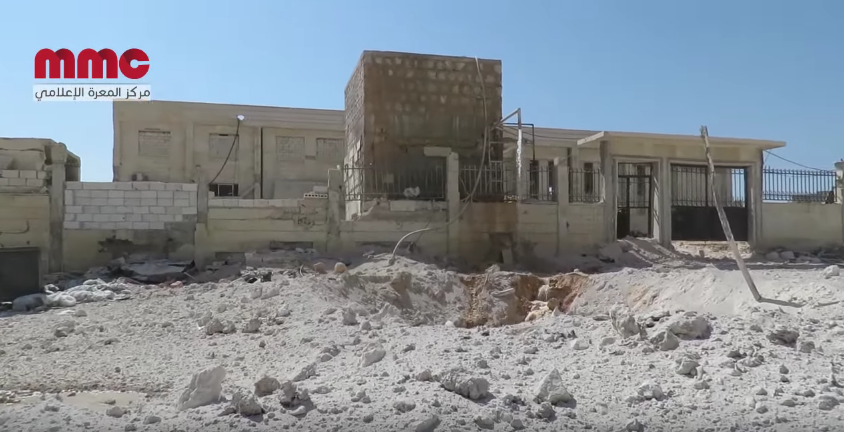

وفي مقابلة ضمن الفيديو، قال أحد الناجين: "كنا نعمل، ثم رأينا القوات الجوية التي استهدفتنا ولم نكن نتوقع ذلك"

وتظهر[صورة أخرى نشرت على صفحة الفيسبوك](https://www.facebook.com/maaramediacenter/photos/pcb.311922602607704/311922422607722/?type=3&theater) الخاصة بمركز المعرة الإعلامي نفس الحفرة أمام المستشفى. انظر أدناه:

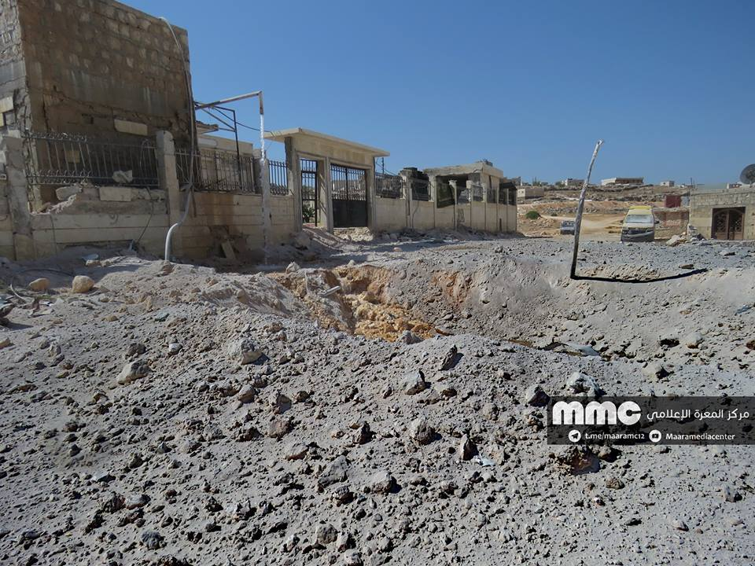

[نشرت وكالة سمارت](https://www.youtube.com/watch?v=M3zsuyum6QQ) للأنباء فيديو يظهر مدخل المستشفى. وفي نفس الفيديو، قال أحد موظفي المستشفى في مقابلة: "كنا نعمل على حالة طارئة عندما وقعت الغارة الجوية. لم يتعرض أحد من الطاقم الطبي للإصابة، ولكن أصيبت فتاة واحدة في ظهرها، بينما كانت تقف خارج المستشفى."

استخدم الأرشيف السوري إطارات من هذا الفيديو لإنشاء مشهد بانورامي لمدخل المستشفى. انظر أدناه:

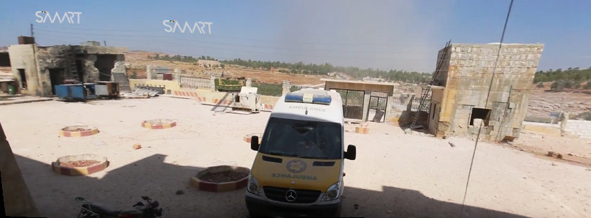

وبالاعتماد على هذا، جنباً إلى جنب مع صور القمر الصناعي التي تم الحصول عليها من (ديجيتال غلوب) ،تمكنا من تحديد الموقع الجغرافي للمستشفى. انظر أدناه :

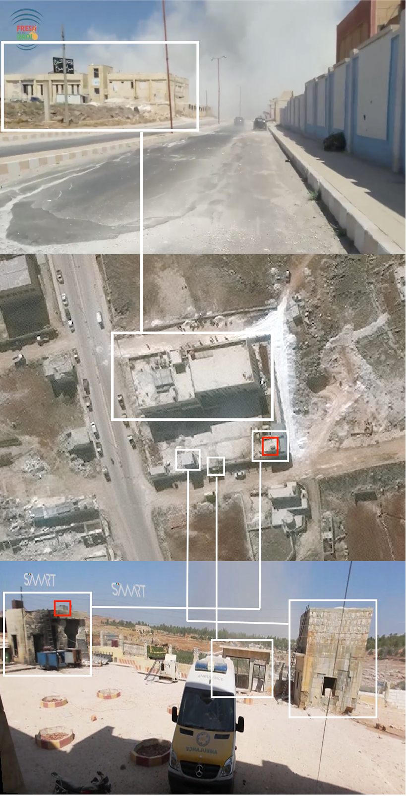

وفيما يلي فيديوهات إضافية توثق هذه الحادثة :

1.  فيديو:[شاهد.. لحظة تنفيذ الطيران الحربي غارات على مشفى أورينت بريف إدلب الجنوبي](https://www.youtube.com/watch?time_continue=1&v=UUNMoSiSQEU)

2.  فيديو:[اللحظات الاولى لإستهداف الطيران الروسي مشفى الاورينت قرب كفرنبل بالصواريخ](https://www.youtube.com/watch?v=6nMggXpfu0Q)

3.  فيديو:[قصف الطيران الحربي الروسي على المدنيين في مدينة كفرنبل بريف إدلب الجنوبي](https://www.youtube.com/watch?v=o2JKLgQyFk0)

للتحقق بشكل أعمق، قام الأرشيف السوري بمقاطعة النتائج النتائج التي قام بالتوصل إليها من خلال الفيديوهات مع بيانات مراقبة الرحلات الجوية التي تم الحصول عليها من منظمة تعمل في مجال الرصد. وقد اقتضت هذه العملية تحليل بيانات المراقبة المتعلقة بالرحلات الجوية بين الساعة 7:00 و 15:00، وهي الفترة التي سبقت وتلت الهجوم مباشرةً.

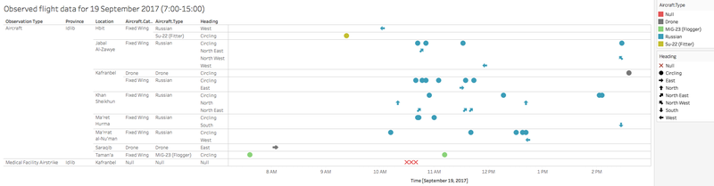

من خلال المقارنة بين الرحلات التي تم رصدها ، والوقت الذي تم رصدها فيه، والاتجاه التي كانت تسلكه، ومقارنة هذه البيانات مع الموقع الجغرافي الذي تم تحديده في خطوات سابقة ، تمكن الأرشيف السوري من تحديد عدد من الرحلات الجوية التي يحتمل أن تكون مسؤولة عن الهجوم (جميعها طائرات روسية ثابتة الجناح)، شوهدت تحلق تحوم ( تحلق بشكل دائري ) بالقرب من الموقع الجغرافي للهجوم والذي تم تحديده سابقاً. وقد وجدت الأبحاث السابقة أن الطائرات التي تحلق بشكل دائري تشير إلى تحديد الهدف و/أو التحضير لهجوم وشيك. من المهم أن نلاحظ أنه على الرغم من أن نوع الطائرة التي تم تحديدها جميعها روسية، فمن الممكن أن يتم تنفيذ هذه الطلعات الجوية من قبل القوات الجوية السورية، بدلا من القوات الجوية الروسية، حيث أن القوات الجوية السورية تقوم باستخدام الطائرات الروسية.
