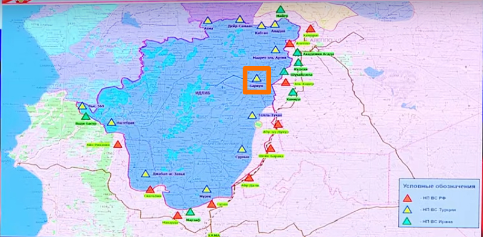

- Location: Zardana (Idlib Governorate, Syria)
- Claimed targets: Residential construction.
- Date: 7 June 2018
- First airstrike: ~ 21:05 Damascus local time (UTC/GMT plus 2)
- Second airstrike: ~ 21:35 local time (UTC/GMT plus 2)
- Reported killed: 45 including 7 women and 10 children
- Reported injured: 70
- Munitions identified: Remnants of the munition are not available
- Potentially responsible: Russian or Syrian Air Force

On the June 7th 2018, corresponding to the 22nd of Ramadan, reports by media groups and individuals in Syria appeared on social media claiming that Russian warplanes carried out two airstrikes targeting [Zardana](https://goo.gl/maps/nXMp1z887Np), a town in the northern countryside of Idlib.

*Zardana town in the east of Idlib province*

The [Russian Ministry of Defense claimed](https://sputniknews.com/middleeast/201806081065228869-russia-syria-strike-zardana-claims/) that they did not strike Zardana. This investigation will use open source techniques to verify videos, photos and reports published online about this incident.

## What Happened and When?

On June 7th 2018, Zardana Al Hadath Facebook page [published a post](https://www.facebook.com/Zerdna838/posts/441860366255086) about an airstrike that targeted the town at 21:14 Damascus local time.

 

The same day at 22:06, the same group [published another post](https://www.facebook.com/Zerdna838/posts/441875912920198) about a second airstrike that targeted the same impact site.

Five days later, on June 12th, the Zardana Al Hadath Facebook page [published a video](https://www.facebook.com/Zerdna838/videos/443894186051704/) documenting the first moments of the second airstrike that targeted the same impact site. In the video, civilians are seen rescuing the injured and pulling out the dead from under the rubble as a result of the first airstrike. The sound of an aircraft can be heard at 00:31 of the video.

<iframe src="https://www.facebook.com/plugins/video.php?href=https%3A%2F%2Fwww.facebook.com%2FZerdna838%2Fvideos%2F443894186051704%2F&show_text=0&width=261" width="261" height="476" style="border:none;overflow:hidden" scrolling="no" frameborder="0" allowTransparency="true" allowFullScreen="true"></iframe>

Ahmad Ibrahim Amon is one the civilians who died in the second airstrike as he was rescuing civilians [as shown in this video](https://www.facebook.com/Zerdna838/videos/442940776147045/).

Step News Agency published a video [showing the rescue operations and the search for survivors](https://www.youtube.com/watch?v=-XrXN4jTvAk) by the Syrian Civil Defence members after the airstrikes.

The Syrian Civil Defence in Idlib published a video [showing their rescue operation](https://www.youtube.com/watch?v=0XSAfmUmiHY) on June 7th 2018. The video titled: "Pulling out a women from under the rubble in Zardana".

Some of those injured in this attack were transferred to Turkey through Bab Al Hawa boarder, [as can be seen in a video](https://www.youtube.com/watch?v=AtesBXymKw8) published on June 8th 2018 by Bab Al Hawa YouTube channel. An injured boy was among the people going to Turkey for the treatment accompanied by his father.  

One witness interviewed by [Naba News Agency](https://www.youtube.com/watch?v=BLwZlWwQbfg) in their coverage of the incident stated: “After the incident, I rushed with members of Civil Defence to rescue the people who were trapped or injured. People were under the rubble due to the massive destruction. 30 minutes after the first airstrike, the aircraft returned and bombed the same impact site. This led to new casualties among the Civil Defence members as well as to civilians who were rescuing the injured from the first airstrike. After the second airstrike, one of the Civil Defence members died, and residential buildings were destroyed due to both airstrikes. The impact sites are civilian locations that hold no military strongholds.”

In the same video, another witness spoke about the airstrikes, stating that they occurred after the Iftar meal and shortly before the Isha'a prayer. The witness said they heard the noise of the aircraft which he claimed to be Russian. Following this, he states that he heard a loud explosion and that he was surprised at the scale of the destruction, and the number of individuals killed and injured that he saw when he rushed to the impact site.

Thiqa news agency published a video [documenting the scale of the destruction](https://www.youtube.com/watch?v=vCuO3SLaM6U). Their video contains an interview with a witness of the airstrike, who, similarly to the Naba News Agency report, also stated that the first airstrike took place 15 minutes after finishing the Iftar meal (after the sunset prayer), and that the second air strike occurred 20 to 30 minutes after the first one.

Using footage from the video, Syrian Archive created a panoramic shot of the impact site, which was the location of a residential building destroyed in this attack.

*Panoramic shot of the impact site*

*Impact site according to the photos*

*Locations of the attack, near the Saad bin Mu'adh mosque*

Qasioun News Agency also [published a video](https://www.youtube.com/watch?v=UNoVvij0Eqs) in which one of those injured during the airstrike was interviewed. He stated: "After the Iftar meal, we heard a huge explosion sound and we saw a bright flash. Due to this explosion, a three floors building was utterly destroyed. I lost seven or eight members of my family. More than 30 other victims and the number of injured is not known yet."

SY Plus agency published a [video interview with one of the airstrike witnesses](https://www.youtube.com/watch?v=B_E0k0cBOf8). The witness stated: "After the Iftar meal, we went to work in our shops, and suddenly we saw a bright flash when the airstrike took place. We tried to hide during this attack, which killed and injured many people, in addition to destroying residential buildings. We started to help those injured and extract them from under the rubble and transfer them to the cars to be taken to the hospital. Then, the Civil Defence team came to rescue the injured, and the second strike occurred, which had a higher number of casualties than the first one."

All the witnesses interviewed by news agencies said that the strike took place after the Iftar meal and shortly before the night prayer. On Thursday, 7 June 2018, corresponding to [22 Ramadan](https://www.prayer-times.info/emsakia/2018/syria/dimashq/), sunset prayer call (the Iftar meal) was recited at 19:43, while the night prayer was recited at 21:13. These times coincide with the testimonies of witnesses who said that the first airstrike occurred at around 21:00.

## Aircraft and Munition

A [report published by Aleppo Today](https://www.facebook.com/HalabTodayTV/videos/2247042018646557/&sa=D&ust=1538476154387000) contains interviews with few of the witnesses of the two airstrikes. The Aleppo Today correspondent stated that the attack was committed by a [Sukhoi Su-24 aircraft](https://en.wikipedia.org/wiki/Sukhoi_Su-24), which carried out two air strikes. One of the airstrikes used thermobaric rockets that destroyed an entire neighbourhood, created a crater depth of 10 meters and caused the death of more than 35 victims and more than 80 injured. This includes women, children and members of the Civil Defence. The video shows killed people as a result of the airstrikes as well as the injured.

## Comparison of the Damaged Building

Through comparing the [video published by Aleppo Today during the rescue operations at night](https://www.facebook.com/HalabTodayTV/videos/2247042018646557/) and the [video by SY Plus](https://www.youtube.com/watch?v=B_E0k0cBOf8), which showed the destroyed impact site that was filmed the day after the airstrikes, Syrian Archive was able to confirm that both videos filmed in the same location.

*The same impact site according to two videos published by Aleppo Today (7th June 2018) and SY Plus (8th June 2018)*

## Statement by the Russian Ministry of Defence

On Friday, 8 June 2018, the [Russian Ministry of Defence denied they had bombed Zardana](https://russian.rt.com/world/news/521128-minoborony-oprovergli-udar-siriya), stating that fierce fighting with heavy artillery had taken place in this region between the large detachments of the *Al-Nusra Front* (designated as a terrorist organisation in Russia and a number of countries) and *Jaysh al-Islam*.

It should also be noted that, according to several media sources including [Step News agency](http://stepagency-sy.net/archives/198035), Zardana had seen some instances of fighting between *Jaysh Al-Ahrar* and *Hay'at Tahrir al-Sham*, and that fighting was renewed on 7 June 2018, resulting in the deaths and injuries including civilians. Fighting was instigated after a dispute broke out between these groups the previous evening.

*A map showing the location of the areas controlled by the Syrian armed opposition (in green) in Idlib province, and Zardana - Source: [Liveuamap](https://syria.liveuamap.com/)*

## De-escalation Zone

On 4 May 2017, the sponsoring states of Astana Talks (Russia, Turkey and Iran) [signed a memorandum of understanding for the establishment of de-escalation zones in Syria](https://www.youtube.com/watch?v=5cF-gIL8yzk) which took effect on 6 May 2017. The Russian Ministry of Defence [published a map showing](https://function.mil.ru/news_page/intrel/more.htm?id=12121964%40egNews) the locations included in this memorandum as shown below (de-escalation zones in blue, ISIS in grey, Syrian army in orange). Zardana is located within the de-escalation zone.

There is also a Turkish observation point in Tal El-Eis roughly 20 km east of Zardana. This can be confirmed by a [video of a press conference](https://www.youtube.com/watch?time_continue=106&amp=&v=oqUQxr-FU9I) published by the Russian Ministry of Defence concerning the observation points. It is possible to identify the Turkish observation point on Tal El-Eis on the map.

## Geolocating the Impact Site

[Photos of the impact site](https://www.facebook.com/omar.hajkadour333/media_set?set=a.10209881398830770.1073742052.1807482420&type=3) were captured by media activist Omar Haj Kadour and published on the AFP as well as Zardana AL- Hadath Facebook page.

*Photograph of the targeted location, in the background Saad bin Muadh mosque can be seen- [Omar Haj Kaddour](https://www.facebook.com/omar.hajkadour333/media_set?set=a.10209881398830770.1073742052.1807482420&type=3) \- AFP*

*Photograph of the targeted location taken from the minaret of Saad bin Mu'adh Mosque - [Zardana AL- Hadath Facebook page](https://www.facebook.com/Zerdna838/posts/442233609551095)*

Below is a screen capture taken through Google Earth geolocating the minaret and the impact site.

Another photo published by Zardana Al Hadath Facebook page which was captured from the minaret and shows the impact site.

*Photograph of the targeted location taken from the minaret of Saad bin Mu'adh Mosque - [Zardana AL- Hadath Facebook page](https://www.facebook.com/Zerdna838/posts/442233609551095)*

The exact building is geolocated using Google earth, as seen below:

*Matching Images from the satellite with photos*

Images of the mosque before and after the airstrikes were published by Google Earth and Zardana Al Hadath Facebook page.

*To the right, an old photo of Saad bin Mu'adh mosque - [Google Earth](https://earth.google.com/web/@36.04600937,36.753989,319.43737442a,1015.92452168d,35y,-0.00000301h,0.8381202t,0r/data=CmgaZhJeCiUweDE1MjU3MmM1MGRjOGQ0ZGY6MHhhMmZkYzhkY2Y3ZGQwODdiGbMgb4KxBUJAIXdiJ3Y6YEJAKiNTYWFkIGJpbiBmb3JiaWQKY29sbGVjdG9yIChXZXN0ZXJuKRgDIAEoAg)*
*To the left, a photo of the damage in the same mosque - [Zardana AL- Hadath Facebook page](https://www.facebook.com/Zerdna838/posts/442233609551095)*

A water tower can be identified in this image which confirmed the location of the impact site through geolocating it with Google earth as shown below:

*A photo showing Saad bin Mu'adh mosque, behind it a water tower can be seen, which is located west of Zardana town - [Zardana AL- Hadath Facebook page](https://www.facebook.com/Zerdna838/posts/442233609551095)*

## Structural Damage in the Impact Site

Below are two satellite images taken before and after the airstrikes which shows structural damage to the residential building.

*Satellite image of the targeted site showing the aftermath of the attack*

Syrian Archive created 3D structure representing buildings that were damaged as a result of the airstrikes.

*3D representation of the targeted site before and after the attack*

Below is a photo published by Zardana Al Hadath on their official Facebook page showing the structural damage to the buildings in the impact site.

*Photograph of the targeted location taken from the minaret of Saad bin Mu'adh Mosque - [Zardana AL- Hadath Facebook page](https://www.facebook.com/Zerdna838/posts/442233609551095)*

*3D representation of impact site showing the targeted buildings, before the attack*

*3D representation of impact site showing the targeted buildings after the attack*

## Flight Data Analysis

To provide a further layer of verification, Syrian Archive cross-referenced findings from the videos and witness testimony with flight observation data from a spotter organisation. This process necessitated analysing observation data for flights between 20:30 and 22:00 Damascus local time, the period directly before and after the reported attack as was claimed by media activists. See below:

<iframe height="550" src="https://public.tableau.com/views/Zardana7June2018/Sheet1?:showVizHome=no&:embed=y" width="780"></iframe>

[View full visualisation](https://public.tableau.com/profile/syrianarchiveorg#!/vizhome/Zardana7June2018/Sheet1?publish=yes)

Through comparing where flights were observed, the type of aircraft observed, the time flights were observed, and the direction flights were heading, and comparing this data to geolocation conducted in earlier steps, the Syrian Archive was able to identify a flight potentially responsible for the attack (a fixed-wing Russian aircraft), seen circling in the immediate vicinity of the geolocated attack site starting at Zardana, and then likely moving to Abin. Previous research has found that circling flights typically indicate target acquisition and/or preparation for an imminent attack.

*Map showing the distance between Abin and Zardana*

While there is no direct evidence available that one of the observed aircrafts was involved in the attack on Zardana the presence of these aircrafts increase the likelihood that an air attack occurred at this location and the time stated by the citizen reporters as well as humanitarian groups, and estimated also using imagery from the attack.

Syrian planes are unable to fly at night according to an official statement made by [Russian Foreign Minister Sergey Lavrov](https://ria.ru/20160921/1477468029.html) to the Russian Information Agency (RIU) which gives more possibility that these airstrikes were carried by the Russian airforce.

## Conclusion:

Zardana, a town north of Idlib, was targeted on Thursday night, 7 June 2018, at approximately 21:05, with an airstrike followed by another one about half an hour later, by aircraft likely to be Russian. The airstrikes targeted a [residential neighbourhood](https://earth.google.com/web/@36.04395964,36.75224262,319.55971579a,147.93847951d,35y,145.27914805h,0.15301545t,0r) south of Zardana, near [Saad bin Mua'dh mosque](https://earth.google.com/web/@36.04418524,36.75250114,319.86556206a,452.25160956d,35y,145.27877064h,0.15302276t,-0r/data=CmgaZhJeCiUweDE1MjU3MmM1MGRjOGQ0ZGY6MHhhMmZkYzhkY2Y3ZGQwODdiGTCE4n2xBUJAIXdiJ3Y6YEJAKiNTYWFkIGJpbiBmb3JiaWQKY29sbGVjdG9yIChXZXN0ZXJuKRgCIAEoAg), killing 45 people including women and children, injuring 70 and destroying dozens of homes.

Thermobaric rockets claimed to be used in one of the two airstrikes, based on the destruction of the entire residential neighbourhood, and the crater depth of 10 meters.

The [Russian Ministry of Defence denied](https://sputniknews.com/middleeast/201806081065228869-russia-syria-strike-zardana-claims/) its warplanes were involved, and instead blamed the attack on artillery shelling between two fighting factions of Jaysh Al-Ahrar and Hay'at Tahrir al-Sham. Although the fighting started on the previous day, but there were no clashes in the targeted area, and all witnesses and injured confirmed that the bombardment was from aircraft flying that night, where high-explosive weapons were used.
