- الموقع: زردنا (محافظة ادلب، سوريا)
- الأهداف المزعومة: مباني سكنية.
- التاريخ: 7 حزيران/يونيو 2018
- الغارة الجوية الأولى: حوالي الساعة 21:05 بالتوقيت المحلي لدمشق (UTC / GMT + 2)
- الغارة الجوية الثانية: حوالي الساعة 21:35 بالتوقيت المحلي لدمشق (UTC / GMT + 2)
- القتلى المُبلغ عنهم: 45، من بينهم  7 نساء و 10 أطفال
- الإصابات المُبلغ عنها: 70
- الذخائر التي تم تحديدها: لم تتوافر بقايا ذخائر
- المسؤول المحتمل عن الهجوم: القوات الجوية الروسية أو السورية

في 7 حزيران / يونيو 2018 الموافق لـ 22 رمضان، نُشرت تقارير على وسائل التواصل الاجتماعي من قبل مؤسسات وناشطين إعلاميّين تدّعي أن طائرات حربية روسية نفّذت غارتين جويّتين استهدفتا بلدة [زردنا](https://goo.gl/maps/nXMp1z887Np) في ريف ادلب الشمالي.

*بلدة زردنا شرقي ريف ادلب*

ادّعت [وزارة الدفاع الروسية](https://sputniknews.com/middleeast/201806081065228869-russia-syria-strike-zardana-claims/) أنها لم تُنفّذ غارات جوية على زردنا. يستخدم هذا التحقيق أدوات مفتوحة المصدر للتحقق من مقاطع فيديو، صور، وتقارير نُشرت على الشبكة حول هذه الحادثة.

## ماذا حدث ومتى؟

في 7 يونيو 2018، نشرت صفحة زردنا الحدث على فيسبوك منشورًا حول غارة جويّة استهدفت البلدة وذلك في الساعة 21:14 بتوقيت دمشق المحليّ.

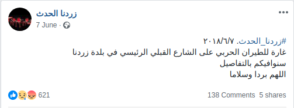

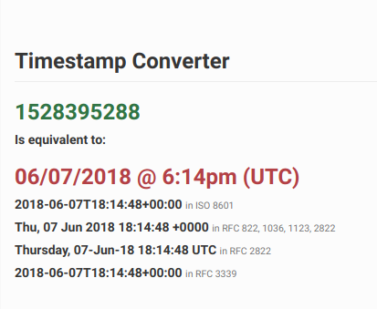 

في الساعة 22:06 من اليوم ذاته؛ نشرت الصفحة [منشورًا آخر](https://www.facebook.com/Zerdna838/posts/441875912920198) حول غارة جوية ثانية استهدفت موقع التأثير نفسه.

بعد خمسة أيام، في 12 يونيو، نشرت صفحة زردنا الحدث على فيسبوك [مقطع فيديو](https://www.facebook.com/Zerdna838/videos/443894186051704/)يوثّق اللحظات الأولى من الغارة الجوية الثانية التي استهدفت موقع التأثير ذاته. يظهر في المقطع مدنيّون ينقذون جرحى ويسحبون قتلى من تحت الأنقاض نتيجة للغارة الجوية الأولى. يمكن سماع صوت الطائرة في الثانية 00:31 من الفيديو.

<iframe src="https://www.facebook.com/plugins/video.php?href=https%3A%2F%2Fwww.facebook.com%2FZerdna838%2Fvideos%2F443894186051704%2F&show_text=0&width=261" width="261" height="476" style="border:none;overflow:hidden" scrolling="no" frameborder="0" allowTransparency="true" allowFullScreen="true"></iframe>

[يظهر في هذا الفيديو](https://www.facebook.com/Zerdna838/videos/442940776147045/) أحمد إبراهيم آمون؛ أحد المدنيين الذين قُتلوا في الغارة الجوية الثانية أثناء إسعافه المصابين.

نشرت وكالة خطوة الإخباريّة [فيديو](https://www.youtube.com/watch?v=-XrXN4jTvAk) يبيّن عمليّات الإنقاذ والبحث عن الناجين من قبل عناصر الدفاع المدني بعد الغارات.

نشر الدفاع المدني السوري في ادلب [مقطع فيديو بعنوان "انتشال امراة من تحت الانقاض في بلدة زردنا"](https://www.youtube.com/watch?v=0XSAfmUmiHY) يظهر عمليات الإنقاذ في 7 يونيو 2018. 

نُقل بعض مصابي الهجوم إلى تركيا عبر معبر باب الهوى، وفقًا [لمقطع فيديو ](https://www.youtube.com/watch?v=AtesBXymKw8)نشرته قناة معبر باب الهوى على يوتيوب بتاريخ 8 يونيو 2018. من بين الأشخاص الذين نُقلوا إلى تركيا للعلاج يظهر طفل مصاب يرافقه والده.

[وكالة نبأ الإخباريّة](https://www.youtube.com/watch?v=BLwZlWwQbfg) قابلت أحد الشهود أثناء تغطية الحادثة، والذي قال "أسرعت بعد الحادثة برفقة عناصر الدفاع المدني لإنقاذ الجرحى العالقين تحت الأنقاض بسبب الدمار الهائل في المكان. ثمّ كانت المفاجأة حيث عاد الطيران وقصف النقطة نفسها بعد حوالي 30 دقيقة من الضربة الأولى، فحدثت إصابات جديدة بين أفراد عناصر الدفاع المدني والمدنيّين الذين هبّوا لإنقاذ المصابين جرّاء الضربة الأولى. بعد الضربة الثانية توفّي أحد عناصر الدفاع المدني، وتمّ تدمير عشرات المنازل من خلال الضربتين، هذه الأماكن مدنيّة ولا وجود لأيّ مقرّات عسكريّة فيها."

يتحدّث شاهد آخر في الفيديو نفسه عن تفاصيل الغارات الجويّة، مشيرًا إلى أنّ الغارة وقعت بعد الإفطار وقبل أذان العشاء بقليل، حيث سمعوا صوت الطيران والذي يدّعي الشاهد أنّه طيران روسي تلاه صوت انفجارِ قويّ، ثمّ فوجئ بحجم الدمار وأعداد القتلى والجرحى الذين صادفهم عندما توجّه إلى مكان الضربة.

نشرت وكالة ثقة الإخباريّة [تقريرًا مصورًا](https://www.youtube.com/watch?v=vCuO3SLaM6U) أوضحت فيه حجم الدمار الهائل في الحي السكني، وتمّت مقابلة أحد الشهود على الضربة الجويّة الذي أكّد أنّ الغارة الأولى حصلت بعد 15 دقيقة من انتهائهم من وجبة الإفطار الرمضاني (بعد أذان المغرب)، ثمّ وقعت الغارة الثانية بعد 20-30 دقيقة من الغارة الأولى. 

باستخدام لقطات من الفيديو، أنشأ الأرشيف السوريّ لقطة بانورامية لموقع التأثير، وهو مبنى سكني دُمّر نتيجة لهذا الهجوم.

*لقطة بانوراميّة لمكان الضربة*

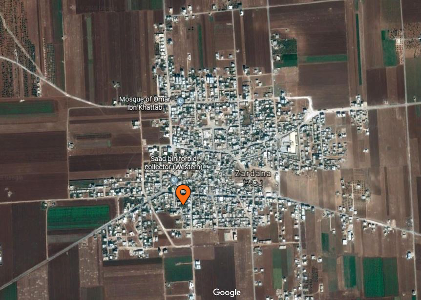
*موقع الضربة بحسب الصور*

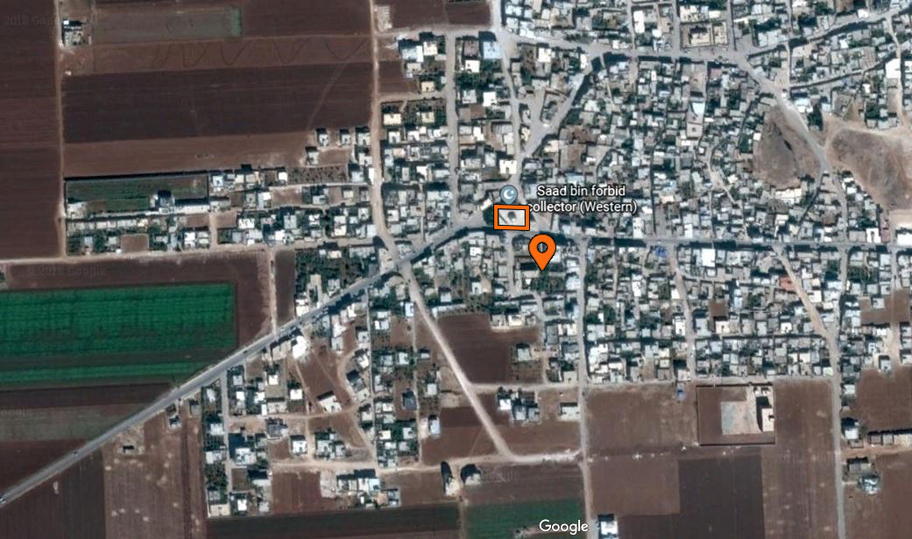
*موقع الضربة قرب جامع سعد بن معاذ*

نشرت وكالة أنباء قاسيون [تقريرًا مصوّرًا](https://www.youtube.com/watch?v=UNoVvij0Eqs) تخلّلته شهادة أحد الجرحى، والذي قال: "بعد انتهائنا من وجبة إفطار رمضان سمعنا صوت انفجار ضخم صاحبه وهج عظيم، تهدّم أحد الأبنيّة المكوّنة من ثلاثة طوابق وتمّت تسويته بالأرض إثر هذا الانفجار.  فقدت 7 أو 8 أشخاص من عائلتي، عدا عدد القتلى الذي تجاوز الـ30 قتيلاً، وأعداد الجرحى غير المعروفة حتى الآن".

نشرت وكالة SY Plus [تقريرًا مصوّرًا](https://www.youtube.com/watch?v=B_E0k0cBOf8) يتضمن شهادة أحد الناجين من الغارات، والذي قال في شهادته: "بعد انتهائنا من طعام الإفطار كنّا قد خرجنا إلى أعمالنا، وفجأة برق الجو وحدثت الغارة، حاولنا الاختباء أثناء هذه الضربة، وبعد انتهائها كان هناك بعض القتلى والجرحى والدمار والغبار، فبدأنا بمساعدة الجرحى واستخراجهم من تحت الأنقاض ووضعهم في السيّارات ليتمّ نقلهم إلى المشفى، هنا أتى الدفاع المدني ليساعد في إنقاذ الجرحى، وهنا حدثت الضربة الثانية، والتي كانت الخسائر البشريّة فيها أكبر".

أجمع الشهود الذين تمّت مقابلتهم من قبل وكالات الأخبار أنّ الهجوم وقع بعد وجبة الإفطار وقبل أذان العشاء بقليل. في يوم الخميس 7 يونيو 2018 الموافق [لـ22 رمضان](https://www.prayer-times.info/emsakia/2018/syria/dimashq/) يرفع أذان المغرب (الإفطار) في الساعة 19:48، أما عن أذان العشاء فيُرفع في الساعة 21:18. تتوافق هذه المواقيت مع إفادات الشهود الذين قالوا أنّ الغارة الأولى وقعت حوالي الساعة 21:00.

## الطيران والذخائر

[نشرت قناة حلب اليوم تقريرًا](https://www.facebook.com/HalabTodayTV/videos/2247042018646557/&sa=D&ust=1538476154387000) يتضمن مقابلات مع بعض الشهود على الغارتين، حيث ذكر مراسل القناة أنّ طائرة من نوع [Sukhoi Su-24](https://en.wikipedia.org/wiki/Sukhoi_Su-24) نفّذت غارتين جويّتين استُخدم في إحداهما صواريخ فراغيّة والتي دمّرت حيًا كاملًا وأحدثت حفرة بعمق 10 أمتار، وتسبّبت بسقوط أكثر من 35 شهيدًا و80 مصابًا بينهم نساء وأطفال وعناصر من الدفاع المدني.

## مقارنة الأبنية المتضرّرة

بمقارنة [مقطع الفيديو الذي نشرته قناة حلب اليوم](https://www.facebook.com/HalabTodayTV/videos/2247042018646557/) أثناء عمليّات الإنقاذ، [وتقرير SY Plus](https://www.youtube.com/watch?v=B_E0k0cBOf8) المُلتقط في اليوم التالي للهجوم والذي يبيّن موقع التأثير بشكل أوضح؛ تمكّن الأرشيف السوري من التحقق أنه تم التقاط كلًا من مقطعي الفيديو في الموقع ذاته.

*موقع التأثير نفسه وفقًا لمقاطع فيديو نُشرت بواسطة حلب اليوم (7 يونيو 2018) و SY Plus (8 يونيو 2018)*

## بيان وزارة الخارجية الروسية

في يوم الجمعة 8 يونيو 2018 [نفت وزارة الدفاع الروسيّة قصف طائرات روسيّة على بلدة زردنا](https://russian.rt.com/world/news/521128-minoborony-oprovergli-udar-siriya)، وأشارت الوزارة في بيانها إلى أن معارك طاحنة دارت في هذه المنطقة بين وحدات كبيرة تابعة لـ *تنظيم جبهة النصرة* (المحظور في روسيا وعدد من الدول) *وجيش الإسلام* باستخدام المدفعية الثقيلة.

وتجدر الإشارة إلى أنّ زردنا، وفقًا لعدّة مصادر إعلاميّة منها [وكالة خطوة الإعلاميّة](http://stepagency-sy.net/archives/198035) كانت قد شهدت بعض حوادث الاقتتال بين *جيش الأحرار المعارض* و *هيئة تحرير الشام* وكان الاقتتال قد تجدّد في يوم 7 حزيران/يونيو 2018، ممّا أسفر عن وقوع قتلى وجرحى بينهم مدنيّين إثر خلاف نشب بين هذه المجموعات مساء اليوم السابق.

*خارطة تبيّن مكان سيطرة المعارضة السوريّة المسلّحة في محافظة إدلب وموقع بلدة زردنا - المصدر: [Liveuamap](https://syria.liveuamap.com/)*

## مناطق خفض التصعيد

في 4 مايو/أيار 2017، وقعت الدول الراعية لمحادثات الأستانة (روسيا، تركيا، وإيران) [مذكرة تفاهم لإنشاء مناطق خفض تصعيد في سوريا](https://www.youtube.com/watch?v=5cF-gIL8yzk) والتي أصبحت سارية المفعول في 6 مايو 2017. نشرت وزارة الدفاع الروسية [خريطة تظهر](https://function.mil.ru/news_page/intrel/more.htm?id=12121964%40egNews)المواقع المشمولة في مذكرة التفاهم هذه كما هو واضح أدناه ( مناطق خفض التصعيد باللون الأزرق،داعش باللون الرمادي، والجيش السوري باللون البرتقالي). تقع زردنا ضمن مناطق خفض التصعيد.

توجد نقطة مراقبة تركيّة في تلّ العيس شرقي زردنا تبعد حوالي 20 كم عن مكان الحادثة، وهو ما يمكن التأكد منه من خلاله [فيديو لمؤتمر صحفي ](https://www.youtube.com/watch?time_continue=106&amp=&v=oqUQxr-FU9I) نشاهد المؤتمر الصحفي نشرته وزارة الدفاع الروسيّة حول نقاط المراقبة. من الممكن تحديد نقطة المراقبة التركية في تل العيس على الخريطة.

## تحديد الموقع الجغرافيّ

[التُقطت صور لموقع التأثير](https://www.facebook.com/omar.hajkadour333/media_set?set=a.10209881398830770.1073742052.1807482420&type=3)   من قبل الناشط الإعلامي عمر حاج قدّور، ونشرتها وكالة فرانس برس؛ إضافة إلى صفحة زردنا الحدث على فيسبوك.

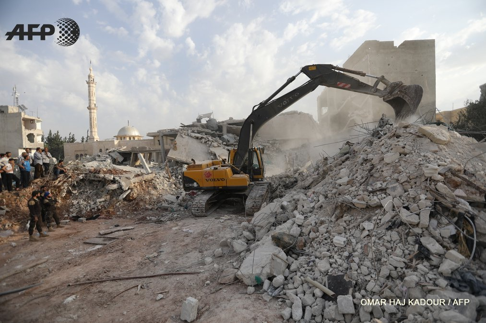
*صورة لمكان الغارة ويظهر في الخلفية جامع سعد بن معاذ-  [عمر حاج قدّور](https://www.facebook.com/omar.hajkadour333/media_set?set=a.10209881398830770.1073742052.1807482420&type=3) وكالة فرانس برس*

*صورة لمكان الغارة تمّ التقاطها من مئذنة جامع سعد بن معاذ- المصدر صفحة [زردنا الحدث](https://www.facebook.com/Zerdna838/posts/442233609551095)*

في ما يلي صورة شاشة تم التقاطها عبر غوغل ايرث لتحديد الموقع الجغرافي للمئذنة وموقع التأثير.

صورة أخرى نشرتها صفحة زردنا الحدت على فيسبوك التُقطت من المئذنة وتوضح موقع التأثير.

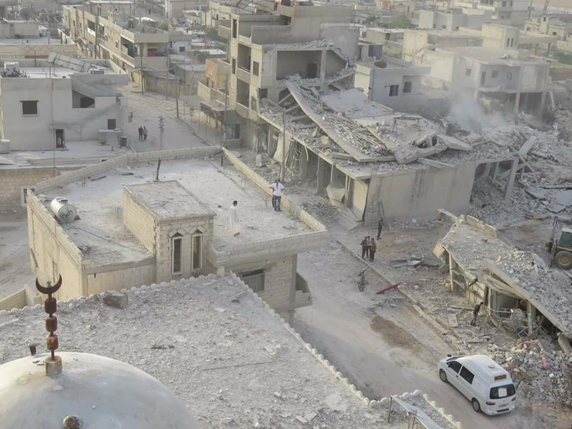
*صورة لمكان الغارة تمّ التقاطها من مئذنة جامع سعد بن معاذ- المصدر صفحة [زردنا الحدث](https://www.facebook.com/Zerdna838/posts/442233609551095)*

تم تحديد الموقع الجغرافي للبناء المستهدف بدقة عبر غوغل إيرث، كما هو موضح أدناه:

*ربط صور من الأقمار الصناعيّة مع الصور*

نُشرت صور للمسجد قبل وبعد الغارات الجوية من قبل غوغل إيرث وصفحة زردنا الحدث على فيسبوك.

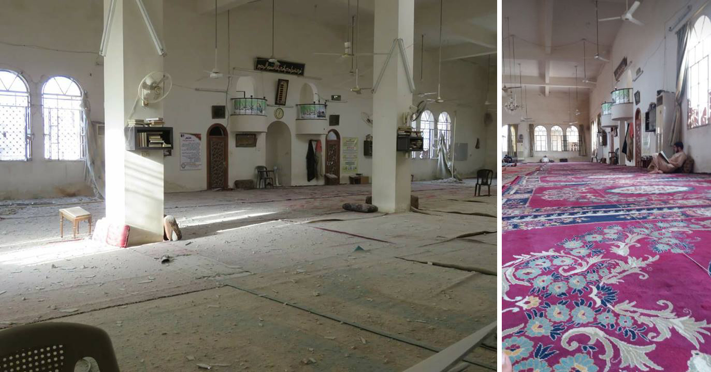
*إلى اليمين صورة قديمة لجامع سعد بن معاذ من الداخل- المصدر [غوغل إيرث](https://earth.google.com/web/@36.04600937,36.753989,319.43737442a,1015.92452168d,35y,-0.00000301h,0.8381202t,0r/data=CmgaZhJeCiUweDE1MjU3MmM1MGRjOGQ0ZGY6MHhhMmZkYzhkY2Y3ZGQwODdiGbMgb4KxBUJAIXdiJ3Y6YEJAKiNTYWFkIGJpbiBmb3JiaWQKY29sbGVjdG9yIChXZXN0ZXJuKRgDIAEoAg)*
*إلى اليسار صورة للأضرار التي لحقت بنفس الجامع من الداخل- المصدر صفحة [زردنا الحدث](https://www.facebook.com/Zerdna838/posts/442233609551095)*

يمكن تمييز برج الماء في الصورة التالية، ما يؤكّد مكان الهجوم عبر تحديد موقعه الجغرافيّ في غوغل إيرث كما هو موضح أدناه:

*صورة يظهر فيها جامع سعد بن معاذ ومن خلفه برج الماء الذي يقع غربي بلدة زردنا - المصدر صفحة [زردنا الحدث](https://www.facebook.com/Zerdna838/posts/442233609551095)*

## الأبنية المتضررة في موقع التأثير

فيما يلي صورتا أقمار صناعية تم التقاطهما قبل وبعد الغارات الجوية، ما يُظهر الدمار الحاصل في الأبنية السكنية.

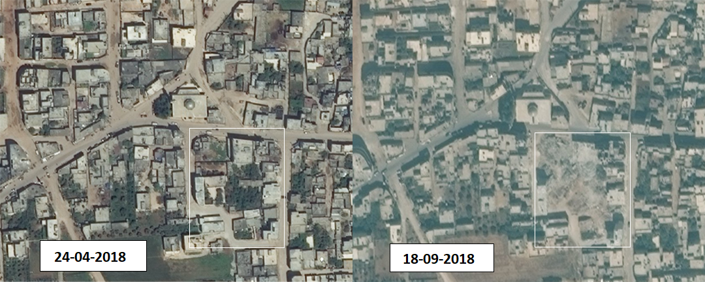

*صور من الأقمار الصناعيّة لموقع التأثير تظهر الدمار الناجم عن الهجوم*

أنشأ الأرشيف السوري تمثيلًا ثلاثيّ الأبعاد للمباني المتضررة نتيجة الغارات الجوية.

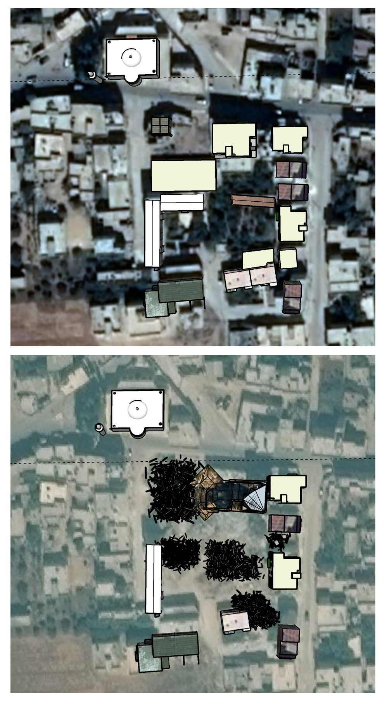
*تمثيل ثلاثي الأبعاد للموقع المستهدف قبل وبعد الهجوم*

أدناه صورة نشرتها صفحة زردنا الحدث على فيسبوك تظهر دمار الأبنية في موقع التأثير.

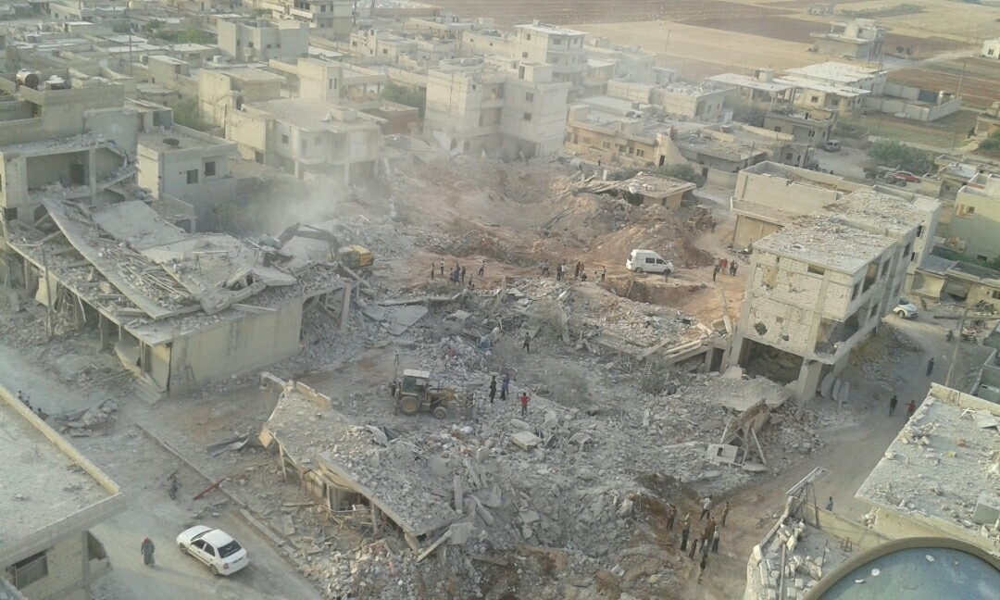
*صورة لموقع التأثير التُقطت من مئذنة جامع سعد بن معاذ - [صفحة زردنا الحدث](https://www.facebook.com/Zerdna838/posts/442233609551095)*

*إعادة تمثيل ثلاثي الأبعاد لموقع التأثير تبيّن الأبنية قبل الهجوم*

*إعادة تمثيل ثلاثي الأبعاد لموقع التأثير تبيّن الأبنية بعد الهجوم*

## بيانات الطيران

بغرض إضافة طبقة أخرى من التحقق؛ قارن الأرشيف السوري النتائج المستخلصة من مقاطع الفيديو وإفادات الشهود مع بيانات رصد الطيران من قبل منظمة مراقبة. استلزمت هذه العملية تحليل بيانات رصد الطيران ما بين الساعة 20:30 و 22:00 وهي الفترة الزمنية التي سبقت الهجوم وتلت مباشرة الإبلاغ عنه من قبل الناشطين الإعلاميين، انظر أدناه:

<iframe height="550" src="https://public.tableau.com/views/Zardana7June2018/Sheet1?:showVizHome=no&:embed=y" width="780"></iframe>

[عرض الإظهار البصري كاملًا](https://public.tableau.com/profile/syrianarchiveorg#!/vizhome/Zardana7June2018/Sheet1?publish=yes)

من خلال مقارنة الرحلات الجوية المرصودة، نوع الطائرات المرصودة، الوقت الذي رُصدت به، ووجهات هذه الرحلات، ومقارنة هذه البيانات مع المواقع الجغرافية المقدّمة في الخطوات السابقة؛ تمكّن الأرشيف السوري من رحلة  جوية  يحتمل أن تكون مسؤولة عن هذا الهجوم (طائرة روسية ثابتة الجناح) حيث شوهدت تُحلق فوق المنطقة الجغرافية للهجوم في زردنا؛ ومن ثم يرجح أنها تحركت إلى أبين. وقد خلصت تحقيقات سابقة إلى أن الطيران الدائري في السماء عادةً ما يُشير إلى محاولة الاستحواذ على الهدف أو التحضير لهجوم وشيك.

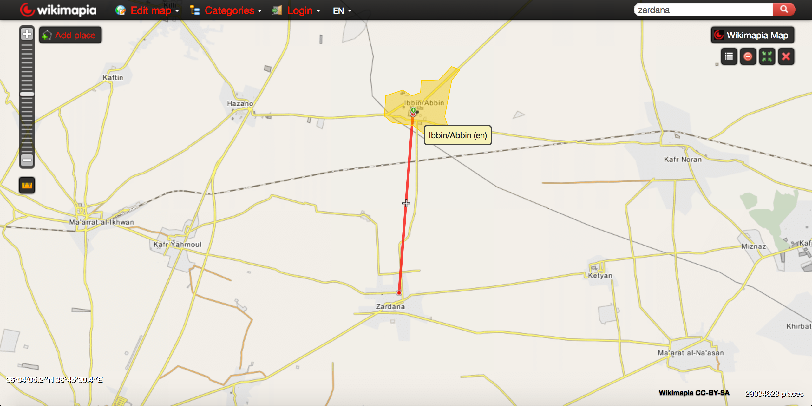
*خريطة تُوضح المسافة بين أبين وزردنا*

على الرغم من عدم توافر دليل مباشر على ضلوع إحدى هذه الطائرات المرصودة في الهجوم على زردنا فإن وجود هذه الطائرات يزيد من احتمال وقوع غارة جوية على هذا الموقع وفي الوقت المحدّد من قبل الصحفيين المواطنين والمجموعات الحقوقية، والمُقدّر باستخدام صور من موقع الهجوم.

بحسب [تصريح وزير الخارجيّة الروسي سيرغي لافروف](https://ria.ru/20160921/1477468029.html) لوكالة المعلومات الروسيّة "RIU"؛ فإن الطائرات السوريّة غير قادرة على الطيران الليلي، الأمر الذي يزيد احتمال تنفيذ هذه الغارات الجوية من قبل طائرات روسية.

## خاتمة

استهدفت بلدة زردنا الواقعة في شمالي محافظة إدلب ليلة الخميس 7 يونيو 2018  حوالي الساعة 21:05 بغارة جويّة، تبعتها غارة جويّة أخرى بعد حوالي النصف ساعة من قبل طيران يُرجّح أنه روسي، وقع الاستهداف على أحد  [الأحياء السكنيّة](https://earth.google.com/web/@36.04395964,36.75224262,319.55971579a,147.93847951d,35y,145.27914805h,0.15301545t,0r) جنوبي بلدة زردنا بالقرب من [جامع سعد بن معاذ](https://earth.google.com/web/@36.04418524,36.75250114,319.86556206a,452.25160956d,35y,145.27877064h,0.15302276t,-0r/data=CmgaZhJeCiUweDE1MjU3MmM1MGRjOGQ0ZGY6MHhhMmZkYzhkY2Y3ZGQwODdiGTCE4n2xBUJAIXdiJ3Y6YEJAKiNTYWFkIGJpbiBmb3JiaWQKY29sbGVjdG9yIChXZXN0ZXJuKRgCIAEoAg) ممّا أدّى إلى مقتل حوالي 45 شخصًا بينهم نساء وأطفال، إصابة 70 آخرون وتهدّم العشرات من المنازل.

تشير الادعاءات إلى استخدام الصواريخ الفراغيّة في إحدى الغارتين نظرًا لدمار الحيّ السكني بشكل كامل، وإحداث حفرة بعمق 10 أمتار.

[نفت وزارة الدفاع الروسيّة](https://sputniknews.com/middleeast/201806081065228869-russia-syria-strike-zardana-claims/) قصف طائراتها للموقع وألقت المسؤوليّة على قصف مدفعي نتيجة اقتتال فصيلي جيش الأحرار وتحرير الشام. رغم بدء الاقتتال في اليوم الذي سبق الحادثة إلّا أنّه لم تقع أيّة اشتباكات في المنطقة المستهدفة، وأجمع الشهود والجرحى على أنّ القصف كان من طائرات تحلّق في تلك الليلة حيث استخدمت أسلحة شديدة التفجير.
