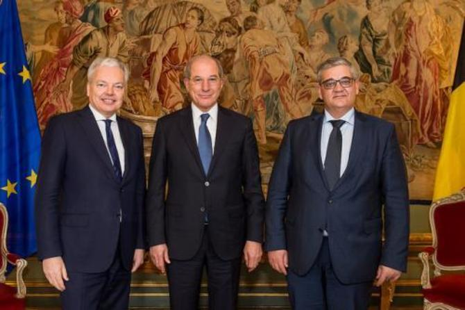

Knack and Syrian Archive reveal today that Belgian companies have violated EU sanctions against Syria, according to the summons of an upcoming lawsuit.

Based on information found through the [UN Comtrade database](https://comtrade.un.org/), freedom of information requests, and confirmed by the Belgian Customs, we can reveal that a criminal case regarding exports of chemicals to Syria has been opened in Antwerp Criminal Court. This case is brought by the Belgian Customs against three Flemish companies, one managing director and one manager, according to court press judge *Roland Cassiers* citing the summons.

Since EU sanctions from September 2013 made export licences compulsory for the export of isopropanol to Syria in concentrations of 95% or higher, Syrian Archive and [Knack](https://www.knack.be/nieuws/belgie/isopropanol-schandaal-hoe-een-grondstof-voor-gifgas-door-de-handen-van-de-belgische-douane-glipte/article-longread-1097291.html) can report that Belgian companies exported 168 tonnes of isopropanol, a sarin precursor, to Syria between 2014 and 2016.

Sarin is the nerve gas used by the Syrian government in the Khan Shaykhun attack that killed 74-100 people in April of last year, as [attributed](https://www.diplomatie.gouv.fr/en/country-files/syria/events/article/chemical-attack-in-syria-national-evaluation-presented-by-jean-marc-ayrault) by the French Ministry of Foreign Affairs. According to Belgian toxicologist Jan Tytgat (KU Leuven), victims of sarin die a painful death. “Diarrhea, urinary flare, narrowed pupils, spasms that give you the feeling of suffocation, vomiting, lacrimation and saliva production: the victim quickly becomes paralyzed, suffocates and dies. The lethal dose of sarin for adults is estimated to be less than 1 milligram.”

<video controls width="100%">
  <source src="https://cube.syrianarchive.org/littlefork/youtube_video/4f20a66995412be034bff64e595eb843207327b163289844883b7fbd27e5c64d/0_1fkKEEJ5E.mp4#t=2" type="video/mp4">
  </source>
Your browser does not support the video tag.
</video>
<small>[Video](https://syrianarchive.org/en/database?unit=e58e64bc) by Hadi Alabdallah of a factory next to the impact site which was targeted by a chemical bomb in Khan Shaykhun</small>

The Organisation for the Prevention of Chemical Weapons (OPCW), that oversees compliance with the Chemical Weapons Convention, examined samples from and around the impact crater in Khan Shaykhun, [finding](http://www.securitycouncilreport.org/atf/cf/%7B65BFCF9B-6D27-4E9C-8CD3-CF6E4FF168FF9%7D/s_2017_904.pdf) in laboratory tests that isopropanol was used in the production of sarin used in the attack.

Isopropanol, also known as isopropyl alcohol, is considered a “dual use” product, much like chlorine, which has ordinary industrial uses (such as in the manufacturing of pharmaceuticals or acetate, where it is favoured due to its low toxicity and small amount of residue). It can also be used in the synthesis process when manufacturing chemical agents such as the nerve agent sarin. Like all chemical weapons, the use of sarin has been banned since the 1993 Chemical Weapons Convention.

The question is: where did Syria get its isopropanol from? In October 2013, Syria acceded to the Chemical Weapons Convention. "It was then necessary to destroy its stocks of isopropanol," says Jean-Pascal Zanders from consultancy firm [The Trench](http://www.the-trench.org/author/jp-zanders/), a Belgian expert on chemical weapons.

According to the OPCW, Syria [liquidated](https://www.opcw.org/news/article/opcw-all-category-1-chemicals-declared-by-syria-now-destroyed/) a stock of 133 tonnes of isopropanol. However, the French Ministry of Foreign Affairs found evidence that since 2014, the Syrian regime has tried to acquire “dozens of tonnes of isopropanol.”

Data found by Syrian Archive staff in the [UN Comtrade database](https://comtrade.un.org/) shows that since 2014, an estimated 1.28 million kilograms of propanol and isopropanol (both propanol and isopropanol are registered under the same code) were exported by various countries to Syria, the largest majority coming from United Arab Emirates and Lebanon with a combined 674,880 kilograms since EU sanctions were introduced. See below:

<iframe src="https://public.tableau.com/views/ExportsofisopropanolandpropanoltoSyriainkilograms2013-2017/Sheet1?:showVizHome=no&:embed=true" width="645" height="455"></iframe>

<small>*Source: UN Comtrade. Reported exports of isopropanol and propanol to Syria in kilograms (2013-2017)*</small>

The UN Comtrade statistics show that Belgium was the only EU member state that continued to export (iso)propanol to Syria since EU sanctions were imposed in 2013. After this discovery, we contacted the Belgian Customs for a reaction.

According to Francis Adyns, spokesperson of the Belgian Federal Public Service Finance (the government department to which the Customs belong), "appropriate permits were not submitted to the Belgian Customs (...) The established facts were the subject of a criminal investigation. The prosecution was initiated at the Criminal Court of Antwerp at the end of March.”

Through information from the Antwerp Criminal Court, we now know that 'The customs authorities summon three Flemish companies, one managing director and one manager,' says press judge Roland Cassiers, citing the summons. "The companies are AAE Chemie Trading from Kalmthout, a wholesaler of chemical products for industrial use; Anex Customs from Hoevenen, a business office that provided administrative services until it went bankrupt in 2017; and Danmar Logistics, a logistics company from Stabroek." Cassiers stresses that they are only charged but that 'the facts are not declared proven yet'. The opening session of the lawsuit at the Antwerp Criminal Court is set for 15 May 2018.

Francis Adyns, spokesperson of the Finance department, confirms that the Customs had proposed to A.A.E. Chemie a friendly settlement.

**That proposal referred to a first, closed part, of the investigation. AAE Chemie did not agree with the proposal. When the customs performed additional investigative acts in this case, in which the involvement of AAE Chemie came up again, AAE Chemie referred to the proposal of a friendly settlement. But because the company had not accepted the proposed settlement, the Customs did prosecute the company in the end.**

Contacted by Knack, the three companies [stress](http://www.knack.be/nieuws/belgie/isopropanol-schandaal-hoe-een-grondstof-voor-gifgas-door-de-handen-van-de-belgische-douane-glipte/article-longread-1097291.html) that they were not aware that export licenses were compulsory for exports of chemicals to Syria, as they had been exporting chemicals to private companies in Syria for over a decade. They state that they acted in good faith and that they did not have the intention to hide anything. They argue that the Belgian Customs' information system on legal obligations (TARBEL/TARWEB) was not up to date, and that the Belgian Customs scanned and controlled all exports to Syria for 100%. According to the companies, the Customs never refused any of the exports.

The summons of the lawsuit shows that the Belgian Customs only determined that the appropriate export licenses had not been submitted by the companies after the chemicals had already been exported to Syria.  

That chronology raises questions, especially bearing in mind public [statements](https://diplomatie.belgium.be/en/newsroom/news/2018/belgium_supports_fight_against_use_of_chemical_weapons) made by the Belgian government last month on the 100th anniversary of the first chemical weapons attack, which took place in Belgium in 1917. The Deputy Prime Minister and Minister of Foreign Affairs Didier Reynders and Minister of Defence Steven Vandeput released a statement that “Belgium condemns the use of chemical weapons by the regime and rebel groups in Syria. These constitute war crimes which must be punished.”

<small>*Deputy Prime Minister and Minister of Foreign Affairs Didier Reynders and Minister of Defence Steven Vandeput and Ahmet Üzümcü, Director-General of the Organisation for the Prohibition of Chemical Weapons (OPCW)*</small>

In Belgium, the granting of export licenses is a responsibility of the three regions: Brussels, Wallonia and Flanders. Answers received after Freedom of Information Requests show that no export licenses for isopropanol were requested to the Walloon or Brussels authorities since 2013.

Public documents from the Flemish authorities show that in October 2016 a requested export license was denied for the export of dual-use chemicals to Syria, totaling €1.93 million. That case did not concern isopropanol, Flemish authorities confirm. But it shows that Belgium is not willing to grant export licenses for the export of dual-use chemicals to Syria.

The upcoming trial at the Antwerp Criminal Court not only concerns the export of isopropanol to Syria. According to the summons cited by court press judge Roland Cassiers, 24 shipments of sanctioned chemicals from Belgium to Syria and Lebanon took place between May 2014 and December 2016, in which 165 tonnes of isopropanol (69 tonnes to Lebanon and the remaining shipments to Syria), 219 tonnes of acetone, 77 tonnes of methanol and 21 tonnes of dichloromethane had been exported without the appropriate licenses.

According to Francis Adyns of the Belgian Federal Public Service Finance, the Belgian Customs have no indication that the isopropanol exported from Belgium has been used for the production of sarin. "Isopropanol is used, among other things, as a solvent in the paint and varnish industry, as a disinfectant in health care and as a coolant. The Customs have no information about any other use than for the paint industry. The export has already been taking place for a decade to the same customers."

In its response to Clerix, AAE Chemie itself confirmed the transport of isopropanol in a concentration of 95% or higher to Syria but claims that Belgian Customs also bear responsibility for what went wrong.

&lowast; The citations of Roland Cassiers, Jan Tytgat, Francis Adyns, Jean-Pascal Zanders, and the reactions of the companies are translations of the citations published in the Knack article 'Isopropanol-schandaal: hoe een grondstof voor gifgas door de handen van de Belgische douane glipte' from 18 April 2018.
