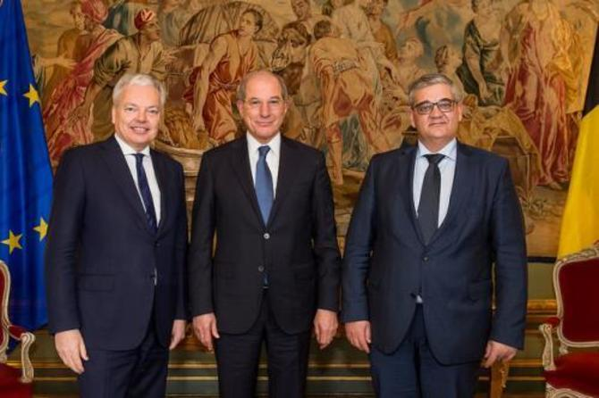

كشف فريق الأرشيف السوري وصحفيو [Knack](https://www.knack.be/nieuws/belgie/isopropanol-schandaal-hoe-een-grondstof-voor-gifgas-door-de-handen-van-de-belgische-douane-glipte/article-longread-1097291.html) اليوم أن شركاتٍ بلجيكية قد انتهكت عقوبات الاتحاد الأوروبي على سوريا، وفقًا لأمر استدعاء دعوى قضائية مقبلة.

واستناداً إلى المعلومات التي تم العثور عليها في قاعدة بيانات الأمم المتحدة Comtrade، وطلبات حرية المعلومات، وبتأكيدٍ من الجمارك البلجيكية، يمكننا أن نكشف عن بدأ قضية جنائية تتعلق بصادرات المواد الكيميائية إلى سوريا في محكمة جنايات أنتويرب. رُفعت هذه القضية من قبل الجمارك البلجيكية ضد ثلاث شركات فلمنكية (Flanders)، مدير عام واحد، ومدير واحد، وفقا للقاضي المسؤول عن التواصل مع الإعلام *رولاند كاسيريس* نقلًا عن أمر الاستدعاء.

بما أن عقوبات الاتحاد الأوروبي جعلت تراخيص التصدير إلزامية لتصدير الإِيزوبروبانول إلى سوريا بتركيز 95٪ أو أعلى اعتبارًا من سبتمبر 2013، يمكن للأرشيف السوريّ و [Knack](https://www.knack.be/nieuws/belgie/isopropanol-schandaal-hoe-een-grondstof-voor-gifgas-door-de-handen-van-de-belgische-douane-glipte/article-longread-1097291.html) الإبلاغ والتأكيد عن أن الشركات البلجيكية صدرت 168 طنًا من الأيزوبروبانول، وهو أحد المواد التي تُستخدم في عملية إنتاج السارين، إلى سوريا ما بين عاميّ 2014 و  2016.

السارين هو غاز الأعصاب الذي استخدمته الحكومة السورية في هجوم خان شيخون الذي أودى بحياة ما بين 74 إلى 100 شخص في أبريل من العام الماضي 2017، حسب [وزارة الخارجية الفرنسية](https://www.diplomatie.gouv.fr/en/country-files/syria/events/article/chemical-attack-in-syria-national-evaluation-presented-by-jean-marc-ayrault).  
وفقا لأخصائيّ السموم البلجيكي جان تيتجات (KU Leuven)، فإن ضحايا السارين يواجهون وفاة أليمة. "الإسهال، زيادة إدرار البول، تضيّق الحدقة، التشنجات التي تسبب الشعور بالاختناق، التقيؤ، إفراز الدموع واللعاب: يصاب الضحية بالشلل سريعًا؛ يختنق، ويموت. تُقدّر الجرعة المميتة من السارين للبالغين بأقل من 1 ملليغرام ".

<video controls width="100%">
  <source src="https://cube.syrianarchive.org/littlefork/youtube_video/4f20a66995412be034bff64e595eb843207327b163289844883b7fbd27e5c64d/0_1fkKEEJ5E.mp4#t=2" type="video/mp4">
  </source>
Your browser does not support the video tag.
</video>
<small>[Video](https://syrianarchive.org/en/database?unit=e58e64bc) يظهر الصحفي هادي العبد الله قرب المكان الذي استهدف بالمواد الكيماوية في خان شيخون</small>

وكانت [منظمة منع الأسلحة الكيميائية](https://www.opcw.org/)، والتي تراقب التقيّد باتفاقية الأسلحة الكيميائية، قد قامت بفحص عيّنات من داخل ومحيط الحفرة الناجمة عن الاصطدام في خان شيخون، [ووجدت في الفحوص المخبريّة](http://www.securitycouncilreport.org/atf/cf/%7B65BFCF9B-6D27-4E9C-8CD3-CF6E4FF168FF9%7D/s_2017_904.pdf) أن الأيزوبروبانول قد استُخدم في إنتاج السارين المستعمل في الهجوم.

يعتبر الأيزوبروبانول، المعروف أيضاً باسم كحول الأيزوبروبيل، منتَجًا "ثنائيّ الاستخدام"، مثل الكلور، إذ أن له استخدامات صناعيّة عادية (مثل تصنيع المستحضرات الدوائيّة أو الأسيتات، حيث يُفضل نظرًا لسميّته المنخفضة ومُخلّفاته القليلة). ويمكن أيضا أن يُستخدم في عملية التركيب عند تصنيع العوامل الكيميائية مثل عامل الأعصاب السارين. تم حظر استخدام السارين، مثل جميع الأسلحة الكيميائية، منذ معاهدة حظر الأسلحة الكيميائية لعام 1993.

السؤال هو: من أين حصلت سوريا على الأيزوبروبانول؟ في أكتوبر 2013، انضمت سوريا إلى معاهدة حظر الأسلحة الكيميائية. "كان من الضروري تدمير مخزوناتها من الأيزوبروبانول" يقول "جان باسكال زاندرز" خبير الأسلحة الكيماوية من شركة الاستشارات [The Trench](http://www.the-trench.org/author/jp-zanders/).

ووفقاً لمعاهدة حظر الأسلحة الكيميائية، قامت [سوريا بتصفية مخزون](https://www.opcw.org/news/article/opcw-all-category-1-chemicals-declared-by-syria-now-destroyed/) يصل إلى 133 طناً من الأيزوبروبانول. ومع ذلك، وجدت وزارة الخارجية الفرنسية أدلة على أن الحكومة السورية حاولت	 منذ عام 2014 الحصول على "عشرات الأطنان من الأيزوبروبانول".

تُظهر البيانات التي وجدها فريق الأرشيف السوري في قاعدة بيانات الأمم المتحدة [UN Comtrade database](https://comtrade.un.org/) أنه منذ عام 2014، تم تصدير ما يقدر بـ 1.28 مليون كيلو من البروبانول والأيزوبروبانول (كل من البروبانول والأيزوبروبانول مسجّلين تحت نفس الرمز) من قِبل دول مختلفة إلى سورية، صُدّرت الأغلبية العظمى من الإمارات العربية المتحدة ولبنان وبلغ مجموعها 674,880 كيلو منذ طرح عقوبات الاتحاد الأوروبي. انظر أدناه:

<iframe src="https://public.tableau.com/views/ExportsofisopropanolandpropanoltoSyriainkilograms2013-2017/Sheet1?:showVizHome=no&:embed=true" width="645" height="455"></iframe>

<small>*المصدر: UN Comtrade. تقرير احصائي حول مادتي الأيزوبروبانول والبروبانول التي صدّرتا لسوريا بالكيلوغرام من عام 2013 إلى عام 2017*</small>

وتظهر إحصائيات "Comtrade" الصادرة عن الأمم المتحدة أن بلجيكا كانت الدولة الوحيدة من أعضاء الاتحاد الأوروبي التي واصلت تصدير (إيزو)بروبانول إلى سوريا منذ فرض عقوبات الاتحاد الأوروبي عام 2013. بعد كشف ذلك، اتصلنا بالجمارك البلجيكية لسماع ردّهم.

وفقًا "لفرانسيس أدينز"، المتحدث باسم تمويل الخدمات العامة الفيدرالية البلجيكية (الإدارة الحكومية التي تتبع لها الجمارك)، "لم يتم تقديم تصاريح مناسبة للجمارك البلجيكية (...) وكانت الوقائع المقرّرة موضوع تحقيق جنائي. افتُتحت دعوى قضائية في محكمة جنايات أنتويرب في أواخر مارس".

من خلال المعلومات الواردة من محكمة جنايات أنتويرب، نعرف الآن أن "السلطات الجمركية تستدعي ثلاث شركات فلمنكية (تعمل في بلجيكا)، ومديرًا عامًا واحدًا، ومديرًا واحدًا"، وفقًا لما ذكره القاضي المسؤول عن التواصل مع الإعلام رولاند كاسيريس  في أمر الاستدعاء. "إن الشركات هي "AAE Chemie Trading" من Kalmthout ، وهي شركة تجارة جملة للمنتجات الكيماوية للاستخدام الصناعي؛ "Anex Customs" من Hoevenen ، وهو مكتب أعمال قدّم الخدمات الإدارية إلى حين إفلاسه عام 2017؛ و "Danmar Logistics"، وهي شركة لوجستية من Stabroek." ويؤكد كاسيريس على أن الشركات متّهمة فحسب ولكن "لم يتم الإعلان عن إثبات الوقائع بعد". تم تحديد الجلسة الافتتاحية للمحاكمة في محكمة جنايات أنتويرب في 15 مايو 2018.

أكّد "فرانسيس أدينز"، المتحدث باسم تمويل الخدمات العامة الفيدرالية البلجيكية أن السلطات الجمركية عرضت تسوية ودية على شركة "A.A.E. Chemie".   

**كان عرض التسوية المقدم من قبل السلطات الجمركية الجزء الأول من التحقيق الذي لم يتم الإعلان عنه. لم تقبل شركة "AAE Chemie" بهذا العرض فقامت السلطات الجمركية بالمزيد من التحقيقات حول هذه القضية، وقد أظهرت هذه التحقيقات تورط شركة "AAE Chemie" مرة أخرى. حينها أرادت شركة "AAE Chemie" قبول التسوية الودية ولكن قامت السلطات الجمركية بطلب استدعاء لدعوى قضائية ضد الشركة بسبب عدم استجابتها للتسوية في المرة الأولى.**

من خلال التواصل معهم من قبل صحفيي (Knack) أكًدت [الشركات الثلاث](http://www.knack.be/nieuws/belgie/isopropanol-schandaal-hoe-een-grondstof-voor-gifgas-door-de-handen-van-de-belgische-douane-glipte/article-longread-1097291.html) بأنها لم تكن على علم بأن تراخيص التصدير إلزامية بالنسبة لصادرات المواد الكيميائية إلى سوريا، حيث أنها كانت تصدر المواد الكيميائية إلى الشركات الخاصة في سوريا لأكثر من عقد من الزمان، وقالوا بأنهم تصرفوا بحسن نية وأنهم لم تكن لديهم نية لإخفاء أي شيء. تجادل هذه الشركات بأن نظام معلومات الجمارك البلجيكي حول الالتزامات القانونية (TARBEL / TARWEB) لم يكن محدثًا، وأن الجمارك البلجيكية فحصت جميع الصادرات إلى سوريا وقد كانت تحت رقابتها بنسبة 100٪. ووفقاً للشركات، فإن الجمارك لم ترفض أبداً أي من الصادرات.

يبين أمر الاستدعاء في الدعوى القضائية أن الجمارك البلجيكية حددت بأن تراخيص التصدير المناسبة لم يتم تقديمها من قبل الشركات بعد أن تم تصدير المواد الكيميائية إلى سوريا.

يثير هذا التسلسل الزمني تساؤلات، خاصةً مع الأخذ بعين الاعتبار [التصريحات العامة](https://diplomatie.belgium.be/en/newsroom/news/2018/belgium_supports_fight_against_use_of_chemical_weapons) التي أدلت بها الحكومة البلجيكية في الشهر الماضي في الذكرى المئوية الأولى لأول هجوم بالأسلحة الكيميائية، الذي وقع في بلجيكا في عام 1917.في تصريح لنائب رئيس الوزراء ووزير الخارجية "ديدييه رينديرز" ووزير الدفاع "ستيفن فاندبوت" جاء فيه: "إن بلجيكا تدين استخدام النظام السوري والجماعات المتمردة للأسلحة الكيميائية، هذه جرائم حرب ويجب معاقبة مرتكبيها".

<small>*نائب رئيس الوزراء ووزير الخارجية "ديدييه رينديرز" ووزير الدفاع "ستيفن فاندبوت" و المدير العام "أحمد أزومغو" لمنظمة حظر الأسلحة الكيميائية.*</small>

في بلجيكا، تقع مسؤولية منح تراخيص التصدير على عاتق سلطات المقاطعات الثلاث: بروكسل ، والونيا ، وفلاندرز. الإجابات التي تم تلقيها بعد طلبات حرية المعلومات تبين أنه لم يتم طلب أي تراخيص تصدير لمادة الأيزوبروبانول إلى سلطات والون أو بروكسل منذ عام 2013.

تظهر المستندات العامة الصادرة عن السلطات الفلمنكية (Flanders) أنه في أكتوبر / تشرين الأول 2016 ، رُفض طلب ترخيص لتصدير مواد كيميائية مزدوجة الاستخدام إلى سوريا ، بقيمة إجمالية تبلغ 1.93 مليون يورو. أكدت الحكومة الفلمنكية بأن هذه الحالة لا صلة لها بـمادة "الأيزوبروبانول". لكن هذا الأمر يؤكد بأن بلجيكا ليس لديها الرغبة بمنح تراخيص لتصدير المواد الكيميائية ذات الاستخدام المزدوج إلى سوريا.

المحاكمة القادمة في محكمة جنايات انتويرب لا تتعلق فقط بتصدير مادة الأيزوبروبانول إلى سوريا. فبحسب أمر الاستدعاء الذي أشار إليه القاضي المسؤول عن التواصل مع الإعلام "رولاند كاسييرس"، فإن 24 شحنة من المواد الكيميائية قد تم شحنها من بلجيكا إلى لبنان وسوريا ما بين آيار/مايو 2014 وكانون الأول/ديسمبر 2016، حيث تشمل 165 طن من الأيزوبروبانول ( 69 طن منها إلى لبنان وباقي الشحنات إلى سوريا)، 219 طن من الأسيتون، 77 طن ميثان و 21 طن من ثنائي كلورو الميثان تم تصديرها دون الحصول على التراخيص اللازمة.

وفقا "لفرانسيس أدينز" من تمويل الخدمات العامة الفيدرالية البلجيكية، فإن الجمارك البلجيكية ليس لديها أي مؤشر على أن مادة الأيزوبروبانول المصدرة من بلجيكا قد استُخدمت لإنتاج السارين. يستخدم الأيزوبروبانول، من بين أمور أخرى، كمذيب في صناعة الطلاء والورنيش، كمطهر في الرعاية الصحية بالإضافة إلى استخدامه كمادة تبريد. الجمارك ليس لديها معلومات عن أي استخدام آخر لمادة الأيزوبروبانول غير صناعة الطلاء. وقد تم تصديره بالفعل لعقد من الزمان لنفس العملاء.

في ردها على الصحفي كريستوف كليركس، أكدت شركة "AAE Chemie" بنفسها نقل مادة الأيزوبروبانول بتركيز 95٪ أو أعلى إلى سوريا لكنها تدعي أن الجمارك البلجيكية تتحمل أيضًا مسؤولية الخطأ الذي حدث.

&lowast; ما تم الاستشهاد به من أقوال "Roland Cassiers"، "Jan Tytgat"، "Francis Adyns"، "Jean-Pascal Zanders"، وردود فعل الشركات هي ترجمات للأقوال التي تم نشرها في مقالة "كناك" "Isopropanol-schandaal: hoe een grondstof voor gifgas door de handen van de Belgische douane glipte" في 18 أبريل 2018.
