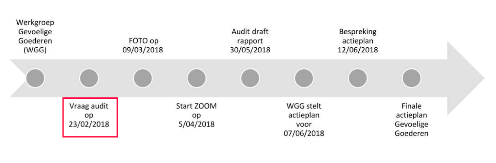

### تصدير الأيزوبروبانول بشكل غير قانوني إلى سوريا

أدانت محكمة أنتويرب الجنائية اليوم، 7 فبراير 2019، ثلاث شركات فلمنكية (AAE Chemie Trading ، Anex Customs and Danmar logistics) ومديرين عامّين؛ لشحن 168 طن من مادة الأيزوبروبانول بتركيز 95٪ إلى سوريا، بين عاميّ 2014 و 2016 دون تقديم تراخيص التصدير المناسبة. تصل الغرامات المشروطة التي فرضتها المحكمة إلى 500.000 يورو بالإضافة إلى عقوبات مشروطة بالسجن ضد مديرٍ عام وإداريّ. وكانت تراخيص تصدير الأيزوبروبانول بتركيز 95٪ قد أصبحت إلزامية منذ أن صادق الاتحاد الأوروبي على العقوبات المفروضة على سوريا بموجب [اللائحة 36/2012](https://eur-lex.europa.eu/legal-content/EN/TXT/?qid=1493825060366&uri=CELEX:02012R0036-20170321). وأتت هذه الإدانة بعد نشر [تحقيق مشترك من صحيفة كناك والأرشيف السوري](https://syrianarchive.org/en/investigations/belgium-isopropanol/) بتاريخ 18 أبريل 2018.

وحُكم على شركة AAE Chemie Trading، لتجارة الجملة من منطقة Kalmthout، والتي وفّرت المواد الكيميائية، بغرامة مشروطة قدرها 346.443 يورو، منها 50.000 يورو نافذة. في حين حُكم على كل من Anex Customs من منطقة Hoevenen و Danmar Logistics من منطقة Stabroek بغرامة مشروطة قدرها 500.000 يورو منها 100.000 يورو نافذة، و 75.000 يورو منها 50.000 نافذة.

كما حُكم على مدير AAE Chemie Trading ومدير Anex Customs و Danmar Logistics بغرامة مشروطة قدرها 346.443 يورو، منها 50.000 يورو نافذة؛ و 500.000 يورو منها 100.000 يورو نافذة. إضافة إلى أحكام بالسجن على مدير AAE Chemie Trading لمدة 4 أشهر مشروطة، وعلى مدير Anex and Danmar بالسجن لمدة 12 شهراً نافذة.

يعتبر الأيزوبروبانول، المعروف أيضاً باسم كحول الأيزوبروبيل، منتَجًا "ثنائيّ الاستخدام"، ففي حين أنه يدخل ضمن استخدامات مدنية مشروعة، إلا أنه قد يُستخدم أيضًا في إحدى مراحل تصنيع مستحضرات كيميائية عدّة مثل عامل الأعصاب السارين.

وبعد الهجوم المُنفّذ بغاز السارين على خان شيخون في 2017، قامت منظمة منع الأسلحة الكيميائية (OPCW)، والتي تراقب التقيّد باتفاقية الأسلحة الكيميائية، بفحص عيّنات من داخل ومحيط الحفرة الناجمة عن الاصطدام، [ووجدت في الفحوص المخبريّة](http://www.securitycouncilreport.org/atf/cf/%7b65BFCF9B-6D27-4E9C-8CD3-CF6E4FF96FF9%7d/s_2017_904.pdf)أن الأيزوبروبانول قد استُخدم في إنتاج السارين المستعمل في الهجوم.

بدأت الدعوى القضائية ضد الشركات الثلاث في أنتويرب في 15 مايو 2018 وأُصدر الحكم في 7 فبراير 2019.

### الشركات تواجه احتمالات بالغرامة والسجن

خلال المرافعات؛ طالب المحامي بيتر بورمز، ممثلاً عن الجمارك البلجيكية، بغرامة لا تقل عن 346.443 يورو ضد شركة AAE Chemie كون الانتهاك هو الأول من نوعه للشركة.

طلب المحامي غرامة أعلى ضد كل من Anex Customs بقيمة (750.000 يورو) و Danmar Logistics بقيمة (160.000 يورو)، بالإضافة إلى غرامة بقيمة 500.000 يورو للمدير. وطالبت الجمارك بمصادرة البضائع.

أيّد مكتب المدعي العام وجهة نظر الجمارك؛ وطالب بعقوبة السجن لمدة 4 أشهر لمدير AAE Chemie و 18 شهرا لمدير Danmar Logistics.
يمثل المحامي يوريس فيركراي شركة AAE Chemie، والتي أشهرت إفلاسها في 20 ديسمبر 2018. إلا أنّ مدير AAE Chemie لم يكن بوسعه الحضور إلى المحكمة أثناء المرافعات. أشار فيركراي إلى أن إفلاس شركة AAE Chemie كان نتيجةً مباشرة لهذه القضية. وذكر أيضًا أن الجمارك البلجيكية قد قدمت تسوية ودية لموكله في 8 نوفمبر 2017 ، مضيفًا "يتناقض هذا مع موقف الجمارك اليوم، أي أن هناك نية خادعة. إذا كان ذلك صحيحًا، فلماذا تم تقديم تسوية ودية إذن؟".

وذكر فيركراي أن Anex Customs و Danmar Logistics (اللتان تولّتا أمر الالتزامات الإدارية نيابة عن AAE Chemie) لم تكونا على علم بإلزامية تراخيص التصدير. وأضاف أن نظام معلومات الجمارك البلجيكي حول الالتزامات القانونية (TARWEB) لم يذكر، إبّان تصدير المادة، أن رخصة التصدير كانت مطلوبة، وأن ذلك هو السبب في عدم تقديم AAE Chemie طلبًا للحصول على الموافقة اللازمة.

ووفقًا لفيركراي فإنّ آخر تحديث لنظام معلومات TARWEB بشأن الأيزوبروبانول كان في 19 أبريل 2018، عقب يوم واحد من نشر المقال من طرف [كناك](https://m.knack.be/nieuws/belgie/isopropanol-schandaal-hoe-een-grondstof-voor-gifgas-door-de-handen-van-de-belgische-douane-glipte/article-longread-1097291.html).

وأشار فيركراي إلى أن جميع الشحنات الأربع والعشرين قد فُحصت من قبل الجمارك البلجيكية. "تم أخذ العينات، فحصها في المختبر، وبعدها الإفراج عن المنتجات من قبل الجمارك للشحن. في وقت لاحق فقط علم المدير من خلال الجمارك الهولندية أن رخصة تصدير الأيزوبروبانول مطلوبة، فأرسل من تلقاء نفسه قائمة بالشحنات التي تم تصديرها إلى سوريا للجمارك الهولندية".

كما ندد فيركراي بأنّ الملف القضائي لم يكن مكتملاً: حيث أجرت الجمارك البلجيكية مراجعة داخلية خاصة بها في المسألة، ولكن لم يتمكّن محامو الدفاع أو القاضي من الاطلاع على تقرير المراجعة هذا.

### تقرير المراجعة الداخلي للجمارك البلجيكية

قدمت صحيفة كناك طلب "حرية المعلومات" إلى الجمارك البلجيكية للحصول على نسخة من تقرير المراجعة. في 25 يناير 2019 وبعد إجراءات مطوّلة، تلقت كناك وثيقة من 31 صفحة بعنوان "المراجعة في مراقبة السلع الحساسة في سياق حالة الأيزوبروبانول".

وفقًا لهذا التقرير؛ طُلب من دائرة التفتيش الجمركية في 23 فبراير 2018 إجراء تدقيق في الموضوع. حدث ذلك بعد وقتٍ قصير من تواصل كناك بالجمارك البلجيكية حول وجود مؤشرات مقلقة - استندت إلى نتائج الأرشيف السوري في قاعدة بيانات الأمم المتحدة UN Comtrade database - حول تصدير الأيزوبروبانول إلى سوريا.

<small>*لقطة شاشة من ملف PDF لتقرير المراجعة الداخلي من قبل الجمارك البلجيكية، توضح الجدول الزمني لعملية المراجعة وخطة العمل التالية.*</small>

خلُصت المراجعة إلى أن "معظم نقاط الضعف في التحكم تكمن في الصفوف الأولى". بعد دراسة عينات من عمليات تصدير الأيزوبروبانول؛ وجدت خدمة التفتيش في الجمارك أن "العديد من الفحوصات المادية طُلبت لكن لم يتم تنفيذ أي منها". وعادة ما تفحص الجمارك الوثائق فقط، وليس المواد الكيميائية نفسها. وأشار موظفو الجمارك الذين شملهم الاستطلاع إلى أنهم كانوا تحت ضغط ضيق الوقت، وأنه من الصعب التشاور حول التشريع الأوروبي في نظام الجمارك الداخلي، وأن الوثيقة المستخدمة من قبل الجمارك للكشف عن الاحتيال لا تحتوي معلوماتٍ كافية.

وذكر التقرير أن جودة اتصال الإنترنت في مركز تفتيش الحدود في أنتويرب كانت "منخفضة للغاية" حتى مطلع عام 2018، وغير كافية لإجراء تحقيقات إضافية. إضافة إلى أن موظفي الجمارك لم يتلقّوا تدريبا كافيا. وأخيراً، أضافت الجمارك أن استمارات التصريح عن المواد الكيماوية مُلئت بشكل غير صحيح من قبل المصدّر.

كما فحصتْ المراجعة ما إذا كانت عملية الرقابة على تصدير السلع الخاضعة للقيود تتوافق مع مبادئ الرقابة الداخلية.

في هذا السياق، "تم تحديد عدد كبير من نقاط الضعف في الرقابة" مرتبطة بمحدودية الموارد البشرية والمالية؛ "لا يمكن لخدمة التفتيش أن تقدّم ضمانًا بإمكانية التحكم بالمخاطر بشكل كامل وبأن تُحقّق عملية الرصد أهدافها".

كان هناك غموض حول الأدوار والمسؤوليات، ولم تعد بعض التعليمات تُحدّث، كما أصبح كلٌ من التعليم والتوعية نقاطا بحاجة إلى التحسين.

إضافة إلى ذلك؛ عُثر على مشكلات في كل من الاتصالات الداخلية والخارجية. إذ لم يكن هناك حتى طريقة واضحة للتحقق من "تركيب السلع الاستراتيجية الحساسة أو معدلات تركيزها".

وأشار تقرير المراجعة إلى عدم وجود قاعدة بيانات مركزية تتضمن معلوماتٍ عن انتهاكات سابقة. كما أن عمليات الفحص التي أُجريت لم تتم مراقبة جودتها على نحو فعال.

أخيرًا، أظهر التقرير أنه لم يتضح ما هو الإجراء الذي يجب على الجمارك تنفيذه بعد العثور على انتهاك ضد قيود التصدير.

يقول كريستيان فاندرويرن، المدير العام للجمارك، أن الجمارك، اتخذت في هذه الأثناء عدة إجراءات لتحسين نظام التحكم. "كما طُوّرت آلية تشاور أفضل من الناحية الهيكلية مع خدمات الترخيص في فلاندرز ووالونيا وبروكسل كعنصر حيوي لتقييم مخاطر التصدير بشكل أفضل".

يضم تقرير المراجعة قائمة بـ 17 توصية مُحددة وإجراءات تحسين، مثل التدريب العملي لموظفي الجمارك وتوفير أدلة توجيهية واضحة للاتصالات. كما أجرت الجمارك دراسة جدوى بشأن الحفظ الرقمي لجميع الوثائق المستلمة، وتخطط، من بين خطوات أخرى، لإعادة تقييم قياس عبء العمل.

كما تتضمن المراجعة مجموعة من لقطات الشاشة من قواعد بيانات TARIC و TARBEL للجمارك. من خلال لقطات الشاشة يبدو أن قاعدة البيانات تتضمن معلومات حول قيود التصدير على الأيزوبروبانول.

فيما يلي لقطة شاشة لقاعدة بيانات TARIC، حيث يبدو أن رمز الإيزوبروبانول (2905120000) مُدخلًا بالفعل. من المهم ملاحظة أن هذا البحث أُجري في "05-05-2018"، أي بعد شهر تقريبًا من بدء المراجعة.

