- Location: [IDLIB : Hass](https://goo.gl/maps/7Uhfyp8h76TZmVUx8)
- Target: Nabed Al Hayat Hospital supported by Syria Relief and Development (SRD)
- Beneficiaries: ~5000 people a month and over 500 surgeries monthly
- Date: 5 May 2019
- Time: ~ 14:42 - 15:08 Damascus Time
- Casualties: Not reported
- Injured: Not reported
- Attacks: ~ 3 - 4 Airstrikes
- Munitions identified: Two munitions can be identified in the video published by Orient News
- Potentially responsible: Russian or Syrian Airforce

## What Happened and When?

On May 5 2019, media reports were [published online by citizen reporters](https://www.facebook.com/wassemalon/posts/1173592712801596) and news agencies in Syria that Nabed Al Hayat Hospital located in Hass in Idlib province was out of service as a result of being targeted with an airstrike.

Hass is a town in Idlib governorate with a [population of 9595](https://web.archive.org/web/20130313044847/http://www.cbssyr.org:80/new%20web%20site/General_census/census_2004/NH/TAB07-11-2004.htm), according to the Syria Central Bureau of Statistics in 2004.

Nabed Al Hayat Hospital is supported by the [Syria Relief and Development - SRD](https://srd.org.tr/) which is a licensed organisation in Turkey. They describe their mission on [their website](https://srd.org.tr/en/about) as follows: "Provide emergency humanitarian relief and sow the seeds of sustainable development for the people of Syria". Baladi News Agency [published a video](https://www.youtube.com/watch?v=QPRb71FGCgI&feature=share) on September 8th 2018 which shows internal damage to the Nabed Al Hayat hospital as a result of a previous attack alongside the recent attack. In that video, the logo of the SRD is visible.

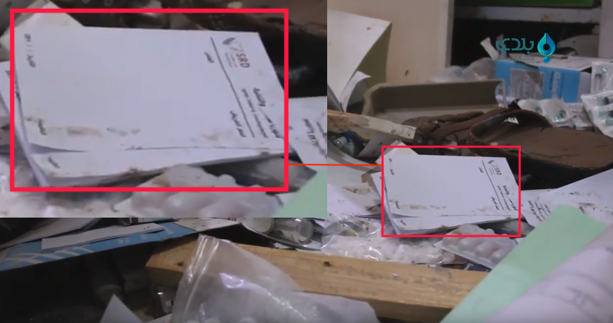

SRD [published a statement](https://srd.ngo/srds-pulse-of-life-medical-hospital-attacked-destroyed/) regarding the attack on their website. Their founder stated the following:

> "Our hospital was one of the major trauma hospitals serving Idlib and northern Hama, which has continuously been targeted this week. The people served will not be able to access life saving services. Over 500 surgeries were performed here each month and over 5,000 patients were seen each month. The attack left parents and children, suffering in pain and with no medical assistance,” said Amany Qaddour, SRD’s Regional Director."

Orient [published a video](https://www.facebook.com/watch/?v=660363207732616) on their Facebook page showing the attack as it happened. Two munitions were dropped on the hospital directly, as can be seen below. The sound of an aircraft can be heard at 01:43 of the video. The person capturing the video mentioned

> "Nabed Al Hayat hospital was targeted with a Russian airstrike in Hass town".

<iframe src="https://giphy.com/embed/MCFOyRtoIiPPFZvSJs" width="680" height="470" frameBorder="0" class="giphy-embed" allowFullScreen></iframe>

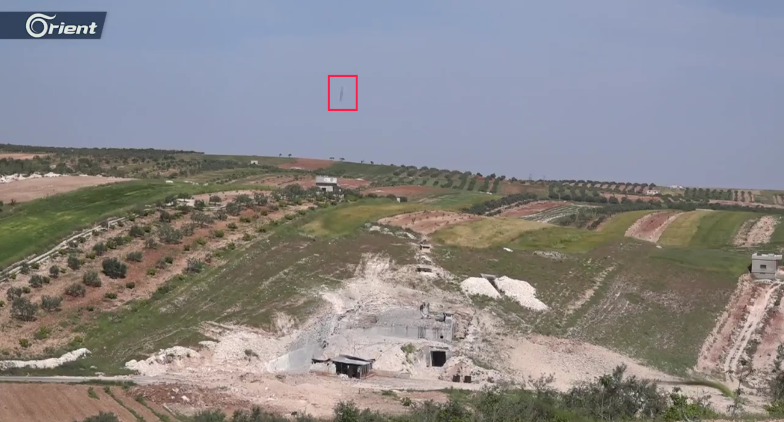

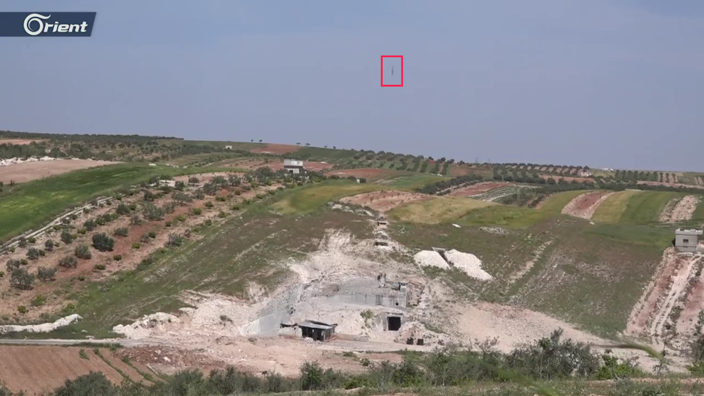
*The Orient video shows a direct hit of Nabed Al Hayat Hospital.*

Idlib AL Hadath [published a Facebook post](https://www.facebook.com/permalink.php?story_fbid=2265878050396699&id=1475672172750628) saying: "Russian airstrike targeting Hass hospital South of Idlib". This Facebook post was published on 15:08 Damascus time after converting *data-utime="1557058094"* to UTC time.

Another [video published](https://www.facebook.com/Orient.Tv.Net/videos/324763261548620/) by Orient after the attack shows their journalist Jamil Hassan streaming from the impact site on May 5 at 18:17 Damascus time. The journalist mentioned that the hospital was targeted directly with 4 missiles by a Russian airstrike. He then mentioned that the 4 aircrafts returned to the same impact site according to the observation centers.

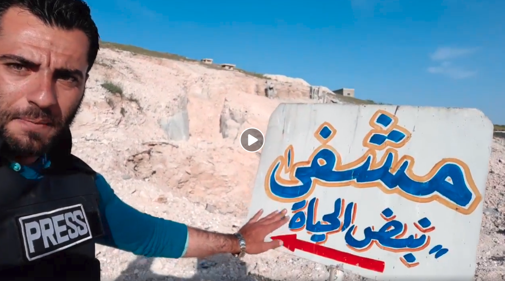
*Journalist Jamil Hassan Live Facebook video from the impact site*

## Crater

The journalist Jamil Hassan pointed to a large crater which resulted from the airstrike in the [live video](https://www.facebook.com/Orient.Tv.Net/videos/324763261548620/) that he published. He mentioned that the hospital destruction was resulted from the attacks.

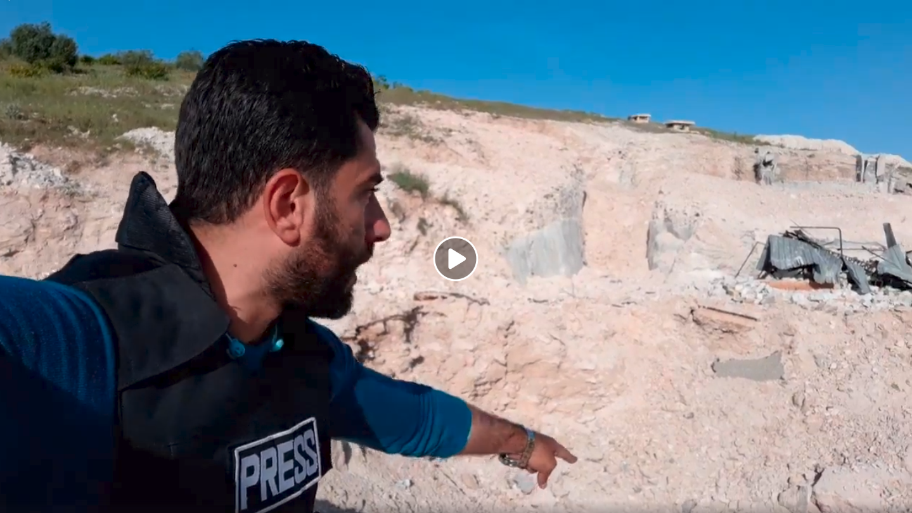
*The Orient video shows a crater as a result of the airstrike.*

Two large craters can also be identified in a [video published](https://www.youtube.com/watch?v=UDiGfhBdYfU) by Mouhammed Bala'as.

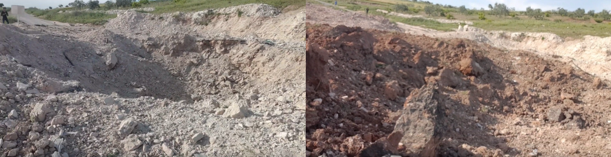
*Two craters shown in Citizen reporter Mouhammed Bala'as YouTUbe Video*

## Destruction in the Hospital

### Internal Destruction

Smart News Agency [published a video](https://www.youtube.com/watch?v=wS_xozm-Tqk) showing how the hospital was attacked as well as the internal damage that resulted from the airstrikes.

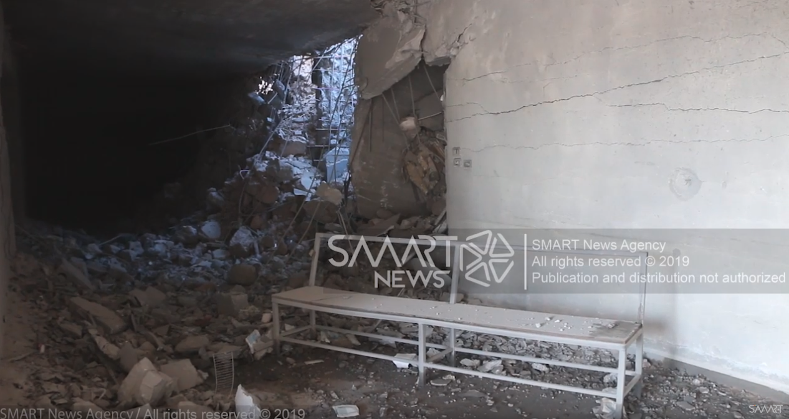
*Internal damage in the hospital as a result of the airstrikes*

Mouhammed Bala'as [video showed](https://www.youtube.com/watch?v=UDiGfhBdYfU) the internal damage in the hospital from two other positions as shown below.

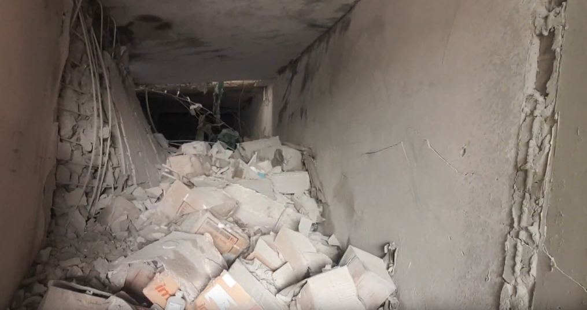

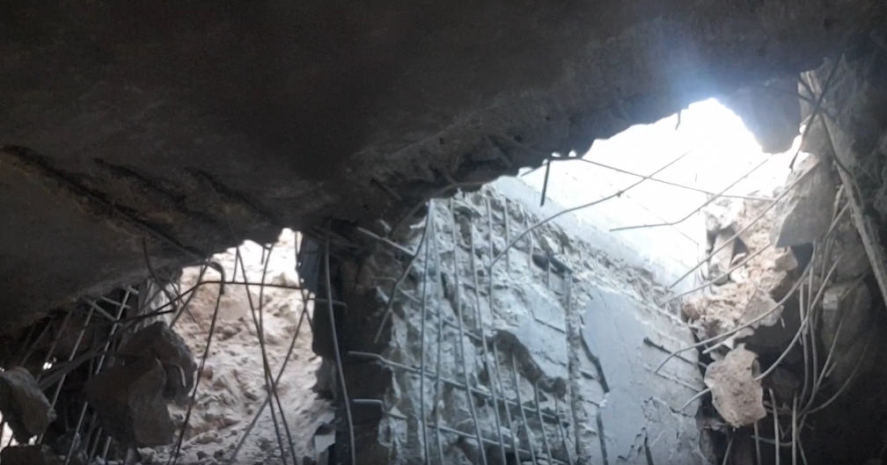
*Internal damage in the hospital as a result of the airstrikes*

### External Destruction

Edlib Media Center also [published photos](https://www.facebook.com/EdlibEmc1/posts/2321136834766539) on their Facebook page of Nabed Al Hayat Hospital after the attack shows the external damage to the hospital building.

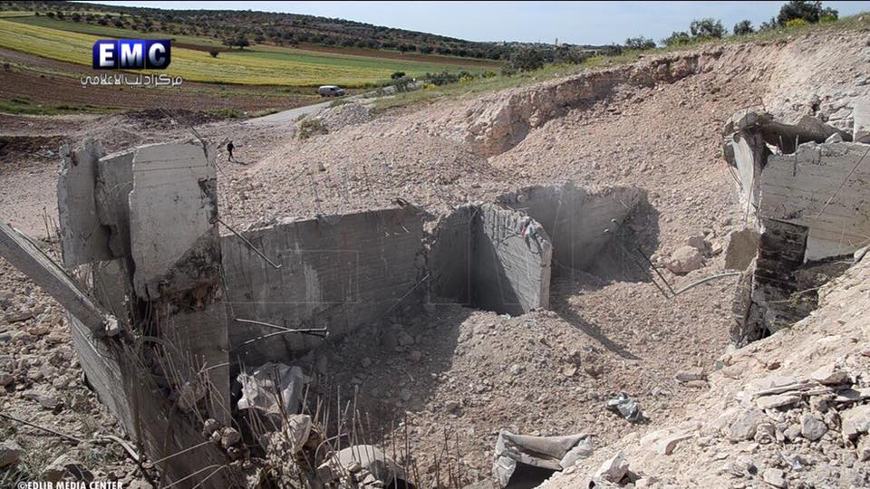
*External damage of the hospital as a result of the airstrikes*

Macro Media Center (MMC) [published photos](https://www.facebook.com/SYRMMC/posts/614939108972717) of Nabed Al Hayat Hospital after the attack showing the external damage.

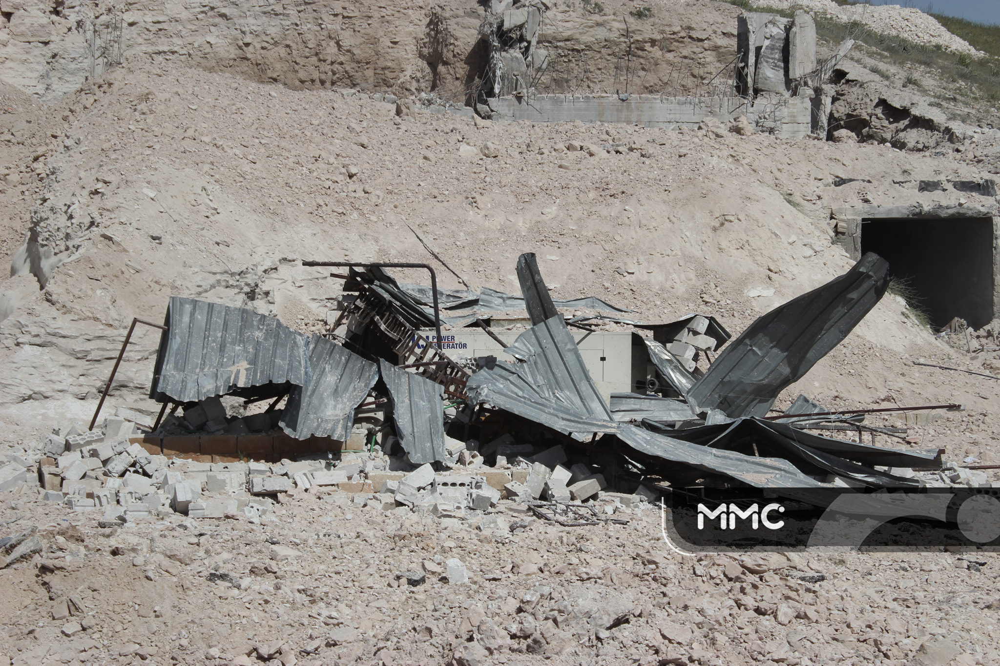
*External damage of around hospital's building as a result of the airstrikes*

## Geolocation of the Hospital

Using Google Earth Pro, the location of the hospital was geolocated by matching the Orient [Facebook video](https://www.facebook.com/watch/?v=660363207732616) of the attack with the satellite imagery below, taken on December 17 2017. This indicates that the attacked hospital shown in the videos is located in Hass town in Idlib, as was reported on social media.

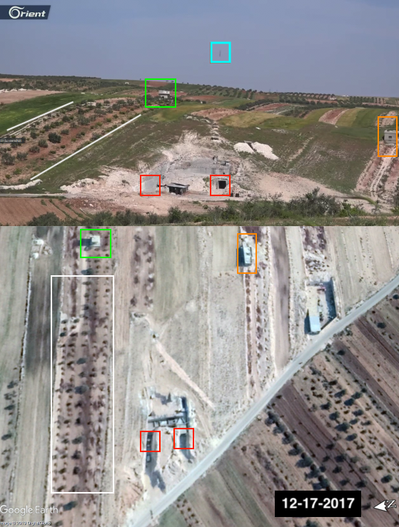

The location of the hospital is remote and isolated with no observable military activity in the vicinity.

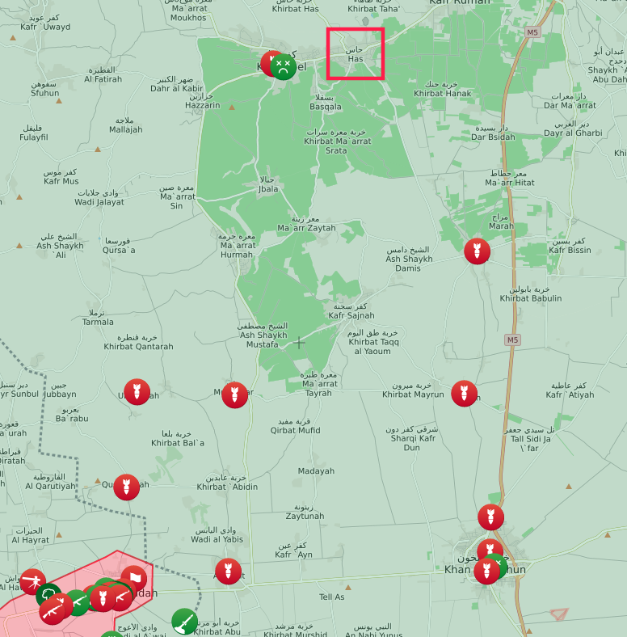

## Repeated Attacks on Nabed Al Hayat Hospital

This is not the first time Nabed Al Hayat Hospital has been targeted. On September 8 2018, SHAM Network [published a video](https://www.youtube.com/watch?v=NChue9acMsw) showing destruction of the hospital, claimed to be as a result of an airstrike.

The Bellingcat investigation team [published an investigation](https://www.bellingcat.com/news/mena/2018/09/09/battle-idlib-opens-bombing-medical-rescue-facilities/) about this incident on September 9th 2018.

Citizen reporter Mouhammed Bala'as also [published a video](https://www.youtube.com/watch?v=1xfCx43gadc) showing the impact site after the attack.

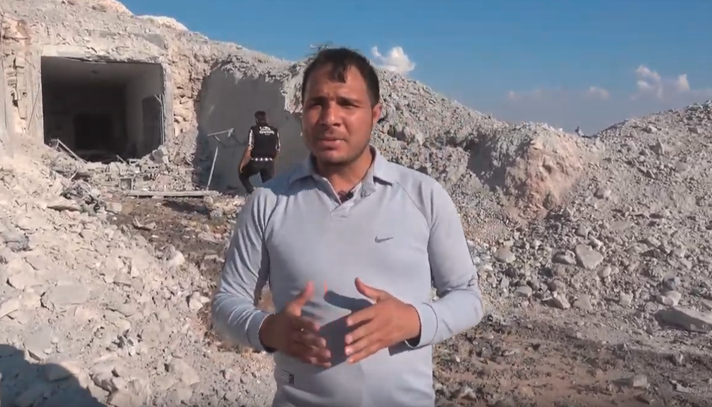

## Flight Data Analysis

To provide a further layer of verification, Syrian Archive cross-referenced findings from the videos and witness testimony with flight observation data from a spotter organisation. This process necessitated analysing observation data for flights between 14:00 and 16:00 Damascus local time, the period directly before and after the reported attack (14:42 - 15:08) as was claimed by media activists. See below:

<iframe height="550" src="https://public.tableau.com/views/Observedflightobservationdata5May2019/Sheet1?:showVizHome=no&:embed=y" width="780"></iframe>

[View full visualisation](https://public.tableau.com/profile/syrianarchiveorg#!/vizhome/Observedflightobservationdata5May2019/Sheet1)

Through comparing where flights were observed, the type of aircraft observed, the time flights were observed, and the direction flights were heading, and comparing this data to geolocation conducted in earlier steps, Syrian Archive was able to identify several flights potentially responsible for the attack. This comprises several fixed-wing Russian aircraft, seen circling in the immediate vicinity of the geolocated attack site in Kafr Nabl (14:38, 14:57, and 15:02), a drone circling Kafr Nabl (15:00), as well as a fixed-wing Russian aircraft seen circling in the area of Maarrat al-Nu'man (14:46). One additional fixed-wing Russian aircraft was observed in Hesh 14:39. Previous research has found that circling flights typically indicate target acquisition and/or preparation for an imminent attack.

While there is no direct evidence available that one of the observed aircrafts was involved in the attack on Hass, the presence of these aircrafts at the time stated by citizen reporters and humanitarian groups as the time in which airstrikes occurred increases the likelihood that an air attack occurred at this location and time.

## De-escalation Zone
On May 4 2017, the sponsoring states of Astana Talks (Russia, Turkey and Iran) [signed a memorandum of understanding](https://www.youtube.com/watch?v=5cF-gIL8yzk) for the establishment of de-escalation zones in Syria which took effect on May 6 2017. The Russian Ministry of Defence [published a map](https://syrianarchive.org/en/investigations/Atarib-Market-Bombing.html) showing the locations included in this memorandum as shown below (de-escalation zones in blue, ISIS in grey, Syrian army in orange). Hass town is located within the de-escalation zone.

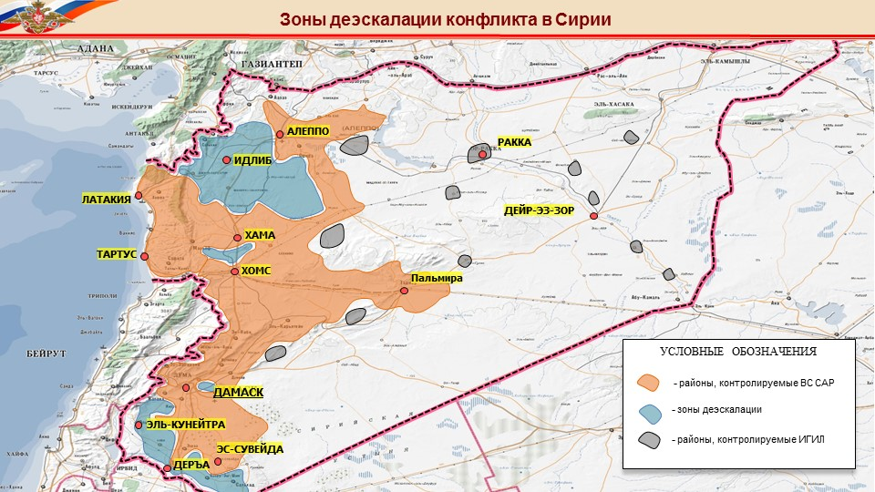

## De-confliction Mechanism

Since September 2014 the UN Office for the Coordination of Humanitarian Affairs (OCHA) have
operated a [humanitarian deconfliction mechanism](https://www.humanitarianresponse.info/sites/www.humanitarianresponse.info/files/documents/files/deconfliction_syria_for_static_non_static_feb2018_eng.pdf) to identify and protect humanitarian staff, offices, facilities, distribution sites, IDP sites, routes mobile clinics travel, etc. to the greatest extent possible during kinetic operations by the Coalition Forces (“CF”) in Syria.

The Russian Federation and the Republic of Turkey air forces were not part of this original 2014 process. However, an agreement is in place with both countries to deconflict movement and static locations provided by humanitarian organisations.

The co-founder of the hospital, Joumana Qaddour, [published a tweet](https://twitter.com/jomanaqaddour/status/1126041954196889600) mentioning that the hospital was part of the deconfliction mechanism. This was also [published in a statement](https://srd.ngo/srds-pulse-of-life-medical-hospital-attacked-destroyed/) by SRD which included:

>"This hospital’s coordinates had previously been shared with UN OCHA as part of its formal deconfliction mechanism, yet it was still directly targeted."

## Conclusion

Based on verifying open source information, interviewing witnesses and analysing flight data, it is certain that Nabed Al Hayat Hospital located in Hass town in Idlib governorate was bombed on May 5 2019 with an airstrike that resulted in both external and internal damage to the building of the hospital. That same hospital was attacked previously on September 8 2018. The hospital is located within the De-escalation zone and it was part of the De-conflicting mechanism. However, with the current information, it is not possible to state with certainty whether the Russian or the Syrian airforce perpetrated this attack.
