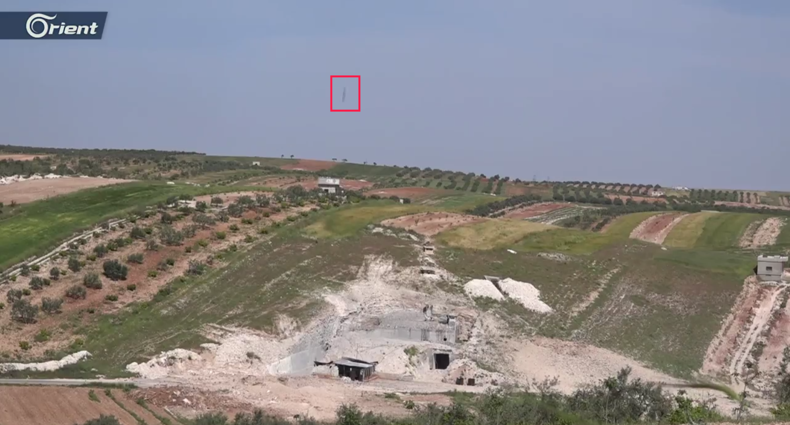
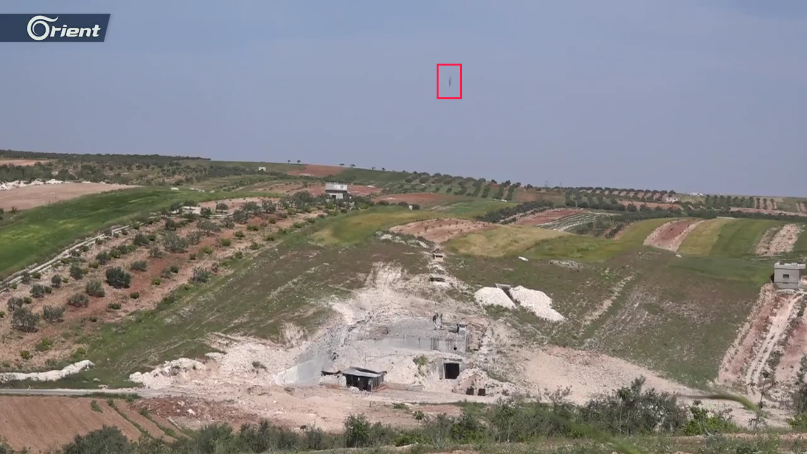
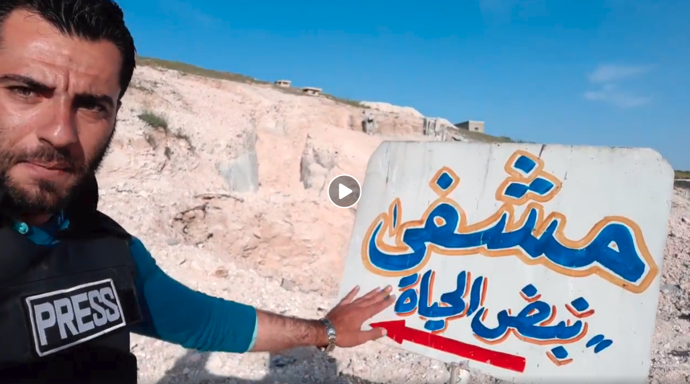
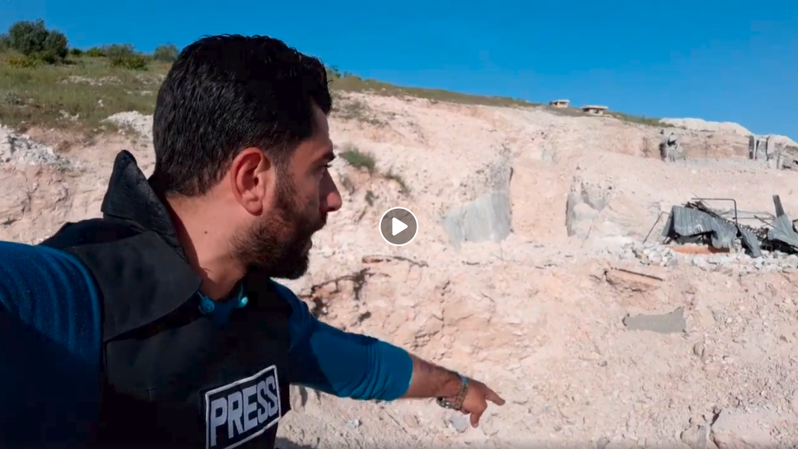
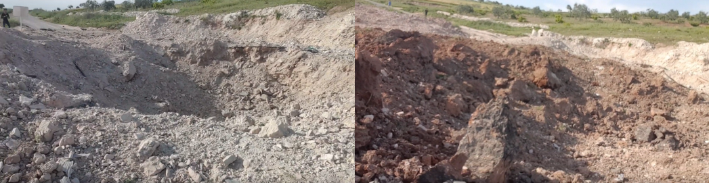
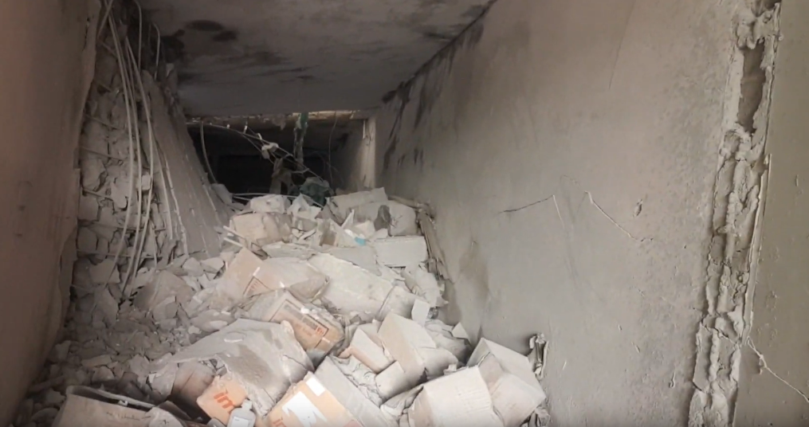
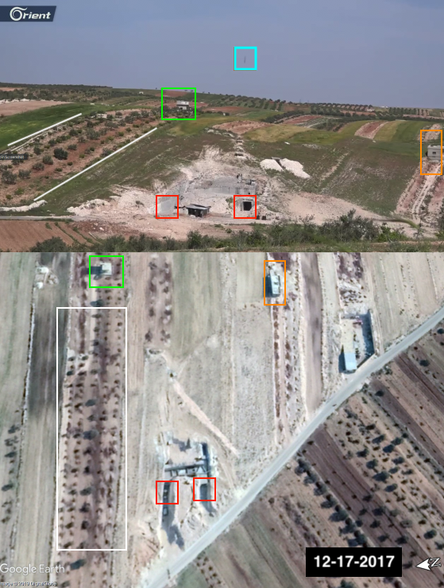
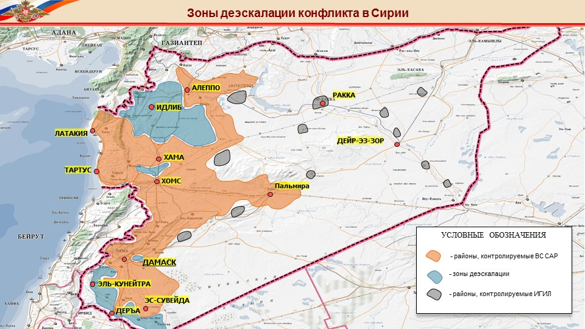

- الموقع الجغرافي: [ادلب: حاس](https://goo.gl/maps/7Uhfyp8h76TZmVUx8)
- الهدف: مستشفى نبض الحياة التابع لمنظمة سوريا للإغاثة والتنمية (SRD)
- المستفيدون من المستشفى: حوالي 5000 شخص وأكثر من 500 عملية جراحية شهريًا
- التاريخ: 5 مايو/ أيار 2019
- التوقيت:  بين 14:42 إلى 15:08 بتوقيت دمشق
- القتلى المبلّغ عنهم: لم يُبلغ عن قتلى
- الجرحى المبلّغ عنهم: لم يُبلغ عن جرحى
- الهجمات: ثلاث إلى أربع غارات جوية
- الذخائر المحدّدة: أمكن تحديد ذخيرتين في الفيديو المنشور من قبل قناة أورينت
- المسؤول المحتمل: الطيران الروسي أو السوري

## ماذا حدث ومتى؟

في 5 مايو/أيار 2019، [نُشرت تقارير من قبل مواطنين صحفيين](https://www.facebook.com/wassemalon/posts/1173592712801596) ووكالات أنباء في سوريا حول خروج مستشفى نبض الحياة في بلدة حاس، محافظة ادلب، عن الخدمة نتيجة استهدافه بغارة جويّة.

تقع بلدة حاس في محافظة ادلب،  [ بلغ عدد سكّانها عام 2004 حوالي 9595 نسمة](https://web.archive.org/web/20130313044847/http://www.cbssyr.org:80/new%20web%20site/General_census/census_2004/NH/TAB07-11-2004.htm)، وفقًا للمكتب المركزي السوريّ للإحصاء.

تتلقى مستشفى نبض الحياة الدعم من [سوريا للإغاثة والتنمية - SRD](https://srd.org.tr/)، وهي منظمة مرخصة في تركيا، مهمّتها،  وفقًا [لما نُشر عبر موقع الويب الخاص بها](https://srd.org.tr/ar/about)، "توفير الإغاثة الإنسانية الطارئة وزرع بذور التنمية المستدامة لشعب سوريا." في الثامن من سبتمبر / أيلول 2018، [نشرت وكالة أخبار بلدي مقطع فيديو](https://www.youtube.com/watch?v=QPRb71FGCgI&feature=share) يظهر أضرارًا داخلية لحقت بمستشفى نبض الحياة نتيجة لهجوم سابق ، ويمكن رؤية شعار منظمة SRD في أحد لقطاته.

[نشرت منظمة سوريا للإغاثة والتنمية - SRD ](https://srd.ngo/srds-pulse-of-life-medical-hospital-attacked-destroyed/) بيانًا حول الهجوم عبر موقع الويب الخاص بها. حيث صرّحت أماني قدّور، مديرة المنظمة الإقليميّة، بما يلي:

> "يعتبر مشفانا، الذي استُهدف باطّراد هذا الأسبوع، أحد مستشفيات الطوارئ الكبرى حيث يقدم الخدمات الطبية لادلب وشمال حماة. لم يعد بوسع الأشخاص الذين كانوا يستفيدون من خدمات المستشفى تلقّي رعاية قد تنقذ حيواتهم. كان المشفى يجري أكثر من 500 عملية جراحية شهريًا، إضافة إلى معاينة أكثر من 5000 مريض. تسبب الهجوم في استمرار آلام أطفالٍ وأهاليهم وحرمانهم من المساعدة الطبية".

 [نشرت قناة أورينت على صفحتهم على فيسبوك مقطع فيديو ](https://www.facebook.com/watch/?v=660363207732616) يظهر الهجوم لحظة وقوعه، حيث قُصفت المستشفى مباشرة بذخيرتين، كما يتضح أدناه. يمكن سماع صوت طائرة في الدقيقة 01:43 من الفيديو. يقول المصوّر أثناء التقاطه للمقطع:

> "استهداف مشفى نبض الحياة في بلدة حاس من قبل الطيران الحربي الروسي".

<iframe src="https://giphy.com/embed/MCFOyRtoIiPPFZvSJs" width="680" height="470" frameBorder="0" class="giphy-embed" allowFullScreen></iframe>

*يظهر المقطع استهدافًا مباشرًا لمستشفى نبض الحياة*

نشرت صفحة ادلب الحدث [منشورًا على فيسبوك](https://www.facebook.com/permalink.php؟story_fbid=2265878050396699&id=1475672172750628) يقول: "الطيران الروسي يستهدف مشفى حاس جنوب ادلب".  بعد تحويل الطابع الزمني *data-utime="1557058094"* إلى تنسيق التوقيت العالمي UTC، يتضح أن الخبر نُشر على فيسبوك في الساعة 15:08 بتوقيت دمشق.

نُشر [مقطع فيديو آخر من قبل أورينت](https://www.facebook.com/Orient.Tv.Net/videos/324763261548620/) عقب الهجوم، ويظهر فيه بثّ مباشر لمراسلهم جميل الحسن من موقع التأثير في الساعة 18:17 بتوقيت دمشق من مساء يوم 5 مايو/ أيّار. حيث أشار الصحفي أن غارة جويّة روسية استهدفت المستشفى مباشرةً بأربعة صواريخ. ثم ذكر أن الطائرات الأربع عادت إلى موقع التأثير نفسه وفقًا لمراكز الرصد.

*بثّ مباشر على فيسبوك للصحفي جميل الحسن من موقع التأثير*

## الحُفرة

أشار الصحفي جميل الحسن  في [البثّ المرئي المباشر](https://www.facebook.com/Orient.Tv.Net/videos/324763261548620/) إلى الحفرة الكبيرة الناتجة عن الغارة الجوية، كما ذكر أن الهجمات أسفرت عن تدمير المستشفى.

*يظهر الفيديو حفرة ناجمة عن الغارة الجوية*

يمكن أيضًا تحديد حفرتين كبيرتين في [مقطع فيديو نشره](https://www.youtube.com/watch؟v=UDiGfhBdYfU) محمد بلعاس.

*تظهر حفرتان في مقطع فيديو نشره الصحفي المواطن محمد بلعاس على يوتيوب*

## الدمار الذي لحق بالمستشفى

### الدمار داخل المبنى

نشرت وكالة سمارت نيوز للأنباء [مقطع فيديو](https://www.youtube.com/watch؟v=wS_xozm-Tqk) يوضّح تعرض المستشفى للهجوم بالإضافة إلى الدمار الداخليّ للمبنى والناجم عن الغارات الجوية.

*الدمار داخل بناء المستشفى نتيجة الغارات الجوية*

كما يصوّر [مقطع الفيديو الذي نشره محمد بلعاس](https://www.youtube.com/watch؟v=UDiGfhBdYfU) دمار المستشفى من الداخل من زاويتين مختلفتين كما هو موضح أدناه.

*الدمار داخل بناء المستشفى نتيجة للغارات الجوية*

### الدمار خارج المبنى

نشر مركز ادلب الإعلامي [صورًا على فيسبوك](https://www.facebook.com/EdlibEmc1/posts/2321136834766539) لمستشفى نبض الحياة بعد الهجوم. تظهر الصور الأضرار الخارجية التي لحقت بمبنى المستشفى.

*الأضرار الخارجية التي لحقت بمبنى المستشفى نتيجة للغارات الجوية*

ونشر المركز الإعلامي العام (MMC)[صورًا لمستشفى نبض الحياة بعد استهدافه](https://www.facebook.com/SYRMMC/posts/614939108972717) تظهر دمار المبنى من الخارج.

*الدمار حول بناء المستشفى والناجم عن الغارات الجوية*

## تحديد الموقع الجغرافي للمستشفى

حُدّد الموقع الجغرافي للمستشفى باستخدام Google Earth Pro، عن طريق مطابقة [فيديو أورينت المنشور على فيسبوك](https://www.facebook.com/watch/؟v=660363207732616) مع صورة الأقمار الصناعية أدناه، والملتقطة بتاريخ 17 ديسمبر / كانون الأول 2017. وبذلك تم التحقق من أن المستشفى الذي تعرض للهجوم وظهر في مقاطع الفيديو يقع في بلدة حاس في ادلب، بما يتوافق مع ما ورد في وسائل التواصل الاجتماعي.

ويُلاحظ أن موقع المستشفى ناءٍ ومنعزل في منطقة لم يُرصد وجود أنشطة عسكرية على مقربة منها.

## هجمات متكررة على مستشفى نبض الحياة

لا يُعتبر هجوم مايو / أيّار 2019 الأول من نوعه على  مستشفى نبض الحياة، إذ تعرّض سابقًا لهجمات متكررة، من بينها ما تمّ توثيقه [في مقطع فيديو نشرته شبكة شام الإخبارية](https://www.youtube.com/watch؟v=NChue9acMsw) بتاريخ 8 سبتمبر / أيلول 2018 أظهر دمارًا في المستشفى ادُّعي أنه ناجم عن غارة جويّة.

نشر فريق التحقيق في بيلينغكات في 9 سبتمبر/ أيلول 2018 [تحقيقًا](https://www.bellingcat.com/news/mena/2018/09/09/battle-idlib-opens-bombing-medical-rescue-facilities/) حول ذلك الحادث.

كما نشر المواطن الصحفي محمد بلعاس [مقطع فيديو يُظهر](https://www.youtube.com/watch؟v=1xfCx43gadc) موقع التأثير بعد الهجوم.

## تحليل بيانات الطيران

بغرض إضافة طبقة أخرى من التحقق؛ قارن الأرشيف السوري النتائج المستخلصة من مقاطع الفيديو وإفادات الشهود مع بيانات رصد الطيران من قبل منظمة مراقبة. استلزمت هذه العملية تحليل بيانات رصد الطيران ما بين الساعة 14:00 و 16:00، وهي الفترة الزمنية التي سبقت الهجوم وتلته مباشرة، حيث أُبلغ عنه ما بين الساعة (14:42 - 15:08) وفقًا للناشطين الإعلاميين. انظر أدناه:

<iframe height="550" src="https://public.tableau.com/views/Observedflightobservationdata5May2019/Sheet1?:showVizHome=no&:embed=y" width="780"></iframe>

[عرض الإظهار البصري كاملًا](https://public.tableau.com/profile/syrianarchiveorg#!/vizhome/Observedflightobservationdata5May2019/Sheet1)

من خلال مقارنة الرحلات الجوية المرصودة، نوع الطائرات المرصودة، الوقت الذي رُصدت به، ووجهات هذه الرحلات، ومقارنة هذه البيانات مع المواقع الجغرافية المقدّمة في الخطوات السابقة؛ تمكّن الأرشيف السوري من تحديد عدة رحلات جوية يحتمل أن تكون مسؤولة عن هذا الهجوم. يشمل ذلك عدة طائرات روسية ثابتة الجناحين شوهدت تحلّق فوق المنطقة المجاورة مباشرة لموقع الهجوم الجغرافي في كفرنبل (14:38، 14:57، 15:02)، طائرة بدون طيار حلّقت فوق كفرنبل (15:00)، وكذلك طائرة روسية ثابتة الجناحين شوهدت تحلق فوق منطقة معرة النعمان (14:46). كما رُصدت طائرة روسية ثابتة الجناحين فوق بلدة حيش (14:39). وقد خلصت تحقيقات سابقة إلى أن الطيران الدائري في السماء عادةً ما يُشير إلى محاولة الاستحواذ على الهدف أو التحضير لهجوم وشيك.

على الرغم من عدم توافر دليل مباشر على ضلوع إحدى هذه الطائرات المرصودة في الهجوم على حاس، فإن وجود هذه الطائرات في الوقت المشار إليه من قبل الصحفيين المواطنين والمجموعات الحقوقية يزيد من احتمال وقوع غارة جوية في المكان والتوقيت المحدّدين.

## مناطق خفض التصعيد

في 4 مايو/أيار 2017، وقعت الدول الراعية لمحادثات الأستانة (روسيا، تركيا، وإيران)[مذكرة تفاهم](https://www.youtube.com/watch?v=5cF-gIL8yzk) لإنشاء مناطق خفض تصعيد في سوريا والتي أصبحت سارية المفعول في 6 مايو/ أيار 2017. نشرت وزارة الدفاع الروسية [خريطة](https://syrianarchive.org/en/investigations/Atarib-Market-Bombing.html) تظهر المواقع المشمولة في مذكرة التفاهم هذه كما هو واضح أدناه (مناطق خفض التصعيد باللون الأزرق، داعش باللون الرمادي، والجيش السوري باللون البرتقالي). تقع حاس ضمن مناطق خفض التصعيد.

## الآلية الإنسانية لتجنب النزاع

منذ سبتمبر/ أيلول 2014، فعّل مكتب الأمم المتحدة لتنسيق الشؤون الإنسانية (OCHA) [الآلية الإنسانية لتجنب النزاع](https://www.humanitarianresponse.info/sites/www.humanitarianresponse.info/files/documents/files/deconfliction_syria_for_static_non_static_feb2018_ar.pdf) لتعريف وحماية العاملين في المجال الإنساني والمكاتب والمرافق والمواقع الخاصة بالعمليات الإنسانية، أماكن تجمعات النازحين، الطريق المؤدية إلى المرافق الإنسانية والعيادات المتنقلة، إلى أقصى حدّ أثناء العمليات الحركية من قبل قوات التحالف في سوريا.

لا تُعتبر القوات الجوية التابعة لروسيا الاتحادية والجمهورية التركية جزءًا من هذه العملية في 2014. ولكن، تم الاتفاق مع البلدين على آلية تحييد المواقع الثابتة والمتحركة الخاصة بالمنظمات الإنسانية.

ذكرت الشريكة المؤسسة للمستشفى، جمانة قدور،  [في تغريدة نشرتها على تويتر](https://twitter.com/jomanaqaddour/status/1126041954196889600) أن المستشفى جزء من الآلية الإنسانية لتجنب النزاع. كما ذُكر ذلك أيضًا  [في البيان المنشور من منظمة سوريا للإغاثة والتنمية](https://srd.ngo/srds-pulse-of-life-medical-hospital-attacked-destroyed/) SRD والذي تضمّن:

> "على الرغم من مشاركة إحداثيات هذا المستشفى مسبقًا مع مكتب الأمم المتحدة لتنسيق الشؤون الإنسانية كجزء من الآلية الإنسانية لتجنب النزاع، إلا أنه لا يزال مستهدفًا بشكل مباشر."

## خاتمة

بالاعتماد على التحقق من البيانات مفتوحة المصدر، إجراء المقابلات مع الشهود، وتحليل بيانات الطيران؛ تم التأكّد أن مستشفى نبض الحياة الواقع في بلدة حاس، محافظة ادلب، قد تعرّض للقصف بتاريخ 5 مايو/ أيار 2019 بغارة جويّة أسفرت عن أضرار داخلية وخارجية في بناء المستشفى. يُذكر أن المستشفى نفسه تعرض لهجوم سابق بتاريخ 8 سبتمبر/ أيلول 2018. يقع المستشفى ضمن منطقة خفض التصعيد، وكان جزءًا من الآلية الإنسانية لتجنب النزاع. تجدر الإشارة إلى أنه وفي ظل المعلومات المتوافرة حاليًا، لا يمكن البتّ على وجه اليقين ما إذا كان الهجوم قد ارتُكب من قبل القوات الجوية الروسية أو السورية.
