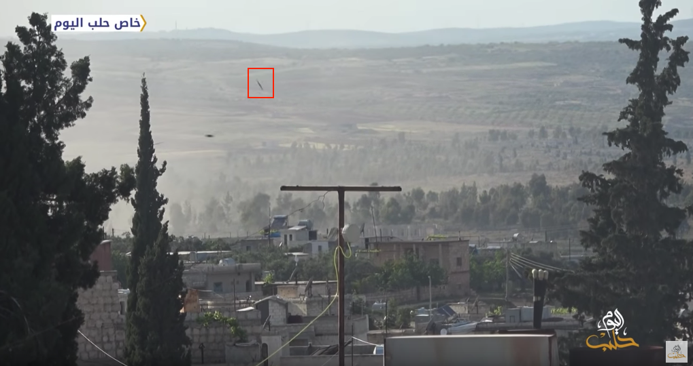

- Location: IDLIB : Kafranbel
- Target: Kafranbel Surgical Hospital (Orient Hospital)
- Beneficiaries: Served the ~400,000 people in Southern Idlib
- Date: 5 May 2019
- Time: ~17:30 Damascus Time
- Casualties: 1
- Injured: At least 1
- Attacks: 4 Airstrikes
- Munitions identified: N/A
- Potentially responsible: Russian or Syrian Airforce

### What Happened?

A number of local news outlets and media activists published on May 5th 2019 news about 4 air raids, which took place around 5:30 PM Damascus Local Time, targeting the [Kafrnabel Surgical hospital](https://orienthr.ngo/ar/surgical-hospital-in-kafr-nabl-idlib-syria/), previously referred to as the Orient Hospital, that rendered it out of service. Hand in Hand for Aid and Development, a [British organization](https://hihfad.org/) supporting the hospital, published on [Twitter](https://twitter.com/hihfaduk/status/1125064412845551617) about the targeting of the Kafranbel hospital. They later published a [video](https://twitter.com/hihfaduk/status/1125079647799132161) showing the damage from inside the hospital after the airstrikes.

The video mentioned above shows the banner of Hand in Hand for Aid and Development which confirms that they support the Kafr Nabel Surgical hospital.

[Halab Today](https://www.youtube.com/watch?v=DBZ9MMeCkqY) and [Edlib Media Center](https://www.youtube.com/watch?v=mcPEwb9SoeE) published videos on the day of the attack showing the direct targeting of the hospital by aircraft overhead as well as the evacuation of patients from the hospital. They also, as is shown below, depict the 4 separate airstrikes or raids on the hospital. In both videos, the sound of an aircraft lingers overhead before and after each airstrike.  

Below is one missile targeting the hospital

Below is a second missile targeting the hospital

Below is a third missile targeting the hospital

The videos published by both Halab Today and Edlib Media Center feature landscapes similar to what is shown for the location of the hospital by Google Earth further verifying the location of the hospital as well as the footage of the airstrikes.

Activist Mustafa al-Alloush Abu Sader, offers a different angle of the airstrikes, sharing a [video](https://www.facebook.com/100025494637033/videos/361798371346648/) on Facebook that shows the direct targeting of the hospital.

Media activist Hadi Al Abdallah, who conducted a [video report](https://www.facebook.com/HadiAlabdallah/videos/2176159982501797/UzpfSTEwMDAwNDU2NDc3Mzg4NjoxMjE4Mjc3ODM4MzM0MzY0/) highlighting the attack on Kafranbel hospital, claims like many others that the medical facility was targeted by a Russian aircraft. Media activist Mohamad Bela’as additionally concurs claiming in his [report](https://www.youtube.com/watch?v=RrSNxU9I4MA) that Russian fighter jets directly targeted the hospital with 4 airstrikes.

Smart News Agency also published a [video](https://www.youtube.com/watch?v=dxhlKcnSbLk) showing the damage and evacuation of Kafranbel hospital with an interview of a White Helmet rescue worker who expressed that the targeting was done by a Russian fighter jet. He claimed the attack resulted in the death of the hospital guard. This matches other [reports](https://www.zamanalwsl.net/news/article/104215/) which claim there was one dead and a few injured as a result of the Kafarnabel airstrikes. A [press release](https://www.amnesty.org.uk/press-releases/syria-least-15-hospitals-targeted-idlib-and-hama-beginning-may) by Amnesty International confirms this reporting one patient killed and his brother injured in the attack.

[Sham News](https://www.youtube.com/watch?v=hCHG9ifqvHc), alongside [Orient TV](https://www.youtube.com/watch?v=0HMsGS92LwI) and [MMC](https://www.youtube.com/watch?v=DK6VUUi7QKI), published various video reports on YouTube a day after the attack highlighting the extensive damage of the hospital as well as depicting the evacuation of patients.

As is shown below, the hospital was hit by 4 airstrikes at around 5:30 PM local Syrian time. As seen in the images and footage above, which is verified as showing the hospital on May 5th or 6th, the four air raids significantly debilitated the hospital internally and externally rendering it, as a multitude of news reports confirmed, out of service.

### Verification

#### Geolocation

Given the repeated history of Kafranbel Hospital’s targeting, the location of the hospital was confirmed by matching previous screenshots taken from video reports verifying earlier attacks on the facility. The attacked hospital shown in the videos is located near the town of Kafranbel, which sits south of Idlib.

Videos published after the attack and their location can be seen below:

#### The Time

Given a multitude of reports indicating the time of the attack as happening around 5:30-5:40 PM, such as the Union of Medical Care and Relief Organization’s [press release](https://www.uossm.org/breaking_3_hospitals_bombed_today_in_syria), the time of this attack was confirmed by the shadows shown in the multitude of videos detailing the 4 airstrikes. Utilizing the online tool [SunCalc](https://www.suncalc.org/#/35.6229,36.5506,15/2019.05.05/17:27/1/1) to calculate the position of the sun based upon the location and supposed time of the airstrike, the shadows in the verified videos analyzed in this report match the location of the sun at around 5:30 PM in Kafranbel.

Moreover, shadows featured in verified footage matched the shadow lengths and size of shadows at 5:30 PM (Damascus Time) as calculated on [Shadow Calculator](http://shadowcalculator.eu/#/lat/35.62304200689339/lng/36.551594894866184). Shadow Calculator calculates the length of a shadow depending upon points of reference as well as the time of day.

#### The Airstrikes

Through the comparison and matching of the airstrike smoke plumes and also the sounds of the approaching aircrafts across a number of videos, it is possible to identify four separate airstrikes. The airstrikes are labeled  A, B, C, D, as they could not be identified confidently in a specific order.   

##### Airstrike A

Videos published by [MMC](https://www.youtube.com/watch?v=DK6VUUi7QKI) and [Civil Defense in Idlib](https://www.youtube.com/watch?v=wUufZe4XLqk).

##### Airstrike B

Videos posted by [Aleppo Today](https://www.youtube.com/watch?v=DBZ9MMeCkqY&feature=youtu.be&t=17), [Mustafa Aloush](https://www.facebook.com/100025494637033/videos/361798371346648/), and [EMC](https://www.youtube.com/watch?v=mcPEwb9SoeE)

##### Airstrike C

Videos pulished by [Idlib Plus](https://twitter.com/IdlibPlus/status/1125057973162844160) and [Alaa Yousef](https://www.youtube.com/watch?v=_LMW4e0hlwU)

##### Airstrike D

Videos published by [Smart News Agency](https://www.youtube.com/watch?v=dxhlKcnSbLk) and [Aleppo Today](https://www.youtube.com/watch?v=DBZ9MMeCkqY&feature=youtu.be&t=30)

#### The Damage

As featured above, and emphasized in the various [local and international reports](https://twitter.com/AlarabyTV/status/1125928302030409729), the damage on Kafranbel Surgical hospital was extensive. Externally and from outside the hospital, it’s surrounding gates, buildings, as well as one of its ambulances are shown as rubble and destroyed.

Moreover, the hospital building itself is shown, by a [number of sources](https://youtu.be/7c4WHKHApPE?t=85), as extensively damaged and visibly unusable.

In showing the evacuation of patients from the hospital, a video posted by the [White Helmets](https://youtu.be/wUufZe4XLqk?t=59) as well as [Hand in Hand](https://twitter.com/hihfaduk/status/1125079647799132161) additionally shows the extensive internal damage of the four airstrikes on the hospital.

In comparison to the [February 5, 2018 attack](https://youtu.be/YwhGjgql7IU?t=48) the hospital externally sustained similar damage. The hospital internally, however, experienced more severe damage in February of 2018 because its wards, as shown in videos from after the attack, remained mostly above ground and in the main larger building.  

This differs from videos of the internal damage of the hospital from the May 5 attack as they, with videos showing the patient evacuation, reveal the vital wards of the hospital as underground. Compared to the 2017 [September 19th](https://youtu.be/2RJ-k5jXopQ?t=10) and [March 25th](https://youtu.be/srgCm-W_gqM?t=26) attacks, the Kafranbel hospital has sustained much more damage to its above ground external structure.

Similar to the February 2018 attack, the footage provided by local news sources and activists confirms reports of the hospital as out of service and destroyed.

#### Flight Data Analysis

To provide a further layer of verification, the Syrian Archive cross referenced findings from the media above with flight observation data from a spotter organisation. Data for flights around 17:30 in the Idlib province near Kafarnabel, the time and location of the investigated attack, was more closely analysed and observed.  

<iframe height="550" src="https://public.tableau.com/views/observedflightdataidlib5may2019/Sheet1?:showVizHome=no&:embed=y" width="780"></iframe>

Through an analysis of this data, the Syrian Archive was able to more confidently verify the time of the airstrikes as well alleged perpetrators of the attack. Several fixed wing aircraft, what are identified as either Russian aircraft, Su-22’s, or Su-24’s, are indicated as flying in the direction of Kafarnabel from neighbouring villages, circling the town, as well as circling the other neighbouring towns of Ma’aret al-Nu’man, Heish, and Jabal al-Zawye between 17:18 and 17:40. Previous research has found that circling flights typically indicate target acquisition and/or preparation for an imminent attack.  This corroborates the data mentioned above of an attack around 17:30 in Kafarnabel.

Given that there is no direct evidence available that one of the observed aircrafts was involved in the attack on Kafarnabel, the presence of these aircrafts above the town as well as neighbouring towns increases the likelihood that an air attack occurred at this location during the time stated by citizen reporters as well as humanitarian groups, and estimated also by using imagery from the attack.

### Conclusion

From an analysis of online open sources as well as flight data, it can be confirmed that Kafranbel Surgical Hospital, which is located in the Syrian de-escalation zone, was attacked on May 5th 2019 with four air raids at around 5:30 PM. Shown in a multitude of uploaded and shared footage, the four air raids significantly debilitated the hospital internally and externally rendering it, as a number of local news sources confirmed, out of service. Although cut footage posted by fairly reputable sources show an aircraft over the hospital, it is not possible to comfortably conclude with certainty that the Russian or Syrian air force perpetrated the attack.
