- الموقع الجغرافي: ادلب: كفرنبل
- الهدف: مستشفى كفرنبل الجراحي (مشفى أورينت)
- المستفيدون من المستشفى: حوالي 40,000 شخص جنوبي ادلب
- التاريخ: 5 مايو/ أيار 2019
- التوقيت: حوالي الساعة 17:30 بتوقيت دمشق
- الضحايا: 1
- الجرحى : 1 على الأقل
- الهجمات: 4 غارات جوية
- الذخائر المحدّدة: غير متوافرة
- المسؤول المحتمل: الطيران الروسي أو السوري

### ماذا حدث؟

نشرت العديد من وسائل الإعلام المحلية والناشطين الإعلامين بتاريخ 5 مايو/ أيار 2019 أنباءً عن 4 غارات جوية استهدفت [مستشفى كفرنبل الجراحي](https://orienthr.ngo/ar/surgical-hospital-in-kafr-nabl-idlib-syria/)، المعروف سابقًا باسم مستشفى أورينت، وذلك حوالي الساعة 5:30 مساءً بالتوقيت المحلي لدمشق، ما أدى لخروجه عن الخدمة. نشر حساب "يداً بيد للإغاثة والتنمية"، و[هي منظمة بريطانية](https://hihfad.org/) داعمة للمستشفى، [تغريدة على تويتر](https://twitter.com/hihfaduk/status/1125064412845551617) حول الاستهداف، كما نشر الحساب لاحقًا [مقطع فيديو](https://twitter.com/hihfaduk/status/1125079647799132161) يُظهر الأضرار داخل المستشفى بعد الغارات الجوية.

في الفيديو المذكور أعلاه تظهر لافتة منظمة "يداً بيد للإغاثة والتنمية" ما يؤكد دعمها لمستشفى كفرنبل الجراحي.

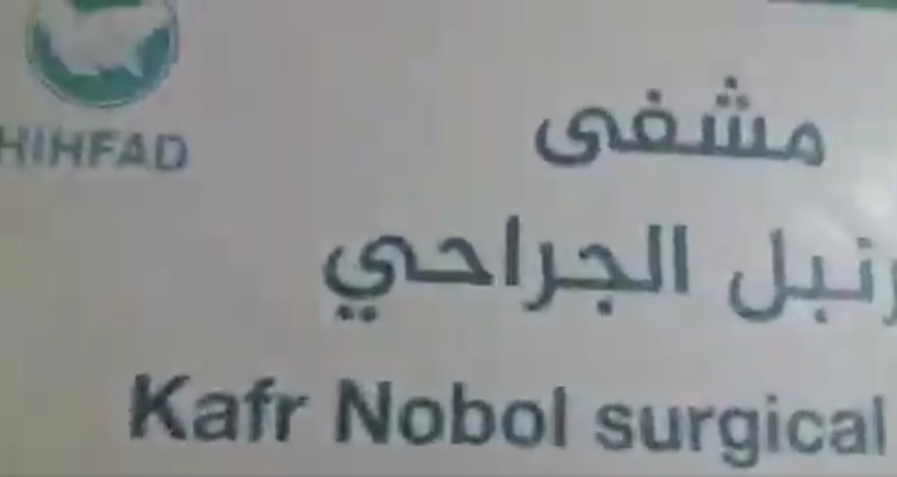

في اليوم نفسه، نشرت كل من قناة [حلب اليوم](https://www.youtube.com/watch؟v=DBZ9MMeCkqY) و[مركز ادلب الإعلامي](https://www.youtube.com/watch؟v=mcPEwb9SoeE) مقطعي فيديو يُظهران الاستهداف المباشر للمستشفى من قبل الطيران ومشاهد لإجلاء المرضى منها. إضافة إلى ذلك؛ يُظهر مقطعا الفيديو أربع غارات جويّة منفصلة على المستشفى. في كلا المقطعين، يمكن سماع صوت طائرة تُحلّق في الأجواء قبل وبعد كل غارة جوية.

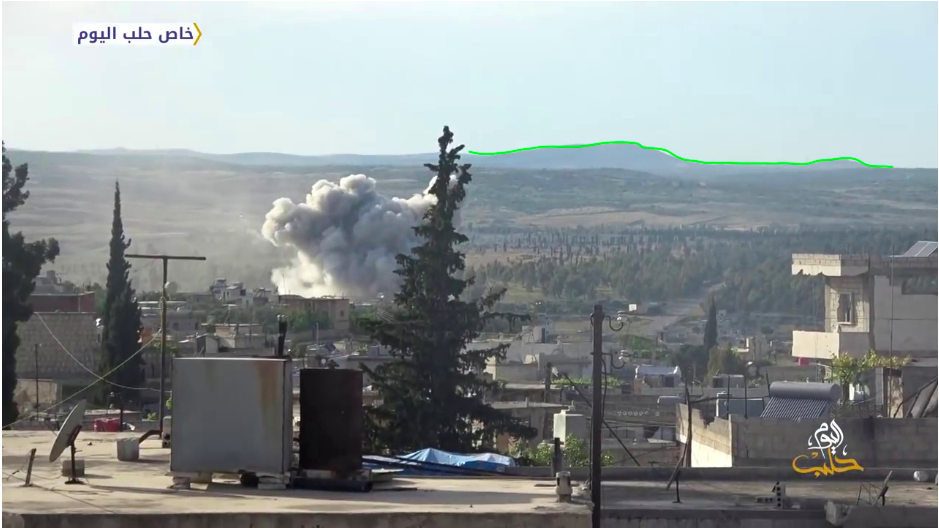

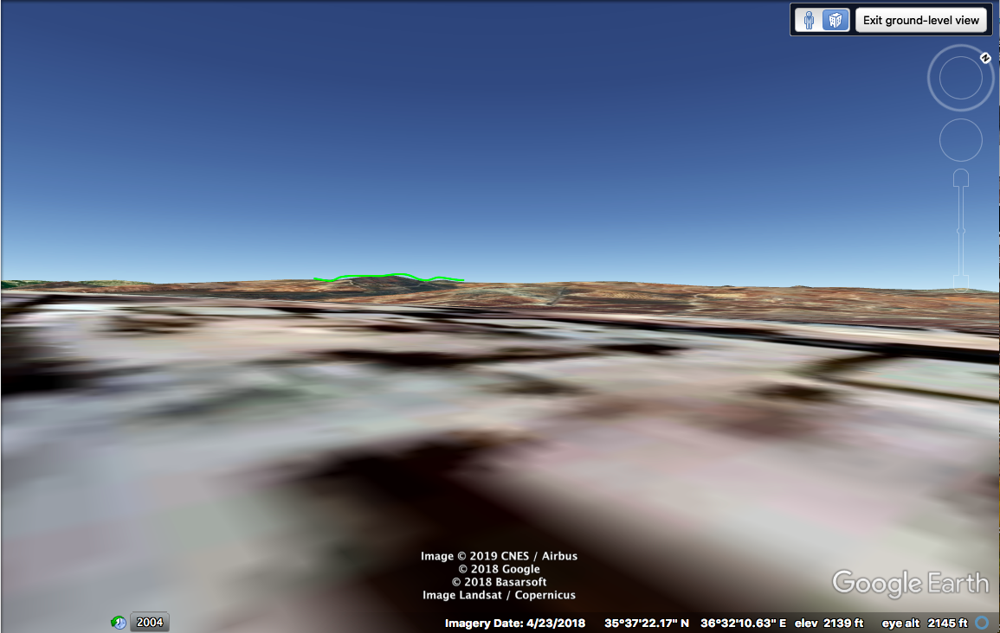

أدناه؛ استهداف المستشفى بصاروخ

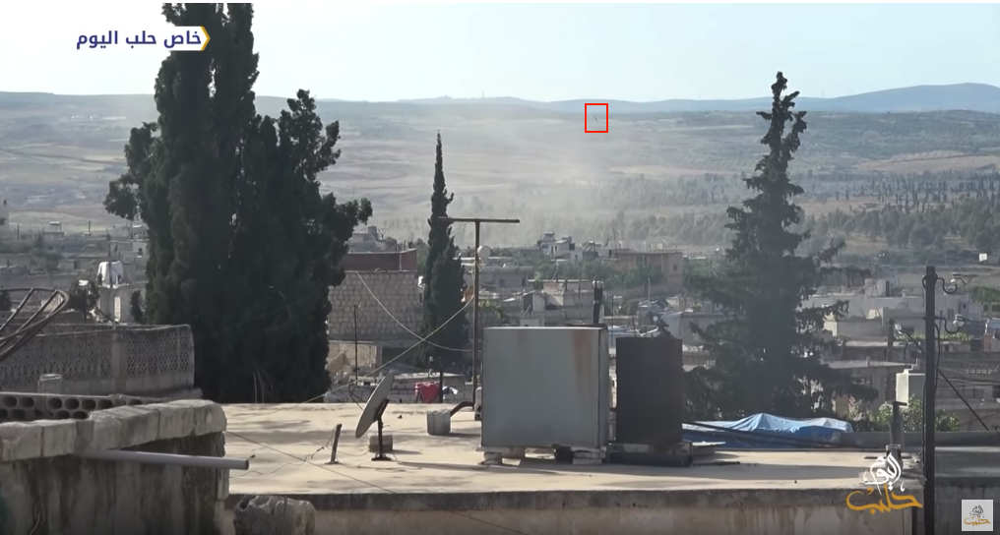

أدناه؛ استهداف المستشفى بصاروخ ثانٍ

أدناه؛ استهداف المستشفى بصاروخ ثالث

تظهر مقاطع الفيديو التي نشرتها كل من قناة حلب اليوم ومركز ادلب الإعلامي معالم طبيعية تتوافق مع المعالم الظاهرة في الموقع الجغرافي للمستشفى على جوجل ايرث، ما يزيد التحقق من موقع المستشفى وكذلك من لقطات الغارات الجوية.

نشر الناشط مصطفى العلوش أبو صادر مقطع [فيديو](https://www.facebook.com/100025494637033/videos/361798371346648/) على فيسبوك يوضح الاستهداف المباشر للمستشفى من زاوية مختلفة.

ادّعى الناشط الإعلامي هادي العبد الله في [تقريره المصوّر](https://www.facebook.com/HadiAlabdallah/videos/2176159982501797/UzpfSTEwMDAwNDU2NDc3Mzg4NjoxMjE4Mjc3ODM4MzM0M) أن الهجوم على المستشفى قد نُفّذ من قبل طائرة روسية. أكّد الناشط الإعلامي محمد بلعاس هذه الادّعاءات في [تقريره](https://www.youtube.com/watch?v=RrSNxU9I4MA)، حيث ذكر بأن مقاتلاتٍ روسيّة استهدفت المستشفى مباشرة بأربع غارات جوية.

نشرت أيضًا وكالة سمارت للأنباء [مقطع فيديو](https://www.youtube.com/watch?v=dxhlKcnSbLk) يُظهر الأضرار في مستشفى كفرنبل وعمليات إخلائه، إضافة إلى مقابلة مع أحد عمال الإنقاذ في الدفاع المدنيّ والذي ذكر أن الاستهداف قد نُفّذ من قبل مقاتلة روسيّة. كما ادّعى أن الهجوم أسفر عن مقتل حارس المستشفى. تتطابق هذه الادّعاءات مع [تقارير أخرى](https://www.zamanalwsl.net/news/article/104215/) ذكرت وقوع قتيل واحد وعددٍ من الجرحى نتيجة لغارات جوية على كفرنبل. وهو ما أكّده أيضًا [بيانٌ صحفي](https://www.amnesty.org.uk/press-releases/syria-least-15-hospitals-targeted-idlib-and-hama-beginning-may) صدر عن منظمة العفو الدولية حيث أبلغ عن مقتل أحد المرضى وإصابة أخيه في الهجوم.

عقب يوم من الهجوم؛ نشرت كل من  [شبكة شام للأنباء](https://www.youtube.com/watch?v=hCHG9ifqvHc)،  [قناة أورينت](https://www.youtube.com/watch?v=0HMsGS92LwI) و[المركز الإعلامي العام MMC](https://www.youtube.com/watch?v=DK6VUUi7QKI) عدة مقاطع فيديو على يوتيوب سلّطت الضوء على الأضرار الواسعة التي لحقت بالمستشفى بالإضافة إلى عمليات إجلاء المرضى.

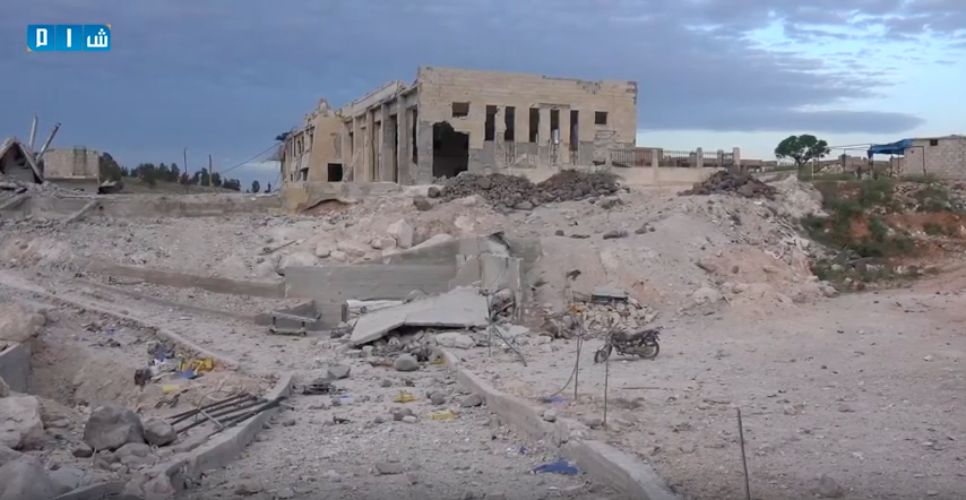

حوالي الساعة 5:30 مساءً بالتوقيت المحلي السوري استُهدف المستشفى بأربع غارات جوية كما سيتضح في الفقرات التالية. توضح الصور واللقطات الواردة أعلاه، والتي تم التحقق من أنها تُظهر بناء المستشفى في الخامس أو السادس من مايو/أيار، أن الغارات الجوية الأربع تسببت بأضرار بالغة لبناء المستشفى من الداخل والخارج، ما أدى إلى خروجه عن الخدمة، وهو ما يتطابق مع العديد من التقارير الإخبارية.

### التحقق

#### تحديد الموقع الجغرافي

نظرًا لاستهداف مستشفى كفرنبل بشكل متكرر؛ فقد تم التحقق من الموقع الجغرافي للمستشفى من خلال مطابقة لقطات شاشة مأخوذة من تقارير فيديو توثّق هجماتٍ سابقةً على المنشأة. يقع المستشفى المُستهدَف الظاهر في مقاطع الفيديو بالقرب من بلدة كفرنبل، جنوبي ادلب.

أدناه، مقاطع فيديو نُشرت بعد الهجوم ومواقعُها الجغرافية:

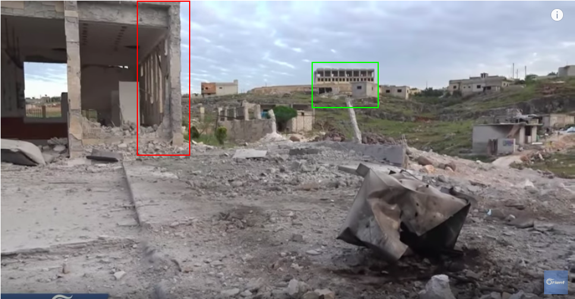

#### التوقيت

تم التحقق من توقيت الهجوم بالاعتماد على العديد من التقارير التي أشارت إلى وقوعه حوالي الساعة 5:30-5:40 مساءً، ومن بينها [بيان صحفي](https://www.uossm.org/breaking_3_hospitals_bombed_today_in_syria) صدر عن اتحاد منظمات الرعاية والإغاثة الطبية، وبالنظر إلى الظلال الظاهرة في عدد من مقاطع الفيديو التي تُفصّل الغارات الجوية الأربع. استُخدمت أداة [SunCalc](https://www.suncalc.org/#/35.6229،36.5506،15/2019.05.05/17:27/1/1) المتاحة عبر الانترنت لحساب موضع الشمس، وذلك استنادًا إلى الموقع الجغرافي و الوقت المفترض للغارة الجوية. تتطابق الظلال الظاهرة في مقاطع الفيديو التي تم التحقق منها وتحليلها في هذا التقرير مع موقع الشمس عند الساعة 5:30 مساءً تقريبًا في كفرنبل.

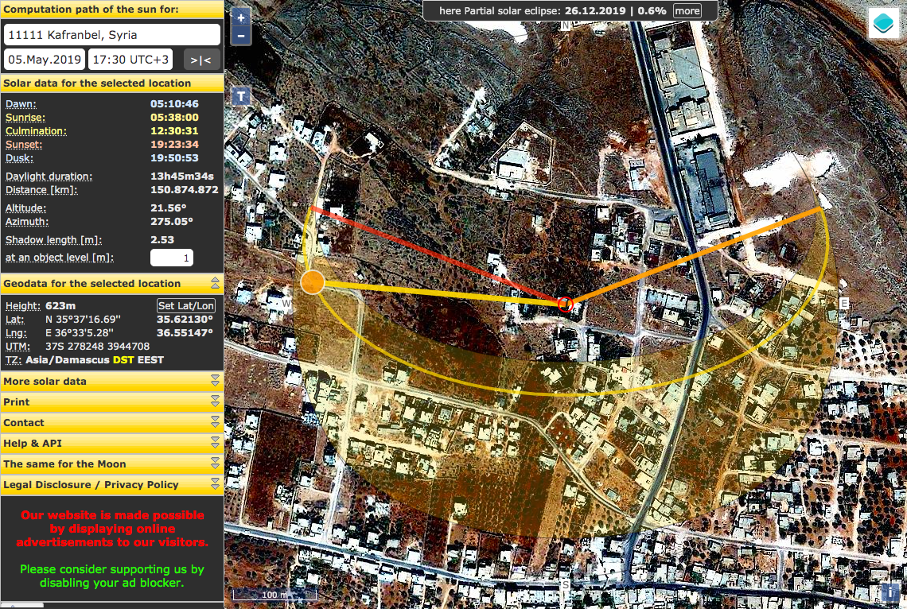

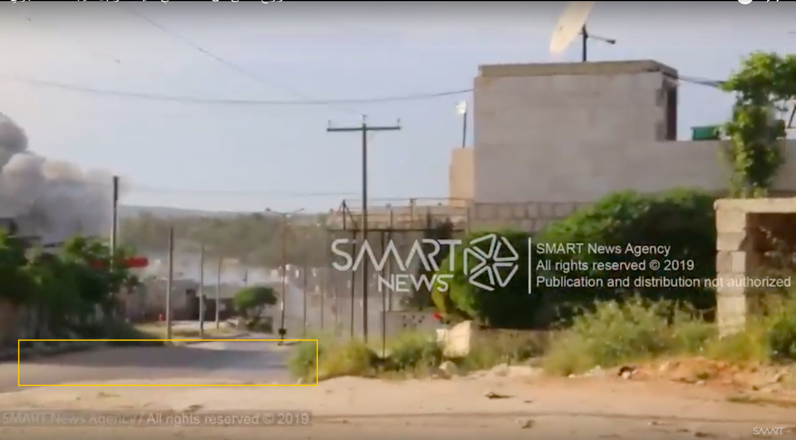

إضافة إلى ذلك، تتطابق الظلال الظاهرة في لقطات تم التحقق منها مع أطوال وحجم الظلال في الساعة 5:30 مساءً (بتوقيت دمشق) المحسوبة بواسطة [Shadow Calculator](http://shadowcalculator.eu/#/lat/35.62304200689339/lng/36.551594894866184). تحسب أداة Shadow Calculator طول الظل اعتمادًا على نقاط مرجعية وكذلك التوقيت.

#### الغارات الجوية

من خلال المقارنة والمطابقة بين أعمدة دخان الغارة الجوية وأصوات الطائرات المحلّقة التي يمكن سماعها في عدد من مقاطع الفيديو؛ أمكن تحديد أربع غارات جوية منفصلة. سندعوها الغارات أ، ب، ج، د، حيث لا يمكن التيقّن من ترتيبها.

##### الغارة الجوية أ

نُشرت فيديوهات بواسطة [MMC](https://www.youtube.com/watch?v=DK6VUUi7QKI) و [الدفاع المدني في إدلب](https://www.youtube.com/watch?v=wUufZe4XLqk).

##### الغارة الجوية ب

فيديوهات نُشرت من طرف [حلب اليوم](https://www.youtube.com/watch?v=DBZ9MMeCkqY&feature=youtu.be&t=17)، [مصطفى العلوش](https://www.facebook.com/100025494637033/videos/361798371346648/)، و [مركز إدلب الإعلامي](https://www.youtube.com/watch?v=mcPEwb9SoeE)

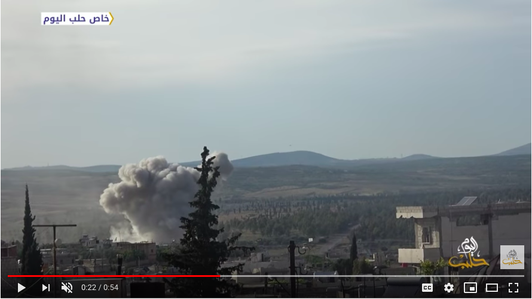

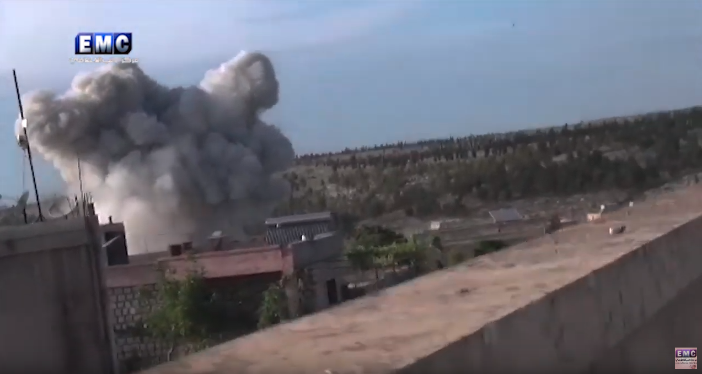

##### الغارة الجوية ج

فيديوهات نُشرت بواسطة [إدلب بلس](https://twitter.com/IdlibPlus/status/1125057973162844160) و[علاء يوسف](https://www.youtube.com/watch?v=_LMW4e0hlwU)

##### الغارة الجوية د

فيديوهات نُشرت بواسطة [وكالة سمارت للأنباء](https://www.youtube.com/watch?v=dxhlKcnSbLk) و[حلب اليوم](https://www.youtube.com/watch?v=DBZ9MMeCkqY&t=30)

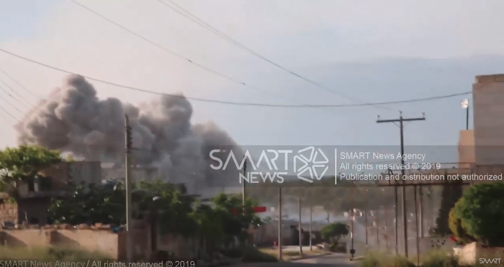

#### الأضرار

حسبما تُظهر الصور أعلاه، ووفقًا لما تم التأكيد عليه في [تقارير محلية ودوليّة](https://twitter.com/AlarabyTV/status/1125928302030409729) مختلفة؛ فإن الأضرار التي لحقت بمستشفى كفرنبل الجراحي كانت بالغة. فمن الجهة الخارجية للمشفى تبدو البوابات، المباني المحيطة، وكذلك إحدى سيارات الإسعاف التابعة لها كأنقاض ودمار.

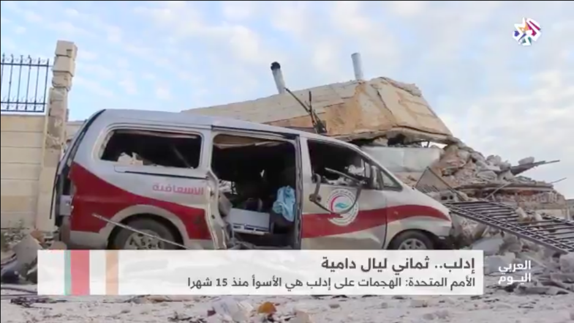

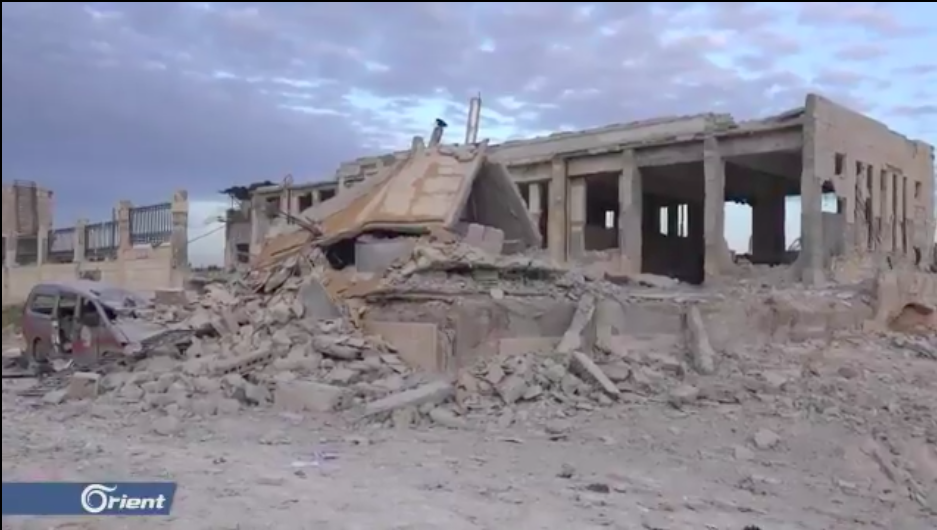

علاوة على ذلك، يظهر بناء المستشفى بحد ذاته [في عدة مصادر](https://youtu.be/7c4WHKHApPE?t=85) متضررًا بشدّة وغير قابل للاستخدام بوضوح.

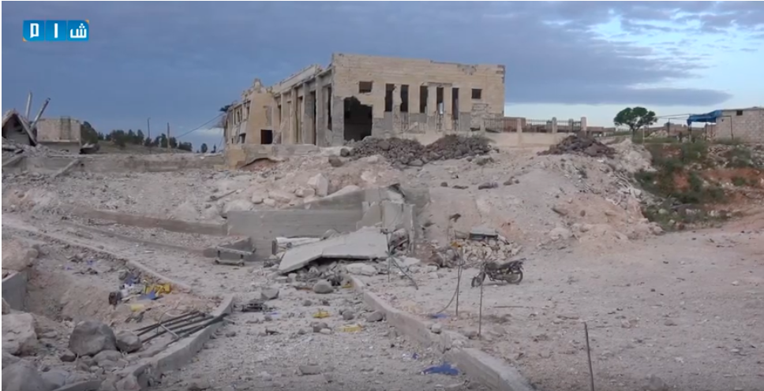

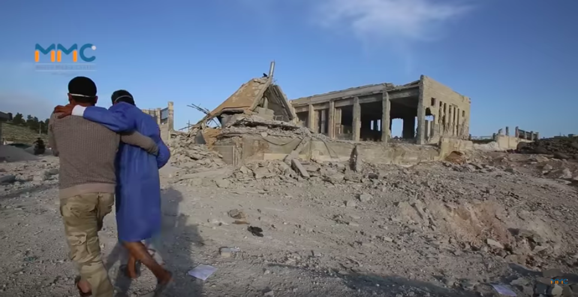

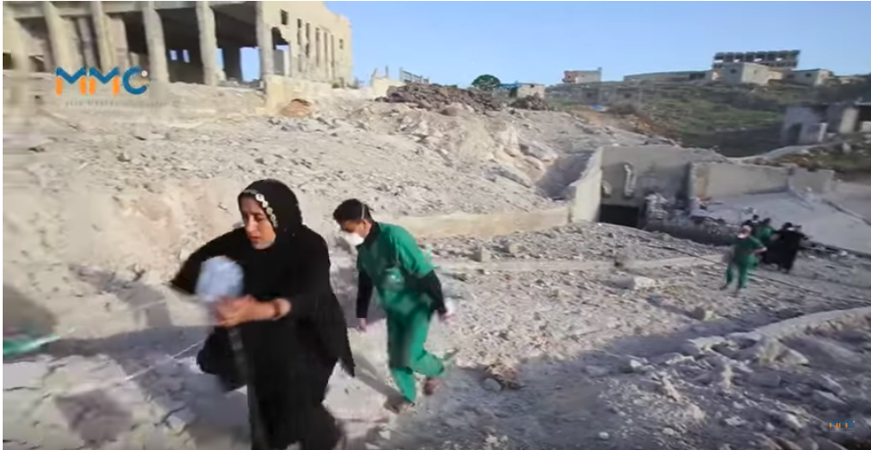

نشر كل من [الدفاع المدني](https://youtu.be/wUufZe4XLqk?t=59) و[منظمة يداً بيد](https://twitter.com/hihfaduk/status/1125079647799132161) مقاطع فيديو تُظهر عمليات إجلاء المرضى من المستشفى، إضافة إلى الأضرار الداخلية واسعة النطاق نتيجة للغارات الجوية الأربع.

بالمقارنة مع [هجوم 5 فبراير 2018](https://youtu.be/YwhGjgql7IU?t=48) تعرض المستشفى لأضرار خارجية مشابهة، ولكنه في هجوم فبراير 2018 تعرّض لأضرار داخلية أكثر جسامة لأن أجنحته؛ كما يتضح في مقاطع الفيديو بعد الهجوم، بقيت فوق الأرض وفي المبنى الأكبر الرئيسي.

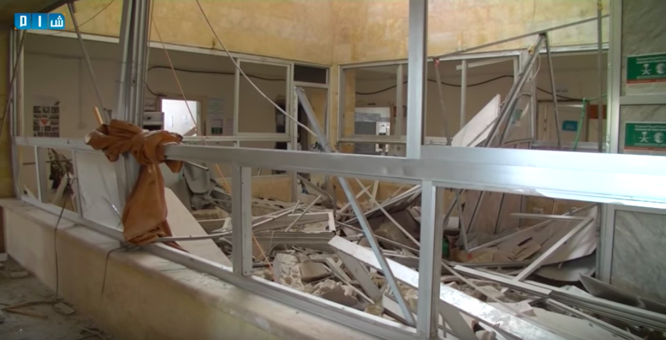

يختلف الأمر بالنظر لمقاطع الفيديو التي وثّقت الأضرار الداخلية للمستشفى في هجوم 5 مايو/ أيار حيث تُظهر، إضافة إلى إجلاء المرضى، أجنحة حيويّة في المستشفى تحت الأرض. مقارنة بهجمات [19 سبتمبر/ أيلول](https://youtu.be/2RJ-k5jXopQ?t=10) و [25 مارس/ آذار](https://youtu.be/srgCm-W_gqM?t=26) 2017، تعرض مستشفى كفرنبل لأضرار أكبر لحقت بهيكله الخارجيّ فوق سطح الأرض.

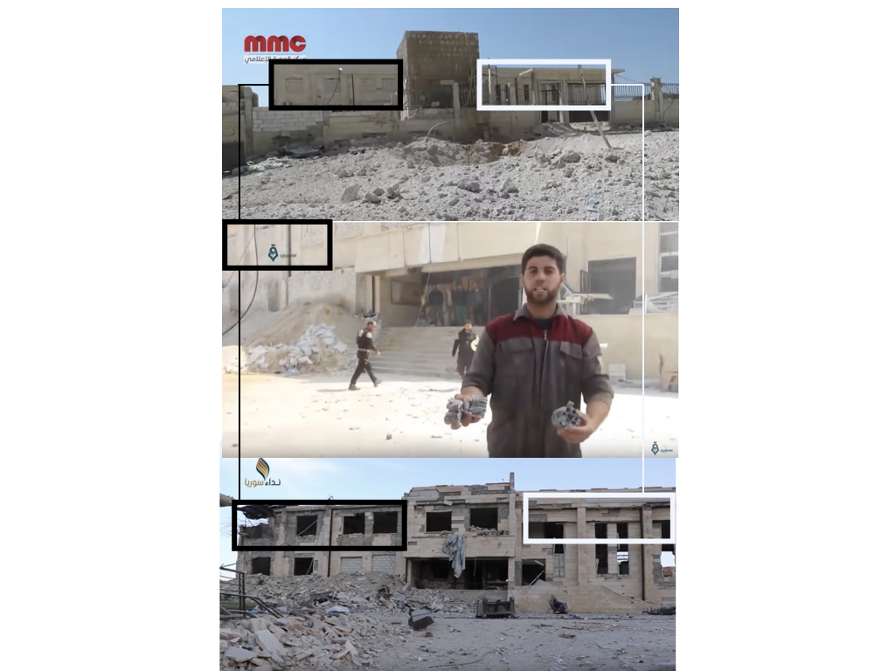

على غرار هجوم فبراير/ شباط 2018، تؤكد اللقطاتُ المنشورة من وسائل الأخبار المحلية والناشطين التقاريرَ التي تفيد بأن المستشفى دُمّر وأصبح خارج الخدمة.

#### تحليل بيانات الطيران

بغرض إضافة طبقة أخرى من التحقق؛ قارن الأرشيف السوريّ النتائج المستخلصة من مقاطع الفيديو وإفادات الشهود مع بيانات رصد الطيران من قبل منظمة مراقبة. استلزمت هذه العملية رصد وتحليل بيانات الطيران في محافظة ادلب قرب كفرنبل حوالي الساعة 17:30 مساء، وهما الموقع الجغرافي والتوقيت الخاصّين بالهجوم موضع التحقيق.

<iframe height="550" src="https://public.tableau.com/views/observedflightdataidlib5may2019/Sheet1?:showVizHome=no&:embed=y" width="780"></iframe>

من خلال تحليل هذه البيانات، تمكن الأرشيف السوري من التحقق بثقة أكبر من توقيت الغارات الجوية وكذلك مرتكبي الهجوم. يشار إلى أن العديد من الطائرات ثابتة الجناح، التي تم تحديدها على أنها إما طائرات روسية أو Su-22 و Su-24، رُصدت تحلّق باتجاه كفرنبل من القرى المجاورة، تحلق فوق المدينة، بالإضافة إلى الطيران الدائري فوق البلدات المجاورة الأخرى مثل معرة النعمان، حيش، وجبل الزاوية بين الساعة 17:18 و17:40.  وقد خلصت تحقيقات سابقة إلى أن الطيران الدائري في السماء عادةً ما يُشير إلى محاولة الاستحواذ على الهدف أو التحضير لهجوم وشيك. وهو ما يؤكّد البيانات المذكورة أعلاه حول هجوم على كفرنبل حوالي الساعة 17:30.

على الرغم من عدم توافر دليل مباشر على ضلوع إحدى الطائرات المرصودة في الهجوم على كفرنبل، فإن وجود هذه الطائرات فوق البلدة والبلدات المجاورة يزيد من احتمال وقوع هجوم جوي في ذلك الموقع في التوقيت المشار إليه من قبل الصحفيين المواطنين والمجموعات الحقوقية، والمقدّر باستخدام صور من موقع الهجوم.

### خاتمة

عبر تحليل الوثائق مفتوحة المصدر المتاحة على الإنترنت بالإضافة إلى بيانات الطيران، يمكن التأكيد على أن مستشفى كفرنبل الجراحي، الواقع ضمن مناطق خفض التصعيد السورية، تعرض لهجوم في 5 مايو/أيّار 2019 بأربع غارات جوية حوالي الساعة 5:30 مساءً. تسبّبت الغارات الجوية الأربع، الظاهرة في العديد من الوثائق البصرية التي تمت مشاركتها، بأضرار بالغة للمستشفى داخليًا وخارجيًا مما أخرجه عن الخدمة، كما أكّد عدد من مصادر الأنباء المحليّة. على الرغم من أن مصادر موثوقة إلى حد ما نشرت صورًا أظهرت طائرة فوق المستشفى، إلا أنه لا يمكن أن نستنتج بشكل مؤكد فيما إذا كانت القوات الجوية الروسية أو السورية هي من ارتكبت الهجوم.
