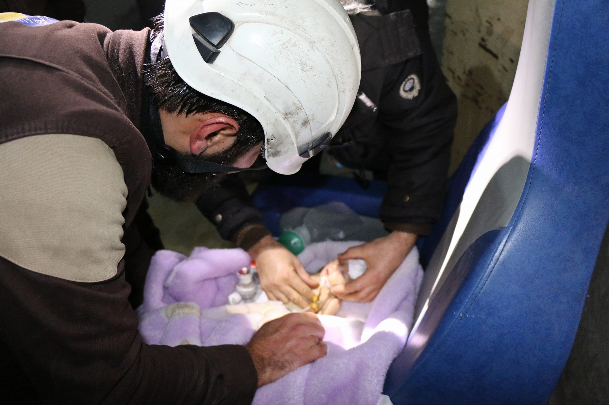
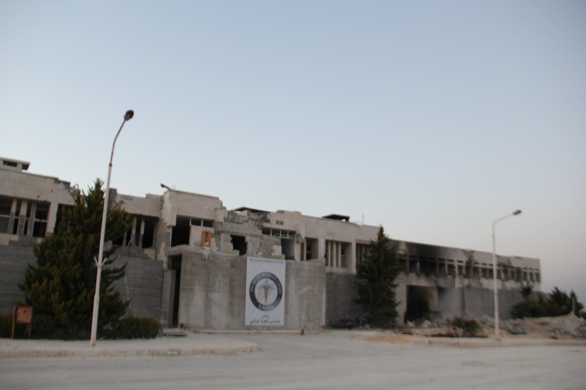
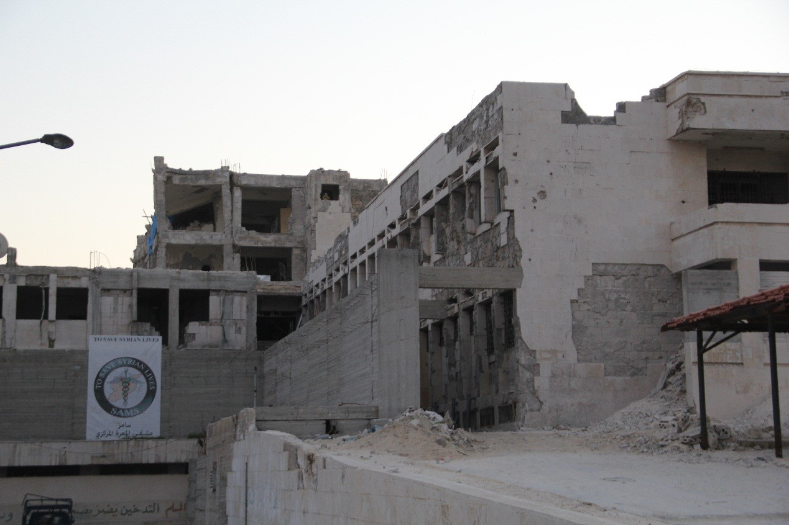
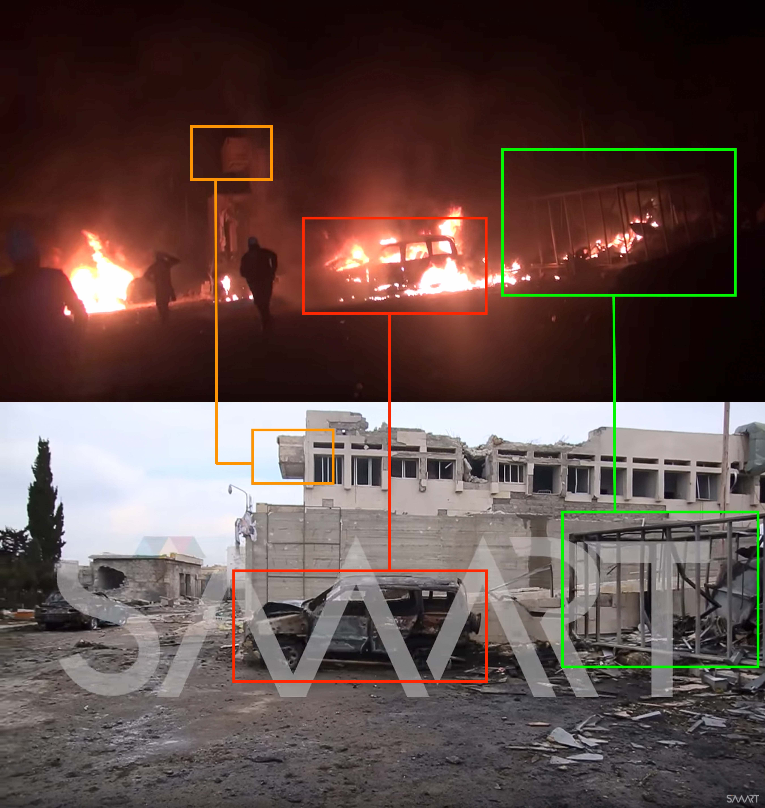
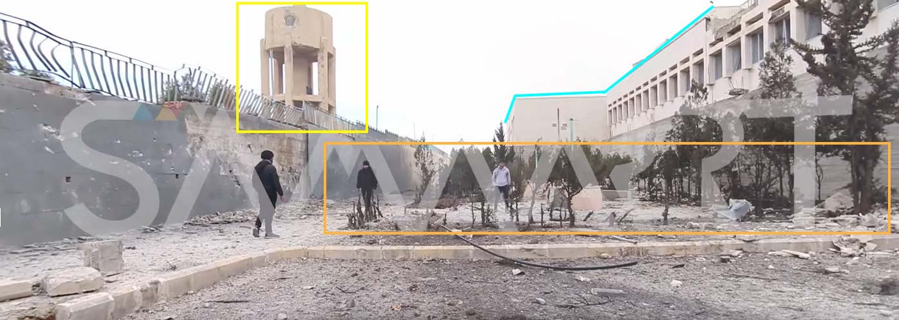
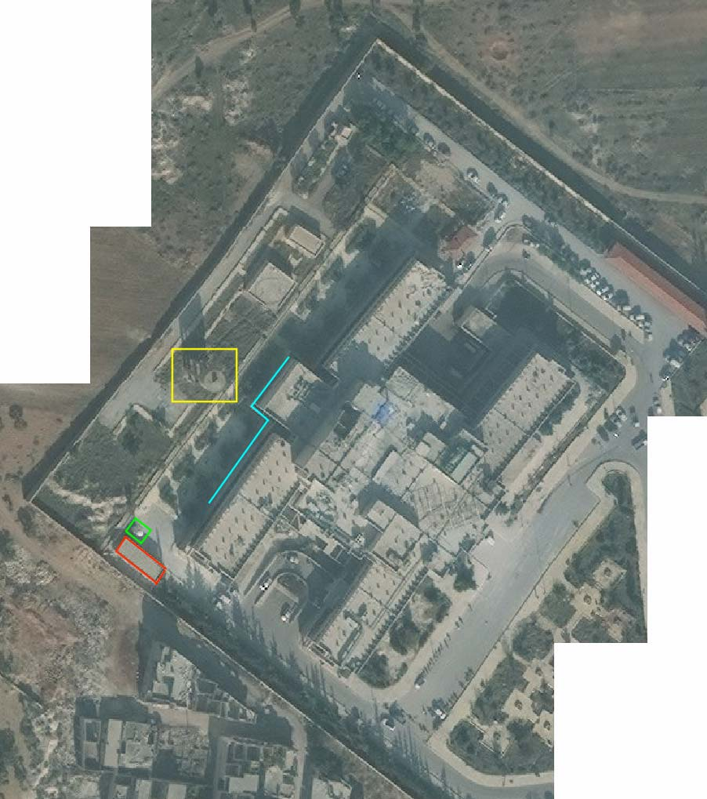
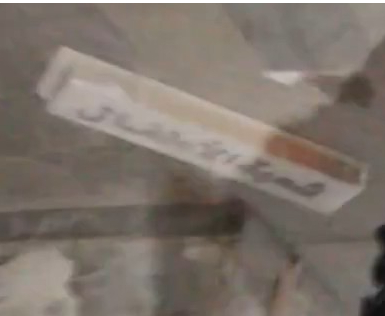
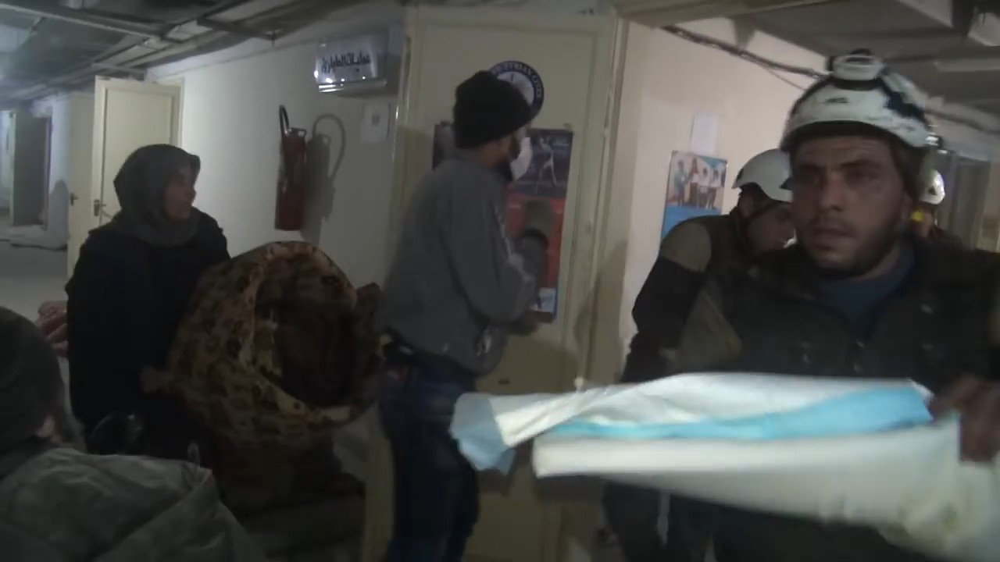

- Location: IDLIB : Maarat al-Numan
- Hospital: The National Hospital of Maarat al-Numan
- Beneficiaries: ~500,000 people a year
- Date: 4 February 2018
- Time: around 20:40
- Attacks: 6 airstrikes according to Osama Eido (Hospital x-rays department)
- Munitions identified: One photo acquired by the Syrians for Truth and Justice
- Potentially responsible: Russian or Syrian air force

## Background of The national hospital of Marret al-Numan

The National Hospital of Maarat al-Numan is a hospital located on the Aleppo-Damascus international highway. It sits between three governorates: 60km north of Hama city, 80km south of Aleppo and 50km southeast of Idlib.

The hospital was [founded in 1984](http://www.esyria.sy/eidleb/index.php?p=stories&category=round&filename=201003101520125) and was supplied with medical equipment worth 6.9 million Euro. The hospital sits on an area of 70 thousand square meters, consists of three floors, contains all medical departments and has an annex building for doctors, and another building of outpatient clinics and it serves about 30.000 monthly beneficiaries.

On Feb 4th, 2018, local reports [including videos published](https://www.youtube.com/watch?v=d6oF9r2oFv0) by the Syrian Civil Defense, claim that the National Hospital was targeted by multiple airstrikes.

## Previous attacks

The National Hospital of Marrat al-Numaan was previously attacked on 2 April 2017. The Syrian Archive has [published an in-depth open source investigation](https://syrianarchive.org/en/investigations/Medical-Facilities-Under-Fire/Incident-1.html) regarding that attack.

## What Happened

On 4 February 2018 at 21:19, a citizen journalist named Anas Al Marwai (who lives in Maarat al-Numaan) [published a video](https://www.facebook.com/100010399271536/videos/559320804424557/) on his Facebook page in which he states: "A huge explosion as a result of Russian warplanes missiles at the national hospital in Maarat al-Numan."

Idlib Health Directorate separately published [a post on their Facebook page](https://www.facebook.com/Idleb.Health.Directorate/posts/1200613503375336) at 21:21 stating: "Russian warplanes directly targeted the National Hospital in Maarat al-Numan, and the aircraft monitors interception calls between the driving room in Hameimim base, heard the air force stating they would repeat the targeting of the hospital." See below:

Syrian Civil Defense in Idlib [published photos](https://www.facebook.com/SyrianCivilDefenceIdlibWhiteHelmets/posts/1562499310515786) on their Facebook page at 22:41 saying "Civil Defense teams evacuated the patients from the national hospital in Maarat al-Nu'man to nearby hospitals after the hospital was targeted with four air strikes." Photos show destructions as a result of the attacks,  as well as of the Civil Defense evacuating injured people. See below:

On their YouTube channel Civil Defense published several videos additional in which members can be seen fighting fires outside the hospital. See below:

<iframe width="560" height="315" src="https://www.youtube.com/embed/V4Nt8JWXVcQ" frameborder="0" allow="autoplay; encrypted-media" allowfullscreen></iframe>

[A second video shows](https://www.youtube.com/watch?v=de7N2n7eYJc) Syrian Civil Defense rescuing a newborn child. In the video, the paramedic asked someone to bring him a Laryngoscope, and after several seconds another man came and said "go to the car now, the tanks might explode." At this point, the paramedic took the child and went to a car.

Another video from Syria Civil Defense [presents a summary](https://www.youtube.com/watch?v=Q4DboRpV9L0) of what happened, stating that the National Hospital is out of service as a result of the attack, and shows stills from incubators room. See below:

The label is from a baby called Abdullah Amir Sarjawi, 13 days old, the date of his admission was 04 February, and his parents live in Aleppo.

*An exclusive photo to Syrians for Truth and Justice shows the location where one of the missiles downfall*

Hadi Alabdallah, a citizen journalist, [published a video on his YouTube channel](https://www.youtube.com/watch?v=HcMurYLYlEo) showing destruction inside the hospital, injured (including elderly men and women), fires outside of the hospital as a result of the attack, as well as the evacuation of babies and injured from the hospital by the Syria Civil Defense members. See below:

In Alabdallah's video at 0:29 somebody asks the Syria Civil Defense members while they were carrying babies, "Where are you taking babies?" Someone can be heard answering: "To the incubators, Syria Civil Defense is taking them to the incubators."

In the same video at 0:49, Alabdallah stated: "A little while ago, Russian warplanes targeted the National Hospital in Maarat al-Numan, resulting in the hospital to become out of service. There are martyrs, wounded and trapped under the rubble as a result of targeting of the National Hospital by these aircrafts. This hospital containing large numbers of injured, patients, and babies. The babies who were inside the incubators were evacuated, some of them may have died due to being evacuated under abnormal harsh conditions. Most parts of the hospital were damaged and destroyed."

At 1:47 in the same video, Alabdallah stated: "Many medical facilities in Idlib have been attacked. The air force is now flying over us and maybe it'll target this area in any moment because this hospital was attacked with more than ten airstrikes so maybe it gets targeted again."

*An exclusive photo to STJ shows a part of the destruction that has done in the hospital.*

In a separate video, published by citizen reporter Moaz Alshami while they were standing in front of the hospital, Syrian Civil Defense members are seen working to put out fires. Moaz stated: "After the massacre carried out by Russian aircrafts in Kafranabel city, the National Hospital in Maarat al-Numan has now been targeted with more than six air strikes. It is the only hospital operating here. It contains dozens of injured people who were injured in Kafranabel and taken here."

<iframe width="560" height="315" src="https://www.youtube.com/embed/fRHSrvXJLDs?rel=0" frameborder="0" allow="autoplay; encrypted-media" allowfullscreen></iframe>

After that Alshami entered the hospital and said: "The Civil Defense evacuate the incubators. A few hours ago, a massacre in Kafranabel and before it in Khan al-Sabeel and before it in Maazran, every day there is a new targeting of civilians."

At 4:31, Moaz Alshami conducted an interview with two women standing beside an injured. One of the women said: "We are from Khan Sheikhan. We were in the hospital there, when it targeted. We came here and now this hospital has been targeted too. Where are we going?".

SMART News Agency [published a video](https://www.youtube.com/watch?v=-GA92EyURH8) on their YouTube channel as well, containing a testimony from the Head of Radiology Department. He stated: "The hospital was targeted last night 4 Feb 2018 by six strikes from Russian warplanes. As a result, the hospital is now completely out of service, which was the only hospital in this region, serving more than 20 thousand patients per month."

The following day, 5 February 2018, the Syrian American Medical Society (SAMS) - who supported the hospital - [published a post](https://www.facebook.com/sams.arabic/photos/a.1188236591309561.1073741829.1174443599355527/1230201110446442/?type=3&theater) on their Facebook page stating that the National Hospital in Maarat al-Numaan had become out of order as a result of being targeted by six airstrikes. See below:

## Where did it happen?

The Syrian Archive team was able to match several objects between Alshami's video and SMART News Agency's video which confirms both documented the same location. See below:

Other objects were identified from a different angle of the same location using the same videos above:

We also identified objects that were shown in Smart News Agency's morning video about this incident:

The Syrian Archive team was also able to geolocate several landmarks and objects using SMART News Agency's video and a satellite image for the National Hospital in Maarat al-Numaan, confirming it was the same location. See below:

Seems from inside the hospital were also able to be cross referenced. In a video [from the Civil Defense](https://www.youtube.com/watch?v=d6oF9r2oFv0), the evacuation process for children and women can clearly be seen. It also documents two Syrian Civil Defense members walking in a hospital corridor. At 1:19 of the video, a banner can be seen on the floor that states: "Children's Division." See below:

A separate vdeo was [published by Moaz Alshami](https://www.youtube.com/watch?v=IicAGAWhD_E) in which a sign reading "Emergency Operation" can be seen:

## When did it happen?

According to several testimonies collected by Syrians for Truth and Justice the first attack happened around 20:40. Jamil Jaafar, a member of the medical staff who was in the National Hospital at the time of the attack, spoke to Syrians for Truth and Justice:

"At 8:40 p.m. on Sunday, 4 February 2018, while I was at the hospital treating the patients, a Russian warplane raided and injured many patients as well as the medical personnel. We immediately evacuated the injured people who were in the emergency department, in the surgery rooms, and in the incubator section. Moments later, the warplane targeted the hospital once again with high-explosive rockets, as well as a percussion (concussion) rocket that could penetrate the surgery room. The airstrikes concentrated on the emergency department."

Another testimony by a member of the Syrian Civil Defense who was in the hospital at the time of the attack, stated:

“On Sunday evening, 4 February 2018, at around 8:45 p.m while we were at the hospital, a warplane raided on the hospital, so we were forced to move the patients to the lower floors. However, the warplanes bombed more than four airstrikes with high-explosive rockets, one of which was a percussion rocket."

Abu Bahar, the supervisor of an observatory that monitors the movement of the warplanes in the city's skies, spoke to Syrians for Truth and Justice, stating:

“On February 4, 2018, a squadron of warplanes took off from Hememim Military Airbase in Latakia province, flied towards the north of Syria, and then rotated on bombing our areas. However, at 8:40 p.m. on the same day, one of these aircrafts raided Maarrat al-Numan Central Hospital, followed by five more raids, which caused the hospital to be completely out of service.”

## The weapons used

Syrians for Truth and Justice was able to obtain a photo shows the remains of one of the missiles that fell in front of the National Hospital. See below:

The Syrian Archive was unable to gather additional information regarding munitions used in this attack.

## Flight Data Analysis

To provide a further layer of verification, the Syrian Archive cross-referenced findings from the videos and witness testimony with flight observation data from a spotter organisation. This process necessitated analysing observation data for flights between 19:00 and 22:00, the period directly before and after the reported attack between 20:45 and 20:51 as was claimed by media activists. See below:

<iframe height="800" src="https://public.tableau.com/views/04022018_marrat_al_numan/Sheet1?:showVizHome=no&:embed=y&:display_count=yes" width="800"></iframe>

[View full visualisation](https://public.tableau.com/views/04022018_marrat_al_numan/Sheet1?:showVizHome=no&:embed=y&:display_count=yes)

Through comparing where flights were observed, the type of aircraft observed, the time flights were observed, and the direction flights were heading, and comparing this data to geolocation conducted in earlier steps, the Syrian Archive was able to identify several flights potentially responsible for the attack (several fixed-wing Russian aircraft), seen circling in the immediate vicinity of the geolocated attack site starting from 11:41 AM. Previous research has found that circling flights typically indicate target acquisition and/or preparation for an imminent attack.

While there is no direct evidence available that one of the observed aircrafts was involved in the attack on Maarat al-Numaan, the presence of these aircrafts increase the likelihood that an air attack occurred at this location and the time stated by the citizen reporters as well as humanitarian groups, and estimated also using imagery from the attack.
