- الموقع: محافظة ادلب: معرة النعمان
- المستشفى: المشفى الوطني في معرة النعمان
- المستفيدين من المستشفى: حوالي 500,000 شخص سنويًا
- التاريخ: 4 شباط- فبراير 2018
- التوقيت: حوالي الساعة 20:40 مساء
- الهجمات: 6 غارات جوية وفقًا لأسامة عيدو (قسم الأشعة السينية في المستشفى)
- الذخائر المحدّدة:  صورة واحدة حصل عليها سوريون من أجل الحقيقة والعدالة
- المسؤول المحتمل: القوات الجوية الروسية أو السورية

## معلومات حول المستشفى الوطني في معرة النعمان

يقع المستشفى معرة النعمان الوطني على طريق حلب- دمشق الدوليّ السريع، بين ثلاث محافظات: 60 كم شمال مدينة حماة؛ 80 كم جنوب حلب، و50 كم جنوب شرقي ادلب.

تأسس المستشفى  [عام 1984](http://www.esyria.sy/eidleb/index.php?p=stories&category=round&filename=201003101520125)، وتم تزويده بمعدات طبية بلغت تكلفتها 6.9 مليون يورو. تبلغ مساحة المستشفى 70 ألف متر مربع، موزعة على ثلاثة طوابق وتتضمن كافة الأقسام الطبية، مع بناء ملحق للأطباء؛ وبناء آخر للعيادات الخارجيّة. يخدّم المستشفى ما يقارب 30,000 مريض شهريًا.

في الرابع من فبراير 2018، ادعت تقارير محلية [بما فيها مقاطع فيديو تم نشرها](https://www.youtube.com/watch?v=d6oF9r2oFv0) من فريق الدفاع المدني السوري؛ ادّعت استهداف المستشفى الوطني  بعدّة غارات جوية.

## هجمات سابقة

هوجم المستشفى الوطني لمعرة النعمان سابقًا في 2 أبريل 2017. نشر الأرشيف السوري  [تحقيقًا معمّقًا مفتوح المصدر](https://syrianarchive.org/en/investigations/Medical-Facilities-Under-Fire/Incident-1.html) حول ذلك الهجوم.

## ماذا حدث؟

في الساعة 21:19 مساء الرابع من فبراير 2018، نشر مواطن صحفي يدعى أنس المعرّاوي (والمقيم في معرة النعمان) [مقطع فيديو](https://www.facebook.com/100010399271536/videos/559320804424557/) على صفحته على فيسبوك، لما قال أنه "الانفجار الهائل جراء الصواريخ التي تلقيها الطائرات الحربية الروسية على المشفى الوطني بمدينة معرة النعمان".

بشكل منفصل، نشرت مديرية صحة ادلب [منشورًا على صفحتهم على فيسبوك](https://www.facebook.com/Idleb.Health.Directorate/posts/1200613503375336) في الساعة 21:21، يقول: "طائرات حربية روسية تستهدف بشكل مباشر المشفى الوطني في مدينة معرة النعمان، ومراصد الطيران ترصد مكالمات بين غرفة القيادة في حميميم توجه الطيران الحربي لتكرار استهداف المشفى بصواريخ شديدة الانفجار". انظر أدناه:

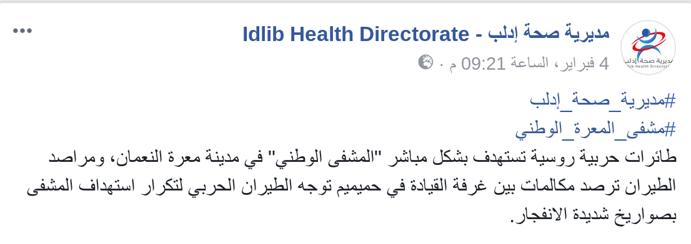

نشر فريق الدفاع المدني السوري في ادلب  [صورًا على صفحتهم على فيسبوك ](https://www.facebook.com/SyrianCivilDefenceIdlibWhiteHelmets/posts/1562499310515786) عند الساعة 22:41، وعلّق عليها: " 4 غارات جوية للطيران الحربي استهدفت المشفى المركزي في مدينة معرة النعمان، حيث عملت فرق الدفاع المدني على إخلاء المرضى من المشفى وتأمينهم في المشافي القريبة". تظهر الصور دمارًا ناجمًا عن الهجمات، إضافة إلى إجلاء الجرحى من قبل أعضاء الدفاع المدني. انظر أدناه:

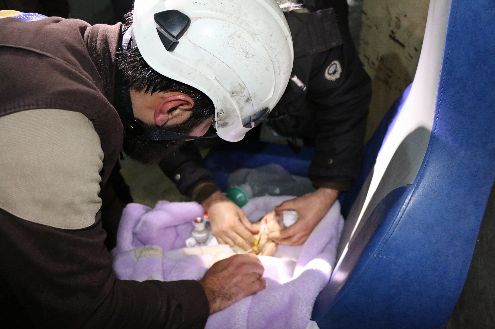

كما نشر فريق الدفاع المدني السوري على قناتهم على يوتيوب عدّة مقاطع فيديو إضافية، حيث يمكن رؤية أعضائه يخمدون الحرائق خارج المستشفى. انظر أدناه:

<iframe width="560" height="315" src="https://www.youtube.com/embed/V4Nt8JWXVcQ" frameborder="0" allow="autoplay; encrypted-media" allowfullscreen></iframe>

[يُظهر مقطع فيديو آخر](https://www.youtube.com/watch?v=de7N2n7eYJc) فريق الدفاع المدني السوري أثناء إسعاف طفل حديث الولادة. خلال الفيديو، يسأل المسعف أحدهم ليجلب له منظار الحنجرة، بعد ثوانٍ قليلة يأتي شخص آخر ويقول " اذهبوا إلى السيارة الآن، يمكن للخزانات أن تنفجر". عندها يحمل المسعف الطفل ويتجه للسيارة.

نشر فريق الدفاع المدني السوري مقطع فيديو آخر  [يلخّص ما جرى](https://www.youtube.com/watch?v=Q4DboRpV9L0)، حيث تم إعلان خروج المستشفى الوطني عن الخدمة جراء الهجوم، ويُظهر لقطات من غرفة الحاضنات. انظر أدناه:

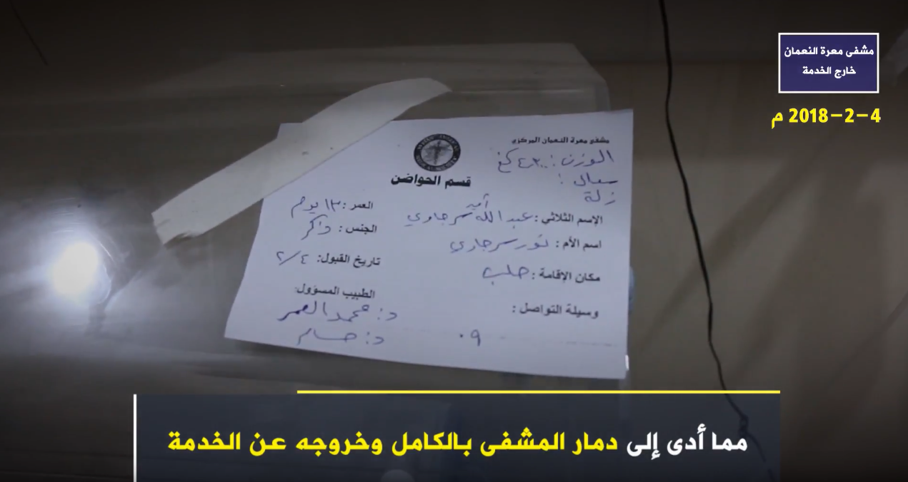

تعود البطاقة إلى طفل يدعى عبد الله أمير سرجاوي، بعمر 13 يومًا، تاريخ قبوله في المستشفى هو 4 فبراير، ويقيم والداه في حلب.

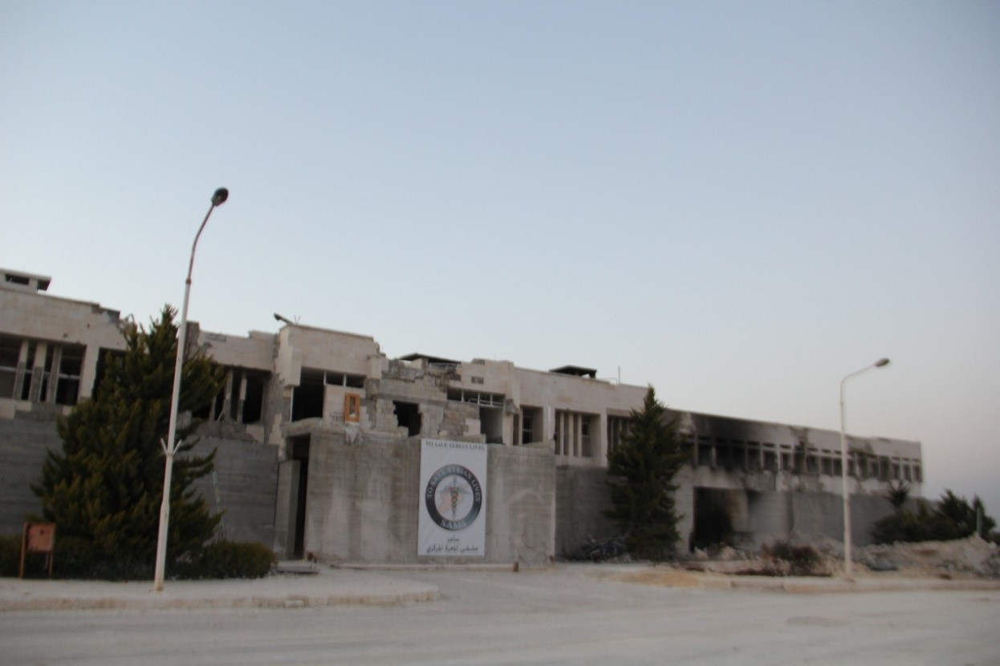
*صورة حصرية لفريق سوريون من أجل الحقيقة والعدالة تظهر مكان سقوط إحدى القذائف*

نشر هادي العبد الله، مواطن صحفي،  [مقطع فيديو على قناته على يوتيوب](https://www.youtube.com/watch?v=HcMurYLYlEo) يظهر دمارًا داخل المستشفى، مصابين (بمن فيهم مسنّين ومسنّات)، حرائق خارج المستشفى ناجمة عن الهجوم، إضافة إلى عمليات إجلاء الأطفال حديثي الولادة والمصابين من المستشفى من قبل عناصر الدفاع المدني السوري. انظر أدناه:

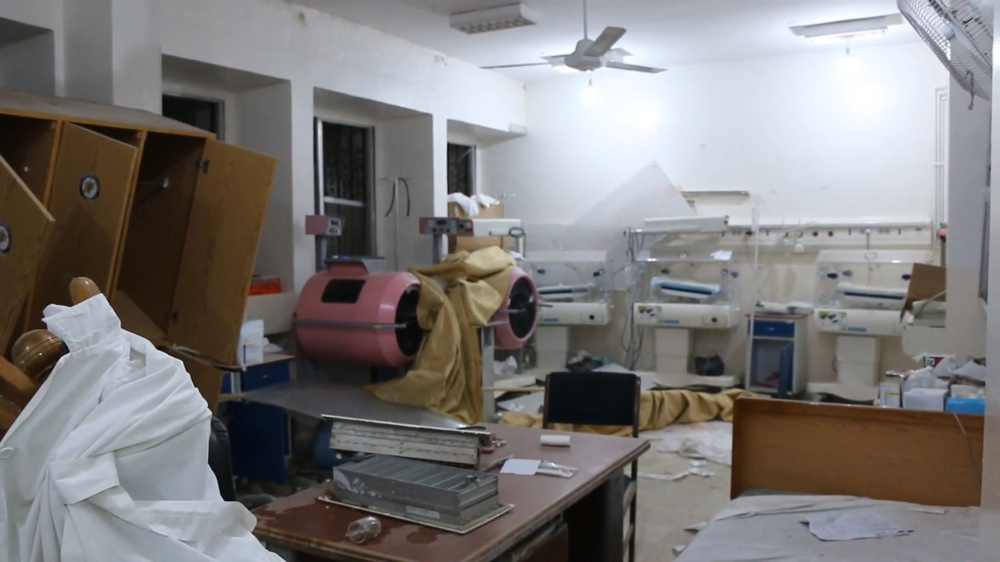

في الدقيقة 0:29 من فيديو هادي العبد الله؛ يسأل أحدهم عناصر الدفاع المدني أثناء حملهم للأطفال "إلى أين تأخذون الأطفال؟"، ويمكن سماع أحدهم يجيب: "إلى الحواضن، الدفاع المدني يأخذ الأطفال إلى الحواضن".

في الدقيقة 0:49 من الفيديو ذاته، يقول هادي العبد الله: "قبل قليل قامت طائرات حربية روسية باستهداف المشفى الوطني في مدينة معرة النعمان بريف ادلب، مما أدى لخروج المشفى عن الخدمة بشكل كامل، شهداء وجرحى وعالقين تحت الأنقاض نتيجة استهداف هذه الطائرات للمشفى الوطني والذي كان يحتوي على أعداد كبيرة من الجرحى، المرضى، حتى من الأطفال الذين كانوا بداخل هذه الحضانات تم إخلاؤهم، بعضهم ربما يفارق الحياة ﻷنه تم إخلاؤه بظروف قاسية وغير طبيعة ، المشفى تضرر وخرج عن الخدمة بشكل كامل، معظم أجزاء المشفى تضررت ودُمرت".

في الفيديو ذاته،  يقول هادي العبد الله في الدقيقة 1:47 :" عدة نقاط طبية في ادلب المدينة تم استهدافها بالإضافة للمشفى الوطني في معرة النعمان، الطائرات تحلق فوقنا الآن ربما تستهدف المنطقة بأي لحظة، لأن هذا المشفى تم استهدافه بأكثر من عشر غارات جوية، ربما يعاود الروس استهدافه من جديد".

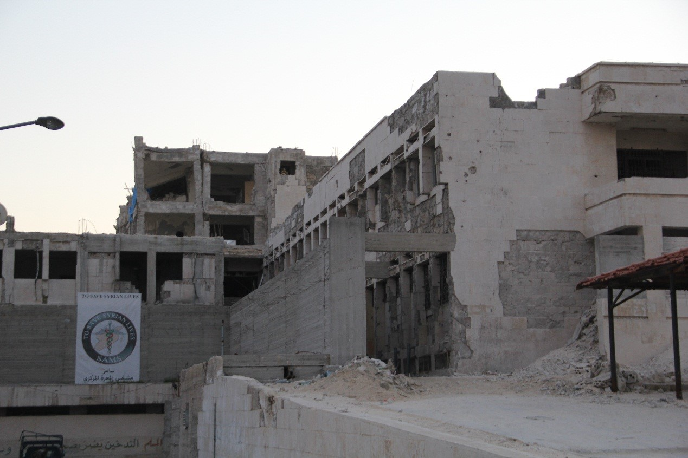
*صورة حصرية لفريق سوريون من أجل الحقيقة والعدالة تظهر جانبًا من الدمار في المستشفى*

في فيديو منفصل نشره المواطن الصحفي معاذ الشامي، يمكن رؤية عناصر الدفاع المدني السوري يخمدون الحرائق أمام المستشفى. يقول الشامي: " بعد المجزرة التي ارتكبتها الطائرات الروسية في بلدة كفرنبل، تستهدف الآن المشفى الوطني في معرة النعمان، المشفى الوحيد في هذه المنطقة، بأكثر من ستة غارات جوية بشكل مباشر، المشفى الآن خارج الخدمة بشكل كامل. هذا المشفى يحوي عشرات المصابين، بعد أن انتقل المصابين من بلدة كفرنبل بريف ادلب نتيجة المجزرة هناك نقلوا إلى هذا المشفى ليتم استهدافه بشكل مباشر".

<iframe width="560" height="315" src="https://www.youtube.com/embed/fRHSrvXJLDs?rel=0" frameborder="0" allow="autoplay; encrypted-media" allowfullscreen></iframe>

بعد ذلك، يدخل الشامي المستشفى ويقول: "الدفاع المدني السوري يقوم بإخلاء الحواضن. قبل قليل مجزرة في كفرنبل، وقبلها في خان السبل، وقبلها في معصران، كل يوم استهداف جديد للمدنيين".

في الدقيقة 4:31، يجري معاذ الشامي مقابلة مع سيدتين تقفان إلى جانب مصابة. تقول إحداهما: "نحن من خان شيخون، كنا في المشفى هناك عندما تم استهدافها، أتينا إلى هنا وتم استهداف هذه المستشفى أيضًا، إلى أين نذهب؟".

إضافة إلى ذلك، نشرت وكالة سمارت للأنباء  [مقطع فيديو](https://www.youtube.com/watch?v=-GA92EyURH8)على قناتهم على يوتيوب يتضمن شهادة رئيس قسم الأشعة في مشفى معرة النعمان، والذي يقول: " تعرض المشفى ليلة البارحة بتاريخ 4/02/2018 لست غارات من الطيران الحربي الروسي، ما أدى لخروجه عن الخدمة بشكل كامل، وهو  المشفى الوحيد في المنطقة ويخدم أكثر من 20 ألف مريض شهريا".

في اليوم التالي، 5 فبراير 2018، نشرت الجمعية الطبية السورية الأميركية (سامز) - الداعمة للمستشفى- [منشورًا على صفحتهم على فيسبوك](https://www.facebook.com/sams.arabic/photos/a.1188236591309561.1073741829.1174443599355527/1230201110446442/?type=3&theater) أعلنت فيه خروج المستشفى الوطني في معرة النعمان عن الخدمة نتيجة لاستهدافه بست غارات جوية. انظر أدناه:

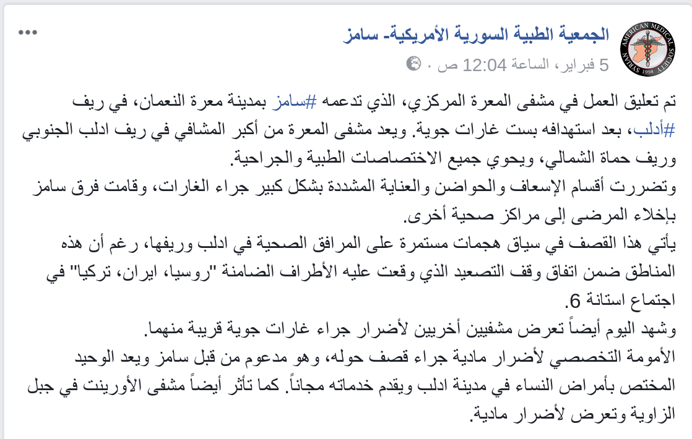

## أين حدث الهجوم؟

تمكّن فريق الأرشيف السوري من مطابقة عدة أجسام بين مقطعي فيديو كلٍ من معاذ الشامي، ووكالة سمارت للأنباء، وبالتالي التأكد من أنهما التُقطا في نفس الموقع. انظر أدناه:

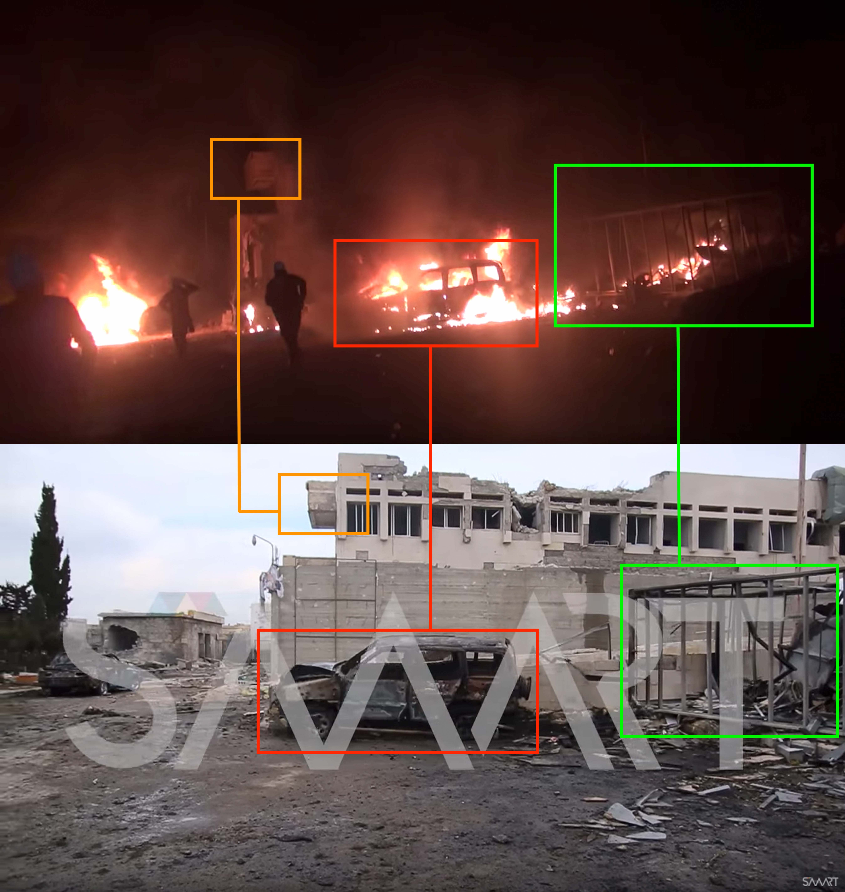

من خلال مقطع الفيديو ذاته، يمكن التعرف على أجسام أخرى في نفس الموقع من زاوية مختلفة:

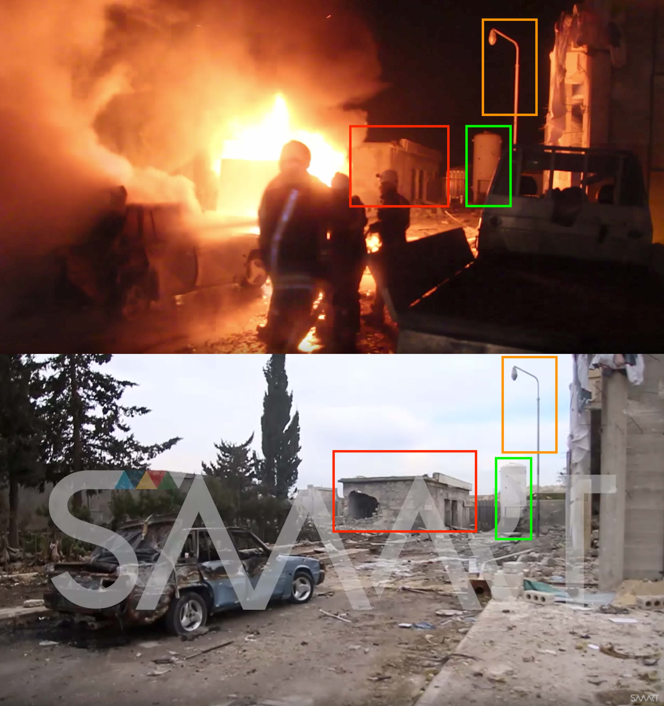

كما أمكن تحديد أجسام ظهرت في فيديو وكالة سمارت للأنباء الصباحيّ حول الهجوم:

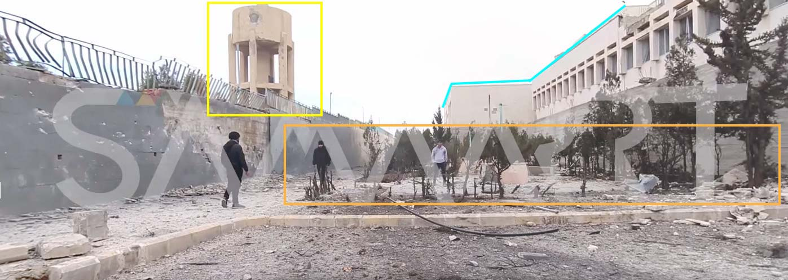

تمكن الأرشيف السوري من تحديد الموقع الجغرافي لعدّة أبنية ومعالم بارزة  باستخدام فيديو وكالة سمارت، وصور الأقمار الصناعية للمستشفى الوطني في معرة النعمان، وبالتالي التأكد من كونها تعود للمكان ذاته. انظر أدناه:

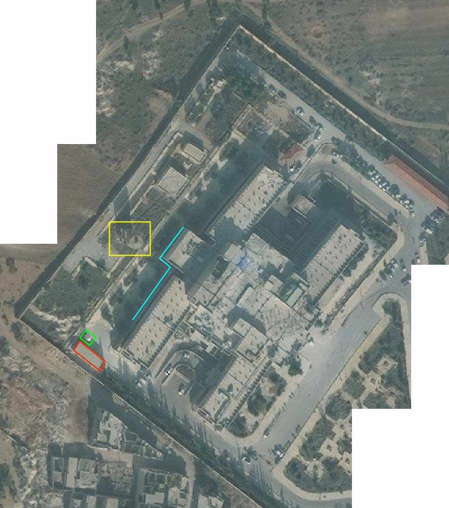

إضافة إلى ذلك، تمكن  الأرشيف السوري من مقاطعة مشاهد من داخل المستشفى. في مقطع فيديو  [لفريق الدفاع المدني السوري](https://www.youtube.com/watch?v=d6oF9r2oFv0)، يمكن رؤية عملية إخلاء الأطفال والنساء بوضوح. كما تم توثيق عنصرين من الدفاع المدني السوري يسيران في ممر المستشفى. في الدقيقة 1:19، يمكن ملاحظة لائحة على الأرض، تُقرأ: "شعبة الأطفال". انظر أدناه:

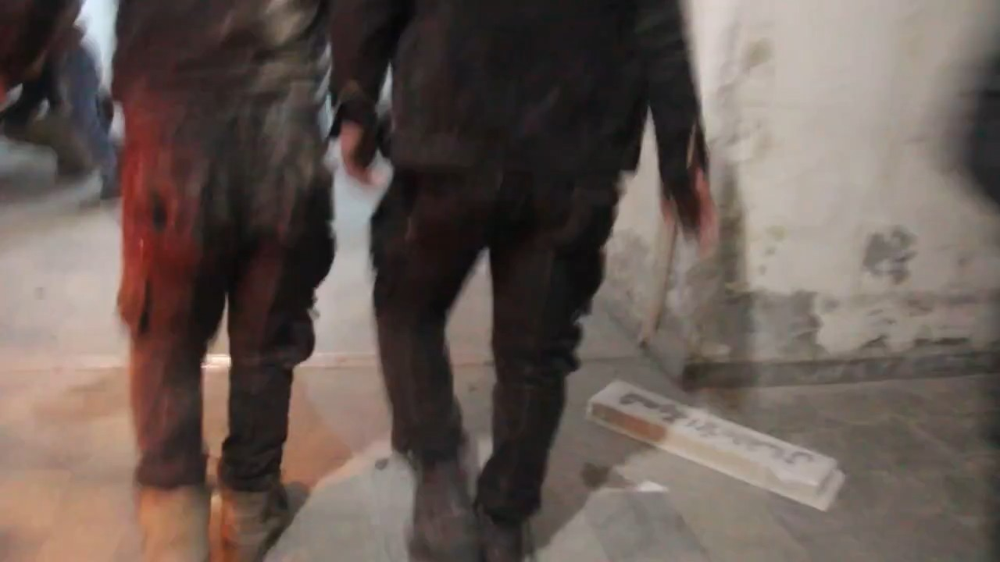

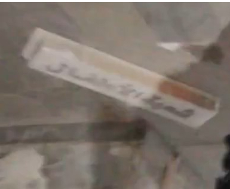

نشر  [معاذ الشامي](https://www.youtube.com/watch?v=IicAGAWhD_E) فيديو آخر منفصل، وفيه يمكن ملاحظة لائحة على الحائط، تُقرأ "عمليات الطوارئ":

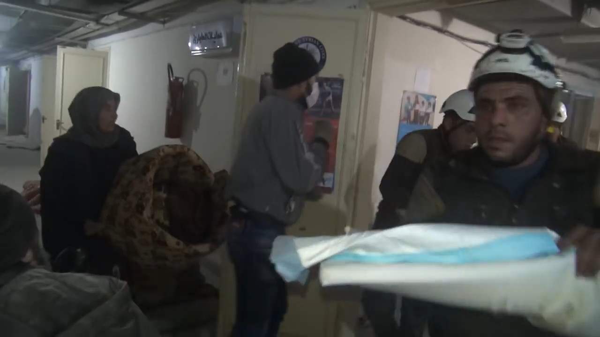

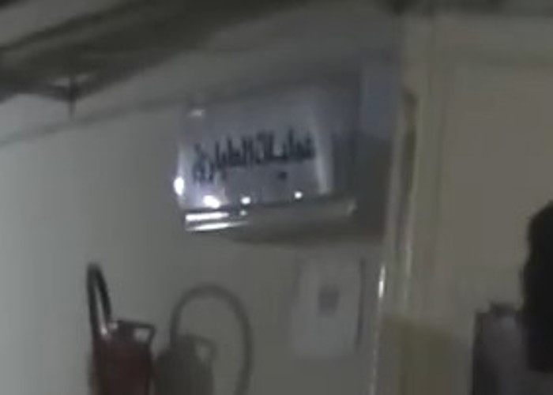

## متى وقع الهجوم؟

وفقًا لعدة شهادات تم جمعها من قبل سوريون من أجل الحقيقة والعدالة، وقع الهجوم الأول حوالي الساعة 20:40. جميل جعفر وهو أحد أعضاء الكادر الطبي الذين كانوا في المشفى لحظة وقوع الهجوم، تحدث لسوريون من أجل الحقيقة والعدالة قائلاً:

"في تمام الساعة (8:40) من مساء يوم الأحد الموافق 4 شباط/فبراير 2018، وبينما كنت في المشفى أسعف وأعالج المرضى، تعرضنا لغارة من قبل طيران حربي روسي، وأدت هذه الغارة إلى إصابة العديد من المرضى وأعضاء الكادر الطبي، فقمنا مباشرة بإخلاء المصابين المتواجدين في قسم الإسعاف والعمليات،إضافة إلى قسم الحاضنات، وماهي إلا لحظات حتى عاود الطيران الحربي استهداف المشفى مرة أخرى بصواريخ شديدة الانفجار، إضافة إلى صاروخ ارتجاجي تمكن من اختراق غرفة العمليات، وقد تركزت هذه الغارات على قسم الإسعاف وخزانات الوقود والمدخل الرئيسي للمشفى، والحمد لله لم يكن هناك أية خسائر بشرية وإنما بعض الإصابات الخفيفة، إلا أنّ الأضرار المادية كانت كبيرة جداً، إذ تضررت معظم الأجهزة الطبية وبعض سيارات الإسعاف، وهو ما أدى إلى خروج المشفى بشكل كامل عن الخدمة."

شهادة أخرى أدلى بها أحد عناصر الدفاع المدني الذين كانوا في المشفى لحظة وقوع الهجوم أيضاً، إذ قال:

"في مساء يوم الأحد الموافق 4 شباط/فبراير 2018، علمنا بأنّ (4) صواريخ انطلقت من مطار حماة العسكري والبوارج الروسية في البحر المتوسط باتجاه مناطقنا، فكنا على أتمّ الاستعداد لذلك، وماهي إلا لحظات حتى سقط الصاروخ الأول على الطرف الشرقي من مدينة معرة النعمان، دون أن يسبّب وقوع أضرار بشرية، ثم تبعه عدة صواريخ أخرى سقطت في القسم الشرقي من المدينة أيضاً، وتسبّب أحدها بمقتل شخصين وإصابة آخرين، وعلى الفور قمنا بنقل المصابين إلى مشفى المعرة المركزي، وخلال تواجدنا في المشفى وفي حوالي الساعة (8:45) مساءً، أغار طيران حربي على المشفى، فقمنا بإنزال المرضى إلى الطوابق السفلية، إلا أنّ الطيران عاود القصف مرة أخرى بأكثر من أربع غارات جوية شديدة الانفجار، وإحدى هذه الغارات كانت بصاروخ ارتجاجي. لقد كان الدمار هائلاً بالمكان، لكن والحمد لله لم يكن هنالك أي قتلى، كما تمّ إخلاء الجرحى إلى مشافي أخرى خارج المنطقة."

أبو بحر وهو المشرف على أحد المراصد التي تتولى رصد حركة الطيران الحربي في سماء المدينة، تحدث لسوريون من أجل الحقيقة والعدالة قائلاً:

"في يوم 4 شباط/فبراير 2018، كان سرب من الطائرات الحربية قد أقلع من مطار حميميم العسكري في محافظة اللاذقية، واتجه نحو الشمال السوري، وأصبحت هذه الطائرات تتناوب على قصف مناطقنا، لكن وفي تمام الساعة (8:40) من مساء ذات اليوم، قامت إحدى هذه الطائرات بشن غارة على مشفى المعرة المركزي، ثمّ تبعها خمس غارات أخرى وهو ما أدى إلى خروج المشفى عن الخدمة بالكامل."

## الأسلحة المستخدمة

تمكن سوريون من أجل الحقيقة والعدالة من الحصول على صورة تظهر بقايا إحدى الذخائر التي سقطت أمام المستشفى الوطني. انظر أدناه:

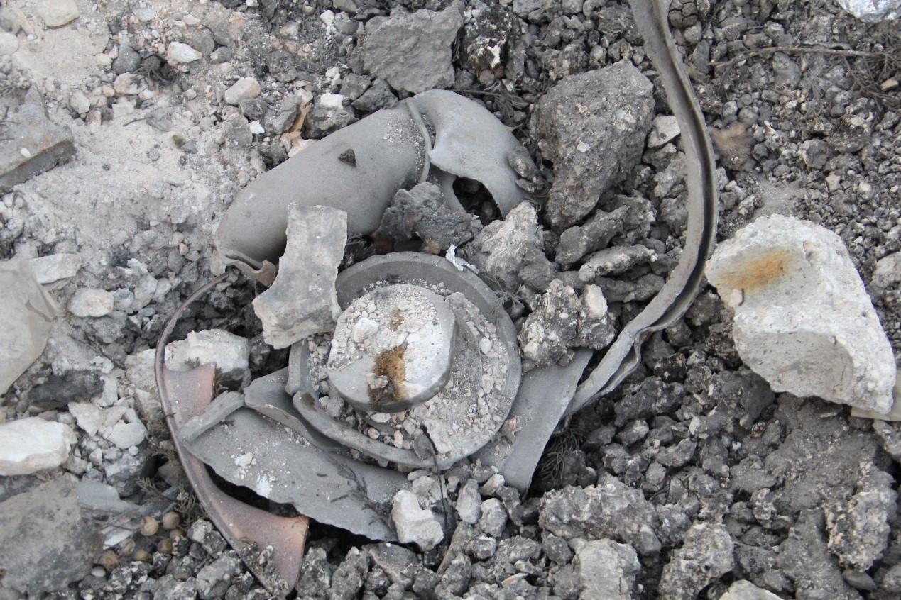

لم يتمكن الأرشيف السوري من جمع معلومات إضافية حول الذخائر المستخدمة في هذا الهجوم.

## تحليل بيانات الطيران

بغرض إضافة طبقة أخرى من التحقق؛ قارن الأرشيف السوري النتائج المستخلصة من مقاطع الفيديو وإفادات الشهود مع بيانات رصد الطيران من قبل منظمة مراقبة. استلزمت هذه العملية تحليل بيانات رصد الطيران ما بين الساعة 19:00 و 22:00، وهي الفترة الزمنية التي سبقت الهجوم وتلته مباشرة، حيث أُبلغ عنه في 20:45 و 20:51 وفقًا للناشطين الإعلاميين. انظر أدناه:

<iframe height="800" src="https://public.tableau.com/views/04022018_marrat_al_numan/Sheet1?:showVizHome=no&:embed=y&:display_count=yes" width="800"></iframe>

[عرض الإظهار البصري كاملًا](https://public.tableau.com/views/04022018_marrat_al_numan/Sheet1?:showVizHome=no&:embed=y&:display_count=yes)

من خلال مقارنة الرحلات الجوية المرصودة، نوع الطائرات المرصودة، الوقت الذي رُصدت به، ووجهات هذه الرحلات، ومقارنة هذه البيانات مع المواقع الجغرافية المقدّمة في الخطوات السابقة؛ تمكّن الأرشيف السوري من تحديد العديد من الرحلات المحتملة المسؤولة عن هذا الهجوم (عدّة طائرات روسية ثابتة الجناح) حيث شوهدت هذه الطائرات تُحلق فوق المنطقة الجغرافية للهجوم بدءًا من الساعة 11:41 صباحًا. وقد خلصت التحقيقيات السابقة إلى أن الطيران الدائري في السماء عادةً ما يُشير إلى محاولة الاستحواذ على الهدف أو التحضير لهجوم وشيك.

على الرغم من عدم توافر دليل مباشر على ضلوع إحدى هذه الطائرات المرصودة في الهجوم على معرة النعمان؛ فإن وجود هذه الطائرات يزيد من احتمال وقوع غارة جوية على هذا الموقع وفي الوقت المحدّد من قبل الصحفيين المواطنين والمجموعات الحقوقية، والمُقدّر باستخدام صور من موقع الهجوم.
