- Location: IDLIB : Kafranbel
- Hospital: The Kafranbel (Orient) Hospital
- Beneficiaries: ~3,000 people
- Date of the attack: 5 February 2018
- Time: 08:45 am
- Attacks: 4 airstrikes
- Potentially responsible: Russian or Syrian air force
- Date of previous attacks on this hospital: 19/09/2017

### Kafranbel surgical (Orient) Hospital

[Orient Hospital or known as "Kafranbel Surgical Hospital"](https://www.google.com.tr/maps/place/Surgical+Hospital+Kafr+Nabl/@35.6245444,36.5500508,698m/data=!3m2!1e3!4b1!4m5!3m4!1s0x152459bbafa257f7:0xfbcc252cc06eea0d!8m2!3d35.6245444!4d36.5521021) is located in the northern part of the city of Kafranbel, in the southern countryside of Idlib, provides services covered the entire towns and cities of the southern countryside of Idlib, with a population of more than 400,000. The hospital has about 156 workers, including 18 doctors.

### Previous attacks on Kafranbel surgical (Orient) Hospital

Orient hospital in Kafranbel was attacked on 19 September 2017 with three airstrikes that resulted in injuries to several people, structural damage to the building, as well as to the equipment of the hospital. [A detailed report titles about this previous incident](https://syrianarchive.org/en/investigations/Three-Idlib-Medical-Facilities-Attacked.html) was published by the Syrian Archive and by [Syrians for Truth and Justice](https://www.stj-sy.com/uploads/pdf_files/Syria%2520Medical%2520Fcilities%2520excluded%2520from%2520de-escalation%2520zone%2520agreement.pdf) in 2017.

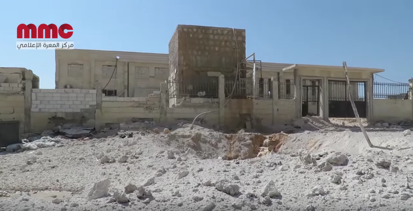

It was additionally attacked previously on 25 March 2017. Qasioun News Agency [published a video](https://www.youtube.com/watch?v=srgCm-W_gqM) showing the damage to the building and fire after the attack. See below:

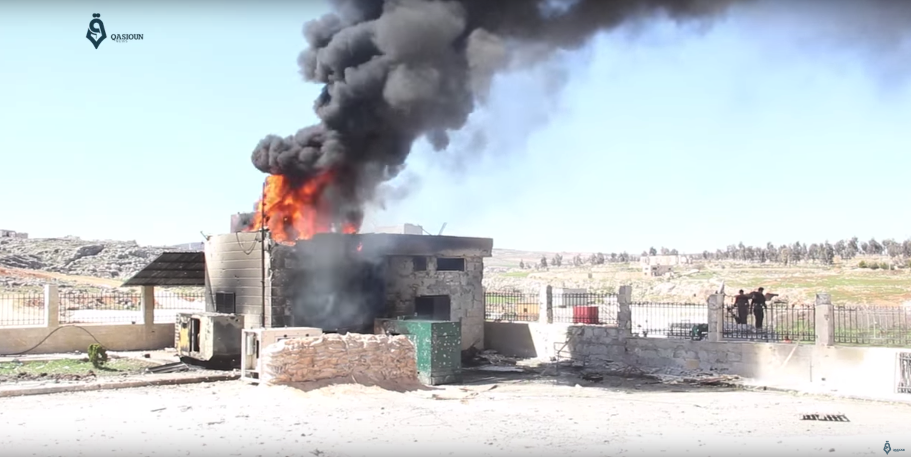

## What Happened

On 5 February 2018, local sources including [Muaz Al Shami reported](https://youtu.be/_dJphbuMm1E?t=31s) that Kafarnabel Surgical Hospital, also known as Hand in Hand Hospital and Orient Hospital, was struck by multiple airstrikes causing significant material damage and resulting in the entire hospital becoming completely out of service.

[Footage filmed during](https://www.youtube.com/watch?v=WzFAjvqC9uw&list=PLPC0Udeof3T4QmV4f9tEhDmQzr2Z_vTKZ&index=1) and after the 5 February 2018 attack clearly shows the hospital was attacked directly, with one [geolocated video](https://www.youtube.com/watch?v=WzFAjvqC9uw) capturing a bomb as it fell through the air and struck the east side of the hospital building. See below:

<iframe src="https://giphy.com/embed/26xo5DvcJlJ73tTsQ" width="560" height="315" frameBorder="0" class="giphy-embed" allowFullScreen></iframe>

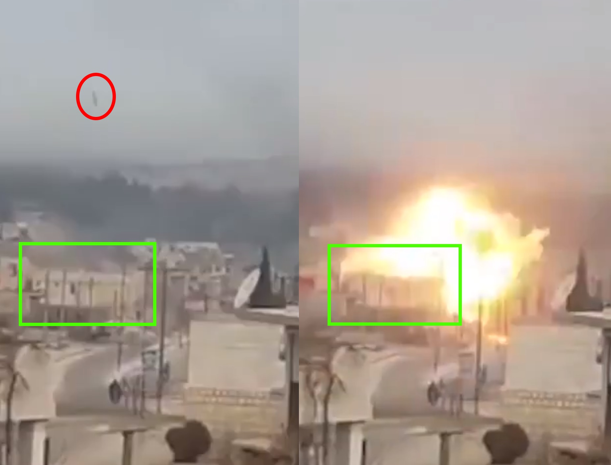

[Maara Media Center](https://www.facebook.com/maaramediacenter/posts/365657123900918) and other reporting from the ground blamed Russian aircraft for the attack.

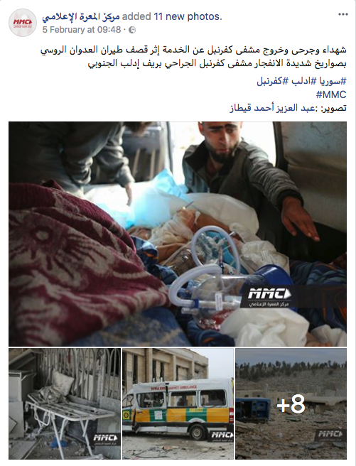

Footage filmed after the airstrikes shows clear damage to the hospital building and to the surrounding area. Damage to the northeast corner of the building, consistent with footage of the airstrike, can be seen clearly as well. The corner of the building is badly damaged and the windows, bricked up in footage from 19 September 2017, have been completely blown out:

Below is [a video publish](https://www.youtube.com/watch?v=2a1eWc0xRqo) by "Nidaa Syria" that shows the damage to the northeast corner of the hospital building:

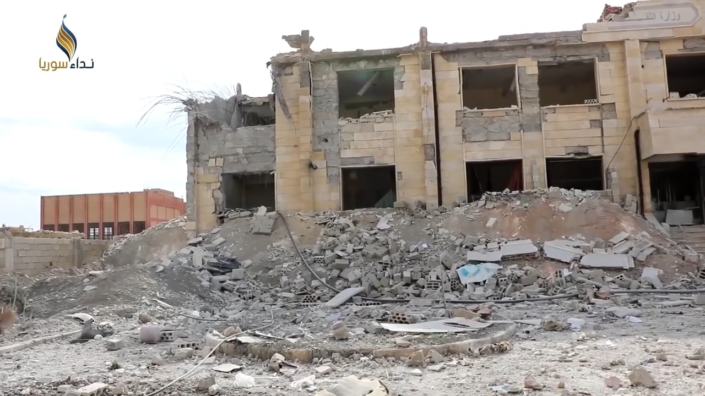

The Syrian Archive compared images between previous attacks 19 September 2017 and this attack (5 February 2018) through videos of [Maara Media Center](https://www.youtube.com/watch?v=2RJ-k5jXopQ) and [Baladi news agency](https://www.youtube.com/watch?v=lP2SGkCAYgM).

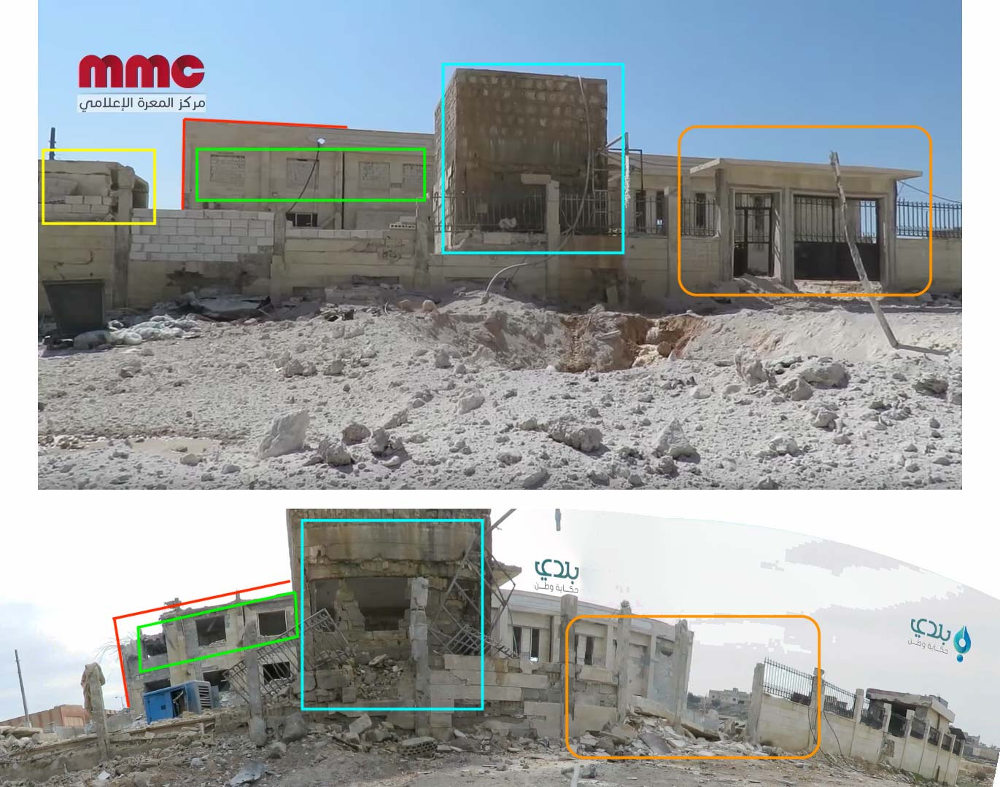

[Maara Media Center published photos](https://www.facebook.com/maaramediacenter/posts/365657123900918) that show the small building in-front of the main hospital building completely destroyed.

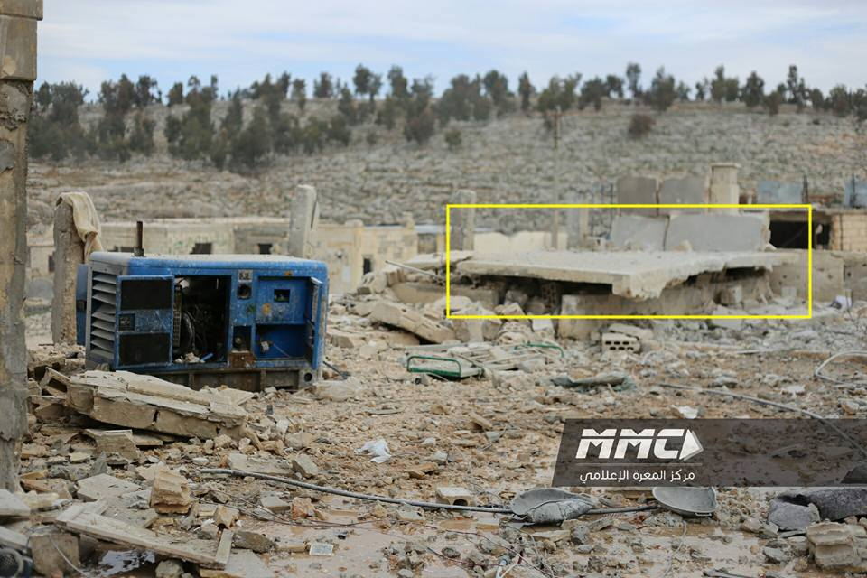

The satellite image below shows the exact location of the impact site and damage, from Digital Globe.

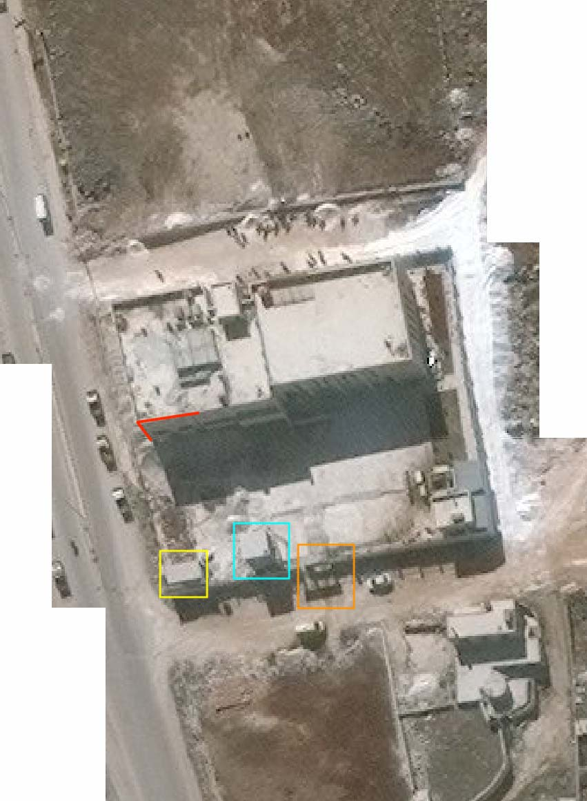

Damage to the entrance of the building and an ambulance provided by the “UK 2 Syria” campaign can be seen in [a video published](https://www.youtube.com/watch?v=YwhGjgql7IU) by Sham News Network:

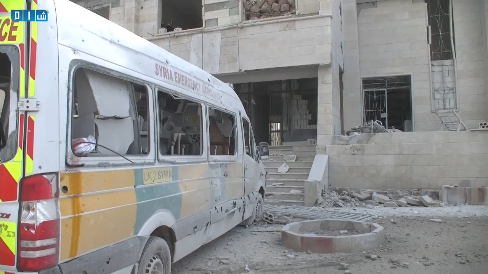

Edlib Media Center [published video](https://www.youtube.com/watch?v=JEKPnfVrVQE) showing also the damage to the interior of the hospital:

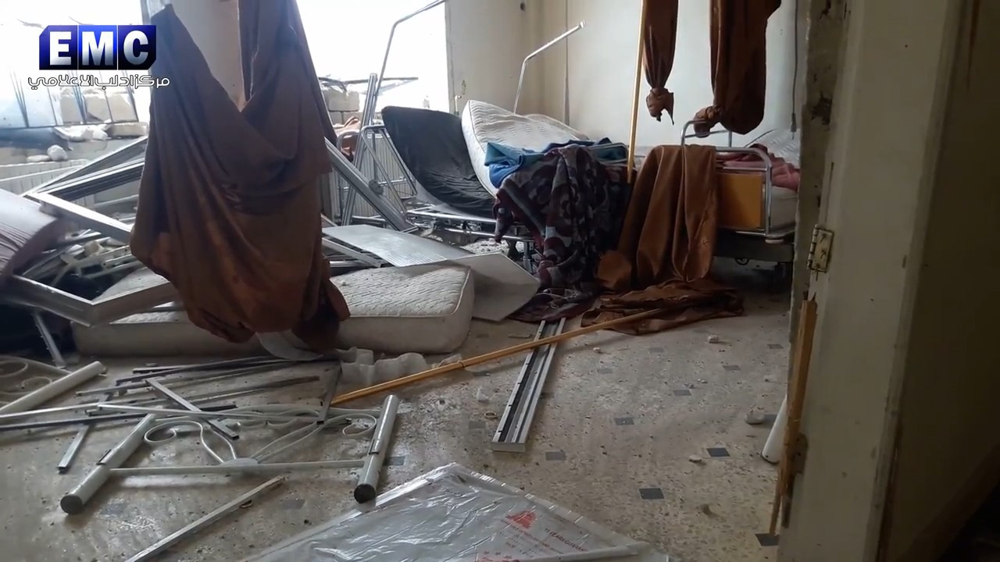

Muaz Al Shami [published a video](https://www.youtube.com/watch?v=_dJphbuMm1E) showing three floors damage as a result of the munition that targeted the building.

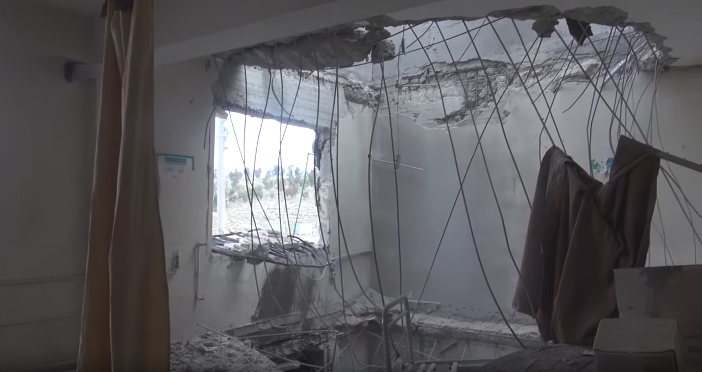

## When did it happen?

Witness statements of the attack was provided by Syrians for Truth and Justice.One of the nurses, who was at Orient Hospital at the time of the attack, spoke to Syrians for Truth and justice about the details of the incident, stating:

"On the morning of February 5, 2018, while I was checking the patients in the hospital, a warning came from the security and safety team that the hospital should be evacuated, particularly that Russian warplanes had raided Al-Ma'ra Central Hospital a day earlier. So the wounded and the reviewers were immediately transferred to the basements. At 8:45 a.m., the warplanes carried out four raids on the hospital, causing panic and fear state among the sick and the medical staff as well. However, dust and fragments scattered everywhere. Thank God there were no injuries among the medical staff or reviewers as the damage was limited to material, the upper floors were entirely damaged and the hospital was completely out of service."

In a cross-checked certificate, a reviewer, who was also at the hospital at the time of shelling, said that at 8:45, while he was in the hospital with a view to visiting one of his sick relatives, warplanes believed to be Russian carried out four air strikes on the hospital, causing destruction in the building specially the upper floors, he continued saying:

"It was a very difficult moment when fear and panic dominated all those in the basements, and the dust filled the place, there were fragments of rubble flying around. It's hard to describe the horrible scene in a few words. The raids caused the hospital to be completely out of service, due to falling a rocket in the operating room causing entire destruction. Then the Civil Defense teams worked to extinguish the fires that had been erupted as a result of the shelling, and they evacuated the sick and the medical staff out of the hospital in case they shelled it again."

Obayda al-Othman, the director of the Syrian Civil Defense Center in Kafranbel, spoke to Syrians for Truth and Justice explaining what happened:

"A day before targeting Orient Hospital, specifically on February 4, 2018, the Russian planes flew in all the liberated areas, where a Russian warplane bombed Kafranbel with highly explosive rockets targeting the popular market and houses of civilians, causing death of 9 civilians and dozens of injured. Anyway, the following day, Russian warplanes bombed Kafranbel Surgical Hospital or known as Orient Hospital with more than 3 air raids, causing destruction of the upper floors, in addition to a rocket dropped in the operating room and the intensive care room. So, immediately the Civil Defense teams rushed to the hospital to evacuate patients and reviewers to other medical points. However, these raids caused the hospital to get completely out of service, without having human damage."

# Flight Data Analysis

To provide a further layer of verification, the Syrian Archive cross-referenced findings from the videos and witness testimony with flight observation data from a spotter organisation. This process necessitated analysing observation data for flights between 8:00 and 10:00, the period directly before and after the reported attack between 7:45 and 8:00 as was claimed by media activists. See below:

<iframe height="800" src="https://public.tableau.com/views/05022018_Kafranbel/Sheet1?:showVizHome=no&:embed=y&:display_count=yes" width="800"></iframe>

[View full visualisation](https://public.tableau.com/views/05022018_Kafranbel/Sheet1?:showVizHome=no&:embed=y&:display_count=yes)

Through comparing where flights were observed, the type of aircraft observed, the time flights were observed, and the direction flights were heading, and comparing this data to geolocation conducted in earlier steps, the Syrian Archive was able to identify several flights potentially responsible for the attack (several fixed-wing Russian aircraft), seen circling in the immediate vicinity of the geolocated attack site starting from 9:00 AM. Previous research has found that circling flights typically indicate target acquisition and/or preparation for an imminent attack.

While there is no direct evidence available that one of the observed aircrafts was involved in the attack on Kafranbel the presence of these aircrafts increase the likelihood that an air attack occurred at this location and the time stated by the citizen reporters as well as humanitarian groups, and estimated also using imagery from the attack.
