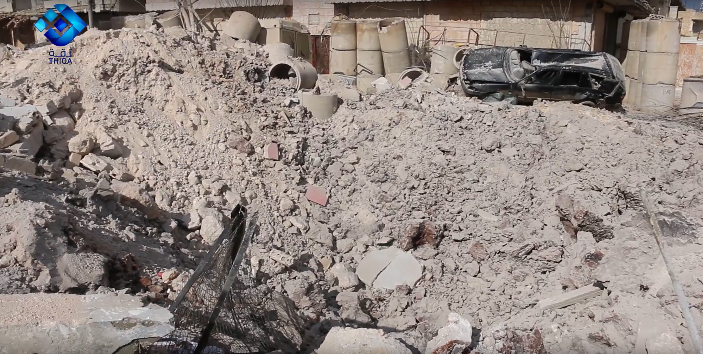

- Location: IDLIB : Saraqib
- Hospital: Oudai (Ehsan) Hospital
- Beneficiaries: ~36000 people in a year
- Date of the attack: 29/01/2018
- Time: 07:40am (potato market) 08:10am (hospital attack)
- Attacks: 1 airstrike
- Reported injured: 3 injured from the medical facility staff
- Potentially responsible: Russian or Syrian air force
- Previous attack on the hospital: 21/01/2018

### Oudai (Ehsan) Hospital

Oudai (Ehsan) Hospital is located in Saraqib city in the southern countryside of Idlib city; it provides medical services such as surgical operations, first aid and health care to the people of Saraqib. The hospital receives roughly 3000 patients a month, two surgical rooms, a department of intensive care, a section for incubators, and a building for clinics.

### Previous attacks on Oudai (Ehsan) Hospital

Idlib health directorate [reported that Oudai hospital was attacked](https://www.facebook.com/Idleb.Health.Directorate/posts/1190245281078825) on 21/01/2018 with an airstrike that resulted in structural damage to the hospital and its equipment.

## What Happened

On 29 January 2018 local sources reported that Owdai Hospital in Saraqib was targeted by an airstrike, following an earlier airstrike that damaged the hospital on 22 January 2018.
Edlib Media Center [published a video](https://www.youtube.com/watch?v=wQAVO0VECTs) showing what they claim to be the first moment of the attack that bombed the Oudai Al Hussein hospital. See below:

The [Syrian Network for Human Rights reported](http://sn4hr.org/sites/news/2018/01/29/russian-forces-shelled-oday-saraqeb-hospital-saraqeb-city-idlib-suburbs-january-29/) that the hospital was treating victims of an earlier bombing at the new potato market in Saraqib January 29th 2018 when the hospital was attacked.

Assi Press [published photos at 9:35](https://www.facebook.com/assipress/posts/1752369028149274) of injured people being treated as a result of the attack that targeted the potato market.

Citizen journalist Hadi Alabdallah [published a video](https://www.youtube.com/watch?v=DHf5r3aPhgU) showing the Syrian Civil Defense rescuing the injured as a result of the attack on the Saraqib potato market.

Alabdallah stated in the video: "11 killed and many injured in a new massacre committed by the airforce which bombed the potato market."

Edlib Media Center [published a video](https://www.youtube.com/watch?v=kEh1xqI9UJ8) about the potato market bombing showing those killed and injured people as a result of the airtsrike, as well trucks damaged in the attack. The photo clearly shows a possible crater as a result of the airstrike that targeted this location.

Geolocation of the impact site (the potato market) was possible through using the video published by Alabdallah. Three banners standing in the main street can clearly be seen both in the video still and in the satellite imagery. See below:

According to witness testimonies collected by the Syrians for Truth and Justice, the killed and injured people from the potato market attack were moved to Oudai hospital, which was then subsequently bombed by airstrikes.

The Syrian Archive has identified stills from the [Smart News Agency video](https://www.youtube.com/watch?v=TBoFbO0YiYE) as well as from the [Thiqa News aAgency video](https://www.youtube.com/watch?v=qi_h0TDek5A) showing the Oudai hospital before and after the attack. In the still above, dead bodies as a result of the potato market attack can clearly b seen. In the second still below shows damage of the same location after the airstrike that targeted the hospital.

Alabdallah [published another video on the same day of the potato market attack on 29 January](https://www.youtube.com/watch?v=R1LYNZ5-1BA) showing damage to the Oudai hospital as a result of an airstrike following the airstrike on the potato market. See below:

<iframe width="560" height="315" src="https://www.youtube.com/embed/R1LYNZ5-1BA?rel=0" frameborder="0" allow="autoplay; encrypted-media" allowfullscreen></iframe>

He stated in the video: "After the morning massacre that was committed by the airforce in the potato market, which resulted in the death of 11 people and in many injured, those injured were transferred to Oudai (Ehsan) hospital in Saraqib to be treated. But after this, the Russian airforce targeted this hospital, resulting in the hospital becoming completely out of service. A large crater resulted from the munition used by the airforce. A few of the medical staff were injured as a result of this attack. Some of those injured from the potato market that were transferred to be treated in this hospital were killed as a result of the airstrike. As of now, some of those killed remain under rubble. This is the only hospital in this city which was not out of service. Ambulances were damaged as well."

Aljisr TV [published a a video of an interview](https://www.youtube.com/watch?v=dmcvVs1l3LY) with Dr. Ali Al Faraj, the Deputy of Oudai hospital. Al Faraj stated: "This morning the potato market was bombed, then the emergency centre. Afterwards, the blood bank and the Oudai hospital were bombed on the same day. Those injured from the potato market attack were all transferred to the Oudai hospital, which was then bombed as you can see here. As a result of this attack, the hospital is now completely out of service. Three medical staff were injured. Renovating the hospital building will be very difficult after this attack."

Edlib Media Center [published photos](https://www.facebook.com/EdlibEmc1/photos/pcb.2020739931472899/2020739648139594/?type=3&theater) showing  rescue operations outside the hospital after the attack. See below:

The bomb landed in front of the main hospital building, leaving a large crater as [shown in a video published](https://www.youtube.com/watch?v=qi_h0TDek5A) by Thiqa News Agency, and resulting in the collapse of a warehouse containing medical supplies. The video shows the Syrian Civil Defence digging an adult male who died in the attack out of the debris after the initial rescue operation.

## Where did it happen?

The Syrian Archive team created a Panoramic image using the [video of Sham News Network](https://www.youtube.com/watch?v=9H0OWyzd8jo&t=1s) which was published after the attack. The hospital building and another building were identified through comparing the image with Google earth satellite imagery. See below:

## Munitions identified

Sham News Network published a video showing remnants of a munition that is claims was used during the potato market attack. The remains of the rocket indicates it would have been launched by a [BM-30 multiple rocket launcher](https://twitter.com/EliotHiggins/status/563393370413105153), a type of surface to surface rocket launcher. If this was the munition used in the attack, it would contradict claims the attack was launched from the air.

## When did it happen?

Witness statements of the attack were provided by Syrians for Truth and Justice.

Ahmed al-Asaad, a doctor who was in the hospital at the time of attacking it, spoke to Syrians for Truth and Justice about what happened:
"At about 8:00 am on 29 January 2018, Russian military aircraft shelled the potato market in Saraqib, which resulted in dozens of civilian casualties. Immediately afterwards, the ambulance teams transported those injured and killed to Uday al-Hussein Hospital, but the warplanes again attacked the hospital with two vacuum rockets, resulting in the hospital becoming completely out of service, killing a civilian and wounding some members of the medical staff at the hospital in the process. Anyway, the shelling also destroyed the room where the dead had been transported from the potato market. So Saraqib now is without any medical points to provide services to those injured and to the locals as well."

Hassan Al-Hassaan, a Syrian Civil Defense worker in Idlib province, told Syrians for Truth and Justice: "The observatories monitoring air traffic in the skies of Saraqib informed them on the morning of 29 January 2018 that warplanes believed to be Russian shelled the city's potato market. As a result, Syrian Civil Defense teams were directed to move the injured and lift the dead from rubbles. There were about 13 killed, in addition to dozens of wounded, and then I transferred them to Uday al-Hussein Hospital in the city. He continued:
“Almost half an hour after we transferred the dead and wounded to the hospital, the warplanes shelled Uday al-Hussein Hospital at about 8:00, leading to massive destruction. Immediately after, the rescue teams again went to the impact site to evacuate the injured out of fear of another raid. This resulted in the hospital becoming completely out of service.

In another testimony by Abu Arab, the supervisor of a military aircraft observatory in Saraqib, spoke to Syrians for Truth and Justice. He stated:
"At 7:35 on 29 January 2018, a warplane took off from the Hmeimim Military Base in Latakia province, flew toward north of Syria at 7:40, and targeted the city's potato market with explosive rockets. This led to a massacre, and we immediately informed the Civil Defense teams to go to the bombing site. But the same warplane targeted the hospital of Uday al-Hussein with two vacuum rockets after about half an hour. This resulted in the hospital becoming completely out of service.

Safi al Hammam, an activist from Saraqib, also spoke to Syrians for Truth and Justice, stating:
“The day of 29 January 2018 was a bloody day in every sense of the word, as the city was shelled with various kinds of weapons by Russian aircraft from Sokhoi, which targeted the potato market with several rockets, resulting in dozens of civilian casualties whom were later transferred to Uday al-Hussein Hospital in Saraqib. These warplanes targeted the hospital with two vacuum rockets, killing one civilian and injuring dozens, in addition to resulting in the hospital becoming completely out of service. And then the Russian warplanes targeted it once again with dual raids, injuring several media personnel. The city has also witnessed a massive wave of displacement towards the border areas north of the province, due to the violent shelling of the city."

According to a Syrians for Truth and Justice reporter, who was in the hospital at the time of the attack, a state of panic and horror controlled all the sick and injured in the hospital after they became aware that the military aircraft observatory had tracked warplanes, believed to be Russian, approaching toward Uday al-Hussein Hospital on the morning of 29 January 2018. Everyone was transferred to the ground floor of the hospital. In the meantime, fighter jets dropped two vacuum rockets, directly targeting the hospital building. This resulted significant damage to the building, as well as several injuries among members the medical staff and media who were outside hospital campus.

# Flight Data Analysis

To provide a further layer of verification, the Syrian Archive cross-referenced findings from the videos and witness testimony with flight observation data from a spotter organisation. This process necessitated analysing observation data for flights between 7:00 and 10:00, the period directly before and after the reported attack between 7:30 and 8:30 as was claimed by media activists. See below:

<iframe height="800" src="https://public.tableau.com/views/29012018_saraqib/Sheet1?:showVizHome=no&:embed=y&:display_count=yes" width="800"></iframe>

[View full visualisation](https://public.tableau.com/views/29012018_saraqib/Sheet1?:showVizHome=no&:embed=y&:display_count=yes)

Through comparing where flights were observed, the type of aircraft observed, the time flights were observed, and the direction flights were heading, and comparing this data to geolocation conducted in earlier steps, the Syrian Archive was able to identify several flights potentially responsible for the attack (several fixed-wing Russian aircraft), seen circling in the immediate vicinity of the geolocated attack site starting from 7:45 AM. Previous research has found that circling flights typically indicate target acquisition and/or preparation for an imminent attack.

While there is no direct evidence available that one of the observed aircrafts was involved in the attack on Saraqib the presence of these aircrafts increase the likelihood that an air attack occurred at this location and the time stated by the citizen reporters as well as humanitarian groups, and estimated also using imagery from the attack.
