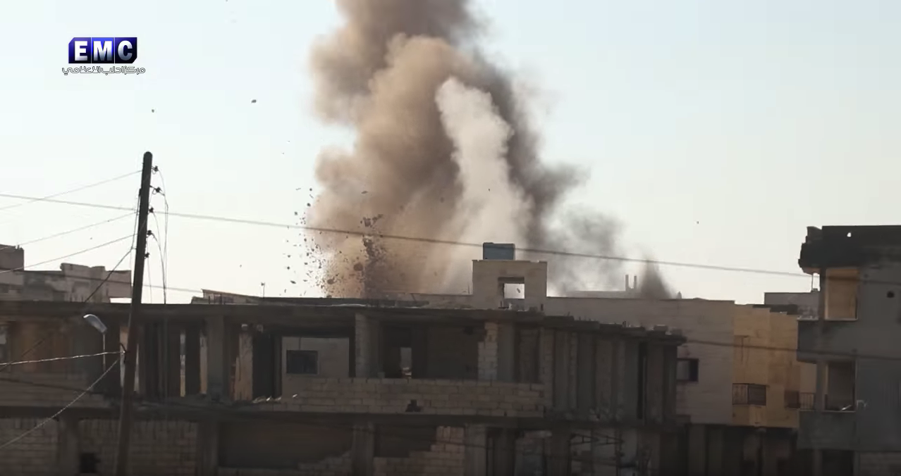
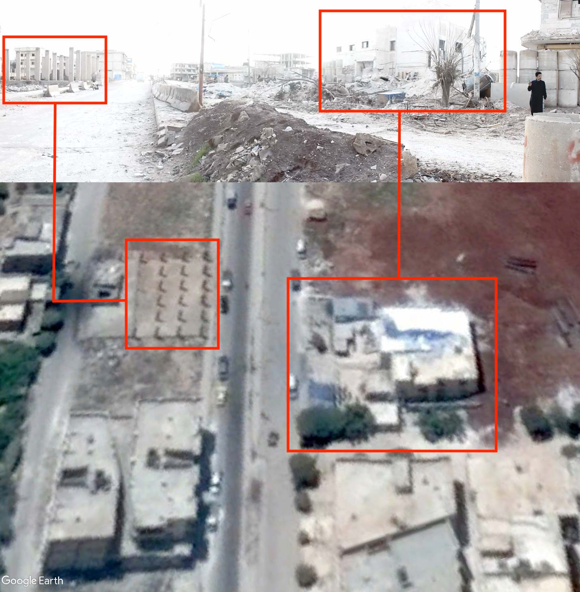
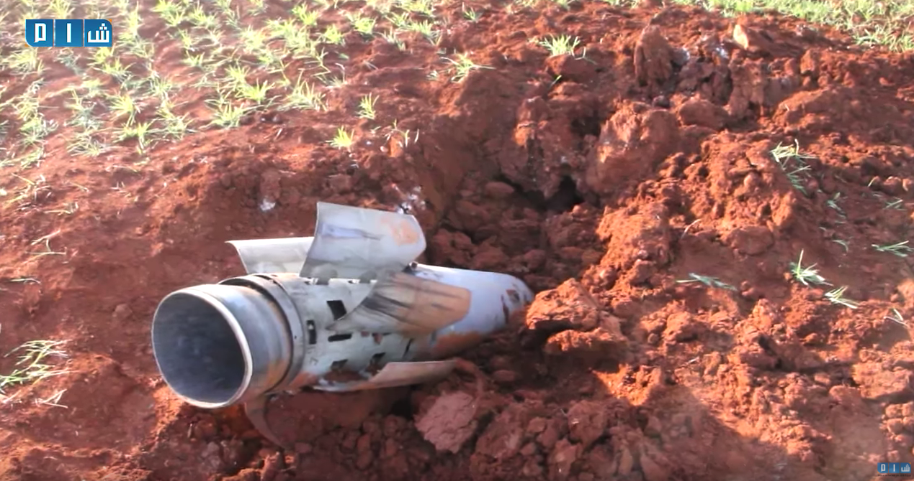

- الموقع: محافظة ادلب: سراقب
- المستشفى: مشفى عدي (الإحسان)
- المستفيدين من المستشفى: حوالي 36,000 شخص سنويًا
- التاريخ: 29 كانون الثاني- يناير 2018
- التوقيت: الساعة 07:40 صباحًا (سوق البطاطا)، الساعة 08:10 صباحًا (الهجوم على المستشفى)
- الهجمات:  غارة جوية واحدة
- الجرحى المبلّغ عنهم:  3 جرحى من الطاقم الطبي في المستشفى
- المسؤول المحتمل: القوات الجوية الروسية أو السورية
- هجمات سابقة على المستشفى: في 21/01/2018

### مستشفى عديّ (الإحسان)

تقع مستشفى عديّ (أو الإحسان) في مدينة سراقب، في ريف إدلب الجنوبي، وتؤمّن الخدمات الطبية مثل العمليات الجراحية، الإسعافات الأولية، والرعاية الصحية للمقيمين في سراقب. تستقبل المستشفى ما يقارب 3000 مريض شهريًا، وتحتوي غرفتي عمليات، قسم العناية المركّزة، قسم حاضنات، وبناءً للعيادات.

### هجمات سابقة على مستشفى عدي (الإحسان)

أعلنت مديرية صحة ادلب [أن مستشفى عدي تعرّض للقصف](https://www.facebook.com/Idleb.Health.Directorate/posts/1190245281078825) بغارة جوية في 21/01/2018، ما تسبب بأضرار في بناء المستشفى ومعدّاته.

## ماذا حدث؟

أعلنت مصادر محلية في 29 يناير 2018 أن مستشفى عديّ في سراقب استُهدف بغارة جويّة، عقب غارة جويّة سابقة في 22 يناير 2018 تسبّبت بوقوع أضرارٍ في بناء المستشفى.
نشر مركز ادلب الإعلامي [مقطع فيديو](https://www.youtube.com/watch?v=wQAVO0VECTs) يُظهر ما تم الادعاء بأنها اللحظات الأولى للهجوم الذي استهدف مستشفى عديّ الحسين. انظر أدناه:

[أشارت الشبكة السورية لحقوق الإنسان](http://sn4hr.org/sites/news/2018/01/29/russian-forces-shelled-oday-saraqeb-hospital-saraqeb-city-idlib-suburbs-january-29/) أن المستشفى كان يعالج ضحايا هجوم سابق على سوق البطاطا الجديد في سراقب في 29 يناير 2018 عندما وقع الهجوم عليه.

نشرت صفحة عاصي برس [عدة صور في الساعة 9:35](https://www.facebook.com/assipress/posts/1752369028149274) تظهر معالجة أشخاص مصابين نتيجة الهجوم الذي استهدف سوق البطاطا.

نشر المواطن الصحفي هادي العبد الله [مقطع فيديو](https://www.youtube.com/watch?v=DHf5r3aPhgU) يظهر فريق الدفاع المدني السوري يسعف المصابين نتيجة الهجوم على سوق البطاطا في ادلب.

يقول العبد الله ضمن الفيديو: " 11 شهيدًا وعشرات الجرحى في مجزرة جديدة ارتكبتها الطائرات الحربية في مدينة سراقب، حيث قامت باستهداف سوق البطاطا".

نشر مركز ادلب الإعلامي [مقطع فيديو](https://www.youtube.com/watch?v=kEh1xqI9UJ8) حول قصف سوق البطاطا يظهر الضحايا والمصابين نتيجة للغارة الجوية، إضافة إلى شاحنات متضررة جراء الهجوم. تظهر الصورة بوضوح حفرة يُحتمل أن تكون ناجمة عن الغارة الجوية التي استهدفت الموقع.

من خلال استخدام فيديو هادي العبد الله، أمكن تحديد الموقع الجغرافي للمكان المستهدف (سوق البطاطا). حيث يمكن بوضوح رؤية ثلاث لافتات في الشارع الرئيسيّ، وذلك في كلًا من الفيديو وصور الأقمار الصناعية. انظر أدناه:

وفقًا لإفادات شهود جُمعت من قبل سوريون من أجل الحقيقة والعدالة؛ فإنه تم نقل ضحايا وجرحى هجوم سوق البطاطا إلى مستشفى عديّ، والذي استُهدف عقب ذلك بغارة جويّة.

 حدّد الأرشيف السوريّ صورًا ثابتة من [مقطع فيديو وكالة سمارت للأنباء](https://www.youtube.com/watch?v=TBoFbO0YiYE) إضافة إلى  [مقطع فيديو وكالة ثقة للأنباء](https://www.youtube.com/watch?v=qi_h0TDek5A) حيث يمكن رؤية مستشفى عديّ قبل وبعد الهجوم. في الصورة العلويّة؛ يمكن بوضوح رؤية جثث ضحايا هجوم سوق البطاطا. أما ثاني الصورتين فتظهر الأضرار في الموقع ذاته عقب الغارة الجوية التي استهدفت المستشفى.

[نشر العبدالله مقطع فيديو آخر في اليوم ذاته حول هجوم سوق البطاطا في 29 يناير ](https://www.youtube.com/watch?v=R1LYNZ5-1BA) ويظهر تضرر مستشفى عديّ نتيجة للغارة الجوية التي تلت الغارة الجويّة على سوق البطاطا. انظر أدناه

<iframe width="560" height="315" src="https://www.youtube.com/embed/R1LYNZ5-1BA?rel=0" frameborder="0" allow="autoplay; encrypted-media" allowfullscreen></iframe>

ويقول في الفيديو: " بعد المجزرة الصباحية التي ارتكبتها الطائرات الحربية في سوق البطاطا، والتي تسببت بوقوع 11 شهيد والعديد من الجرحى، تم إسعاف الجرحى إلى مستشفى عدي (الإحسان) في سراقب لإسعافهم. لكن بعدها بقليل، استهدفت الطائرات الحربية الروسية المستشفى بصواريخ ارتجاجية، ما أسفر عن خروج المستشفى بشكل كامل عن الخدمة. حفرة كبيرة أحدثها الصاروخ الذي أطلق من قبل الطائرات الحربية. عدد من أعضاء الكادر التمريضي والطبي تعرضوا للإصابات نتيجة للهجوم. بعض الجرحى في هجوم سوق البطاطا والذين أسعفوا لعلاجهم في المستشفى استشهدوا نتيجة للغارة الجوية. حتى الآن، لا يزال بعض الشهداء تحت الأنقاض. هذا هو  المشفى الوحيد في المدينة خرج الآن عن الخدمة. عدد من سيارات الإسعاف تدمرت بشكل كامل".

نشرت قناة الجسر الفضائية  [مقطع فيديو لمقابلة](https://www.youtube.com/watch?v=dmcvVs1l3LY) مع د.علي الفرج، نائب مدير مستشفى عديّ. قال الفرج: " اليوم صباحا قُصف سوق البطاطا، كان الاستهداف في بداية الحملة على مركز الدفاع المدني ومن ثم مركز الإسعاف. بعدها بنك الدم، ومشفى عدي. تم إسعاف جميع المصابين نتيجة هجوم سوق البطاطا لمستشفى عدي، والذي تم قصفه بعدها كما ترون هنا. أدى الهجوم لخروج المستشفى بشكل كامل عن الخدمة وأصيب ثلاثة من أعضاء الكادر الطبي. إعادة ترميم بناء المستشفى بعد هذا الهجوم أصبحت شبه مستحيلة".

نشر مركز إدلب الإعلامي  [صورًا تظهر ](https://www.facebook.com/EdlibEmc1/photos/pcb.2020739931472899/2020739648139594/?type=3&theater) عمليات إسعاف خارج بناء المستشفى بعد الهجوم. انظر أدناه:

سقطت القذيفة أمام مبنى المستشفى الرئيسي، مخلفة حفرة كبيرة كما  [يظهر في مقطع فيديو تم نشره](https://www.youtube.com/watch?v=qi_h0TDek5A) من قبل وكالة ثقة للأنباء، ومتسببة في انهيار مستودع يحتوي على معدّات طبية.  يظهر الفيديو عناصر الدفاع المدني السوري ينتشلون جثة ذكر بالغ والذي قُتل نتيجة للهجوم تحت الحطام عقب عملية الإسعاف الأولية.

## أين وقع الهجوم؟

أنشأ فريق الأرشيف السوري صورة بانورامية باستخدام  [مقطع فيديو شبكة شام الإخبارية](https://www.youtube.com/watch?v=9H0OWyzd8jo&t=1s) والذي نُشر عقب الهجوم. أمكن تحديد بناء المستشفى وبناء آخر من خلال مقارنة الصورة مع صورة أقمار صناعية من غوغل إيرث. انظر أدناه:

## تحديد الذخائر المستخدمة

نشرت شبكة شام الإخبارية مقطع فيديو يظهر بقايا الذخائر المستخدمة في الهجوم على سوق البطاطا. تشير بقايا الصاروخ أنه قد يكون أُطلق من  [قاذفة الصواريخ المتعددة BM-30](https://twitter.com/EliotHiggins/status/563393370413105153)، وهي نوع من قاذفات صواريخ أرض أرض. إذا كانت بقايا الصاروخ تعود للذخيرة المستخدمة في الهجوم، فإن ذلك يتناقض مع الادعاءات بأن الهجوم كان جويًا.

## متى وقع الهجوم؟

جُمعت إفادات الشهود حول الهجوم من قبل سوريون من أجل الحقيقة والعدالة.

أحمد الأسعد وهو أحد الأطباء الذين كانوا متواجدين في المشفى لحظة استهدافه، تحدث لسوريون من أجل الحقيقة والعدالة حول ما جرى قائلاً:
"في حوالي الساعة (8:00) من صبيحة يوم 29 كانون الثاني/يناير 2018، تمّ استهداف سوق البطاطا الكائن في مدينة سراقب من قبل طيران حربي روسي، وهو ما أسفر عن وقوع عشرات الضحايا من المدنيين، وعلى الفور قامت فرق الإسعاف بنقل المصابين والقتلى إلى مشفى عدي الحسين، إلا أنّ الطائرات الحربية عادت لتستهدف المشفى بصاروخين فراغيين، وهو ما أدى إلى خروجه عن الخدمة بشكل كامل، كما أدت إلى مقتل مدني وإصابة بعض أفراد الطاقم الطبي في المشفى، وأدى القصف أيضاً إلى دمار الغرفة التي تمّ نقل جثامين القتلى إليها من سوق البطاطا، لتصبح مدينة سراقب بلا أي نقطة طبية قد تشرف على تقديم الخدمات الصحية للمصابين والأهالي."

حسن الحسان وهو أحد العاملين في مركز الدفاع المدني في محافظة إدلب، قال لسوريون من أجل الحقيقة والعدالة، بأنّ المراصد التي تشرف على رصد حركة الطيران الحربي في سماء مدينة سراقب، أنبأتهم في صبيحة يوم 29 كانون الثاني/يناير 2018، بأنّ طائرات حربية يُعتقد أنها روسية قامت باستهداف سوق البطاطا في المدينة، فعملت فرق الدفاع المدني على التوجه إلى المكان لنقل المصابين وانتشال القتلى  من المدنيين والذين قدر عددهم ب (13) قتيل إضافة إلى عشرات الجرحى، ومن ثمّ عملت على نقلهم إلى مشفى عدي الحسين في المدينة، وتابع قائلاً:
"لمّا قمنا بنقل القتلى والجرحى إلى المشفى، وبعد قرابة نصف ساعة عادت الطائرات الحربية لتستهدف مشفى عدي الحسين في حوالي الساعة (8:00) صباحاً، وهو ما تسبّب في دمار المشفى بشكل كبير، وعلى الفور عاودت فرق الإنقاذ التوجه مرة أخرى إلى المكان حتى تعمل على إخلاء المصابين خشية وقوع غارة أخرى، كما أدى القصف إلى خروج المشفى بشكل كامل عن الخدمة."

وفي شهادة أخرى أدلى بها أبو عرب وهو المشرف على أحد مراصد الطيران الحربي في مدينة سراقب، إذ تحدث لسوريون من أجل الحقيقة والعدالة قائلاً:
"في تمام الساعة (7:35) من صبيحة يوم 29 كانون الثاني/يناير 2018، أقلعت طائرة حربية من قاعدة حميميم العسكرية في محافظة اللاذقية باتجاه الشمال السوري، وفي تمام الساعة (7:40) صباحاً قامت الطائرة باستهداف سوق البطاطا في المدينة بصواريخ متفجرة أدت إلى وقوع مجزرة، وعلى الفور قمنا بإبلاغ فرق الدفاع المدني للتوجه إلى مكان القصف، إلا أنّ ذات الطائرة الحربية عادت لتستهدف مشفى عدي الحسين في المدينة بصاروخين فراغيين بعد قرابة النصف ساعة، وهو ما أدى إلى خروج المشفى بشكل كامل عن الخدمة."

صافي الحمام وهو أحد نشطاء مدينة سراقب، تحدث هو الآخر لسوريون من أجل الحقيقة والعدالة، حول ما جرى قائلاً:
"كان يوم 29 كانون الثاني/يناير 2018، يوماً دامياً بكل معنى الكلمة، فقد تعرضت المدينة للقصف بمختلف أنواع الأسلحة من قبل طائرات حربية روسية من نوع (سوخوي)، إذ أنها استهدفت سوق البطاطا بعدة صواريخ وهو ما أدى إلى وقوع عشرات الضحايا من المدنيين الذين تمّ نقلهم لاحقاً إلى مشفى عدي الحسين في المدينة، فقامت تلك الطائرات الحربية باستهداف المشفى بصاروخين فراغيين، وهو ما أدى إلى مقتل مدني وإصابة العشرات، إضافة إلى خروج المشفى بشكل كامل عن الخدمة، ومن ثمّ عاود الطيران الحربي الروسي استهداف المدينة بغارة مزدوجة، وهو ما أدى إلى إصابة عدة إعلاميين، كما شهدت المدينة موجة نزوح كبيرة من قبل الأهالي باتجاه المناطق الحدودية شمال المحافظة، وذلك بسب القصف العنيف الذي تتعرض له المدينة."

وبحسب مراسل سوريون من أجل الحقيقة والعدالة الذي كان متواجداً في المشفى لحظة وقوع الهجوم، فإنّ حالة من الهلع والرعب كانت قد سيطرت على جميع المرضى والمصابين الذين كانوا في المشفى، عقب إعلامهم بأنّ مرصد الطيران الحربي كان قد رصد طائرات حربية يُعتقد أنها روسية تقترب من مشفى عدي الحسين في صبيحة يوم 29 كانون الثاني/يناير 2018، حيث تمّ إنزال الجميع إلى الطابق الأرضي من المشفى، وفي هذه الأثناء قامت تلك الطائرات بإسقاط صاروخين فراغيين استهدفا مبنى المشفى بشكل مباشر، وهو ما تسبّب في وقوع إصابات بين أعضاء الكادر الطبي، إضافة إلى عدة إعلاميين كانوا متواجدين في حرم المشفى الخارجي، فضلاً عن الأضرار المادية الكبيرة التي سببّها القصف.

## تحليل بيانات الطيران

بغرض إضافة طبقة أخرى من التحقق؛ قارن الأرشيف السوري النتائج المستخلصة من مقاطع الفيديو وإفادات الشهود مع بيانات رصد الطيران من قبل منظمة مراقبة. استلزمت هذه العملية تحليل بيانات رصد الطيران ما بين الساعة 07:00 و 10:00، وهي الفترة الزمنية التي سبقت الهجوم وتلته مباشرة، حيث أُبلغ عنه في 07:30 و 08:30 وفقًا للناشطين الإعلاميين. انظر أدناه:

<iframe height="800" src="https://public.tableau.com/views/29012018_saraqib/Sheet1?:showVizHome=no&:embed=y&:display_count=yes" width="800"></iframe>

[عرض الإظهار البصري كاملًا](https://public.tableau.com/views/29012018_saraqib/Sheet1?:showVizHome=no&:embed=y&:display_count=yes)

من خلال مقارنة الرحلات الجوية المرصودة، نوع الطائرات المرصودة، الوقت الذي رُصدت به، ووجهات هذه الرحلات، ومقارنة هذه البيانات مع المواقع الجغرافية المقدّمة في الخطوات السابقة؛ تمكّن الأرشيف السوري من تحديد العديد من الرحلات المحتملة المسؤولة عن هذا الهجوم (عدّة طائرات روسية ثابتة الجناح) حيث شوهدت هذه الطائرات تُحلق فوق المنطقة الجغرافية للهجوم بدءًا من الساعة 07:45 صباحًا. وقد خلصت التحقيقيات السابقة إلى أن الطيران الدائري في السماء عادةً ما يُشير إلى محاولة الاستحواذ على الهدف أو التحضير لهجوم وشيك.

على الرغم من عدم توافر دليل مباشر على ضلوع إحدى هذه الطائرات المرصودة في الهجوم على سراقب؛ فإن وجود هذه الطائرات يزيد من احتمال وقوع غارة جوية على هذا الموقع وفي الوقت المحدّد من قبل الصحفيين المواطنين والمجموعات الحقوقية، والمُقدّر باستخدام صور من موقع الهجوم.
