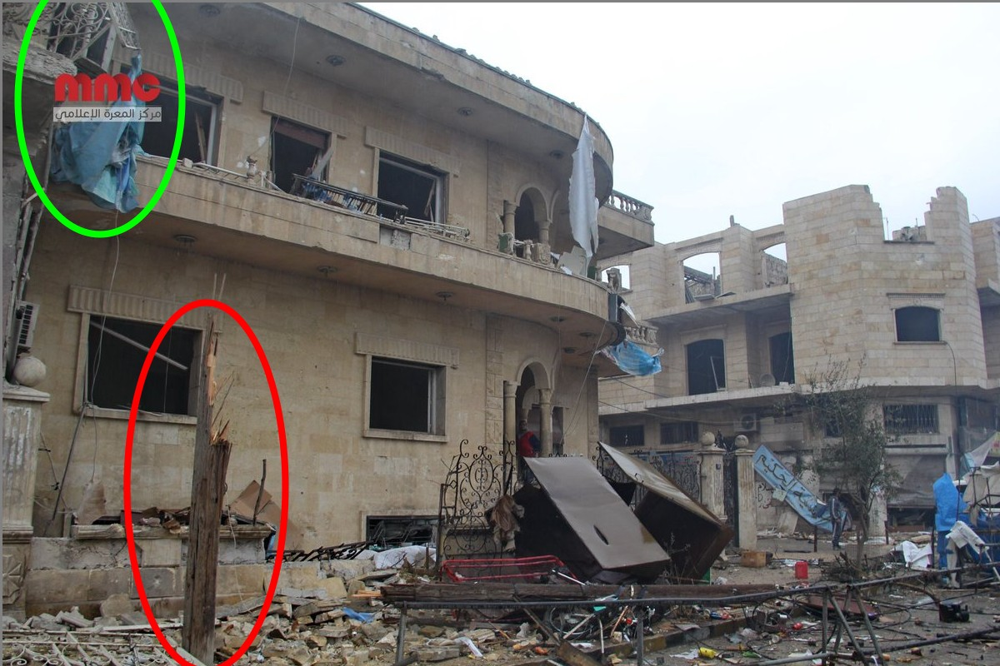

- Location: Maarat al-Numaan (Idlib governorate, Syria)
- Claimed targets: Al-Salaam hospital
- Date: 03 January 2018
- Reported killed: 2 killed (including one infant who was 1 year old)
- Reported injured: 10 injured, as reported by Thiqa News Agency
- Potentially responsible: Russian or Syrian Air Force

## Background of Maarat al-Numaan

Maarat al-Numaan (also known as al-Maarra) is a city located 33 km south of Idlib. It is the second largest city in Idlib, with a population of roughly 58,008 (2004 census). Maarat al-Numaan has a long history, and its museum has [mosaics from the Dead Cities](http://www.esyria.sy/eidleb/index.php?p=stories&category=ruins&filename=200801071848011), dating from the 1st to 7th centuries.

The city saw demonstrations early on in the Syrian uprising. [One of the first demonstrations](https://www.youtube.com/watch?v=ptgRwJ0tGq8), dating from 24 April 2011, documents demonstrators chanting for freedom and Daraa. Security forces [often intervened](https://www.youtube.com/watch?v=Z_8a7FlJMAU) to break up demonstrations. The city has seen a [number of defection of military officers](https://www.youtube.com/watch?v=sp29oYjAGRQ), and as a result, swiftly became an important hub for [organizing protests](https://www.youtube.com/watch?v=mfLaZ1G3s20). In October 2012, Maarat al-Numaan fell under [control by the Free Syrian Army](https://www.youtube.com/watch?v=5aralZ54lXs) (FSA), since which it has ceased to be controlled by the Syrian government.

On 13 March 2016, al-Nusra Front and Jund al-Aqsa [attacked the Free Syrian Army's Division 13](https://apnews.com/5eefe3dd4c2045c3b2277fcb8276bda9) in Maarat al-Numaan, overrunning their depots, killing seven combatants and wounding as many as 20 others. Two of Division 13's storage facilities which were filled with US manufactured anti-tank TOW missiles were surrendered to al-Nusra. At the time, Ahmad al-Saaoud, a Syrian rebel commander, said the attackers had seized light weapons and ammunition from his group but had not managed to capture any TOW anti-tank missiles.

Civilian opposition against al-Nusra [continued for several months](http://stepagency-sy.net/archives/94904) in Maarat al-Numaan until 6 June 2016 when clashes broke out again. On 9 June, [an agreement was signed](https://twitter.com/jenanmoussa/status/873483701140811776) between the Free Idlib Army and Tahrir al-Sham. This agreement requires the Division 13 to be stripped of power and all headquarters of Division 13 to be managed by the Free Idlib Army with the exception of one to be managed by Tahrir al-Sham.

### Al-Salaam Hospital

Al Salaam Hospital is a maternity hospital in Maarat al-Numaan founded in 1995. It contains all medical departments, including women's clinics, orthopaedics, and general surgery. The hospital served approximately 500,000 people.

Prior to the attack on 3 Jan 2018, the hospital treated approximately 8.000 to 9.000 patients per month. In December of 2017, the [hospital delivered 674 babies](https://www.sams-usa.net/press_release/maternity-hospital-maarat-al-numan-city-destroyed-following-three-attacks-four-days/) and [the total number of beneficiaries](https://www.facebook.com/alsalam.Hospital2/photos/a.390735564429659.1073741860.182840021885882/870621066441104/?type=3) from its services reached 8670 patients, including 1789 in the internal clinic, 3356 in the paediatrics clinic, 2668 in the women's clinics, and hundreds of other patients in different clinics. See below:

Al Salaam Hospital is the only maternity hospital in Maarat al-Numaan that provided emergency services, medical consultations, as well as deliveries.

## What Happened?

On 03 Jan 2018 between 11:38 AM and 12:00 AM (in Damascus local time), al-Salaam hospital in Maarat al-Numaan was attacked allegedly by the Russian air force. The Syrian American Medical Society (SAMS), who supported the hospital, published a  [report](https://www.sams-usa.net/press_release/maternity-hospital-maarat-al-numan-city-destroyed-following-three-attacks-four-days/) stating that the latest airstrikes resulted in the 'killing [of] five people, including a newborn baby girl and her father, and injuring many more.'

On their Facebook page, [SAMS published a video](https://www.facebook.com/sams.arabic/videos/1209630115836875/) showing the hospital from the inside, immediately after the attack. That evening [SAMS later reported](https://www.facebook.com/sams.arabic/videos/1209757322490821/): "Al-Salaam hospital in Maarat al-Numaan was becoming out of order, after violent attacks against it caused significant material damage, and its medical staff and patients were evacuated. A newborn baby girl was killed two hours later after she has been born in the hospital and another was injured as a result of the shelling."

Thiqa News agency [also published a video on their YouTube channel](https://www.youtube.com/watch?v=kKJi6vdRAmM)  showing the destruction of the hospital. See still below:

The video includes an interview with one of the medical staff who stated: "Russian aircraft targeted al-Salaam hospital after the Duhur prayer [noon prayer]. The hospital is out of service now as a result of this attack, we have ten injuries, including three children."

Hadi Alabdallah [also published a video](https://www.youtube.com/watch?v=Y6LrgHofQB4) showing destruction of the incubators section of the hospital. See below:

Another still from the Alabdallah video shows destruction outside of the hospital. The Syrian Archive has identified similar objects between Alabdallahs video and Thiqa News Agency video. See below:

In the same video, Alabdallah conducted an interview with one of the hospital doctors who stated: "We were in the operations room when we were surprised by a huge explosion caused by two missiles. We went out immediately to check the casualties. We had five victims and a number of wounded, in addition to extreme physical damage."

RFS Media [also published a video](https://www.youtube.com/watch?v=RH0g4bxbbAQ) showing the destruction in the front of the hospital. The video also features an interview with a member of Syria Civil Defence rescue team, who stated: "The warplanes launched heaviest attacks on several areas in the southern countryside of Idlib. We are now in al-Salaam hospital in Maarat al-Numaan, a civilian hospital, which was targeted by airstrikes, resulting in five victims and ten wounded."

Maara Media Center (MMC) [published a video](https://www.youtube.com/watch?v=sVU982I06rY) by Mohamed Aldaher showing additional destruction outside of the hospital from a different perspective. See stills below:

The video contains an interview with one of Syria Civil Defence members who stated: "Russian warplanes targeted Maarat al-Numan city with two air strikes targeting al-Salaam hospital and some shops surrounding it. A city inhabited by civilians."

Eye on Homeland (EOH) [published an Additional video](https://www.youtube.com/watch?v=9l9hy36AbZo) on their youtube channel showing the outside of the hospital, where the attack caused destruction of nearby shops surrounding the al-Salaam hospital. See below:

The Syrian Archive identified objects contained in both the Maara Media Center video and the Eye on Homeland video to confirm both videos were filmed in the the same location. See below:

Edlib Media Center also published a video [showing the first moments after the attack](https://www.youtube.com/watch?v=Ht_bbjEXEUg). See below:

## Where did it happen?

Al Jazeera published a video after the attack [showing rubble removal activites around the hospital](https://www.youtube.com/watch?v=J1NBfJU5r7M), by Syria Civil Defense.

The Syrian Archive was able to geolocate several landmarks and building using the above video and satellite images, thus confirming that the targeted location was the al-Salaam hospital and its surroundings. The below stills were taken from inside and outside the hospital:

These landmarks and buildings were then compared with the following satellite image taken from Digital Globe, confirming the location:

## When did it happen?

According to some testimonies in the videos above, the airstrike took place after the noon prayer, [which was held around](https://timesprayer.today/6045-month01-year2018-%D8%AC%D8%AF%D9%88%D9%84-%D9%85%D9%88%D8%A7%D9%82%D9%8A%D8%AA-%D8%A7%D9%84%D8%B5%D9%84%D8%A7%D8%A9-%D8%B4%D9%87%D8%B1-%D9%8A%D9%86%D8%A7%D9%8A%D8%B1-%D9%85%D8%B9%D8%B1%D8%A9-%D8%A7%D9%84%D9%86%D8%B9%D9%85%D8%A7%D9%86.html) 11:38 AM on 03 Jan 2018.

At 11:48 AM on 03 January, a citizen reporter, based in Maarat al-Numaan, [Anas Al Marwai, published a video](https://www.facebook.com/100010399271536/videos/543910859298885/) on his Facebook page showing destruction around the al-Salaam hospital. See below:

Another Citizen reporter Mutie Jalal also [published a tweet](https://twitter.com/shamalmjd1/status/948492991605411840?ref_src=twsrc%5Etfw) at 11:55 AM about the attack, stating: "Two Russian airstrikes on Sarakib and one on Maarat al-Numaan and another one on Muharram."

Hadi Alabdallah [published another video](https://www.youtube.com/watch?v=5LIEMU7tMIQ) showing the destruction of shops around the hospital. See below:

In the same video, Alabdallah stated: "Although it's raining and the sky is full of clouds, the Russian warplanes do not stop flying and bombing the areas of Idlib countryside." Through comparing Alabdallah's description of the weather at the location to recorded data of the [weather on 03 January in Maarat al-Numaan](https://weather.com/en-GB/weather/monthly/l/SYXX0099:1:SY), the Syrian Archive was able to confirm the weather was rainy and cloudy, corroborating claims made in the videos. See below:

## Flight Data Analysis

To provide a further layer of verification, the Syrian Archive cross-referenced findings from the videos and witness testimony with flight observation data from a spotter organisation. This process necessitated analysing observation data for flights between 11:00 and 14:00, the period directly before and after the reported attack between 11:30 and 11:45 as was claimed by media activists. See below:

<iframe height="800" src="https://public.tableau.com/views/03012018_marrat_al_numan/Sheet1?:showVizHome=no&:embed=y&:display_count=yes" width="100%"></iframe>

[View full visualisation](https://public.tableau.com/views/03012018_marrat_al_numan/Sheet1?:embed=y&:display_count=yes)

Through comparing where flights were observed, the type of aircraft observed, the time flights were observed, and the direction flights were heading, and comparing this data to geolocation conducted in earlier steps, the Syrian Archive was able to identify several flights potentially responsible for the attack (several fixed-wing Russian aircraft), seen circling in the immediate vicinity of the geolocated attack site starting from 11:41 AM. Previous research has found that circling flights typically indicate target acquisition and/or preparation for an imminent attack.

While there is no direct evidence available that one of the observed aircrafts was involved in the attack on Maarat al-Numaan, the presence of these aircrafts increase the likelihood that an air attack occurred at this location and the time stated by the citizen reporters as well as humanitarian groups, and estimated also using imagery from the attack.

## Some of killed civilians names and pictures:

On his Facebook page, Anas Al Marwai [published a photo of a newborn baby girl from Ma'ar Shamareen](https://www.facebook.com/photo.php?fbid=544037762619528&set=a.115427455480563.1073741828.100010399271536&type=3&theater) named "Tal Firas Al Omar", stating that she died an hour after she was born in Al Salaam Hospital as a result of the bombing.

Mukhils Kahttab, a citizen-based in Maarat al-Numaan, [published a photo](https://www.facebook.com/photo.php?fbid=2018781351743914&set=a.2016163322005717.1073741829.100008362053367&type=3&theater) on his Facebook page of what he claimed was "his nephew, who was killed as a result of the al-Salaam hospital targeting."
